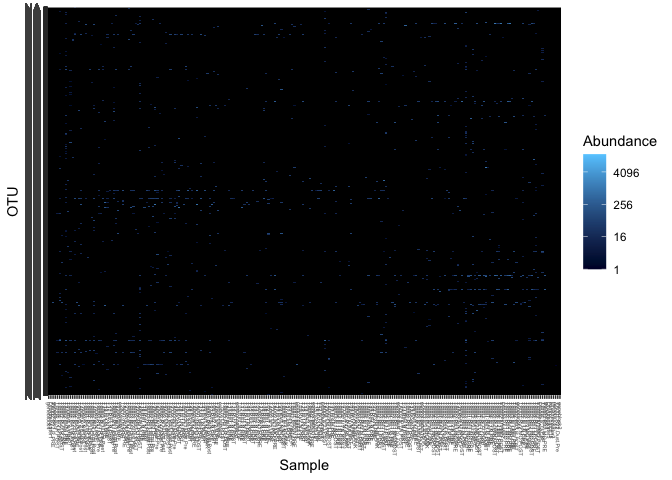

AAT Analysis Part 2 - R Processing
================

Part 2 - Post Processing in R
=============================

### Need to do Part 1 before starting, where you'll end up with

##### 1. Feature Table (list of taxa numbers by sample)

##### 2. Taxonomy Table (what bacteria matches what taxa)

##### 3. Phylogeny Table (how taxa are related to eachother phylogenetically)

##### 4. Raw AAT Sequences as tsv file (matched with taxa name)

In this part, we'll be working on moving all our QIIME objects into Phyloseq and doing additional quality control

Overview of Steps
-----------------

#### 1. Prep and Move files

#### 2. Create initial phyloseq object (which combines feature table, taxonomy table, phylogeny table, and metadata)

#### 3. Decontamination

#### 4. Manually BLAST Staphlococcus samples to species level

End Product
-----------

#### Final Phyloseq object (with 13734 taxa and 224 samples)

Step 1: Prep R workpace and bring in QIIME files
------------------------------------------------

Start by downloading packages we'll need just for this section (others needed in next section). Make sure to change the name of your working directory, previous file names (from earlier QIIME tutorial), metadata files, etc. ALso ensure variable in metatable match code (for qPCR data)

``` r
## Prep ##
setwd("~/Dropbox/AAT_microbiome/16S")
library(phyloseq)
library("qiime2R")
library(decontam)
library("vegan")
```

    ## Loading required package: permute

    ## Loading required package: lattice

    ## Warning: package 'lattice' was built under R version 3.6.2

    ## This is vegan 2.5-6

``` r
library("tidyr")
library(plyr)
library("dplyr")
```

    ## Warning: package 'dplyr' was built under R version 3.6.2

    ## 
    ## Attaching package: 'dplyr'

    ## The following objects are masked from 'package:plyr':
    ## 
    ##     arrange, count, desc, failwith, id, mutate, rename, summarise,
    ##     summarize

    ## The following objects are masked from 'package:stats':
    ## 
    ##     filter, lag

    ## The following objects are masked from 'package:base':
    ## 
    ##     intersect, setdiff, setequal, union

``` r
library(readr)
library("ggplot2")
library(reshape)
```

    ## 
    ## Attaching package: 'reshape'

    ## The following object is masked from 'package:dplyr':
    ## 
    ##     rename

    ## The following objects are masked from 'package:plyr':
    ## 
    ##     rename, round_any

    ## The following objects are masked from 'package:tidyr':
    ## 
    ##     expand, smiths

``` r
library(tibble)
```

    ## Warning: package 'tibble' was built under R version 3.6.2

``` r
seqtab<-read_qza("aat-table.qza")
tree<-read_qza("rooted-tree-aat.qza")
taxonomy<-read_qza("aat-gg-taxonomy.qza")
taxtable<-taxonomy$data %>% as_tibble() %>% separate(Taxon, sep="; ", c("Kingdom","Phylum","Class","Order","Family","Genus","Species")) #convert the table into a tabular split version
```

    ## Warning: Expected 7 pieces. Missing pieces filled with `NA` in 2439 rows [22,
    ## 30, 38, 41, 61, 68, 81, 100, 108, 129, 153, 186, 197, 237, 242, 244, 252, 272,
    ## 297, 298, ...].

``` r
aat_lab_metadata <-read_tsv("/Users/kathryndalton/Dropbox/AAT_microbiome/16S/AAT_lab_metadata.txt") 
```

    ## Parsed with column specification:
    ## cols(
    ##   .default = col_character(),
    ##   plate = col_double(),
    ##   dna_concentration_ng_ul = col_double(),
    ##   X16S_qPCR_copy_num_per_ul_DNA = col_double(),
    ##   X16S_library_concentration_ng_ul = col_double(),
    ##   X16S_remade_library_concentration_ng_ul = col_double(),
    ##   X16S_final_library_concentration_ng_ul = col_double(),
    ##   X16S_volume_for_pool = col_double(),
    ##   X16S_volume_for_epmotion = col_double(),
    ##   X16S_Lib_plate_barcode = col_double(),
    ##   X16S_pool_barcode = col_double(),
    ##   ITS_library_concentration_ng_ul = col_double(),
    ##   ITS_remade_library_concentration_ng_ul = col_double(),
    ##   ITS_final_library_concentration_ng_ul = col_double(),
    ##   ITS_volume_for_pool = col_double(),
    ##   ITS_volume_for_epmotion = col_double(),
    ##   ITS_Lib_plate_barcode = col_double(),
    ##   ITS_pool_barcode = col_double(),
    ##   ITS_clean_pool_barcode = col_double(),
    ##   pooled = col_logical(),
    ##   DNA_plate_barcode = col_double()
    ## )

    ## See spec(...) for full column specifications.

``` r
aat_lab_metadata$X16S_qPCR_copy_num_per_ul_DNA<-as.numeric(aat_lab_metadata$X16S_qPCR_copy_num_per_ul_DNA)
```

Step 2: Create Preliminary Phyloseq Object
------------------------------------------

Combine all our objects into a phyloseq object. For more information on phyloseq, visit <https://joey711.github.io/phyloseq/>

``` r
phylo_prelim<-phyloseq(
  otu_table(seqtab$data, taxa_are_rows = T), 
  phy_tree(tree$data), 
  tax_table(as.data.frame(taxtable) %>% select(-Confidence) %>% column_to_rownames("Feature.ID") %>% as.matrix()),
  sample_data(aat_lab_metadata %>% as.data.frame() %>% column_to_rownames("#SampleID"))
)
phylo_prelim
```

    ## phyloseq-class experiment-level object
    ## otu_table()   OTU Table:         [ 14183 taxa and 236 samples ]
    ## sample_data() Sample Data:       [ 236 samples by 46 sample variables ]
    ## tax_table()   Taxonomy Table:    [ 14183 taxa by 7 taxonomic ranks ]
    ## phy_tree()    Phylogenetic Tree: [ 14183 tips and 13942 internal nodes ]

``` r
dim(seqtab$data)
```

    ## [1] 14183   237

``` r
dim(aat_lab_metadata)
```

    ## [1] 238  47

``` r
sample_names(phylo_prelim)
```

    ##   [1] "control.batch10"     "control.batch12"     "control.batch13"    
    ##   [4] "control.batch14"     "control.batch15"     "control.batch16"    
    ##   [7] "control.batch17"     "control.batch18"     "control.dust"       
    ##  [10] "DNAfreewater1"       "DNAfreewater2"       "DNAfreewater3"      
    ##  [13] "DNAfreewater4"       "DNAfreewater5"       "DNAfreewater6"      
    ##  [16] "geneblock1"          "geneblock2"          "geneblock3"         
    ##  [19] "geneblock4"          "geneblock5"          "geneblock6"         
    ##  [22] "T01.RV1.N.POST"      "T01.RV1.N.PRE"       "T02.RV1.N.POST"     
    ##  [25] "T02.RV1.N.PRE"       "T03.RV1.N.POST"      "T03.RV1.N.PRE"      
    ##  [28] "T04.RV2.N.POST"      "T04.RV2.N.PRE"       "T05.RV2.N.POST"     
    ##  [31] "T05.RV2.N.PRE"       "T06.RV1.N.PRE"       "T06.RV2.N.POST"     
    ##  [34] "T08.RV2.N.POST"      "T08.RV2.N.PRE"       "T09.RV2.N.POST"     
    ##  [37] "T09.RV2.N.PRE"       "T10.RV2.N.POST"      "T10.RV2.N.PRE"      
    ##  [40] "T11.RV2.N.POST"      "T11.RV2.N.PRE"       "T13.IV1.N.POST"     
    ##  [43] "T13.IV1.N.PRE"       "T14.IV1.N.POST"      "T14.IV1.N.PRE"      
    ##  [46] "T15.IV1.N.POST"      "T15.IV1.N.PRE"       "T16.RV3.N.POST"     
    ##  [49] "T16.RV3.N.PRE"       "T17.RV3.N.POST"      "T17.RV3.N.PRE"      
    ##  [52] "T18.RV1.N.POST"      "T18.RV1.N.PRE"       "T19.RV1.N.POST"     
    ##  [55] "T19.RV1.N.PRE"       "T20.RV1.N.POST"      "T20.RV1.N.PRE"      
    ##  [58] "T21.RV1.N.POST"      "T21.RV1.N.PRE"       "T22.RV2.N.PRE"      
    ##  [61] "T23.RV2.N.POST"      "T23.RV2.N.PRE"       "T25.RV2.N.POST"     
    ##  [64] "T25.RV2.N.PRE"       "T27.IV1.N.POST"      "T27.IV1.N.PRE"      
    ##  [67] "T28.IV1.N.POST"      "T28.IV2.N.PRE"       "T29.IV1.N.POST"     
    ##  [70] "T29.IV1.N.PRE"       "T30.IV1.N.PRE"       "T31.IV1.N.POST"     
    ##  [73] "T31.IV1.N.PRE"       "T32.IV2.N.POST"      "T32.IV2.N.PRE"      
    ##  [76] "T33.IV2.N.PRE"       "T35.IV2.N.POST"      "T35.IV2.N.PRE"      
    ##  [79] "T36.IV2.N.POST"      "T36.IV2.N.PRE"       "T37.IV2.N.POST"     
    ##  [82] "T37.IV2.N.PRE"       "T38.RV1.N.POST"      "T38.RV1.N.PRE"      
    ##  [85] "T40.RV1.N.POST"      "T40.RV1.N.PRE"       "T41.RV1.N.POST"     
    ##  [88] "T41.RV1.N.PRE"       "T42.IV1.N.POST"      "T42.IV1.N.PRE"      
    ##  [91] "T43.IV1.N.POST"      "T43.IV1.N.PRE"       "T44.IV1.N.POST"     
    ##  [94] "T44.IV1.N.PRE"       "T45.IV2.N.POST"      "T45.IV2.N.PRE"      
    ##  [97] "T48.IV2.N.POST"      "T48.IV2.N.PRE"       "T49.IV2.N.POST"     
    ## [100] "T49.IV2.N.PRE"       "TA001.RV1.MO.POST"   "TA001.RV1.MO.PRE"   
    ## [103] "TA001.RV1.N.POST"    "TA001.RV1.N.PRE"     "TA001.RV1.R.POST"   
    ## [106] "TA001.RV1.R.PRE"     "TA001.RV2.BLANK"     "TA001.RV2.Dust.Post"
    ## [109] "TA001.RV2.Dust.Pre"  "TA001.RV2.MO.POST"   "TA001.RV2.MO.PRE"   
    ## [112] "TA001.RV2.N.POST"    "TA001.RV2.N.PRE"     "TA001.RV2.R.POST"   
    ## [115] "TA001.RV2.R.PRE"     "TA002.IV1.BLANK"     "TA002.IV1.Dust.Post"
    ## [118] "TA002.IV1.Dust.Pre"  "TA002.IV1.I.POST"    "TA002.IV1.I.PRE"    
    ## [121] "TA002.IV1.MO.POST"   "TA002.IV1.MO.PRE"    "TA002.IV1.N.POST"   
    ## [124] "TA002.IV1.N.PRE"     "TA002.IV1.R.POST"    "TA002.IV1.R.PRE"    
    ## [127] "TA002.RV1.BLANK"     "TA002.RV1.Dust.Post" "TA002.RV1.Dust.Pre" 
    ## [130] "TA002.RV1.I.POST"    "TA002.RV1.I.PRE"     "TA002.RV1.MO.POST"  
    ## [133] "TA002.RV1.MO.PRE"    "TA002.RV1.N.POST"    "TA002.RV1.N.PRE"    
    ## [136] "TA002.RV1.R.POST"    "TA002.RV1.R.PRE"     "TA002.RV2.BLANK"    
    ## [139] "TA002.RV2.Dust.Post" "TA002.RV2.Dust.Pre"  "TA002.RV2.I.POST"   
    ## [142] "TA002.RV2.I.PRE"     "TA002.RV2.MO.POST"   "TA002.RV2.MO.PRE"   
    ## [145] "TA002.RV2.N.POST"    "TA002.RV2.N.PRE"     "TA002.RV2.R.POST"   
    ## [148] "TA002.RV2.R.PRE"     "TA002.RV3.BLANK"     "TA002.RV3.Dust.Post"
    ## [151] "TA002.RV3.Dust.Pre"  "TA002.RV3.I.POST"    "TA002.RV3.I.PRE"    
    ## [154] "TA002.RV3.MO.POST"   "TA002.RV3.MO.PRE"    "TA002.RV3.N.POST"   
    ## [157] "TA002.RV3.N.PRE"     "TA002.RV3.R.POST"    "TA002.RV3.R.PRE"    
    ## [160] "TA003.IV1.BLANK"     "TA003.IV1.Dust.Post" "TA003.IV1.Dust.Pre" 
    ## [163] "TA003.IV1.I.POST"    "TA003.IV1.I.PRE"     "TA003.IV1.MO.POST"  
    ## [166] "TA003.IV1.MO.PRE"    "TA003.IV1.N.POST"    "TA003.IV1.N.PRE"    
    ## [169] "TA003.IV1.R.POST"    "TA003.IV1.R.PRE"     "TA003.IV2.BLANK"    
    ## [172] "TA003.IV2.Dust.Post" "TA003.IV2.Dust.Pre"  "TA003.IV2.I.POST"   
    ## [175] "TA003.IV2.I.PRE"     "TA003.IV2.MO.POST"   "TA003.IV2.MO.PRE"   
    ## [178] "TA003.IV2.N.POST"    "TA003.IV2.N.PRE"     "TA003.IV2.R.POST"   
    ## [181] "TA003.IV2.R.PRE"     "TA003.RV1.BLANK"     "TA003.RV1.Dust.Post"
    ## [184] "TA003.RV1.Dust.Pre"  "TA003.RV1.I.POST"    "TA003.RV1.I.PRE"    
    ## [187] "TA003.RV1.MO.POST"   "TA003.RV1.MO.PRE"    "TA003.RV1.N.POST"   
    ## [190] "TA003.RV1.N.PRE"     "TA003.RV1.R.POST"    "TA003.RV1.R.PRE"    
    ## [193] "TA003.RV2.BLANK"     "TA003.RV2.Dust.Post" "TA003.RV2.Dust.Pre" 
    ## [196] "TA003.RV2.I.POST"    "TA003.RV2.I.PRE"     "TA003.RV2.MO.POST"  
    ## [199] "TA003.RV2.MO.PRE"    "TA003.RV2.N.POST"    "TA003.RV2.N.PRE"    
    ## [202] "TA003.RV2.R.POST"    "TA003.RV2.R.PRE"     "TA004.IV1.BLANK"    
    ## [205] "TA004.IV1.Dust.Post" "TA004.IV1.Dust.Pre"  "TA004.IV1.I.POST"   
    ## [208] "TA004.IV1.I.PRE"     "TA004.IV1.MO.POST"   "TA004.IV1.MO.PRE"   
    ## [211] "TA004.IV1.N.POST"    "TA004.IV1.N.PRE"     "TA004.IV1.R.POST"   
    ## [214] "TA004.IV1.R.PRE"     "TA004.IV2.BLANK"     "TA004.IV2.Dust.Post"
    ## [217] "TA004.IV2.Dust.Pre"  "TA004.IV2.I.POST"    "TA004.IV2.I.PRE"    
    ## [220] "TA004.IV2.MO.POST"   "TA004.IV2.MO.PRE"    "TA004.IV2.N.POST"   
    ## [223] "TA004.IV2.N.PRE"     "TA004.IV2.R.POST"    "TA004.IV2.R.PRE"    
    ## [226] "TA004.RV1.BLANK"     "TA004.RV1.Dust.Post" "TA004.RV1.Dust.Pre" 
    ## [229] "TA004.RV1.I.POST"    "TA004.RV1.I.PRE"     "TA004.RV1.MO.POST"  
    ## [232] "TA004.RV1.MO.PRE"    "TA004.RV1.N.POST"    "TA004.RV1.N.PRE"    
    ## [235] "TA004.RV1.R.POST"    "TA004.RV1.R.PRE"

``` r
table(sample_data(phylo_prelim)$batch)
```

    ## 
    ##   10   12   13   14   15   16   17   18 dust  seq 
    ##   49    2   14   71   15   35    4    9   25   12

``` r
#table missing from DADA2 - #Removed TA001-RV1-Dust-Pre, TA001-RV1-Dost-Post

#Simple Phyloseq Analysis
plot_bar(phylo_prelim, fill = "Family")
```


``` r
plot_tree(phylo_prelim, color="HostSpecies", label.tips="taxa_names", ladderize="left", plot.margin=0.3)
```


``` r
plot_heatmap(phylo_prelim)
```

    ## Warning in metaMDS(veganifyOTU(physeq), distance, ...): stress is (nearly) zero:
    ## you may have insufficient data

    ## Warning: Transformation introduced infinite values in discrete y-axis


``` r
plot_heatmap(phylo_prelim, taxa.label="Phylum")
```

    ## Warning in metaMDS(veganifyOTU(physeq), distance, ...): stress is (nearly) zero:
    ## you may have insufficient data

    ## Warning in metaMDS(veganifyOTU(physeq), distance, ...): Transformation
    ## introduced infinite values in discrete y-axis



``` r
#Inspect Library Size
df <- as.data.frame(sample_data(phylo_prelim)) # Put sample_data into a ggplot-friendly data.frame
df$LibrarySize <- sample_sums(phylo_prelim)
df <- df[order(df$LibrarySize),]
df$Index <- seq(nrow(df))
ggplot(data=df, aes(x=Index, y=LibrarySize, color=Study)) + 
  geom_point()
```


``` r
ggplot(data=df, aes(x=Index, y=LibrarySize, color=SampleType)) + 
  geom_point()
```


``` r
#Index = ordered based on library size
```

Step 3. Decontamination
-----------------------

Used to ID contaminant sequences based on frequency of each sequence/OTU/ASV in the input feature tables as a function of the concentration of amplified DNA Needs: feature table, concentration DNA, negative controls Method - based on either conc or negs, or combined(using Fishers) ID contaminants from sample data (con/negs) then go back to feature table to remove Best way to do it is to start with a phyloseq object - a file that combines otu feature table + sample data + tax data

Overview of Stages in decontamination process and results |Stage 1 | ID contam using combo batch for lab controls + DNA conc data | 166 contam| |Stage 2 | ID contam using combo batch for lab controls + qPCR conc data | 149 contam| |Stage 3 | Combine steps 2 + 3 - ID contaminants found on EITHER methods | 261 contam (54 shaared)| |Stage 4 | Remove those contaminants from phyloseq object | 13922 taxa remain| |Stage 5 | ID contaminants in new phyloseq objects using field blanks - loose ID | 188 contam| |Stage 6 | Remove field contaminants to get final non-contaminated phyloseq object | 13734 taxa remain| \#\#\#\# phylo.final = final object

### FYI

See seperate contamination file for more details on the stages above and how I selected those specific stages (versus other combinations). Important to note that there was little difference between treating the sequencing, library prep, and extraction controls separately versus combining all lab controls (Extract controls is primary driver of lab controls - seq&library controls have very little contamination)

``` r
##Stage 1 - ID contam using combo batch for lab controls + DNA conc data 
sample_data(phylo_prelim)$is.neg <- sample_data(phylo_prelim)$Study=="control"
contamdf.combobatch <- isContaminant(phylo_prelim, method="combined", neg="is.neg", conc="X16S_final_library_concentration_ng_ul", batch = "batch")
```

    ## Warning in isContaminant(phylo_prelim, method = "combined", neg = "is.neg", :
    ## Some batches have very few (<=4) samples.

``` r
table(contamdf.combobatch$contaminant)  #using dna 166
```

    ## 
    ## FALSE  TRUE 
    ## 14017   166

``` r
head(which(contamdf.combobatch$contaminant)) # 832nd most abundant
```

    ## [1] 832 873 884 922 958 964

``` r
taxtable1<-taxtable %>% select(-Confidence) %>% column_to_rownames("Feature.ID")
contam_asvs1 <- row.names(contamdf.combobatch[contamdf.combobatch$contaminant == TRUE, ])
contam_taxa1<-taxtable1[row.names(taxtable1) %in% contam_asvs1, ]
sort(table(contam_taxa1$Genus), decreasing = TRUE)
```

    ## 
    ##                  g__   g__Corynebacterium      g__Sphingomonas 
    ##                   25                   10                    8 
    ##     g__Streptococcus          g__Bacillus  g__Methylobacterium 
    ##                    7                    6                    5 
    ##    g__Staphylococcus       g__Bacteroides       g__Rhodococcus 
    ##                    5                    4                    4 
    ##     g__Acinetobacter       g__Actinomyces        g__Finegoldia 
    ##                    3                    3                    3 
    ##    g__Friedmanniella      g__Hymenobacter    g__Microbacterium 
    ##                    3                    3                    3 
    ##       g__Pseudomonas       g__Veillonella      g__Anaerococcus 
    ##                    3                    3                    2 
    ##             g__Bosea    g__Bradyrhizobium        g__Fusibacter 
    ##                    2                    2                    2 
    ##     g__Fusobacterium     g__Lactobacillus       g__Lactococcus 
    ##                    2                    2                    2 
    ##         g__Neisseria         g__Pelomonas     g__Pigmentiphaga 
    ##                    2                    2                    2 
    ##     g__Porphyromonas  g__Stenotrophomonas         g__Treponema 
    ##                    2                    2                    2 
    ##     g__[Eubacterium]         g__Aeromonas       g__Akkermansia 
    ##                    1                    1                    1 
    ##      g__Arthrobacter         g__Atopobium           g__Blautia 
    ##                    1                    1                    1 
    ##         g__Bulleidia    g__Capnocytophaga       g__Caulobacter 
    ##                    1                    1                    1 
    ##  g__Chryseobacterium       g__Clostridium       g__Coprococcus 
    ##                    1                    1                    1 
    ##       g__Deinococcus       g__Dermabacter     g__Desulfovibrio 
    ##                    1                    1                    1 
    ##           g__Dietzia     g__Enhydrobacter    g__Granulicatella 
    ##                    1                    1                    1 
    ##           g__Kocuria        g__Luteimonas      g__Nocardioides 
    ##                    1                    1                    1 
    ##     g__Paenibacillus        g__Paracoccus       g__Pasteurella 
    ##                    1                    1                    1 
    ##        g__Prevotella g__Pseudoclavibacter g__Pseudoxanthomonas 
    ##                    1                    1                    1 
    ##     g__Psychrobacter         g__Ralstonia       g__Rhodoplanes 
    ##                    1                    1                    1 
    ##            g__Rothia      g__Ruminococcus 
    ##                    1                    1

``` r
##Stage 2 - ID contam using combo batch for lab controls + qPCR conc data
phylo_qpcr <- prune_samples(!is.na(sample_data(phylo_prelim)$X16S_qPCR_copy_num_per_ul_DNA), phylo_prelim)
phylo_qpcr #should have 233 samples (-3 NA samples)
```

    ## phyloseq-class experiment-level object
    ## otu_table()   OTU Table:         [ 14183 taxa and 233 samples ]
    ## sample_data() Sample Data:       [ 233 samples by 47 sample variables ]
    ## tax_table()   Taxonomy Table:    [ 14183 taxa by 7 taxonomic ranks ]
    ## phy_tree()    Phylogenetic Tree: [ 14183 tips and 13942 internal nodes ]

``` r
phylo_prelim
```

    ## phyloseq-class experiment-level object
    ## otu_table()   OTU Table:         [ 14183 taxa and 236 samples ]
    ## sample_data() Sample Data:       [ 236 samples by 47 sample variables ]
    ## tax_table()   Taxonomy Table:    [ 14183 taxa by 7 taxonomic ranks ]
    ## phy_tree()    Phylogenetic Tree: [ 14183 tips and 13942 internal nodes ]

``` r
contamdf.combobatch.qpcr <- isContaminant(phylo_qpcr, method="combined", neg="is.neg", conc="X16S_qPCR_copy_num_per_ul_DNA", 
                                          batch = "batch")
```

    ## Warning in isContaminant(phylo_qpcr, method = "combined", neg = "is.neg", : Some
    ## batches have very few (<=4) samples.

``` r
table(contamdf.combobatch.qpcr$contaminant) #using qpcr 149
```

    ## 
    ## FALSE  TRUE 
    ## 14034   149

``` r
head(which(contamdf.combobatch.qpcr$contaminant))  #591st most abundant
```

    ## [1]  591  884  890  947  975 1074

``` r
contam_asvs2 <- row.names(contamdf.combobatch.qpcr[contamdf.combobatch.qpcr$contaminant == TRUE, ])
contam_taxa2<-taxtable1[row.names(taxtable1) %in% contam_asvs2, ]
sort(table(contam_taxa2$Genus), decreasing = TRUE)
```

    ## 
    ##                  g__   g__Corynebacterium     g__Streptococcus 
    ##                   25                    9                    9 
    ##    g__Staphylococcus      g__Sphingomonas  g__Methylobacterium 
    ##                    7                    6                    5 
    ##     g__Acinetobacter    g__Microbacterium     g__Porphyromonas 
    ##                    4                    3                    3 
    ##       g__Pseudomonas      g__Anaerococcus          g__Bacillus 
    ##                    3                    2                    2 
    ##     g__Campylobacter         g__Facklamia          g__Gordonia 
    ##                    2                    2                    2 
    ##         g__Neisseria         g__Pelomonas     g__Pigmentiphaga 
    ##                    2                    2                    2 
    ##      g__[Prevotella]       g__Actinomyces     g__Agrobacterium 
    ##                    1                    1                    1 
    ##       g__Anaerovorax         g__Atopobium          g__Belnapia 
    ##                    1                    1                    1 
    ##    g__Capnocytophaga       g__Caulobacter  g__Chryseobacterium 
    ##                    1                    1                    1 
    ##       g__Collinsella       g__Deinococcus           g__Delftia 
    ##                    1                    1                    1 
    ##     g__Desulfovibrio       g__Dyadobacter     g__Enhydrobacter 
    ##                    1                    1                    1 
    ##           g__Erwinia           g__Euzebya    g__Flavobacterium 
    ##                    1                    1                    1 
    ##     g__Fusobacterium       g__Haemophilus           g__Kocuria 
    ##                    1                    1                    1 
    ##     g__Lactobacillus       g__Marmoricola          g__Massilia 
    ##                    1                    1                    1 
    ##      g__Microbispora      g__Microvirgula         g__Moraxella 
    ##                    1                    1                    1 
    ##     g__Mycobacterium         g__Nicotiana      g__Nocardioides 
    ##                    1                    1                    1 
    ##           g__p-75-a5        g__Parvimonas     g__Peptoniphilus 
    ##                    1                    1                    1 
    ##  g__Phenylobacterium        g__Prevotella g__Propionibacterium 
    ##                    1                    1                    1 
    ##         g__Ralstonia       g__Rhodococcus         g__Roseburia 
    ##                    1                    1                    1 
    ##            g__Rothia      g__Ruminococcus       g__Sphingobium 
    ##                    1                    1                    1 
    ##  g__Stenotrophomonas               g__TG5       g__Veillonella 
    ##                    1                    1                    1

``` r
##Stage 3 - Combine steps 2 + 3 - ID contaminants found on EITHER methods 
c1<-rownames_to_column(contamdf.combobatch, var="rowname")
c2<-rownames_to_column(contamdf.combobatch.qpcr, var="rowname")
c1$contaminant.d<-c1$contaminant
c2$contaminant.q<-c2$contaminant
c3<-full_join(c1,c2, by="rowname") #x=dna, y=qpcr  eg. c3$contaminant.x = c3$contaminant.d
table(c3$contaminant.d)
```

    ## 
    ## FALSE  TRUE 
    ## 14017   166

``` r
table(c3$contaminant.q) 
```

    ## 
    ## FALSE  TRUE 
    ## 14034   149

``` r
c3$contaminant.both<-ifelse(c3$contaminant.d==TRUE&c3$contaminant.q==TRUE, TRUE, FALSE)  
c3$contaminant.either<-ifelse(c3$contaminant.d==TRUE, TRUE, 
                              ifelse(c3$contaminant.q==TRUE, TRUE, FALSE))  
table(c3$contaminant.both)  # 54 shared between DNA + qPCR results
```

    ## 
    ## FALSE  TRUE 
    ## 14129    54

``` r
table(c3$contaminant.either)  #261 total contaminants IDed using either conc method
```

    ## 
    ## FALSE  TRUE 
    ## 13922   261

``` r
##Stage 4 - Remove those contaminants from phyloseq object 
phylo_prelim
```

    ## phyloseq-class experiment-level object
    ## otu_table()   OTU Table:         [ 14183 taxa and 236 samples ]
    ## sample_data() Sample Data:       [ 236 samples by 47 sample variables ]
    ## tax_table()   Taxonomy Table:    [ 14183 taxa by 7 taxonomic ranks ]
    ## phy_tree()    Phylogenetic Tree: [ 14183 tips and 13942 internal nodes ]

``` r
ps.noncontam.labcontconc <- prune_taxa(!c3$contaminant.either, phylo_prelim)
ps.noncontam.labcontconc # taxa should be less (original 14183 - 261above = 13922 total taxa)
```

    ## phyloseq-class experiment-level object
    ## otu_table()   OTU Table:         [ 13922 taxa and 236 samples ]
    ## sample_data() Sample Data:       [ 236 samples by 47 sample variables ]
    ## tax_table()   Taxonomy Table:    [ 13922 taxa by 7 taxonomic ranks ]
    ## phy_tree()    Phylogenetic Tree: [ 13922 tips and 13698 internal nodes ]

``` r
##Stage 5 - ID contaminants in new phyloseq objects using field blanks
sample_data(ps.noncontam.labcontconc)$field.control <- sample_data(ps.noncontam.labcontconc)$SampleType=="Environmental Blank"
table(sample_data(ps.noncontam.labcontconc)$field.control)  #Missing TA001 RV1 Blank == 12 total blanks
```

    ## 
    ## FALSE  TRUE 
    ##   224    12

``` r
contamdf.field <- isContaminant(ps.noncontam.labcontconc, method="prevalence", neg="field.control")
```

    ## Warning in isContaminant(ps.noncontam.labcontconc, method = "prevalence", :
    ## Removed 5 samples with zero total counts (or frequency).

``` r
table(contamdf.field$contaminant) #188 contaminates IDed
```

    ## 
    ## FALSE  TRUE 
    ## 13734   188

``` r
head(which(contamdf.field$contaminant)) #705th most abundant is top one
```

    ## [1] 705 761 788 822 904 956

``` r
contam_asvs3 <- row.names(contamdf.field[contamdf.field$contaminant == TRUE, ])
contam_taxa3<-taxtable1[row.names(taxtable1) %in% contam_asvs3, ]
sort(table(contam_taxa2$Genus), decreasing = TRUE)
```

    ## 
    ##                  g__   g__Corynebacterium     g__Streptococcus 
    ##                   25                    9                    9 
    ##    g__Staphylococcus      g__Sphingomonas  g__Methylobacterium 
    ##                    7                    6                    5 
    ##     g__Acinetobacter    g__Microbacterium     g__Porphyromonas 
    ##                    4                    3                    3 
    ##       g__Pseudomonas      g__Anaerococcus          g__Bacillus 
    ##                    3                    2                    2 
    ##     g__Campylobacter         g__Facklamia          g__Gordonia 
    ##                    2                    2                    2 
    ##         g__Neisseria         g__Pelomonas     g__Pigmentiphaga 
    ##                    2                    2                    2 
    ##      g__[Prevotella]       g__Actinomyces     g__Agrobacterium 
    ##                    1                    1                    1 
    ##       g__Anaerovorax         g__Atopobium          g__Belnapia 
    ##                    1                    1                    1 
    ##    g__Capnocytophaga       g__Caulobacter  g__Chryseobacterium 
    ##                    1                    1                    1 
    ##       g__Collinsella       g__Deinococcus           g__Delftia 
    ##                    1                    1                    1 
    ##     g__Desulfovibrio       g__Dyadobacter     g__Enhydrobacter 
    ##                    1                    1                    1 
    ##           g__Erwinia           g__Euzebya    g__Flavobacterium 
    ##                    1                    1                    1 
    ##     g__Fusobacterium       g__Haemophilus           g__Kocuria 
    ##                    1                    1                    1 
    ##     g__Lactobacillus       g__Marmoricola          g__Massilia 
    ##                    1                    1                    1 
    ##      g__Microbispora      g__Microvirgula         g__Moraxella 
    ##                    1                    1                    1 
    ##     g__Mycobacterium         g__Nicotiana      g__Nocardioides 
    ##                    1                    1                    1 
    ##           g__p-75-a5        g__Parvimonas     g__Peptoniphilus 
    ##                    1                    1                    1 
    ##  g__Phenylobacterium        g__Prevotella g__Propionibacterium 
    ##                    1                    1                    1 
    ##         g__Ralstonia       g__Rhodococcus         g__Roseburia 
    ##                    1                    1                    1 
    ##            g__Rothia      g__Ruminococcus       g__Sphingobium 
    ##                    1                    1                    1 
    ##  g__Stenotrophomonas               g__TG5       g__Veillonella 
    ##                    1                    1                    1

``` r
##Stage 6 - Remove field contaminants to get final non-contaminated phyloseq object
phylo_prelim   #started with 14183 taxa
```

    ## phyloseq-class experiment-level object
    ## otu_table()   OTU Table:         [ 14183 taxa and 236 samples ]
    ## sample_data() Sample Data:       [ 236 samples by 47 sample variables ]
    ## tax_table()   Taxonomy Table:    [ 14183 taxa by 7 taxonomic ranks ]
    ## phy_tree()    Phylogenetic Tree: [ 14183 tips and 13942 internal nodes ]

``` r
ps.noncontam.labcontconc  #went down to 13922
```

    ## phyloseq-class experiment-level object
    ## otu_table()   OTU Table:         [ 13922 taxa and 236 samples ]
    ## sample_data() Sample Data:       [ 236 samples by 48 sample variables ]
    ## tax_table()   Taxonomy Table:    [ 13922 taxa by 7 taxonomic ranks ]
    ## phy_tree()    Phylogenetic Tree: [ 13922 tips and 13698 internal nodes ]

``` r
phylo.final <- prune_taxa(!contamdf.field$contaminant, ps.noncontam.labcontconc)
phylo.final # final tally 13734   (13922 - 188)
```

    ## phyloseq-class experiment-level object
    ## otu_table()   OTU Table:         [ 13734 taxa and 236 samples ]
    ## sample_data() Sample Data:       [ 236 samples by 48 sample variables ]
    ## tax_table()   Taxonomy Table:    [ 13734 taxa by 7 taxonomic ranks ]
    ## phy_tree()    Phylogenetic Tree: [ 13734 tips and 13519 internal nodes ]

``` r
## save new feature table as backup
otutable.final<-as.data.frame(otu_table(phylo.final))
write_tsv(otutable.final, "aat-otutable_final.tsv")


### not this phyloseq object DOESN"T have full metadata - 
## need to download full metadata sperately and re-upload


### FINAL PHYLOSEQ OBJECT ###
aat_metadata <-read_tsv("/Users/kathryndalton/Dropbox/AAT_microbiome/16S/AAT_workbook_contact.txt") 
```

    ## Parsed with column specification:
    ## cols(
    ##   SampleID = col_character(),
    ##   sampletype = col_character(),
    ##   subjectid = col_character(),
    ##   host = col_character(),
    ##   host_env = col_character(),
    ##   contactscore_ppl = col_character(),
    ##   record_ID = col_character(),
    ##   visit_number = col_character(),
    ##   match_week = col_double(),
    ##   pre_post = col_character(),
    ##   sample_site = col_character(),
    ##   batch = col_character(),
    ##   sample_row = col_character(),
    ##   sample_column = col_double(),
    ##   sample_plate = col_double(),
    ##   uniqueid = col_character(),
    ##   intervention = col_double(),
    ##   study = col_character()
    ## )

``` r
phylo.final<-phyloseq(
  otu_table(otutable.final, taxa_are_rows = T), 
  phy_tree(tree$data), 
  tax_table(as.data.frame(taxtable) %>% select(-Confidence) %>% 
              column_to_rownames("Feature.ID") %>% as.matrix()),
  sample_data(aat_metadata %>% as.data.frame() %>% column_to_rownames("SampleID"))
)
phylo.final
```

    ## phyloseq-class experiment-level object
    ## otu_table()   OTU Table:         [ 13734 taxa and 224 samples ]
    ## sample_data() Sample Data:       [ 224 samples by 17 sample variables ]
    ## tax_table()   Taxonomy Table:    [ 13734 taxa by 7 taxonomic ranks ]
    ## phy_tree()    Phylogenetic Tree: [ 13734 tips and 13519 internal nodes ]

``` r
###########################################################################################################
#### Additional Steps to check Decontamination Process

#Checking appropriate p value selection 
# simplest and most useful evaluation of method is to inspect the distribution of scores assigned by the method.
#Expectation is that there will be a strong mode at low scores. In the cleanest cases the 
#distribution will be clearly bimodal, while in other datasets the high-score mode is more wide and 
#diffuse. However, the low-score mode should be there, and should be used to set the P* score threshold 
#for identifying contaminants
hist(contamdf.combobatch$p, 100) #slight bimodal
```


``` r
hist(contamdf.combobatch.qpcr$p, 100) 
```


``` r
hist(contamdf.field$p, 100)
```


``` r
## see seperate decontam file for test of further combinations

### Get list of contaminants
tax_table(phylo_prelim)[contamdf.combobatch$contaminant,] # to get genera corresponding to contaminants
```

    ## Taxonomy Table:     [166 taxa by 7 taxonomic ranks]:
    ##                                  Kingdom       Phylum              
    ## 7e1d0651db507222c1753a7bbf2dba56 "k__Bacteria" "p__Proteobacteria" 
    ## d598fb6455a7c01d06552b5ebbd1da82 "k__Bacteria" "p__Proteobacteria" 
    ## b77092b03e48a93946fc8fc3141a03b4 "k__Bacteria" "p__Proteobacteria" 
    ## 1927a27ef81faf191c54b3d8c261e44a "k__Bacteria" "p__Proteobacteria" 
    ## 1cb179fffda671a0bcb35beaf8b0f32c "k__Bacteria" "p__Proteobacteria" 
    ## f8b04890041f0b6ae7008079481f1ed1 "k__Bacteria" "p__Proteobacteria" 
    ## d203e6bc4d28f595bc9f370810eeff57 "k__Bacteria" "p__Proteobacteria" 
    ## 98d380008fe782de53defe5a40b72e29 "k__Bacteria" "p__Proteobacteria" 
    ## 88ad7550649a4c49a1130e60ed254460 "k__Bacteria" "p__Proteobacteria" 
    ## 9ffd3abb9926031e6e7d3f26da9f6710 "k__Bacteria" "p__Proteobacteria" 
    ## 4f9ef80c44d6a48ac27c06d8b88eda30 "k__Bacteria" "p__Proteobacteria" 
    ## 8815bfc2f9b48bd0c6a25261942d3540 "k__Bacteria" "p__Proteobacteria" 
    ## 37c1e4f6bb705c5ba7933c38ac155108 "k__Bacteria" "p__Proteobacteria" 
    ## 1b23c3fc48211500ccde3ff85cc56863 "k__Bacteria" "p__Proteobacteria" 
    ## a8065414d168741d20fba40caa0cca35 "k__Bacteria" "p__Proteobacteria" 
    ## 69c3a201e9989e092e3f618555969094 "k__Bacteria" "p__Proteobacteria" 
    ## 868e0c1d13e792722853fcfc13296f95 "k__Bacteria" "p__Proteobacteria" 
    ## 9d0fb454f9f47151d804a8455822429e "k__Bacteria" "p__Proteobacteria" 
    ## 3012e49af04fa9ac3de08d9fb7817ff5 "k__Bacteria" "p__Proteobacteria" 
    ## c7a0945310c363da76903ec9e0176bbd "k__Bacteria" "p__Proteobacteria" 
    ## beaba9b029cde77df09bff59d6713e03 "k__Bacteria" "p__Proteobacteria" 
    ## a15c949f2ad0ff894d921dfc1afb3921 "k__Bacteria" "p__Proteobacteria" 
    ## c6d93c088d9d1560d64ef757aa01b6ab "k__Bacteria" "p__Proteobacteria" 
    ## 4c2cb260def628fa04c9e68697f0f15a "k__Bacteria" "p__Proteobacteria" 
    ## 196121e7d84592d42244b0bed5314385 "k__Bacteria" "p__Proteobacteria" 
    ## 9c533d663eb59e38be88d845b9f5d60d "k__Bacteria" "p__Proteobacteria" 
    ## 55900a5f357a127bce81f8496948b7d0 "k__Bacteria" "p__Proteobacteria" 
    ## 22441bbd41eafac800363605abf8f5fd "k__Bacteria" "p__Proteobacteria" 
    ## 541b6f1001eff8a2ad7fb4a0a1fa4bef "k__Bacteria" "p__Proteobacteria" 
    ## 340b01e86444ed7538e170fb46be08fc "k__Bacteria" "p__Proteobacteria" 
    ## 25f251b04840e450d79af26e640b68dc "k__Bacteria" "p__TM7"            
    ## 007a8eb8be63c702b15792c18b7a1c58 "k__Bacteria" "p__Proteobacteria" 
    ## b07421b87c2405f65359749e9b66db94 "k__Bacteria" "p__Proteobacteria" 
    ## 88350ca2755c0f197f84dd1dd30d5259 "k__Bacteria" "p__Cyanobacteria"  
    ## fcfffedaaf7ea71b28f3f89666a93fd5 "k__Bacteria" "p__Proteobacteria" 
    ## 32c6c42f519f70f1cdd9431cb0cee729 "k__Bacteria" "p__Proteobacteria" 
    ## b26d675fc170a59f31eff4888b74bf3e "k__Bacteria" "p__Proteobacteria" 
    ## e6b95a00f7a9d3e13d7b2e6206d59b8b "k__Bacteria" "p__Proteobacteria" 
    ## fa0de9b4cfb5c5d15d3bfd34e798b727 "k__Bacteria" "p__Proteobacteria" 
    ## d04f277c2d733a8622fa318c9834e07f "k__Bacteria" "p__Proteobacteria" 
    ## 94c2473f67ea305e1919d92e38d4e450 "k__Bacteria" "p__Proteobacteria" 
    ## fab41e9a50444e7cd1bae686f88e9e0f "k__Bacteria" "p__Proteobacteria" 
    ## 12dca12bd35f1669d3d846c37e9acd59 "k__Bacteria" "p__Proteobacteria" 
    ## 2a8bbea01a6df1663af869e0917ec359 "k__Bacteria" "p__Proteobacteria" 
    ## 282a16411452bd32d68e939e364e9ca1 "k__Bacteria" "p__Proteobacteria" 
    ## ab2b7c4435951f675adc3020b67a65b2 "k__Bacteria" "p__Proteobacteria" 
    ## 9fd8e1126d1051f428369a8162e02d93 "k__Bacteria" "p__Proteobacteria" 
    ## 776db61def134d427bff627f2849e7c1 "k__Bacteria" "p__Proteobacteria" 
    ## d70b0647d545d826763607ef5730f7c7 "k__Bacteria" "p__Proteobacteria" 
    ## fed2e30784665afc811aa1ed17da2b33 "k__Bacteria" "p__Proteobacteria" 
    ## df2b9058ee37a71e992661932d681668 "k__Bacteria" "p__Proteobacteria" 
    ## afab907b9da56e97d7c1cd225ebc096b "k__Bacteria" "p__Proteobacteria" 
    ## f5f666ab28f6d1d451f96b1f14dbf4a6 "k__Bacteria" "p__Proteobacteria" 
    ## 396d8616e4ffec47381dfee86571dcd6 "k__Bacteria" "p__Proteobacteria" 
    ## b56f938da942ad41920adfa02b5c5237 "k__Bacteria" "p__Proteobacteria" 
    ## 909e2d90563230ec45cd865c4142dec7 "k__Bacteria" "p__Proteobacteria" 
    ## c2ae73bb8a758d3c761dff096882c4b2 "k__Bacteria" "p__Proteobacteria" 
    ## 96b6729eb36dabf6966f39c7b97e193b "k__Bacteria" "p__Proteobacteria" 
    ## 9e2df6631708ac200f12cc6511172a28 "k__Bacteria" "p__Proteobacteria" 
    ## 7d1e593e6f9c4a5da986e71d38520331 "k__Bacteria" "p__Proteobacteria" 
    ## e835acdf56f50a12b5201fdf78bf1d1a "k__Bacteria" "p__Proteobacteria" 
    ## 1bd3e4ee38cc5e3e5ff5afdfcec89bfb "k__Bacteria" "p__Proteobacteria" 
    ## 8230b72f501761ce753162daefd9d323 "k__Bacteria" "p__Firmicutes"     
    ## d34b5a59cf145ca026057e51046554fd "k__Bacteria" "p__Firmicutes"     
    ## 704b3ebd150411278cd77c66a03aec72 "k__Bacteria" "p__Firmicutes"     
    ## 317a8399e21f04a47596b1f958c19d9c "k__Bacteria" "p__Firmicutes"     
    ## 772f332a92bf7b863bde4a632deaad70 "k__Bacteria" "p__Firmicutes"     
    ## 7c1c5e01377f0070f778f857b4e86ef6 "k__Bacteria" "p__Firmicutes"     
    ## 2c28fb3ca62897ac81172d76273aea01 "k__Bacteria" "p__Firmicutes"     
    ## 7db7c20317d1bcca2f2fcd85aa2f3e34 "k__Bacteria" "p__Firmicutes"     
    ## 09ede4930d997054bbced9c455b83326 "k__Bacteria" "p__Firmicutes"     
    ## c3c2e6382c9622abe2e972ba56d96ae2 "k__Bacteria" "p__Firmicutes"     
    ## 008ef1902d043b53a5daf6dd35c42dd9 "k__Bacteria" "p__Firmicutes"     
    ## 5b462efaf2d19080d1942e76da3cc82a "k__Bacteria" "p__Firmicutes"     
    ## 63a1ef41cb20d669ab51ea2dc29beda1 "k__Bacteria" "p__Cyanobacteria"  
    ## ee4b71ecb452603eb0fd7b95e52d8d86 "k__Bacteria" "p__Cyanobacteria"  
    ## ef3868be0af2cd0382c4358d6f96dca4 "k__Bacteria" "p__Firmicutes"     
    ## 9b5fe728204e7fe43959618661ddfc89 "k__Bacteria" "p__Firmicutes"     
    ## 1442c871bdeb86c476f385ad90352e1d "k__Bacteria" "p__Firmicutes"     
    ## b310d29d3e3a12591329c2d689ed32de "k__Bacteria" "p__Cyanobacteria"  
    ## 1c1cdb7c394a342fc67171357e39d54b "k__Bacteria" "p__Firmicutes"     
    ## a5670ee29394a0e78b413a652873db7f "k__Bacteria" "p__Firmicutes"     
    ## c2d15ad878df79114b44e3db59723c3b "k__Bacteria" "p__Spirochaetes"   
    ## b571811e22d03b9d96c1d5201bc86ca1 "k__Bacteria" "p__Spirochaetes"   
    ## 55e7096b88d10e9e96781c72ac3e5b40 "k__Bacteria" "p__[Thermi]"       
    ## 47c4d2471a6e20a192b20b9370e8f9c9 "k__Bacteria" "p__Firmicutes"     
    ## 71f333e12cfdd2eaf182be2ad0f1d4e5 "k__Bacteria" "p__Firmicutes"     
    ## cf27490ab5fee690c78e707adba2c64a "k__Bacteria" "p__Firmicutes"     
    ## 3fe9e387e888c8a94b9dac828cac7795 "k__Bacteria" "p__Firmicutes"     
    ## 2204817c8a9347598360769fd401eb3f "k__Bacteria" "p__Firmicutes"     
    ## d29605f246e307fcc87353a9781d4b05 "k__Bacteria" "p__Firmicutes"     
    ## 0bf8233a3df4c74f1cd588e47e8c7356 "k__Bacteria" "p__Firmicutes"     
    ## 8d7528dea9578161f09f01d0f393ed04 "k__Bacteria" "p__Firmicutes"     
    ## 1e6f3afe1becf324ad6e9e2c6e9a3e6b "k__Bacteria" "p__Firmicutes"     
    ## 0aca6f2d5516fe6b94456c68d6adc5e1 "k__Bacteria" "p__Firmicutes"     
    ## 9a655b184b79c9a99ddb64b059226e07 "k__Bacteria" "p__Firmicutes"     
    ## 82057c6b07be5adf17836bcb730b0606 "k__Bacteria" "p__Firmicutes"     
    ## 9e7ed1f6212154f133c38c488cb97647 "k__Bacteria" "p__Firmicutes"     
    ## 3bedd4b2327ee08a1c1f54bf521ff184 "k__Bacteria" "p__Firmicutes"     
    ## 0e59b95d43ca5df2c6c40d7d3d9154d7 "k__Bacteria" "p__Firmicutes"     
    ## 2b3e6d12ed12aff28a5d4ab93c773396 "k__Bacteria" "p__Firmicutes"     
    ## 3848e688da099bba4ad0ec325762d79d "k__Bacteria" "p__Firmicutes"     
    ## e2e652b54f33c7ff9620f933d20c3bbe "k__Bacteria" "p__Firmicutes"     
    ## d67376f8208c9ea83d81ade2d1e21d20 "k__Bacteria" "p__Firmicutes"     
    ## 404052df52167d52ed09412aa6a95fdf "k__Bacteria" "p__Firmicutes"     
    ## e608a8d03bc9a2bf9e28277c1680f092 "k__Bacteria" "p__Firmicutes"     
    ## 7905d2d70a51a5ec6feccfa6bf39078e "k__Bacteria" "p__Firmicutes"     
    ## 5adb186801eac1c88c633eaf09d577a1 "k__Bacteria" "p__Firmicutes"     
    ## 112984686c68c0d15f5784c89e78841e "k__Bacteria" "p__Firmicutes"     
    ## ed9a0a8c12c140d473c857b49e72034a "k__Bacteria" "p__Firmicutes"     
    ## 6aa6cb2a1ad6d4c802f0e0ca6a266358 "k__Bacteria" "p__Firmicutes"     
    ## 7345d921a2a2419aede14ae92a90f603 "k__Bacteria" "p__Firmicutes"     
    ## 4620b4e855cb9d0742408172fa13ff45 "k__Bacteria" "p__Fusobacteria"   
    ## 9153f8ed4648704dc37919883dc4f7e1 "k__Bacteria" "p__Fusobacteria"   
    ## f314a1edcf4fbdeebd1597146c833a26 "k__Bacteria" "p__Proteobacteria" 
    ## e0d1973eac8773f7d2a05ad8b4886768 "k__Bacteria" "p__Proteobacteria" 
    ## e83c5bd04083d94108f049a526cdda8a "k__Bacteria" "p__Verrucomicrobia"
    ## b0862c3ad0c8cf2a9b6c12de358dc437 "k__Bacteria" "p__Bacteroidetes"  
    ## 0f4710e84f769f9a042a3cf09e4cee31 "k__Bacteria" "p__Bacteroidetes"  
    ## 00ad15ff97a40a87aab8eb5a6662ef01 "k__Bacteria" "p__Bacteroidetes"  
    ## fb1c1730e539b7bb311e86b0d258fb6f "k__Bacteria" "p__Bacteroidetes"  
    ## 9bb43bd50ca0f91064e48a903035ee7e "k__Bacteria" "p__Bacteroidetes"  
    ## 943e692c55030bb758b9bf4a479eb9ac "k__Bacteria" "p__Bacteroidetes"  
    ## b4d95fa4819ba8ae27d1d319303c31be "k__Bacteria" "p__Bacteroidetes"  
    ## 5eb15e277d4029ad68d70bac8841a0a4 "k__Bacteria" "p__Bacteroidetes"  
    ## 1f057cb52f21dbe62785c1d6a06d914a "k__Bacteria" "p__Bacteroidetes"  
    ## 85604e055994cae188a728af2bf4b1da "k__Bacteria" "p__Bacteroidetes"  
    ## 91f763bea3ecc526bf77ceb0cacb8cbc "k__Bacteria" "p__Bacteroidetes"  
    ## ce206bd9115625915dacf849b448f9f5 "k__Bacteria" "p__Bacteroidetes"  
    ## 5ec906a3e222fdd3c86b9bd71f9aa665 "k__Bacteria" "p__Bacteroidetes"  
    ## e154683aee1082542e5e8f4478ea5fa9 "k__Bacteria" "p__Bacteroidetes"  
    ## 6c44c9c430e9a2f65394cdaf4a5d18f9 "k__Bacteria" "p__Actinobacteria" 
    ## 082375dbc65baebac210b453418f751a "k__Bacteria" "p__Actinobacteria" 
    ## ae1a45e17221cd96097f6294f25d77da "k__Bacteria" "p__Actinobacteria" 
    ## 8d5f905db03d69676219af981c5ed8ed "k__Bacteria" "p__Actinobacteria" 
    ## 492eda36d3b4b05374620b09af2fb9ba "k__Bacteria" "p__Actinobacteria" 
    ## 7a53fc1f55a48b381b16b5f03c7ef8e8 "k__Bacteria" "p__Actinobacteria" 
    ## 0248ab8406f78cf91f697c4f97162559 "k__Bacteria" "p__Actinobacteria" 
    ## 6af735ab7d0a7c01bd064cf7bdb1db8b "k__Bacteria" "p__Actinobacteria" 
    ## 75509860eec629c8e36c3001704c0e18 "k__Bacteria" "p__Actinobacteria" 
    ## 253a6677915c8b79b6077eaef08f45df "k__Bacteria" "p__Actinobacteria" 
    ## c96e4c18e5e254117a33c6faac5fddad "k__Bacteria" "p__Actinobacteria" 
    ## fc90c895880cc5b7f90eafceaf3b97c6 "k__Bacteria" "p__Actinobacteria" 
    ## 4bfe4a99679a653fd2b1f5c7c2a3d35d "k__Bacteria" "p__Actinobacteria" 
    ## 59709df05e24789beba199e4c4678935 "k__Bacteria" "p__Actinobacteria" 
    ## 3deaf8b12b273848209c0d5f971be1e0 "k__Bacteria" "p__Actinobacteria" 
    ## 928e9ccf7e5b84b2a0d497a2316b4233 "k__Bacteria" "p__Actinobacteria" 
    ## 96f3617957167e6bf4089c42cb501818 "k__Bacteria" "p__Actinobacteria" 
    ## dac4b0c933bafee6d114fd533c9a7936 "k__Bacteria" "p__Actinobacteria" 
    ## 07807dc483b561ab2977e1acd1be8f82 "k__Bacteria" "p__Actinobacteria" 
    ## da472b7d777c3722960793d28758991f "k__Bacteria" "p__Actinobacteria" 
    ## 1e78ca68cdb9f5b4d27923a831950d01 "k__Bacteria" "p__Actinobacteria" 
    ## 3b1efecd284f73fa0cbfa343317d2e60 "k__Bacteria" "p__Actinobacteria" 
    ## 2a262bb716f346fe952fff343029566a "k__Bacteria" "p__Actinobacteria" 
    ## 83ecf1155de4969ba515d938d38cce51 "k__Bacteria" "p__Actinobacteria" 
    ## 19a36764bb8eca55be10cd2380af64a6 "k__Bacteria" "p__Actinobacteria" 
    ## b95af87030885629b59dd83b2c0aa080 "k__Bacteria" "p__Actinobacteria" 
    ## c5f7c6fc8b220dd58b93dc945a7a529c "k__Bacteria" "p__Actinobacteria" 
    ## 43c788e0b406d4c2af57b7df0df0729b "k__Bacteria" "p__Actinobacteria" 
    ## 02cbc866395fd061ed2f76e55c495900 "k__Bacteria" "p__Actinobacteria" 
    ## fa22e530caad2b101ec3bf7a141053c9 "k__Bacteria" "p__Actinobacteria" 
    ## d213ae3b3a8b34dd760ffab69f301f54 "k__Bacteria" "p__Actinobacteria" 
    ## ef4a62576e9833c22fa181d8c330eed2 "k__Bacteria" "p__Actinobacteria" 
    ## 33a03c52dcb8e0cd7fd5563d6b9faa75 "k__Bacteria" "p__Actinobacteria" 
    ## 804f386e032aad44f76e0c2a952fcd9f "k__Bacteria" "p__Actinobacteria" 
    ## d070e608d12249e5efa9ec8d8ecce21b "k__Bacteria" "p__Actinobacteria" 
    ##                                  Class                   
    ## 7e1d0651db507222c1753a7bbf2dba56 "c__Alphaproteobacteria"
    ## d598fb6455a7c01d06552b5ebbd1da82 "c__Alphaproteobacteria"
    ## b77092b03e48a93946fc8fc3141a03b4 "c__Alphaproteobacteria"
    ## 1927a27ef81faf191c54b3d8c261e44a "c__Alphaproteobacteria"
    ## 1cb179fffda671a0bcb35beaf8b0f32c "c__Alphaproteobacteria"
    ## f8b04890041f0b6ae7008079481f1ed1 "c__Alphaproteobacteria"
    ## d203e6bc4d28f595bc9f370810eeff57 "c__Alphaproteobacteria"
    ## 98d380008fe782de53defe5a40b72e29 "c__Alphaproteobacteria"
    ## 88ad7550649a4c49a1130e60ed254460 "c__Alphaproteobacteria"
    ## 9ffd3abb9926031e6e7d3f26da9f6710 "c__Alphaproteobacteria"
    ## 4f9ef80c44d6a48ac27c06d8b88eda30 "c__Alphaproteobacteria"
    ## 8815bfc2f9b48bd0c6a25261942d3540 "c__Alphaproteobacteria"
    ## 37c1e4f6bb705c5ba7933c38ac155108 "c__Alphaproteobacteria"
    ## 1b23c3fc48211500ccde3ff85cc56863 "c__Alphaproteobacteria"
    ## a8065414d168741d20fba40caa0cca35 "c__Alphaproteobacteria"
    ## 69c3a201e9989e092e3f618555969094 "c__Alphaproteobacteria"
    ## 868e0c1d13e792722853fcfc13296f95 "c__Alphaproteobacteria"
    ## 9d0fb454f9f47151d804a8455822429e "c__Alphaproteobacteria"
    ## 3012e49af04fa9ac3de08d9fb7817ff5 "c__Alphaproteobacteria"
    ## c7a0945310c363da76903ec9e0176bbd "c__Alphaproteobacteria"
    ## beaba9b029cde77df09bff59d6713e03 "c__Alphaproteobacteria"
    ## a15c949f2ad0ff894d921dfc1afb3921 "c__Alphaproteobacteria"
    ## c6d93c088d9d1560d64ef757aa01b6ab "c__Alphaproteobacteria"
    ## 4c2cb260def628fa04c9e68697f0f15a "c__Alphaproteobacteria"
    ## 196121e7d84592d42244b0bed5314385 "c__Alphaproteobacteria"
    ## 9c533d663eb59e38be88d845b9f5d60d "c__Alphaproteobacteria"
    ## 55900a5f357a127bce81f8496948b7d0 "c__Alphaproteobacteria"
    ## 22441bbd41eafac800363605abf8f5fd "c__Alphaproteobacteria"
    ## 541b6f1001eff8a2ad7fb4a0a1fa4bef "c__Alphaproteobacteria"
    ## 340b01e86444ed7538e170fb46be08fc "c__Alphaproteobacteria"
    ## 25f251b04840e450d79af26e640b68dc "c__TM7-3"              
    ## 007a8eb8be63c702b15792c18b7a1c58 "c__Deltaproteobacteria"
    ## b07421b87c2405f65359749e9b66db94 "c__Deltaproteobacteria"
    ## 88350ca2755c0f197f84dd1dd30d5259 "c__4C0d-2"             
    ## fcfffedaaf7ea71b28f3f89666a93fd5 "c__Gammaproteobacteria"
    ## 32c6c42f519f70f1cdd9431cb0cee729 "c__Gammaproteobacteria"
    ## b26d675fc170a59f31eff4888b74bf3e "c__Gammaproteobacteria"
    ## e6b95a00f7a9d3e13d7b2e6206d59b8b "c__Gammaproteobacteria"
    ## fa0de9b4cfb5c5d15d3bfd34e798b727 "c__Gammaproteobacteria"
    ## d04f277c2d733a8622fa318c9834e07f "c__Gammaproteobacteria"
    ## 94c2473f67ea305e1919d92e38d4e450 "c__Gammaproteobacteria"
    ## fab41e9a50444e7cd1bae686f88e9e0f "c__Gammaproteobacteria"
    ## 12dca12bd35f1669d3d846c37e9acd59 "c__Gammaproteobacteria"
    ## 2a8bbea01a6df1663af869e0917ec359 "c__Gammaproteobacteria"
    ## 282a16411452bd32d68e939e364e9ca1 "c__Gammaproteobacteria"
    ## ab2b7c4435951f675adc3020b67a65b2 "c__Gammaproteobacteria"
    ## 9fd8e1126d1051f428369a8162e02d93 "c__Gammaproteobacteria"
    ## 776db61def134d427bff627f2849e7c1 "c__Gammaproteobacteria"
    ## d70b0647d545d826763607ef5730f7c7 "c__Gammaproteobacteria"
    ## fed2e30784665afc811aa1ed17da2b33 "c__Gammaproteobacteria"
    ## df2b9058ee37a71e992661932d681668 "c__Gammaproteobacteria"
    ## afab907b9da56e97d7c1cd225ebc096b "c__Betaproteobacteria" 
    ## f5f666ab28f6d1d451f96b1f14dbf4a6 "c__Betaproteobacteria" 
    ## 396d8616e4ffec47381dfee86571dcd6 "c__Betaproteobacteria" 
    ## b56f938da942ad41920adfa02b5c5237 "c__Betaproteobacteria" 
    ## 909e2d90563230ec45cd865c4142dec7 "c__Betaproteobacteria" 
    ## c2ae73bb8a758d3c761dff096882c4b2 "c__Betaproteobacteria" 
    ## 96b6729eb36dabf6966f39c7b97e193b "c__Betaproteobacteria" 
    ## 9e2df6631708ac200f12cc6511172a28 "c__Betaproteobacteria" 
    ## 7d1e593e6f9c4a5da986e71d38520331 "c__Betaproteobacteria" 
    ## e835acdf56f50a12b5201fdf78bf1d1a "c__Betaproteobacteria" 
    ## 1bd3e4ee38cc5e3e5ff5afdfcec89bfb "c__Betaproteobacteria" 
    ## 8230b72f501761ce753162daefd9d323 "c__Clostridia"         
    ## d34b5a59cf145ca026057e51046554fd "c__Clostridia"         
    ## 704b3ebd150411278cd77c66a03aec72 "c__Clostridia"         
    ## 317a8399e21f04a47596b1f958c19d9c "c__Clostridia"         
    ## 772f332a92bf7b863bde4a632deaad70 "c__Clostridia"         
    ## 7c1c5e01377f0070f778f857b4e86ef6 "c__Clostridia"         
    ## 2c28fb3ca62897ac81172d76273aea01 "c__Clostridia"         
    ## 7db7c20317d1bcca2f2fcd85aa2f3e34 "c__Clostridia"         
    ## 09ede4930d997054bbced9c455b83326 "c__Clostridia"         
    ## c3c2e6382c9622abe2e972ba56d96ae2 "c__Clostridia"         
    ## 008ef1902d043b53a5daf6dd35c42dd9 "c__Clostridia"         
    ## 5b462efaf2d19080d1942e76da3cc82a "c__Clostridia"         
    ## 63a1ef41cb20d669ab51ea2dc29beda1 "c__Chloroplast"        
    ## ee4b71ecb452603eb0fd7b95e52d8d86 "c__Chloroplast"        
    ## ef3868be0af2cd0382c4358d6f96dca4 "c__Clostridia"         
    ## 9b5fe728204e7fe43959618661ddfc89 "c__Clostridia"         
    ## 1442c871bdeb86c476f385ad90352e1d "c__Clostridia"         
    ## b310d29d3e3a12591329c2d689ed32de "c__Nostocophycideae"   
    ## 1c1cdb7c394a342fc67171357e39d54b "c__Clostridia"         
    ## a5670ee29394a0e78b413a652873db7f "c__Clostridia"         
    ## c2d15ad878df79114b44e3db59723c3b "c__Spirochaetes"       
    ## b571811e22d03b9d96c1d5201bc86ca1 "c__Spirochaetes"       
    ## 55e7096b88d10e9e96781c72ac3e5b40 "c__Deinococci"         
    ## 47c4d2471a6e20a192b20b9370e8f9c9 "c__Bacilli"            
    ## 71f333e12cfdd2eaf182be2ad0f1d4e5 "c__Bacilli"            
    ## cf27490ab5fee690c78e707adba2c64a "c__Bacilli"            
    ## 3fe9e387e888c8a94b9dac828cac7795 "c__Bacilli"            
    ## 2204817c8a9347598360769fd401eb3f "c__Bacilli"            
    ## d29605f246e307fcc87353a9781d4b05 "c__Bacilli"            
    ## 0bf8233a3df4c74f1cd588e47e8c7356 "c__Bacilli"            
    ## 8d7528dea9578161f09f01d0f393ed04 "c__Bacilli"            
    ## 1e6f3afe1becf324ad6e9e2c6e9a3e6b "c__Bacilli"            
    ## 0aca6f2d5516fe6b94456c68d6adc5e1 "c__Bacilli"            
    ## 9a655b184b79c9a99ddb64b059226e07 "c__Bacilli"            
    ## 82057c6b07be5adf17836bcb730b0606 "c__Bacilli"            
    ## 9e7ed1f6212154f133c38c488cb97647 "c__Bacilli"            
    ## 3bedd4b2327ee08a1c1f54bf521ff184 "c__Bacilli"            
    ## 0e59b95d43ca5df2c6c40d7d3d9154d7 "c__Bacilli"            
    ## 2b3e6d12ed12aff28a5d4ab93c773396 "c__Bacilli"            
    ## 3848e688da099bba4ad0ec325762d79d "c__Bacilli"            
    ## e2e652b54f33c7ff9620f933d20c3bbe "c__Bacilli"            
    ## d67376f8208c9ea83d81ade2d1e21d20 "c__Bacilli"            
    ## 404052df52167d52ed09412aa6a95fdf "c__Bacilli"            
    ## e608a8d03bc9a2bf9e28277c1680f092 "c__Bacilli"            
    ## 7905d2d70a51a5ec6feccfa6bf39078e "c__Bacilli"            
    ## 5adb186801eac1c88c633eaf09d577a1 "c__Bacilli"            
    ## 112984686c68c0d15f5784c89e78841e "c__Bacilli"            
    ## ed9a0a8c12c140d473c857b49e72034a "c__Bacilli"            
    ## 6aa6cb2a1ad6d4c802f0e0ca6a266358 "c__Erysipelotrichi"    
    ## 7345d921a2a2419aede14ae92a90f603 "c__Erysipelotrichi"    
    ## 4620b4e855cb9d0742408172fa13ff45 "c__Fusobacteriia"      
    ## 9153f8ed4648704dc37919883dc4f7e1 "c__Fusobacteriia"      
    ## f314a1edcf4fbdeebd1597146c833a26 "c__Deltaproteobacteria"
    ## e0d1973eac8773f7d2a05ad8b4886768 "c__Deltaproteobacteria"
    ## e83c5bd04083d94108f049a526cdda8a "c__Verrucomicrobiae"   
    ## b0862c3ad0c8cf2a9b6c12de358dc437 "c__Cytophagia"         
    ## 0f4710e84f769f9a042a3cf09e4cee31 "c__Cytophagia"         
    ## 00ad15ff97a40a87aab8eb5a6662ef01 "c__Cytophagia"         
    ## fb1c1730e539b7bb311e86b0d258fb6f "c__Flavobacteriia"     
    ## 9bb43bd50ca0f91064e48a903035ee7e "c__Flavobacteriia"     
    ## 943e692c55030bb758b9bf4a479eb9ac "c__Bacteroidia"        
    ## b4d95fa4819ba8ae27d1d319303c31be "c__Bacteroidia"        
    ## 5eb15e277d4029ad68d70bac8841a0a4 "c__Bacteroidia"        
    ## 1f057cb52f21dbe62785c1d6a06d914a "c__Bacteroidia"        
    ## 85604e055994cae188a728af2bf4b1da "c__Bacteroidia"        
    ## 91f763bea3ecc526bf77ceb0cacb8cbc "c__Bacteroidia"        
    ## ce206bd9115625915dacf849b448f9f5 "c__Bacteroidia"        
    ## 5ec906a3e222fdd3c86b9bd71f9aa665 "c__Bacteroidia"        
    ## e154683aee1082542e5e8f4478ea5fa9 "c__Flavobacteriia"     
    ## 6c44c9c430e9a2f65394cdaf4a5d18f9 "c__Actinobacteria"     
    ## 082375dbc65baebac210b453418f751a "c__Actinobacteria"     
    ## ae1a45e17221cd96097f6294f25d77da "c__Actinobacteria"     
    ## 8d5f905db03d69676219af981c5ed8ed "c__Actinobacteria"     
    ## 492eda36d3b4b05374620b09af2fb9ba "c__Actinobacteria"     
    ## 7a53fc1f55a48b381b16b5f03c7ef8e8 "c__Actinobacteria"     
    ## 0248ab8406f78cf91f697c4f97162559 "c__Actinobacteria"     
    ## 6af735ab7d0a7c01bd064cf7bdb1db8b "c__Actinobacteria"     
    ## 75509860eec629c8e36c3001704c0e18 "c__Actinobacteria"     
    ## 253a6677915c8b79b6077eaef08f45df "c__Coriobacteriia"     
    ## c96e4c18e5e254117a33c6faac5fddad "c__Coriobacteriia"     
    ## fc90c895880cc5b7f90eafceaf3b97c6 "c__Actinobacteria"     
    ## 4bfe4a99679a653fd2b1f5c7c2a3d35d "c__Actinobacteria"     
    ## 59709df05e24789beba199e4c4678935 "c__Actinobacteria"     
    ## 3deaf8b12b273848209c0d5f971be1e0 "c__Actinobacteria"     
    ## 928e9ccf7e5b84b2a0d497a2316b4233 "c__Actinobacteria"     
    ## 96f3617957167e6bf4089c42cb501818 "c__Actinobacteria"     
    ## dac4b0c933bafee6d114fd533c9a7936 "c__Actinobacteria"     
    ## 07807dc483b561ab2977e1acd1be8f82 "c__Actinobacteria"     
    ## da472b7d777c3722960793d28758991f "c__Actinobacteria"     
    ## 1e78ca68cdb9f5b4d27923a831950d01 "c__Actinobacteria"     
    ## 3b1efecd284f73fa0cbfa343317d2e60 "c__Actinobacteria"     
    ## 2a262bb716f346fe952fff343029566a "c__Actinobacteria"     
    ## 83ecf1155de4969ba515d938d38cce51 "c__Actinobacteria"     
    ## 19a36764bb8eca55be10cd2380af64a6 "c__Actinobacteria"     
    ## b95af87030885629b59dd83b2c0aa080 "c__Actinobacteria"     
    ## c5f7c6fc8b220dd58b93dc945a7a529c "c__Actinobacteria"     
    ## 43c788e0b406d4c2af57b7df0df0729b "c__Actinobacteria"     
    ## 02cbc866395fd061ed2f76e55c495900 "c__Actinobacteria"     
    ## fa22e530caad2b101ec3bf7a141053c9 "c__Actinobacteria"     
    ## d213ae3b3a8b34dd760ffab69f301f54 "c__Actinobacteria"     
    ## ef4a62576e9833c22fa181d8c330eed2 "c__Actinobacteria"     
    ## 33a03c52dcb8e0cd7fd5563d6b9faa75 "c__Actinobacteria"     
    ## 804f386e032aad44f76e0c2a952fcd9f "c__Actinobacteria"     
    ## d070e608d12249e5efa9ec8d8ecce21b "c__Actinobacteria"     
    ##                                  Order                  
    ## 7e1d0651db507222c1753a7bbf2dba56 "o__Sphingomonadales"  
    ## d598fb6455a7c01d06552b5ebbd1da82 "o__Sphingomonadales"  
    ## b77092b03e48a93946fc8fc3141a03b4 "o__Sphingomonadales"  
    ## 1927a27ef81faf191c54b3d8c261e44a "o__Sphingomonadales"  
    ## 1cb179fffda671a0bcb35beaf8b0f32c "o__Sphingomonadales"  
    ## f8b04890041f0b6ae7008079481f1ed1 "o__Sphingomonadales"  
    ## d203e6bc4d28f595bc9f370810eeff57 "o__Sphingomonadales"  
    ## 98d380008fe782de53defe5a40b72e29 "o__Sphingomonadales"  
    ## 88ad7550649a4c49a1130e60ed254460 "o__Sphingomonadales"  
    ## 9ffd3abb9926031e6e7d3f26da9f6710 "o__Sphingomonadales"  
    ## 4f9ef80c44d6a48ac27c06d8b88eda30 "o__Rickettsiales"     
    ## 8815bfc2f9b48bd0c6a25261942d3540 "o__Rickettsiales"     
    ## 37c1e4f6bb705c5ba7933c38ac155108 "o__Rhizobiales"       
    ## 1b23c3fc48211500ccde3ff85cc56863 "o__Rhizobiales"       
    ## a8065414d168741d20fba40caa0cca35 "o__Rhizobiales"       
    ## 69c3a201e9989e092e3f618555969094 "o__Rhizobiales"       
    ## 868e0c1d13e792722853fcfc13296f95 "o__Rhizobiales"       
    ## 9d0fb454f9f47151d804a8455822429e "o__Rhizobiales"       
    ## 3012e49af04fa9ac3de08d9fb7817ff5 "o__Rhizobiales"       
    ## c7a0945310c363da76903ec9e0176bbd "o__Rhizobiales"       
    ## beaba9b029cde77df09bff59d6713e03 "o__Rhizobiales"       
    ## a15c949f2ad0ff894d921dfc1afb3921 "o__Rhizobiales"       
    ## c6d93c088d9d1560d64ef757aa01b6ab "o__Rhizobiales"       
    ## 4c2cb260def628fa04c9e68697f0f15a "o__Rhizobiales"       
    ## 196121e7d84592d42244b0bed5314385 "o__Rhizobiales"       
    ## 9c533d663eb59e38be88d845b9f5d60d "o__Rhizobiales"       
    ## 55900a5f357a127bce81f8496948b7d0 "o__Rhizobiales"       
    ## 22441bbd41eafac800363605abf8f5fd "o__Caulobacterales"   
    ## 541b6f1001eff8a2ad7fb4a0a1fa4bef "o__Rhodobacterales"   
    ## 340b01e86444ed7538e170fb46be08fc "o__Rhodospirillales"  
    ## 25f251b04840e450d79af26e640b68dc "o__"                  
    ## 007a8eb8be63c702b15792c18b7a1c58 "o__Myxococcales"      
    ## b07421b87c2405f65359749e9b66db94 "o__Myxococcales"      
    ## 88350ca2755c0f197f84dd1dd30d5259 "o__MLE1-12"           
    ## fcfffedaaf7ea71b28f3f89666a93fd5 "o__Xanthomonadales"   
    ## 32c6c42f519f70f1cdd9431cb0cee729 "o__Xanthomonadales"   
    ## b26d675fc170a59f31eff4888b74bf3e "o__Xanthomonadales"   
    ## e6b95a00f7a9d3e13d7b2e6206d59b8b "o__Xanthomonadales"   
    ## fa0de9b4cfb5c5d15d3bfd34e798b727 "o__Pasteurellales"    
    ## d04f277c2d733a8622fa318c9834e07f "o__Pasteurellales"    
    ## 94c2473f67ea305e1919d92e38d4e450 "o__Enterobacteriales" 
    ## fab41e9a50444e7cd1bae686f88e9e0f "o__Enterobacteriales" 
    ## 12dca12bd35f1669d3d846c37e9acd59 "o__Aeromonadales"     
    ## 2a8bbea01a6df1663af869e0917ec359 "o__Pseudomonadales"   
    ## 282a16411452bd32d68e939e364e9ca1 "o__Pseudomonadales"   
    ## ab2b7c4435951f675adc3020b67a65b2 "o__Pseudomonadales"   
    ## 9fd8e1126d1051f428369a8162e02d93 "o__Pseudomonadales"   
    ## 776db61def134d427bff627f2849e7c1 "o__Pseudomonadales"   
    ## d70b0647d545d826763607ef5730f7c7 "o__Pseudomonadales"   
    ## fed2e30784665afc811aa1ed17da2b33 "o__Pseudomonadales"   
    ## df2b9058ee37a71e992661932d681668 "o__Pseudomonadales"   
    ## afab907b9da56e97d7c1cd225ebc096b "o__Burkholderiales"   
    ## f5f666ab28f6d1d451f96b1f14dbf4a6 "o__Burkholderiales"   
    ## 396d8616e4ffec47381dfee86571dcd6 "o__Burkholderiales"   
    ## b56f938da942ad41920adfa02b5c5237 "o__Burkholderiales"   
    ## 909e2d90563230ec45cd865c4142dec7 "o__Burkholderiales"   
    ## c2ae73bb8a758d3c761dff096882c4b2 "o__Burkholderiales"   
    ## 96b6729eb36dabf6966f39c7b97e193b "o__Burkholderiales"   
    ## 9e2df6631708ac200f12cc6511172a28 "o__Burkholderiales"   
    ## 7d1e593e6f9c4a5da986e71d38520331 "o__Neisseriales"      
    ## e835acdf56f50a12b5201fdf78bf1d1a "o__Neisseriales"      
    ## 1bd3e4ee38cc5e3e5ff5afdfcec89bfb "o__Neisseriales"      
    ## 8230b72f501761ce753162daefd9d323 "o__Clostridiales"     
    ## d34b5a59cf145ca026057e51046554fd "o__Clostridiales"     
    ## 704b3ebd150411278cd77c66a03aec72 "o__Clostridiales"     
    ## 317a8399e21f04a47596b1f958c19d9c "o__Clostridiales"     
    ## 772f332a92bf7b863bde4a632deaad70 "o__Clostridiales"     
    ## 7c1c5e01377f0070f778f857b4e86ef6 "o__Clostridiales"     
    ## 2c28fb3ca62897ac81172d76273aea01 "o__Clostridiales"     
    ## 7db7c20317d1bcca2f2fcd85aa2f3e34 "o__Clostridiales"     
    ## 09ede4930d997054bbced9c455b83326 "o__Clostridiales"     
    ## c3c2e6382c9622abe2e972ba56d96ae2 "o__Clostridiales"     
    ## 008ef1902d043b53a5daf6dd35c42dd9 "o__Clostridiales"     
    ## 5b462efaf2d19080d1942e76da3cc82a "o__Clostridiales"     
    ## 63a1ef41cb20d669ab51ea2dc29beda1 "o__Stramenopiles"     
    ## ee4b71ecb452603eb0fd7b95e52d8d86 "o__Streptophyta"      
    ## ef3868be0af2cd0382c4358d6f96dca4 "o__Clostridiales"     
    ## 9b5fe728204e7fe43959618661ddfc89 "o__Clostridiales"     
    ## 1442c871bdeb86c476f385ad90352e1d "o__Clostridiales"     
    ## b310d29d3e3a12591329c2d689ed32de "o__Nostocales"        
    ## 1c1cdb7c394a342fc67171357e39d54b "o__Clostridiales"     
    ## a5670ee29394a0e78b413a652873db7f "o__Clostridiales"     
    ## c2d15ad878df79114b44e3db59723c3b "o__Spirochaetales"    
    ## b571811e22d03b9d96c1d5201bc86ca1 "o__Spirochaetales"    
    ## 55e7096b88d10e9e96781c72ac3e5b40 "o__Deinococcales"     
    ## 47c4d2471a6e20a192b20b9370e8f9c9 "o__Lactobacillales"   
    ## 71f333e12cfdd2eaf182be2ad0f1d4e5 "o__Lactobacillales"   
    ## cf27490ab5fee690c78e707adba2c64a "o__Lactobacillales"   
    ## 3fe9e387e888c8a94b9dac828cac7795 "o__Lactobacillales"   
    ## 2204817c8a9347598360769fd401eb3f "o__Lactobacillales"   
    ## d29605f246e307fcc87353a9781d4b05 "o__Lactobacillales"   
    ## 0bf8233a3df4c74f1cd588e47e8c7356 "o__Lactobacillales"   
    ## 8d7528dea9578161f09f01d0f393ed04 "o__Lactobacillales"   
    ## 1e6f3afe1becf324ad6e9e2c6e9a3e6b "o__Lactobacillales"   
    ## 0aca6f2d5516fe6b94456c68d6adc5e1 "o__Lactobacillales"   
    ## 9a655b184b79c9a99ddb64b059226e07 "o__Lactobacillales"   
    ## 82057c6b07be5adf17836bcb730b0606 "o__Lactobacillales"   
    ## 9e7ed1f6212154f133c38c488cb97647 "o__Lactobacillales"   
    ## 3bedd4b2327ee08a1c1f54bf521ff184 "o__Bacillales"        
    ## 0e59b95d43ca5df2c6c40d7d3d9154d7 "o__Bacillales"        
    ## 2b3e6d12ed12aff28a5d4ab93c773396 "o__Bacillales"        
    ## 3848e688da099bba4ad0ec325762d79d "o__Bacillales"        
    ## e2e652b54f33c7ff9620f933d20c3bbe "o__Bacillales"        
    ## d67376f8208c9ea83d81ade2d1e21d20 "o__Bacillales"        
    ## 404052df52167d52ed09412aa6a95fdf "o__Bacillales"        
    ## e608a8d03bc9a2bf9e28277c1680f092 "o__Bacillales"        
    ## 7905d2d70a51a5ec6feccfa6bf39078e "o__Bacillales"        
    ## 5adb186801eac1c88c633eaf09d577a1 "o__Bacillales"        
    ## 112984686c68c0d15f5784c89e78841e "o__Bacillales"        
    ## ed9a0a8c12c140d473c857b49e72034a "o__Bacillales"        
    ## 6aa6cb2a1ad6d4c802f0e0ca6a266358 "o__Erysipelotrichales"
    ## 7345d921a2a2419aede14ae92a90f603 "o__Erysipelotrichales"
    ## 4620b4e855cb9d0742408172fa13ff45 "o__Fusobacteriales"   
    ## 9153f8ed4648704dc37919883dc4f7e1 "o__Fusobacteriales"   
    ## f314a1edcf4fbdeebd1597146c833a26 "o__Desulfovibrionales"
    ## e0d1973eac8773f7d2a05ad8b4886768 "o__"                  
    ## e83c5bd04083d94108f049a526cdda8a "o__Verrucomicrobiales"
    ## b0862c3ad0c8cf2a9b6c12de358dc437 "o__Cytophagales"      
    ## 0f4710e84f769f9a042a3cf09e4cee31 "o__Cytophagales"      
    ## 00ad15ff97a40a87aab8eb5a6662ef01 "o__Cytophagales"      
    ## fb1c1730e539b7bb311e86b0d258fb6f "o__Flavobacteriales"  
    ## 9bb43bd50ca0f91064e48a903035ee7e "o__Flavobacteriales"  
    ## 943e692c55030bb758b9bf4a479eb9ac "o__Bacteroidales"     
    ## b4d95fa4819ba8ae27d1d319303c31be "o__Bacteroidales"     
    ## 5eb15e277d4029ad68d70bac8841a0a4 "o__Bacteroidales"     
    ## 1f057cb52f21dbe62785c1d6a06d914a "o__Bacteroidales"     
    ## 85604e055994cae188a728af2bf4b1da "o__Bacteroidales"     
    ## 91f763bea3ecc526bf77ceb0cacb8cbc "o__Bacteroidales"     
    ## ce206bd9115625915dacf849b448f9f5 "o__Bacteroidales"     
    ## 5ec906a3e222fdd3c86b9bd71f9aa665 "o__Bacteroidales"     
    ## e154683aee1082542e5e8f4478ea5fa9 "o__Flavobacteriales"  
    ## 6c44c9c430e9a2f65394cdaf4a5d18f9 "o__Actinomycetales"   
    ## 082375dbc65baebac210b453418f751a "o__Actinomycetales"   
    ## ae1a45e17221cd96097f6294f25d77da "o__Actinomycetales"   
    ## 8d5f905db03d69676219af981c5ed8ed "o__Actinomycetales"   
    ## 492eda36d3b4b05374620b09af2fb9ba "o__Actinomycetales"   
    ## 7a53fc1f55a48b381b16b5f03c7ef8e8 "o__Actinomycetales"   
    ## 0248ab8406f78cf91f697c4f97162559 "o__Actinomycetales"   
    ## 6af735ab7d0a7c01bd064cf7bdb1db8b "o__Actinomycetales"   
    ## 75509860eec629c8e36c3001704c0e18 "o__Actinomycetales"   
    ## 253a6677915c8b79b6077eaef08f45df "o__Coriobacteriales"  
    ## c96e4c18e5e254117a33c6faac5fddad "o__Coriobacteriales"  
    ## fc90c895880cc5b7f90eafceaf3b97c6 "o__Actinomycetales"   
    ## 4bfe4a99679a653fd2b1f5c7c2a3d35d "o__Actinomycetales"   
    ## 59709df05e24789beba199e4c4678935 "o__Actinomycetales"   
    ## 3deaf8b12b273848209c0d5f971be1e0 "o__Actinomycetales"   
    ## 928e9ccf7e5b84b2a0d497a2316b4233 "o__Actinomycetales"   
    ## 96f3617957167e6bf4089c42cb501818 "o__Actinomycetales"   
    ## dac4b0c933bafee6d114fd533c9a7936 "o__Actinomycetales"   
    ## 07807dc483b561ab2977e1acd1be8f82 "o__Actinomycetales"   
    ## da472b7d777c3722960793d28758991f "o__Actinomycetales"   
    ## 1e78ca68cdb9f5b4d27923a831950d01 "o__Actinomycetales"   
    ## 3b1efecd284f73fa0cbfa343317d2e60 "o__Actinomycetales"   
    ## 2a262bb716f346fe952fff343029566a "o__Actinomycetales"   
    ## 83ecf1155de4969ba515d938d38cce51 "o__Actinomycetales"   
    ## 19a36764bb8eca55be10cd2380af64a6 "o__Actinomycetales"   
    ## b95af87030885629b59dd83b2c0aa080 "o__Actinomycetales"   
    ## c5f7c6fc8b220dd58b93dc945a7a529c "o__Actinomycetales"   
    ## 43c788e0b406d4c2af57b7df0df0729b "o__Actinomycetales"   
    ## 02cbc866395fd061ed2f76e55c495900 "o__Actinomycetales"   
    ## fa22e530caad2b101ec3bf7a141053c9 "o__Actinomycetales"   
    ## d213ae3b3a8b34dd760ffab69f301f54 "o__Actinomycetales"   
    ## ef4a62576e9833c22fa181d8c330eed2 "o__Actinomycetales"   
    ## 33a03c52dcb8e0cd7fd5563d6b9faa75 "o__Actinomycetales"   
    ## 804f386e032aad44f76e0c2a952fcd9f "o__Actinomycetales"   
    ## d070e608d12249e5efa9ec8d8ecce21b "o__Actinomycetales"   
    ##                                  Family                     
    ## 7e1d0651db507222c1753a7bbf2dba56 "f__Sphingomonadaceae"     
    ## d598fb6455a7c01d06552b5ebbd1da82 "f__Sphingomonadaceae"     
    ## b77092b03e48a93946fc8fc3141a03b4 "f__Sphingomonadaceae"     
    ## 1927a27ef81faf191c54b3d8c261e44a "f__Sphingomonadaceae"     
    ## 1cb179fffda671a0bcb35beaf8b0f32c "f__Sphingomonadaceae"     
    ## f8b04890041f0b6ae7008079481f1ed1 "f__Sphingomonadaceae"     
    ## d203e6bc4d28f595bc9f370810eeff57 "f__Sphingomonadaceae"     
    ## 98d380008fe782de53defe5a40b72e29 "f__Sphingomonadaceae"     
    ## 88ad7550649a4c49a1130e60ed254460 "f__Sphingomonadaceae"     
    ## 9ffd3abb9926031e6e7d3f26da9f6710 "f__Sphingomonadaceae"     
    ## 4f9ef80c44d6a48ac27c06d8b88eda30 "f__mitochondria"          
    ## 8815bfc2f9b48bd0c6a25261942d3540 "f__mitochondria"          
    ## 37c1e4f6bb705c5ba7933c38ac155108 "f__Methylobacteriaceae"   
    ## 1b23c3fc48211500ccde3ff85cc56863 "f__Methylobacteriaceae"   
    ## a8065414d168741d20fba40caa0cca35 "f__Methylobacteriaceae"   
    ## 69c3a201e9989e092e3f618555969094 "f__Methylobacteriaceae"   
    ## 868e0c1d13e792722853fcfc13296f95 "f__Methylobacteriaceae"   
    ## 9d0fb454f9f47151d804a8455822429e "f__Methylobacteriaceae"   
    ## 3012e49af04fa9ac3de08d9fb7817ff5 "f__Methylobacteriaceae"   
    ## c7a0945310c363da76903ec9e0176bbd "f__Methylobacteriaceae"   
    ## beaba9b029cde77df09bff59d6713e03 "f__Methylobacteriaceae"   
    ## a15c949f2ad0ff894d921dfc1afb3921 "f__Methylobacteriaceae"   
    ## c6d93c088d9d1560d64ef757aa01b6ab "f__Bradyrhizobiaceae"     
    ## 4c2cb260def628fa04c9e68697f0f15a "f__Bradyrhizobiaceae"     
    ## 196121e7d84592d42244b0bed5314385 "f__Bradyrhizobiaceae"     
    ## 9c533d663eb59e38be88d845b9f5d60d "f__Bradyrhizobiaceae"     
    ## 55900a5f357a127bce81f8496948b7d0 "f__Hyphomicrobiaceae"     
    ## 22441bbd41eafac800363605abf8f5fd "f__Caulobacteraceae"      
    ## 541b6f1001eff8a2ad7fb4a0a1fa4bef "f__Rhodobacteraceae"      
    ## 340b01e86444ed7538e170fb46be08fc "f__Acetobacteraceae"      
    ## 25f251b04840e450d79af26e640b68dc "f__"                      
    ## 007a8eb8be63c702b15792c18b7a1c58 "f__0319-6G20"             
    ## b07421b87c2405f65359749e9b66db94 "f__0319-6G20"             
    ## 88350ca2755c0f197f84dd1dd30d5259 "f__"                      
    ## fcfffedaaf7ea71b28f3f89666a93fd5 "f__Xanthomonadaceae"      
    ## 32c6c42f519f70f1cdd9431cb0cee729 "f__Xanthomonadaceae"      
    ## b26d675fc170a59f31eff4888b74bf3e "f__Xanthomonadaceae"      
    ## e6b95a00f7a9d3e13d7b2e6206d59b8b "f__Xanthomonadaceae"      
    ## fa0de9b4cfb5c5d15d3bfd34e798b727 "f__Pasteurellaceae"       
    ## d04f277c2d733a8622fa318c9834e07f "f__Pasteurellaceae"       
    ## 94c2473f67ea305e1919d92e38d4e450 "f__Enterobacteriaceae"    
    ## fab41e9a50444e7cd1bae686f88e9e0f "f__Enterobacteriaceae"    
    ## 12dca12bd35f1669d3d846c37e9acd59 "f__Aeromonadaceae"        
    ## 2a8bbea01a6df1663af869e0917ec359 "f__Pseudomonadaceae"      
    ## 282a16411452bd32d68e939e364e9ca1 "f__Pseudomonadaceae"      
    ## ab2b7c4435951f675adc3020b67a65b2 "f__Pseudomonadaceae"      
    ## 9fd8e1126d1051f428369a8162e02d93 "f__Moraxellaceae"         
    ## 776db61def134d427bff627f2849e7c1 "f__Moraxellaceae"         
    ## d70b0647d545d826763607ef5730f7c7 "f__Moraxellaceae"         
    ## fed2e30784665afc811aa1ed17da2b33 "f__Moraxellaceae"         
    ## df2b9058ee37a71e992661932d681668 "f__Moraxellaceae"         
    ## afab907b9da56e97d7c1cd225ebc096b "f__Alcaligenaceae"        
    ## f5f666ab28f6d1d451f96b1f14dbf4a6 "f__Alcaligenaceae"        
    ## 396d8616e4ffec47381dfee86571dcd6 "f__Comamonadaceae"        
    ## b56f938da942ad41920adfa02b5c5237 "f__Comamonadaceae"        
    ## 909e2d90563230ec45cd865c4142dec7 "f__Oxalobacteraceae"      
    ## c2ae73bb8a758d3c761dff096882c4b2 "f__Oxalobacteraceae"      
    ## 96b6729eb36dabf6966f39c7b97e193b "f__Oxalobacteraceae"      
    ## 9e2df6631708ac200f12cc6511172a28 "f__Oxalobacteraceae"      
    ## 7d1e593e6f9c4a5da986e71d38520331 "f__Neisseriaceae"         
    ## e835acdf56f50a12b5201fdf78bf1d1a "f__Neisseriaceae"         
    ## 1bd3e4ee38cc5e3e5ff5afdfcec89bfb "f__Neisseriaceae"         
    ## 8230b72f501761ce753162daefd9d323 "f__Lachnospiraceae"       
    ## d34b5a59cf145ca026057e51046554fd "f__"                      
    ## 704b3ebd150411278cd77c66a03aec72 "f__Lachnospiraceae"       
    ## 317a8399e21f04a47596b1f958c19d9c "f__"                      
    ## 772f332a92bf7b863bde4a632deaad70 "f__Peptostreptococcaceae" 
    ## 7c1c5e01377f0070f778f857b4e86ef6 "f__[Acidaminobacteraceae]"
    ## 2c28fb3ca62897ac81172d76273aea01 "f__[Acidaminobacteraceae]"
    ## 7db7c20317d1bcca2f2fcd85aa2f3e34 "f__[Tissierellaceae]"     
    ## 09ede4930d997054bbced9c455b83326 "f__[Tissierellaceae]"     
    ## c3c2e6382c9622abe2e972ba56d96ae2 "f__[Tissierellaceae]"     
    ## 008ef1902d043b53a5daf6dd35c42dd9 "f__[Tissierellaceae]"     
    ## 5b462efaf2d19080d1942e76da3cc82a "f__[Tissierellaceae]"     
    ## 63a1ef41cb20d669ab51ea2dc29beda1 "f__"                      
    ## ee4b71ecb452603eb0fd7b95e52d8d86 "f__"                      
    ## ef3868be0af2cd0382c4358d6f96dca4 "f__Veillonellaceae"       
    ## 9b5fe728204e7fe43959618661ddfc89 "f__Veillonellaceae"       
    ## 1442c871bdeb86c476f385ad90352e1d "f__Veillonellaceae"       
    ## b310d29d3e3a12591329c2d689ed32de "f__Nostocaceae"           
    ## 1c1cdb7c394a342fc67171357e39d54b "f__"                      
    ## a5670ee29394a0e78b413a652873db7f "f__Ruminococcaceae"       
    ## c2d15ad878df79114b44e3db59723c3b "f__Spirochaetaceae"       
    ## b571811e22d03b9d96c1d5201bc86ca1 "f__Spirochaetaceae"       
    ## 55e7096b88d10e9e96781c72ac3e5b40 "f__Deinococcaceae"        
    ## 47c4d2471a6e20a192b20b9370e8f9c9 "f__Lactobacillaceae"      
    ## 71f333e12cfdd2eaf182be2ad0f1d4e5 "f__Lactobacillaceae"      
    ## cf27490ab5fee690c78e707adba2c64a "f__Streptococcaceae"      
    ## 3fe9e387e888c8a94b9dac828cac7795 "f__Streptococcaceae"      
    ## 2204817c8a9347598360769fd401eb3f "f__Streptococcaceae"      
    ## d29605f246e307fcc87353a9781d4b05 "f__Streptococcaceae"      
    ## 0bf8233a3df4c74f1cd588e47e8c7356 "f__Streptococcaceae"      
    ## 8d7528dea9578161f09f01d0f393ed04 "f__Streptococcaceae"      
    ## 1e6f3afe1becf324ad6e9e2c6e9a3e6b "f__Streptococcaceae"      
    ## 0aca6f2d5516fe6b94456c68d6adc5e1 "f__Streptococcaceae"      
    ## 9a655b184b79c9a99ddb64b059226e07 "f__Streptococcaceae"      
    ## 82057c6b07be5adf17836bcb730b0606 "f__Carnobacteriaceae"     
    ## 9e7ed1f6212154f133c38c488cb97647 "f__Carnobacteriaceae"     
    ## 3bedd4b2327ee08a1c1f54bf521ff184 "f__Paenibacillaceae"      
    ## 0e59b95d43ca5df2c6c40d7d3d9154d7 "f__Bacillaceae"           
    ## 2b3e6d12ed12aff28a5d4ab93c773396 "f__Bacillaceae"           
    ## 3848e688da099bba4ad0ec325762d79d "f__Bacillaceae"           
    ## e2e652b54f33c7ff9620f933d20c3bbe "f__Bacillaceae"           
    ## d67376f8208c9ea83d81ade2d1e21d20 "f__Bacillaceae"           
    ## 404052df52167d52ed09412aa6a95fdf "f__Bacillaceae"           
    ## e608a8d03bc9a2bf9e28277c1680f092 "f__Staphylococcaceae"     
    ## 7905d2d70a51a5ec6feccfa6bf39078e "f__Staphylococcaceae"     
    ## 5adb186801eac1c88c633eaf09d577a1 "f__Staphylococcaceae"     
    ## 112984686c68c0d15f5784c89e78841e "f__Staphylococcaceae"     
    ## ed9a0a8c12c140d473c857b49e72034a "f__Staphylococcaceae"     
    ## 6aa6cb2a1ad6d4c802f0e0ca6a266358 "f__Erysipelotrichaceae"   
    ## 7345d921a2a2419aede14ae92a90f603 "f__Erysipelotrichaceae"   
    ## 4620b4e855cb9d0742408172fa13ff45 "f__Fusobacteriaceae"      
    ## 9153f8ed4648704dc37919883dc4f7e1 "f__Fusobacteriaceae"      
    ## f314a1edcf4fbdeebd1597146c833a26 "f__Desulfovibrionaceae"   
    ## e0d1973eac8773f7d2a05ad8b4886768 "f__"                      
    ## e83c5bd04083d94108f049a526cdda8a "f__Verrucomicrobiaceae"   
    ## b0862c3ad0c8cf2a9b6c12de358dc437 "f__Cytophagaceae"         
    ## 0f4710e84f769f9a042a3cf09e4cee31 "f__Cytophagaceae"         
    ## 00ad15ff97a40a87aab8eb5a6662ef01 "f__Cytophagaceae"         
    ## fb1c1730e539b7bb311e86b0d258fb6f "f__Flavobacteriaceae"     
    ## 9bb43bd50ca0f91064e48a903035ee7e "f__Flavobacteriaceae"     
    ## 943e692c55030bb758b9bf4a479eb9ac "f__Porphyromonadaceae"    
    ## b4d95fa4819ba8ae27d1d319303c31be "f__Porphyromonadaceae"    
    ## 5eb15e277d4029ad68d70bac8841a0a4 "f__RF16"                  
    ## 1f057cb52f21dbe62785c1d6a06d914a "f__Prevotellaceae"        
    ## 85604e055994cae188a728af2bf4b1da "f__Bacteroidaceae"        
    ## 91f763bea3ecc526bf77ceb0cacb8cbc "f__Bacteroidaceae"        
    ## ce206bd9115625915dacf849b448f9f5 "f__Bacteroidaceae"        
    ## 5ec906a3e222fdd3c86b9bd71f9aa665 "f__Bacteroidaceae"        
    ## e154683aee1082542e5e8f4478ea5fa9 "f__[Weeksellaceae]"       
    ## 6c44c9c430e9a2f65394cdaf4a5d18f9 "f__Dermabacteraceae"      
    ## 082375dbc65baebac210b453418f751a "f__Actinomycetaceae"      
    ## ae1a45e17221cd96097f6294f25d77da "f__Actinomycetaceae"      
    ## 8d5f905db03d69676219af981c5ed8ed "f__Actinomycetaceae"      
    ## 492eda36d3b4b05374620b09af2fb9ba "f__Nocardiaceae"          
    ## 7a53fc1f55a48b381b16b5f03c7ef8e8 "f__Nocardiaceae"          
    ## 0248ab8406f78cf91f697c4f97162559 "f__Nocardiaceae"          
    ## 6af735ab7d0a7c01bd064cf7bdb1db8b "f__Nocardiaceae"          
    ## 75509860eec629c8e36c3001704c0e18 "f__Nocardioidaceae"       
    ## 253a6677915c8b79b6077eaef08f45df "f__Coriobacteriaceae"     
    ## c96e4c18e5e254117a33c6faac5fddad "f__Coriobacteriaceae"     
    ## fc90c895880cc5b7f90eafceaf3b97c6 NA                         
    ## 4bfe4a99679a653fd2b1f5c7c2a3d35d "f__Nocardioidaceae"       
    ## 59709df05e24789beba199e4c4678935 "f__Nocardioidaceae"       
    ## 3deaf8b12b273848209c0d5f971be1e0 "f__Nocardioidaceae"       
    ## 928e9ccf7e5b84b2a0d497a2316b4233 "f__Dietziaceae"           
    ## 96f3617957167e6bf4089c42cb501818 "f__Corynebacteriaceae"    
    ## dac4b0c933bafee6d114fd533c9a7936 "f__Corynebacteriaceae"    
    ## 07807dc483b561ab2977e1acd1be8f82 "f__Corynebacteriaceae"    
    ## da472b7d777c3722960793d28758991f "f__Corynebacteriaceae"    
    ## 1e78ca68cdb9f5b4d27923a831950d01 "f__Corynebacteriaceae"    
    ## 3b1efecd284f73fa0cbfa343317d2e60 "f__Corynebacteriaceae"    
    ## 2a262bb716f346fe952fff343029566a "f__Corynebacteriaceae"    
    ## 83ecf1155de4969ba515d938d38cce51 "f__Corynebacteriaceae"    
    ## 19a36764bb8eca55be10cd2380af64a6 "f__Corynebacteriaceae"    
    ## b95af87030885629b59dd83b2c0aa080 "f__Corynebacteriaceae"    
    ## c5f7c6fc8b220dd58b93dc945a7a529c "f__Microbacteriaceae"     
    ## 43c788e0b406d4c2af57b7df0df0729b "f__Microbacteriaceae"     
    ## 02cbc866395fd061ed2f76e55c495900 "f__Microbacteriaceae"     
    ## fa22e530caad2b101ec3bf7a141053c9 "f__Microbacteriaceae"     
    ## d213ae3b3a8b34dd760ffab69f301f54 "f__Micrococcaceae"        
    ## ef4a62576e9833c22fa181d8c330eed2 "f__Micrococcaceae"        
    ## 33a03c52dcb8e0cd7fd5563d6b9faa75 "f__Micrococcaceae"        
    ## 804f386e032aad44f76e0c2a952fcd9f "f__Micrococcaceae"        
    ## d070e608d12249e5efa9ec8d8ecce21b "f__Micrococcaceae"        
    ##                                  Genus                  Species          
    ## 7e1d0651db507222c1753a7bbf2dba56 "g__Sphingomonas"      "s__echinoides"  
    ## d598fb6455a7c01d06552b5ebbd1da82 NA                     NA               
    ## b77092b03e48a93946fc8fc3141a03b4 "g__"                  "s__"            
    ## 1927a27ef81faf191c54b3d8c261e44a "g__Sphingomonas"      "s__"            
    ## 1cb179fffda671a0bcb35beaf8b0f32c "g__Sphingomonas"      "s__"            
    ## f8b04890041f0b6ae7008079481f1ed1 "g__Sphingomonas"      "s__"            
    ## d203e6bc4d28f595bc9f370810eeff57 "g__Sphingomonas"      "s__yabuuchiae"  
    ## 98d380008fe782de53defe5a40b72e29 "g__Sphingomonas"      "s__yabuuchiae"  
    ## 88ad7550649a4c49a1130e60ed254460 "g__Sphingomonas"      "s__"            
    ## 9ffd3abb9926031e6e7d3f26da9f6710 "g__Sphingomonas"      "s__"            
    ## 4f9ef80c44d6a48ac27c06d8b88eda30 NA                     NA               
    ## 8815bfc2f9b48bd0c6a25261942d3540 NA                     NA               
    ## 37c1e4f6bb705c5ba7933c38ac155108 "g__Methylobacterium"  "s__hispanicum"  
    ## 1b23c3fc48211500ccde3ff85cc56863 "g__Methylobacterium"  "s__hispanicum"  
    ## a8065414d168741d20fba40caa0cca35 "g__Methylobacterium"  "s__adhaesivum"  
    ## 69c3a201e9989e092e3f618555969094 "g__Methylobacterium"  "s__"            
    ## 868e0c1d13e792722853fcfc13296f95 "g__Methylobacterium"  "s__mesophilicum"
    ## 9d0fb454f9f47151d804a8455822429e "g__"                  "s__"            
    ## 3012e49af04fa9ac3de08d9fb7817ff5 "g__"                  "s__"            
    ## c7a0945310c363da76903ec9e0176bbd "g__"                  "s__"            
    ## beaba9b029cde77df09bff59d6713e03 "g__"                  "s__"            
    ## a15c949f2ad0ff894d921dfc1afb3921 "g__"                  "s__"            
    ## c6d93c088d9d1560d64ef757aa01b6ab "g__Bradyrhizobium"    "s__"            
    ## 4c2cb260def628fa04c9e68697f0f15a "g__Bosea"             "s__genosp."     
    ## 196121e7d84592d42244b0bed5314385 "g__Bosea"             "s__genosp."     
    ## 9c533d663eb59e38be88d845b9f5d60d "g__Bradyrhizobium"    "s__"            
    ## 55900a5f357a127bce81f8496948b7d0 "g__Rhodoplanes"       "s__"            
    ## 22441bbd41eafac800363605abf8f5fd "g__Caulobacter"       "s__henricii"    
    ## 541b6f1001eff8a2ad7fb4a0a1fa4bef "g__Paracoccus"        "s__aminovorans" 
    ## 340b01e86444ed7538e170fb46be08fc "g__"                  "s__"            
    ## 25f251b04840e450d79af26e640b68dc "g__"                  "s__"            
    ## 007a8eb8be63c702b15792c18b7a1c58 "g__"                  "s__"            
    ## b07421b87c2405f65359749e9b66db94 "g__"                  "s__"            
    ## 88350ca2755c0f197f84dd1dd30d5259 "g__"                  "s__"            
    ## fcfffedaaf7ea71b28f3f89666a93fd5 "g__Luteimonas"        "s__"            
    ## 32c6c42f519f70f1cdd9431cb0cee729 "g__Stenotrophomonas"  "s__geniculata"  
    ## b26d675fc170a59f31eff4888b74bf3e "g__Stenotrophomonas"  "s__rhizophila"  
    ## e6b95a00f7a9d3e13d7b2e6206d59b8b "g__Pseudoxanthomonas" "s__taiwanensis" 
    ## fa0de9b4cfb5c5d15d3bfd34e798b727 "g__Pasteurella"       "s__"            
    ## d04f277c2d733a8622fa318c9834e07f "g__"                  "s__"            
    ## 94c2473f67ea305e1919d92e38d4e450 NA                     NA               
    ## fab41e9a50444e7cd1bae686f88e9e0f NA                     NA               
    ## 12dca12bd35f1669d3d846c37e9acd59 "g__Aeromonas"         NA               
    ## 2a8bbea01a6df1663af869e0917ec359 "g__Pseudomonas"       "s__"            
    ## 282a16411452bd32d68e939e364e9ca1 "g__Pseudomonas"       "s__veronii"     
    ## ab2b7c4435951f675adc3020b67a65b2 "g__Pseudomonas"       "s__veronii"     
    ## 9fd8e1126d1051f428369a8162e02d93 "g__Acinetobacter"     NA               
    ## 776db61def134d427bff627f2849e7c1 "g__Acinetobacter"     "s__"            
    ## d70b0647d545d826763607ef5730f7c7 "g__Acinetobacter"     "s__"            
    ## fed2e30784665afc811aa1ed17da2b33 "g__Psychrobacter"     "s__pulmonis"    
    ## df2b9058ee37a71e992661932d681668 "g__Enhydrobacter"     "s__"            
    ## afab907b9da56e97d7c1cd225ebc096b "g__Pigmentiphaga"     "s__"            
    ## f5f666ab28f6d1d451f96b1f14dbf4a6 "g__Pigmentiphaga"     "s__"            
    ## 396d8616e4ffec47381dfee86571dcd6 "g__Pelomonas"         "s__"            
    ## b56f938da942ad41920adfa02b5c5237 "g__Pelomonas"         NA               
    ## 909e2d90563230ec45cd865c4142dec7 "g__Ralstonia"         "s__"            
    ## c2ae73bb8a758d3c761dff096882c4b2 "g__"                  "s__"            
    ## 96b6729eb36dabf6966f39c7b97e193b "g__"                  "s__"            
    ## 9e2df6631708ac200f12cc6511172a28 NA                     NA               
    ## 7d1e593e6f9c4a5da986e71d38520331 "g__"                  "s__"            
    ## e835acdf56f50a12b5201fdf78bf1d1a "g__Neisseria"         "s__shayeganii"  
    ## 1bd3e4ee38cc5e3e5ff5afdfcec89bfb "g__Neisseria"         "s__shayeganii"  
    ## 8230b72f501761ce753162daefd9d323 "g__Coprococcus"       "s__eutactus"    
    ## d34b5a59cf145ca026057e51046554fd "g__"                  "s__"            
    ## 704b3ebd150411278cd77c66a03aec72 "g__Blautia"           "s__"            
    ## 317a8399e21f04a47596b1f958c19d9c "g__"                  "s__"            
    ## 772f332a92bf7b863bde4a632deaad70 "g__Clostridium"       "s__ruminantium" 
    ## 7c1c5e01377f0070f778f857b4e86ef6 "g__Fusibacter"        "s__"            
    ## 2c28fb3ca62897ac81172d76273aea01 "g__Fusibacter"        "s__"            
    ## 7db7c20317d1bcca2f2fcd85aa2f3e34 "g__Finegoldia"        "s__"            
    ## 09ede4930d997054bbced9c455b83326 "g__Finegoldia"        "s__"            
    ## c3c2e6382c9622abe2e972ba56d96ae2 "g__Finegoldia"        "s__"            
    ## 008ef1902d043b53a5daf6dd35c42dd9 "g__Anaerococcus"      "s__"            
    ## 5b462efaf2d19080d1942e76da3cc82a "g__Anaerococcus"      "s__"            
    ## 63a1ef41cb20d669ab51ea2dc29beda1 "g__"                  "s__"            
    ## ee4b71ecb452603eb0fd7b95e52d8d86 "g__"                  "s__"            
    ## ef3868be0af2cd0382c4358d6f96dca4 "g__Veillonella"       "s__dispar"      
    ## 9b5fe728204e7fe43959618661ddfc89 "g__Veillonella"       "s__dispar"      
    ## 1442c871bdeb86c476f385ad90352e1d "g__Veillonella"       "s__dispar"      
    ## b310d29d3e3a12591329c2d689ed32de NA                     NA               
    ## 1c1cdb7c394a342fc67171357e39d54b "g__"                  "s__"            
    ## a5670ee29394a0e78b413a652873db7f "g__Ruminococcus"      "s__"            
    ## c2d15ad878df79114b44e3db59723c3b "g__Treponema"         "s__"            
    ## b571811e22d03b9d96c1d5201bc86ca1 "g__Treponema"         "s__"            
    ## 55e7096b88d10e9e96781c72ac3e5b40 "g__Deinococcus"       "s__"            
    ## 47c4d2471a6e20a192b20b9370e8f9c9 "g__Lactobacillus"     "s__"            
    ## 71f333e12cfdd2eaf182be2ad0f1d4e5 "g__Lactobacillus"     "s__"            
    ## cf27490ab5fee690c78e707adba2c64a "g__Streptococcus"     NA               
    ## 3fe9e387e888c8a94b9dac828cac7795 "g__Streptococcus"     "s__"            
    ## 2204817c8a9347598360769fd401eb3f "g__Streptococcus"     "s__"            
    ## d29605f246e307fcc87353a9781d4b05 "g__Streptococcus"     "s__"            
    ## 0bf8233a3df4c74f1cd588e47e8c7356 "g__Streptococcus"     "s__"            
    ## 8d7528dea9578161f09f01d0f393ed04 "g__Streptococcus"     "s__"            
    ## 1e6f3afe1becf324ad6e9e2c6e9a3e6b "g__Streptococcus"     "s__infantis"    
    ## 0aca6f2d5516fe6b94456c68d6adc5e1 "g__Lactococcus"       "s__"            
    ## 9a655b184b79c9a99ddb64b059226e07 "g__Lactococcus"       "s__"            
    ## 82057c6b07be5adf17836bcb730b0606 "g__"                  "s__"            
    ## 9e7ed1f6212154f133c38c488cb97647 "g__Granulicatella"    "s__"            
    ## 3bedd4b2327ee08a1c1f54bf521ff184 "g__Paenibacillus"     NA               
    ## 0e59b95d43ca5df2c6c40d7d3d9154d7 "g__Bacillus"          "s__flexus"      
    ## 2b3e6d12ed12aff28a5d4ab93c773396 "g__Bacillus"          "s__cereus"      
    ## 3848e688da099bba4ad0ec325762d79d "g__Bacillus"          "s__cereus"      
    ## e2e652b54f33c7ff9620f933d20c3bbe "g__Bacillus"          "s__cereus"      
    ## d67376f8208c9ea83d81ade2d1e21d20 "g__Bacillus"          "s__cereus"      
    ## 404052df52167d52ed09412aa6a95fdf "g__Bacillus"          "s__cereus"      
    ## e608a8d03bc9a2bf9e28277c1680f092 "g__Staphylococcus"    "s__"            
    ## 7905d2d70a51a5ec6feccfa6bf39078e "g__Staphylococcus"    "s__"            
    ## 5adb186801eac1c88c633eaf09d577a1 "g__Staphylococcus"    "s__"            
    ## 112984686c68c0d15f5784c89e78841e "g__Staphylococcus"    "s__"            
    ## ed9a0a8c12c140d473c857b49e72034a "g__Staphylococcus"    "s__"            
    ## 6aa6cb2a1ad6d4c802f0e0ca6a266358 "g__Bulleidia"         "s__moorei"      
    ## 7345d921a2a2419aede14ae92a90f603 "g__[Eubacterium]"     "s__biforme"     
    ## 4620b4e855cb9d0742408172fa13ff45 "g__Fusobacterium"     "s__"            
    ## 9153f8ed4648704dc37919883dc4f7e1 "g__Fusobacterium"     "s__"            
    ## f314a1edcf4fbdeebd1597146c833a26 "g__Desulfovibrio"     "s__"            
    ## e0d1973eac8773f7d2a05ad8b4886768 "g__"                  "s__"            
    ## e83c5bd04083d94108f049a526cdda8a "g__Akkermansia"       "s__muciniphila" 
    ## b0862c3ad0c8cf2a9b6c12de358dc437 "g__Hymenobacter"      "s__"            
    ## 0f4710e84f769f9a042a3cf09e4cee31 "g__Hymenobacter"      "s__"            
    ## 00ad15ff97a40a87aab8eb5a6662ef01 "g__Hymenobacter"      "s__"            
    ## fb1c1730e539b7bb311e86b0d258fb6f "g__Capnocytophaga"    "s__canimorsus"  
    ## 9bb43bd50ca0f91064e48a903035ee7e "g__"                  "s__"            
    ## 943e692c55030bb758b9bf4a479eb9ac "g__Porphyromonas"     "s__"            
    ## b4d95fa4819ba8ae27d1d319303c31be "g__Porphyromonas"     "s__"            
    ## 5eb15e277d4029ad68d70bac8841a0a4 "g__"                  "s__"            
    ## 1f057cb52f21dbe62785c1d6a06d914a "g__Prevotella"        "s__"            
    ## 85604e055994cae188a728af2bf4b1da "g__Bacteroides"       "s__"            
    ## 91f763bea3ecc526bf77ceb0cacb8cbc "g__Bacteroides"       "s__"            
    ## ce206bd9115625915dacf849b448f9f5 "g__Bacteroides"       "s__fragilis"    
    ## 5ec906a3e222fdd3c86b9bd71f9aa665 "g__Bacteroides"       "s__"            
    ## e154683aee1082542e5e8f4478ea5fa9 "g__Chryseobacterium"  "s__"            
    ## 6c44c9c430e9a2f65394cdaf4a5d18f9 "g__Dermabacter"       "s__"            
    ## 082375dbc65baebac210b453418f751a "g__Actinomyces"       "s__"            
    ## ae1a45e17221cd96097f6294f25d77da "g__Actinomyces"       "s__"            
    ## 8d5f905db03d69676219af981c5ed8ed "g__Actinomyces"       "s__"            
    ## 492eda36d3b4b05374620b09af2fb9ba "g__Rhodococcus"       "s__fascians"    
    ## 7a53fc1f55a48b381b16b5f03c7ef8e8 "g__Rhodococcus"       "s__"            
    ## 0248ab8406f78cf91f697c4f97162559 "g__Rhodococcus"       "s__fascians"    
    ## 6af735ab7d0a7c01bd064cf7bdb1db8b "g__Rhodococcus"       "s__fascians"    
    ## 75509860eec629c8e36c3001704c0e18 "g__Nocardioides"      "s__oleivorans"  
    ## 253a6677915c8b79b6077eaef08f45df NA                     NA               
    ## c96e4c18e5e254117a33c6faac5fddad "g__Atopobium"         "s__vaginae"     
    ## fc90c895880cc5b7f90eafceaf3b97c6 NA                     NA               
    ## 4bfe4a99679a653fd2b1f5c7c2a3d35d "g__Friedmanniella"    "s__"            
    ## 59709df05e24789beba199e4c4678935 "g__Friedmanniella"    "s__"            
    ## 3deaf8b12b273848209c0d5f971be1e0 "g__Friedmanniella"    "s__"            
    ## 928e9ccf7e5b84b2a0d497a2316b4233 "g__Dietzia"           "s__"            
    ## 96f3617957167e6bf4089c42cb501818 "g__Corynebacterium"   "s__"            
    ## dac4b0c933bafee6d114fd533c9a7936 "g__Corynebacterium"   "s__"            
    ## 07807dc483b561ab2977e1acd1be8f82 "g__Corynebacterium"   "s__"            
    ## da472b7d777c3722960793d28758991f "g__Corynebacterium"   "s__"            
    ## 1e78ca68cdb9f5b4d27923a831950d01 "g__Corynebacterium"   "s__"            
    ## 3b1efecd284f73fa0cbfa343317d2e60 "g__Corynebacterium"   "s__"            
    ## 2a262bb716f346fe952fff343029566a "g__Corynebacterium"   "s__"            
    ## 83ecf1155de4969ba515d938d38cce51 "g__Corynebacterium"   "s__"            
    ## 19a36764bb8eca55be10cd2380af64a6 "g__Corynebacterium"   "s__"            
    ## b95af87030885629b59dd83b2c0aa080 "g__Corynebacterium"   "s__"            
    ## c5f7c6fc8b220dd58b93dc945a7a529c "g__Pseudoclavibacter" "s__bifida"      
    ## 43c788e0b406d4c2af57b7df0df0729b "g__Microbacterium"    "s__maritypicum" 
    ## 02cbc866395fd061ed2f76e55c495900 "g__Microbacterium"    "s__"            
    ## fa22e530caad2b101ec3bf7a141053c9 "g__Microbacterium"    "s__chocolatum"  
    ## d213ae3b3a8b34dd760ffab69f301f54 "g__Kocuria"           "s__rhizophila"  
    ## ef4a62576e9833c22fa181d8c330eed2 "g__Rothia"            "s__mucilaginosa"
    ## 33a03c52dcb8e0cd7fd5563d6b9faa75 "g__"                  "s__"            
    ## 804f386e032aad44f76e0c2a952fcd9f NA                     NA               
    ## d070e608d12249e5efa9ec8d8ecce21b "g__Arthrobacter"      "s__agilis"

``` r
ps.contam <- prune_taxa(contamdf.combobatch$contaminant, phylo_prelim) # create a phyloseq objects w just to contaminants
head(tax_table(ps.contam))
```

    ## Taxonomy Table:     [6 taxa by 7 taxonomic ranks]:
    ##                                  Kingdom       Phylum             
    ## 7e1d0651db507222c1753a7bbf2dba56 "k__Bacteria" "p__Proteobacteria"
    ## d598fb6455a7c01d06552b5ebbd1da82 "k__Bacteria" "p__Proteobacteria"
    ## b77092b03e48a93946fc8fc3141a03b4 "k__Bacteria" "p__Proteobacteria"
    ## 1927a27ef81faf191c54b3d8c261e44a "k__Bacteria" "p__Proteobacteria"
    ## 1cb179fffda671a0bcb35beaf8b0f32c "k__Bacteria" "p__Proteobacteria"
    ## f8b04890041f0b6ae7008079481f1ed1 "k__Bacteria" "p__Proteobacteria"
    ##                                  Class                    Order                
    ## 7e1d0651db507222c1753a7bbf2dba56 "c__Alphaproteobacteria" "o__Sphingomonadales"
    ## d598fb6455a7c01d06552b5ebbd1da82 "c__Alphaproteobacteria" "o__Sphingomonadales"
    ## b77092b03e48a93946fc8fc3141a03b4 "c__Alphaproteobacteria" "o__Sphingomonadales"
    ## 1927a27ef81faf191c54b3d8c261e44a "c__Alphaproteobacteria" "o__Sphingomonadales"
    ## 1cb179fffda671a0bcb35beaf8b0f32c "c__Alphaproteobacteria" "o__Sphingomonadales"
    ## f8b04890041f0b6ae7008079481f1ed1 "c__Alphaproteobacteria" "o__Sphingomonadales"
    ##                                  Family                 Genus            
    ## 7e1d0651db507222c1753a7bbf2dba56 "f__Sphingomonadaceae" "g__Sphingomonas"
    ## d598fb6455a7c01d06552b5ebbd1da82 "f__Sphingomonadaceae" NA               
    ## b77092b03e48a93946fc8fc3141a03b4 "f__Sphingomonadaceae" "g__"            
    ## 1927a27ef81faf191c54b3d8c261e44a "f__Sphingomonadaceae" "g__Sphingomonas"
    ## 1cb179fffda671a0bcb35beaf8b0f32c "f__Sphingomonadaceae" "g__Sphingomonas"
    ## f8b04890041f0b6ae7008079481f1ed1 "f__Sphingomonadaceae" "g__Sphingomonas"
    ##                                  Species        
    ## 7e1d0651db507222c1753a7bbf2dba56 "s__echinoides"
    ## d598fb6455a7c01d06552b5ebbd1da82 NA             
    ## b77092b03e48a93946fc8fc3141a03b4 "s__"          
    ## 1927a27ef81faf191c54b3d8c261e44a "s__"          
    ## 1cb179fffda671a0bcb35beaf8b0f32c "s__"          
    ## f8b04890041f0b6ae7008079481f1ed1 "s__"

``` r
ps.contam_list<-as.data.frame(tax_table(ps.contam)) 
#Way 2
contam <- row.names(contamdf.combobatch[contamdf.combobatch$contaminant == TRUE, ])
taxtable1<-taxtable %>% column_to_rownames("Feature.ID")
contam_list<-taxtable1[row.names(taxtable1) %in% contam, ]  %>% select(-Confidence)
head(contam_list)
```

    ##                                      Kingdom            Phylum
    ## ee4b71ecb452603eb0fd7b95e52d8d86 k__Bacteria  p__Cyanobacteria
    ## ef4a62576e9833c22fa181d8c330eed2 k__Bacteria p__Actinobacteria
    ## 282a16411452bd32d68e939e364e9ca1 k__Bacteria p__Proteobacteria
    ## 3b1efecd284f73fa0cbfa343317d2e60 k__Bacteria p__Actinobacteria
    ## 7905d2d70a51a5ec6feccfa6bf39078e k__Bacteria     p__Firmicutes
    ## 776db61def134d427bff627f2849e7c1 k__Bacteria p__Proteobacteria
    ##                                                   Class              Order
    ## ee4b71ecb452603eb0fd7b95e52d8d86         c__Chloroplast    o__Streptophyta
    ## ef4a62576e9833c22fa181d8c330eed2      c__Actinobacteria o__Actinomycetales
    ## 282a16411452bd32d68e939e364e9ca1 c__Gammaproteobacteria o__Pseudomonadales
    ## 3b1efecd284f73fa0cbfa343317d2e60      c__Actinobacteria o__Actinomycetales
    ## 7905d2d70a51a5ec6feccfa6bf39078e             c__Bacilli      o__Bacillales
    ## 776db61def134d427bff627f2849e7c1 c__Gammaproteobacteria o__Pseudomonadales
    ##                                                 Family              Genus
    ## ee4b71ecb452603eb0fd7b95e52d8d86                   f__                g__
    ## ef4a62576e9833c22fa181d8c330eed2     f__Micrococcaceae          g__Rothia
    ## 282a16411452bd32d68e939e364e9ca1   f__Pseudomonadaceae     g__Pseudomonas
    ## 3b1efecd284f73fa0cbfa343317d2e60 f__Corynebacteriaceae g__Corynebacterium
    ## 7905d2d70a51a5ec6feccfa6bf39078e  f__Staphylococcaceae  g__Staphylococcus
    ## 776db61def134d427bff627f2849e7c1      f__Moraxellaceae   g__Acinetobacter
    ##                                          Species
    ## ee4b71ecb452603eb0fd7b95e52d8d86             s__
    ## ef4a62576e9833c22fa181d8c330eed2 s__mucilaginosa
    ## 282a16411452bd32d68e939e364e9ca1      s__veronii
    ## 3b1efecd284f73fa0cbfa343317d2e60             s__
    ## 7905d2d70a51a5ec6feccfa6bf39078e             s__
    ## 776db61def134d427bff627f2849e7c1             s__

Optional Step 4: Manually BLAST Staphlococcus samples to species level
----------------------------------------------------------------------

While our taxonomic assignment is good, its not perfect. It is recommended to evaluate the composition of your samples to assess classification of any specific genera / species of concern in your analysis. \#\#\#\# If speciation doesn't matter in your analysis you can skip this step In this case we care about the Staphylococcus genus and want to be able to determine differences at the species level. While our initial taxonomic assignment was good, there were still many taxa assigned to the Staph genus but without a species assignment. We can manually isolate these taxa and enter the sequences into the NCBI database to determine most likely match.

There is a way to do this using a full file, but I'm still working on the code. At this stage, you have to manually copy and paste the sequnce and type in the likely species in a table (excel or txt file).

``` r
## Set Up ##
## need taxtable and seqtab from earlier Step 1 
staph_taxtable<-subset(taxtable, taxtable$Genus=="g__Staphylococcus") %>%
  subset(.$Species =="s__")
staph_taxtable[,9]<-NULL
head(staph_taxtable)
```

    ## # A tibble: 6 x 8
    ##   Feature.ID        Kingdom   Phylum   Class  Order   Family    Genus    Species
    ##   <fct>             <chr>     <chr>    <chr>  <chr>   <chr>     <chr>    <chr>  
    ## 1 c9e64c6bd2ad40f8 k__Bacte p__Firm c__Ba o__Bac f__Staph g__Stap s__    
    ## 2 cfc97b97e5b25710 k__Bacte p__Firm c__Ba o__Bac f__Staph g__Stap s__    
    ## 3 3f21810df5617ae9 k__Bacte p__Firm c__Ba o__Bac f__Staph g__Stap s__    
    ## 4 2078825418da733e k__Bacte p__Firm c__Ba o__Bac f__Staph g__Stap s__    
    ## 5 7905d2d70a51a5ec k__Bacte p__Firm c__Ba o__Bac f__Staph g__Stap s__    
    ## 6 5adb186801eac1c8 k__Bacte p__Firm c__Ba o__Bac f__Staph g__Stap s__

``` r
dim(staph_taxtable) ## 128 un-speciated Staph taxa
```

    ## [1] 128   8

``` r
## upload raw sequences that you saved from QIIME
seqs<-read_tsv("/Users/kathryndalton/Dropbox/AAT_microbiome/16S/sequences.tsv", col_names="Seq")
```

    ## Parsed with column specification:
    ## cols(
    ##   Seq = col_character()
    ## )

``` r
seq1<-rownames_to_column(seqs)
is.odd <- function(v) v %% 2 != 0  
seq1<-transform(seq1, rowname = as.numeric(rowname))
class(seq1$rowname)
```

    ## [1] "numeric"

``` r
seq1$odd<-is.odd(seq1$rowname)
seq1.name<-subset(seq1, odd==TRUE) %>%
  dplyr::rename(FeatureID=Seq) %>%
  mutate(row=c(1:14183)) ## edit to your dimensions of seq1.name & seq1.seq (should be equal)
seq1.seq<-subset(seq1, odd==FALSE) %>%
  mutate(row=c(1:14183)) ## edit to your dimensions of seq1.name & seq1.seq (should be equal)
seq<-merge(x=seq1.seq, y=seq1.name, by="row", all=TRUE) %>% 
  as_tibble() %>% 
  separate(FeatureID, sep=">", c("1","Feature.ID"))
seq[,c(1,2,4,5,6, 8)] <- NULL


## Isolate Staph Sequences ##
staph_seq<-merge(x=seq, y=staph_taxtable, by="Feature.ID", all.y=TRUE, all.x=FALSE) %>%
  subset(is.na(.$Seq)==FALSE)
dim(staph_seq)
```

    ## [1] 93  9

``` r
write_tsv(staph_seq, path="/Users/kathryndalton/Dropbox/AAT_microbiome/16S/staph_seq_tax_pre", col_names = TRUE)


#BLAST results individually - for future need to figure out to get into format to upload as one file
# https://blast.ncbi.nlm.nih.gov/Blast.cgi?PROGRAM=blastn&PAGE_TYPE=BlastSearch&LINK_LOC=blasthome
# Make sure to chose "16S ribosomal RNA Sequences" under Database
## Blast each sequences then copy in top Staph species match within the txt file
## Save edited file as staph_seq_blast.tsv


## Bring Back Manually Added in BLAST Results
staph_seq_blast<-read_tsv("/Users/kathryndalton/Dropbox/AAT_microbiome/16S/staph_seq_tax.tsv")
```

    ## Parsed with column specification:
    ## cols(
    ##   Feature.ID = col_character(),
    ##   Seq = col_character(),
    ##   Kingdom = col_character(),
    ##   Phylum = col_character(),
    ##   Class = col_character(),
    ##   Order = col_character(),
    ##   Family = col_character(),
    ##   Genus = col_character(),
    ##   Species = col_character(),
    ##   Confidence = col_double()
    ## )

``` r
staph_seq_blast$Seq<-NULL
#need to merge w/ staph_taxtable1 - removing suplicat entries
staph1<-full_join(x=staph_seq_blast, y=taxtable, by ="Feature.ID", match="first")
staph1$Kingdom<-ifelse(is.na(staph1$Kingdom.x), staph1$Kingdom.y, staph1$Kingdom.x)
staph1$Phylum<-ifelse(is.na(staph1$Phylum.x), staph1$Phylum.y, staph1$Phylum.x)
staph1$Class<-ifelse(is.na(staph1$Class.x), staph1$Class.y, staph1$Class.x)
staph1$Order<-ifelse(is.na(staph1$Order.x), staph1$Order.y, staph1$Order.x)
staph1$Family<-ifelse(is.na(staph1$Family.x), staph1$Family.y, staph1$Family.x)
staph1$Genus<-ifelse(is.na(staph1$Genus.x), staph1$Genus.y, staph1$Genus.x)
staph1$Species<-ifelse(is.na(staph1$Species.x), staph1$Species.y, staph1$Species.x)
taxtable_final<-subset(staph1, select= -c(Kingdom.x:Species.y))
## save final taxable as backup
write_tsv(as.data.frame(taxtable_final), "aat-taxtable_final.tsv") 

#Bring back to phyloseq object
phylo.final<-phyloseq(
  otu_table(otutable.final, taxa_are_rows = T), 
  phy_tree(tree$data), 
  tax_table(as.data.frame(taxtable_final) %>% select(-Confidence.y) %>% 
              column_to_rownames("Feature.ID") %>% as.matrix()),
  sample_data(aat_metadata %>% as.data.frame() %>% column_to_rownames("SampleID"))
)
phylo.final
```

    ## phyloseq-class experiment-level object
    ## otu_table()   OTU Table:         [ 13734 taxa and 224 samples ]
    ## sample_data() Sample Data:       [ 224 samples by 17 sample variables ]
    ## tax_table()   Taxonomy Table:    [ 13734 taxa by 7 taxonomic ranks ]
    ## phy_tree()    Phylogenetic Tree: [ 13734 tips and 13519 internal nodes ]
