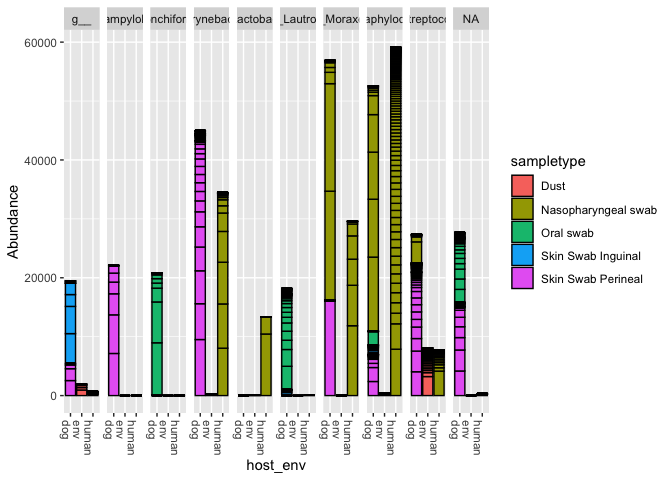
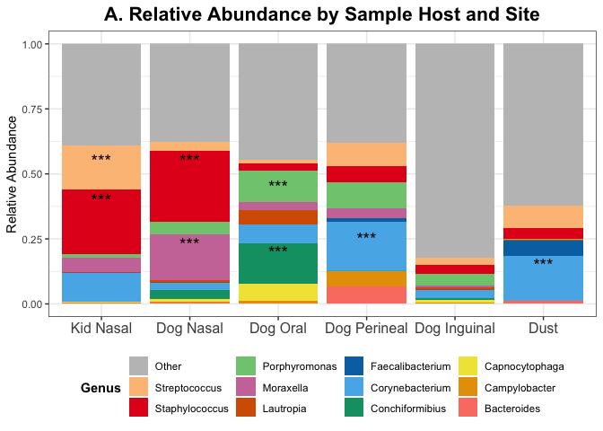
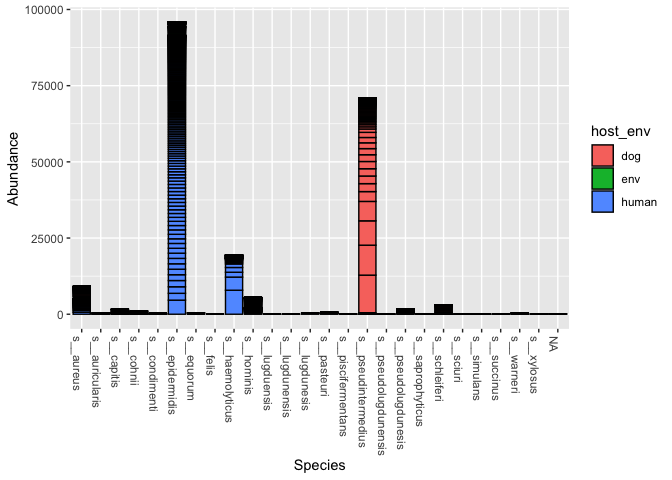
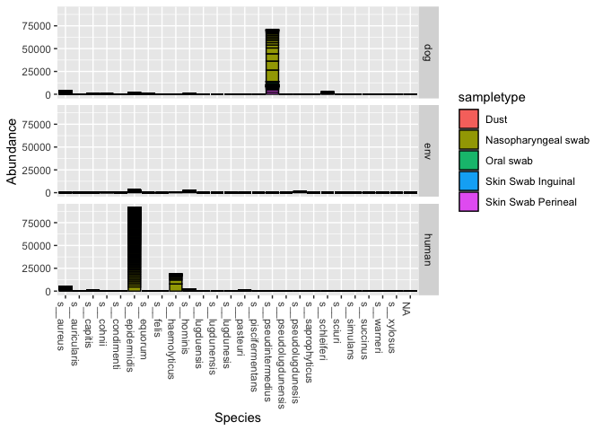
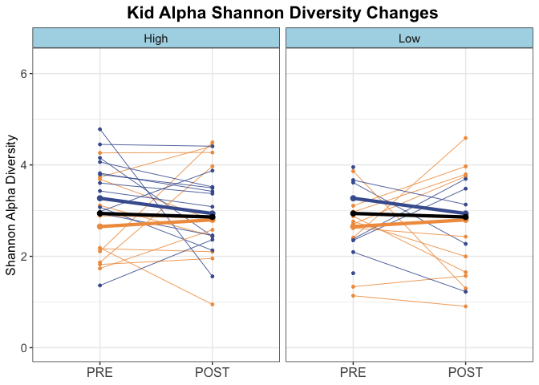
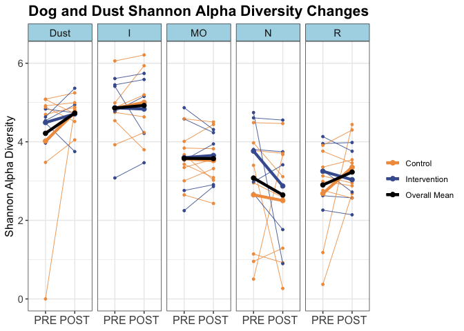
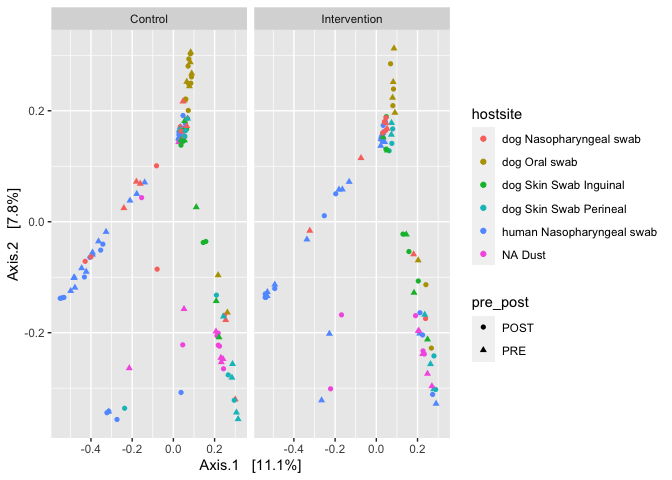

AAT Analysis Part 3 - Data Analysis for Sharing Paper
================

Part 3 - Data Analysis for Microbial Sharing Chapter/Paper
==========================================================

Prior to starting this section, need to go through Part 1 (QIIME prep) and Part 2 (R prep) End product from both parts: \#\#\#\# Final Phyloseq object (phyloseq.final) with 13734 taxa, 224 samples, and 17 variables

Overview of Steps:
------------------

#### 1. Prep your environment and working datasets

#### 2. Absolute and Relative Abundance

#### 3. Alpha Diversity

#### 4. Beta Diversity

#### 5. Beta Distance

This is just the analysis for the sharing paper, refer to Part 4 for analysis related to the vet paper.

Step 1 - Prep R environment
---------------------------

Set your working directory, activate relevant packages, and re-upload final phyloseq object

``` r
## change to your working directory
setwd("/Users/kathryndalton/Dropbox/AAT_microbiome/16S")

#Bring up Packages
library("phyloseq")
library("vegan")
```

    ## Loading required package: permute

    ## Loading required package: lattice

    ## Warning: package 'lattice' was built under R version 3.6.2

    ## This is vegan 2.5-6

``` r
library("DESeq2")
```

    ## Loading required package: S4Vectors

    ## Warning: package 'S4Vectors' was built under R version 3.6.3

    ## Loading required package: stats4

    ## Loading required package: BiocGenerics

    ## Loading required package: parallel

    ## 
    ## Attaching package: 'BiocGenerics'

    ## The following objects are masked from 'package:parallel':
    ## 
    ##     clusterApply, clusterApplyLB, clusterCall, clusterEvalQ,
    ##     clusterExport, clusterMap, parApply, parCapply, parLapply,
    ##     parLapplyLB, parRapply, parSapply, parSapplyLB

    ## The following objects are masked from 'package:stats':
    ## 
    ##     IQR, mad, sd, var, xtabs

    ## The following objects are masked from 'package:base':
    ## 
    ##     anyDuplicated, append, as.data.frame, basename, cbind, colnames,
    ##     dirname, do.call, duplicated, eval, evalq, Filter, Find, get, grep,
    ##     grepl, intersect, is.unsorted, lapply, Map, mapply, match, mget,
    ##     order, paste, pmax, pmax.int, pmin, pmin.int, Position, rank,
    ##     rbind, Reduce, rownames, sapply, setdiff, sort, table, tapply,
    ##     union, unique, unsplit, which, which.max, which.min

    ## 
    ## Attaching package: 'S4Vectors'

    ## The following object is masked from 'package:base':
    ## 
    ##     expand.grid

    ## Loading required package: IRanges

    ## Warning: package 'IRanges' was built under R version 3.6.2

    ## 
    ## Attaching package: 'IRanges'

    ## The following object is masked from 'package:phyloseq':
    ## 
    ##     distance

    ## Loading required package: GenomicRanges

    ## Loading required package: GenomeInfoDb

    ## Warning: package 'GenomeInfoDb' was built under R version 3.6.3

    ## Loading required package: SummarizedExperiment

    ## Warning: package 'SummarizedExperiment' was built under R version 3.6.2

    ## Loading required package: Biobase

    ## Welcome to Bioconductor
    ## 
    ##     Vignettes contain introductory material; view with
    ##     'browseVignettes()'. To cite Bioconductor, see
    ##     'citation("Biobase")', and for packages 'citation("pkgname")'.

    ## 
    ## Attaching package: 'Biobase'

    ## The following object is masked from 'package:phyloseq':
    ## 
    ##     sampleNames

    ## Loading required package: DelayedArray

    ## Warning: package 'DelayedArray' was built under R version 3.6.3

    ## Loading required package: matrixStats

    ## Warning: package 'matrixStats' was built under R version 3.6.2

    ## 
    ## Attaching package: 'matrixStats'

    ## The following objects are masked from 'package:Biobase':
    ## 
    ##     anyMissing, rowMedians

    ## Loading required package: BiocParallel

    ## Warning: package 'BiocParallel' was built under R version 3.6.2

    ## 
    ## Attaching package: 'DelayedArray'

    ## The following objects are masked from 'package:matrixStats':
    ## 
    ##     colMaxs, colMins, colRanges, rowMaxs, rowMins, rowRanges

    ## The following objects are masked from 'package:base':
    ## 
    ##     aperm, apply, rowsum

``` r
library(btools)
library("ggplot2")
```

    ## Warning: package 'ggplot2' was built under R version 3.6.2

``` r
library("reshape2")
```

    ## Warning: package 'reshape2' was built under R version 3.6.2

``` r
library("tidyr")
```

    ## Warning: package 'tidyr' was built under R version 3.6.2

    ## 
    ## Attaching package: 'tidyr'

    ## The following object is masked from 'package:reshape2':
    ## 
    ##     smiths

    ## The following object is masked from 'package:S4Vectors':
    ## 
    ##     expand

``` r
library(plyr)  ## need to upload before dpylr 
```

    ## 
    ## Attaching package: 'plyr'

    ## The following object is masked from 'package:matrixStats':
    ## 
    ##     count

    ## The following object is masked from 'package:IRanges':
    ## 
    ##     desc

    ## The following object is masked from 'package:S4Vectors':
    ## 
    ##     rename

``` r
library("dplyr")
```

    ## Warning: package 'dplyr' was built under R version 3.6.2

    ## 
    ## Attaching package: 'dplyr'

    ## The following objects are masked from 'package:plyr':
    ## 
    ##     arrange, count, desc, failwith, id, mutate, rename, summarise,
    ##     summarize

    ## The following object is masked from 'package:matrixStats':
    ## 
    ##     count

    ## The following object is masked from 'package:Biobase':
    ## 
    ##     combine

    ## The following objects are masked from 'package:GenomicRanges':
    ## 
    ##     intersect, setdiff, union

    ## The following object is masked from 'package:GenomeInfoDb':
    ## 
    ##     intersect

    ## The following objects are masked from 'package:IRanges':
    ## 
    ##     collapse, desc, intersect, setdiff, slice, union

    ## The following objects are masked from 'package:S4Vectors':
    ## 
    ##     first, intersect, rename, setdiff, setequal, union

    ## The following objects are masked from 'package:BiocGenerics':
    ## 
    ##     combine, intersect, setdiff, union

    ## The following objects are masked from 'package:stats':
    ## 
    ##     filter, lag

    ## The following objects are masked from 'package:base':
    ## 
    ##     intersect, setdiff, setequal, union

``` r
library("qiime2R")
library("tidyverse")
```

    ## ── Attaching packages ─────────────────────────────────────── tidyverse 1.3.0 ──

    ## ✓ tibble  3.0.4     ✓ stringr 1.4.0
    ## ✓ readr   1.4.0     ✓ forcats 0.5.0
    ## ✓ purrr   0.3.4

    ## Warning: package 'tibble' was built under R version 3.6.2

    ## Warning: package 'readr' was built under R version 3.6.2

    ## Warning: package 'purrr' was built under R version 3.6.2

    ## ── Conflicts ────────────────────────────────────────── tidyverse_conflicts() ──
    ## x dplyr::arrange()    masks plyr::arrange()
    ## x dplyr::collapse()   masks IRanges::collapse()
    ## x dplyr::combine()    masks Biobase::combine(), BiocGenerics::combine()
    ## x purrr::compact()    masks plyr::compact()
    ## x dplyr::count()      masks plyr::count(), matrixStats::count()
    ## x dplyr::desc()       masks plyr::desc(), IRanges::desc()
    ## x tidyr::expand()     masks S4Vectors::expand()
    ## x dplyr::failwith()   masks plyr::failwith()
    ## x dplyr::filter()     masks stats::filter()
    ## x dplyr::first()      masks S4Vectors::first()
    ## x dplyr::id()         masks plyr::id()
    ## x dplyr::lag()        masks stats::lag()
    ## x dplyr::mutate()     masks plyr::mutate()
    ## x ggplot2::Position() masks BiocGenerics::Position(), base::Position()
    ## x purrr::reduce()     masks GenomicRanges::reduce(), IRanges::reduce()
    ## x dplyr::rename()     masks plyr::rename(), S4Vectors::rename()
    ## x purrr::simplify()   masks DelayedArray::simplify()
    ## x dplyr::slice()      masks IRanges::slice()
    ## x dplyr::summarise()  masks plyr::summarise()
    ## x dplyr::summarize()  masks plyr::summarize()

``` r
library(ggpubr)
```

    ## Warning: package 'ggpubr' was built under R version 3.6.2

    ## 
    ## Attaching package: 'ggpubr'

    ## The following object is masked from 'package:plyr':
    ## 
    ##     mutate

``` r
library("cowplot")
```

    ## Warning: package 'cowplot' was built under R version 3.6.2

    ## 
    ## Attaching package: 'cowplot'

    ## The following object is masked from 'package:ggpubr':
    ## 
    ##     get_legend

``` r
library(gridExtra)
```

    ## 
    ## Attaching package: 'gridExtra'

    ## The following object is masked from 'package:dplyr':
    ## 
    ##     combine

    ## The following object is masked from 'package:Biobase':
    ## 
    ##     combine

    ## The following object is masked from 'package:BiocGenerics':
    ## 
    ##     combine

``` r
library(grid)
library("cluster")

## Final phyloseq 
seqtab<-read.table("/Users/kathryndalton/Dropbox/AAT_microbiome/16S/aat-otutable_final.tsv", sep = "\t", row.names = 1)
tree<-read_qza("rooted-tree-aat.qza")
aat_metadata <-read_tsv("/Users/kathryndalton/Dropbox/AAT_microbiome/16S/AAT_workbook_contact.txt") 
```

    ## 
    ## ── Column specification ────────────────────────────────────────────────────────
    ## cols(
    ##   SampleID = col_character(),
    ##   sampletype = col_character(),
    ##   subjectid = col_character(),
    ##   host = col_character(),
    ##   host_env = col_character(),
    ##   contactscore_ppl = col_character(),
    ##   record_ID = col_character(),
    ##   visit_number = col_character(),
    ##   match_week = col_double(),
    ##   pre_post = col_character(),
    ##   sample_site = col_character(),
    ##   batch = col_character(),
    ##   sample_row = col_character(),
    ##   sample_column = col_double(),
    ##   sample_plate = col_double(),
    ##   uniqueid = col_character(),
    ##   intervention = col_double(),
    ##   study = col_character()
    ## )

``` r
taxtable_final<-read_tsv("/Users/kathryndalton/Dropbox/AAT_microbiome/16S/aat-taxtable_final.tsv")
```

    ## 
    ## ── Column specification ────────────────────────────────────────────────────────
    ## cols(
    ##   Feature.ID = col_character(),
    ##   Confidence.y = col_double(),
    ##   Kingdom = col_character(),
    ##   Phylum = col_character(),
    ##   Class = col_character(),
    ##   Order = col_character(),
    ##   Family = col_character(),
    ##   Genus = col_character(),
    ##   Species = col_character()
    ## )

``` r
phylo.final<-phyloseq(
  otu_table(seqtab, taxa_are_rows = T), 
  phy_tree(tree$data), 
  tax_table(as.data.frame(taxtable_final) %>% select(-Confidence.y) %>% column_to_rownames("Feature.ID") %>% as.matrix()),
  sample_data(aat_metadata %>% as.data.frame() %>% column_to_rownames("SampleID"))
)
phylo.final
```

    ## phyloseq-class experiment-level object
    ## otu_table()   OTU Table:         [ 13720 taxa and 224 samples ]
    ## sample_data() Sample Data:       [ 224 samples by 17 sample variables ]
    ## tax_table()   Taxonomy Table:    [ 13720 taxa by 7 taxonomic ranks ]
    ## phy_tree()    Phylogenetic Tree: [ 13720 tips and 13595 internal nodes ]

``` r
### change Confidence.y to just Confidence if not doing additional manual blast step

## Generate new variables
sample_data(phylo.final)$hostsite<-paste(sample_data(phylo.final)$host, sample_data(phylo.final)$sampletype)
sample_data(phylo.final)$interv<-ifelse(sample_data(phylo.final)$intervention==0, "Control", "Intervention")

##Quick EDA on dataset to confirm samples are there
table(sample_data(phylo.final)$host_env, useNA = "always")
```

    ## 
    ##   dog   env human  <NA> 
    ##   100    24    79    21

``` r
table(sample_data(phylo.final)$sampletype)
```

    ## 
    ##                Dust Environmental Blank     Extract Control Nasopharyngeal swab 
    ##                  24                  12                   9                 105 
    ##           Oral swab  Skin Swab Inguinal  Skin Swab Perineal 
    ##                  26                  22                  26

``` r
table(sample_data(phylo.final)$hostsite)
```

    ## 
    ##   dog Nasopharyngeal swab             dog Oral swab    dog Skin Swab Inguinal 
    ##                        26                        26                        22 
    ##    dog Skin Swab Perineal human Nasopharyngeal swab                   NA Dust 
    ##                        26                        79                        24 
    ##    NA Environmental Blank        NA Extract Control 
    ##                        12                         9

``` r
table(sample_data(phylo.final)$intervention, sample_data(phylo.final)$interv, useNA = "always")
```

    ##       
    ##        Control Intervention <NA>
    ##   0        124            0    0
    ##   1          0           91    0
    ##   <NA>       0            0    9

``` r
## Get working datasets
phylo.kd<-subset_samples(phylo.final, !is.na(host))
phylo.kd
```

    ## phyloseq-class experiment-level object
    ## otu_table()   OTU Table:         [ 13720 taxa and 179 samples ]
    ## sample_data() Sample Data:       [ 179 samples by 19 sample variables ]
    ## tax_table()   Taxonomy Table:    [ 13720 taxa by 7 taxonomic ranks ]
    ## phy_tree()    Phylogenetic Tree: [ 13720 tips and 13595 internal nodes ]

``` r
phy.kde<-subset_samples(phylo.final, !is.na(host_env))
phy.kde
```

    ## phyloseq-class experiment-level object
    ## otu_table()   OTU Table:         [ 13720 taxa and 203 samples ]
    ## sample_data() Sample Data:       [ 203 samples by 19 sample variables ]
    ## tax_table()   Taxonomy Table:    [ 13720 taxa by 7 taxonomic ranks ]
    ## phy_tree()    Phylogenetic Tree: [ 13720 tips and 13595 internal nodes ]

``` r
dog<-subset_samples(phylo.final, host=="dog")
dog
```

    ## phyloseq-class experiment-level object
    ## otu_table()   OTU Table:         [ 13720 taxa and 100 samples ]
    ## sample_data() Sample Data:       [ 100 samples by 19 sample variables ]
    ## tax_table()   Taxonomy Table:    [ 13720 taxa by 7 taxonomic ranks ]
    ## phy_tree()    Phylogenetic Tree: [ 13720 tips and 13595 internal nodes ]

``` r
kid<-subset_samples(phylo.final, host=="human")
kid
```

    ## phyloseq-class experiment-level object
    ## otu_table()   OTU Table:         [ 13720 taxa and 79 samples ]
    ## sample_data() Sample Data:       [ 79 samples by 19 sample variables ]
    ## tax_table()   Taxonomy Table:    [ 13720 taxa by 7 taxonomic ranks ]
    ## phy_tree()    Phylogenetic Tree: [ 13720 tips and 13595 internal nodes ]

``` r
env <-subset_samples(phylo.final, sampletype=="Dust")
env
```

    ## phyloseq-class experiment-level object
    ## otu_table()   OTU Table:         [ 13720 taxa and 24 samples ]
    ## sample_data() Sample Data:       [ 24 samples by 19 sample variables ]
    ## tax_table()   Taxonomy Table:    [ 13720 taxa by 7 taxonomic ranks ]
    ## phy_tree()    Phylogenetic Tree: [ 13720 tips and 13595 internal nodes ]

``` r
### Synchronized Colors from all Plots
colors_pre.post<-c("#E6C81F", "#A31603")
colors_host<-c("#7AB5F5", "#F86F61", "#025205")
colors_host_de<-c("#F86F61", "#025205")
colors_contact<-c("#40a695", "#a067bd", "black")
colors_visit<-c("#F19C4C", "#455E9E", "black")
```

Step 1 - Absolute and Relative Abundance
----------------------------------------

These are the analyzes that went directly towards either a) the dissertation chapters or b) the journal articles. All other sub-analyzes can be found under the rough AAT\_Analysis\_Phyloseq\_RelAbun.R script. This includes other EDA figures, more DESeq tests, and further staph sub-analyses.

End tables/figures: \* rel abund figure by host \* table with rel abund top genera, by host/site \* rel abund figure in kids pre/post & cont/interv \* absol abun Staph species by host

``` r
## quick EDA top genus 
TopNOTUs<- names(sort(taxa_sums(phy.kde), TRUE)[1:20])
phy.kde20 <- prune_taxa(TopNOTUs, phy.kde)
tax_table(phy.kde20) 
```

    ## Taxonomy Table:     [20 taxa by 7 taxonomic ranks]:
    ##                                  Kingdom       Phylum             
    ## f5c8d6114f504d6e1df29218d47e67c0 "k__Bacteria" "p__Cyanobacteria" 
    ## c64495aa3af26215130782bc89963590 "k__Bacteria" "p__Proteobacteria"
    ## b3b3e4a60434cc2180dbe6d7fc510177 "k__Bacteria" "p__Proteobacteria"
    ## 91d05eb70c22c77fc3643657c05ee417 "k__Bacteria" "p__Proteobacteria"
    ## ce4eef4260c2a5d00b40530d7d44f889 "k__Bacteria" "p__Proteobacteria"
    ## f31d0ae1b2cfd8d7c8d3057fef928d73 "k__Bacteria" "p__Proteobacteria"
    ## 52e273a2472dd5c98a227ac2ac6654ff "k__Bacteria" "p__Proteobacteria"
    ## 639d89384262e8658f996631565a2128 "k__Bacteria" "p__Proteobacteria"
    ## 613d736c2860aef03fa5cccdb0ac829b "k__Bacteria" "p__Firmicutes"    
    ## fe0d569b39f141ac72824d67c92aef32 "k__Bacteria" "p__Firmicutes"    
    ## 43535253824dafc1551ef2196f5639d0 "k__Bacteria" "p__Firmicutes"    
    ## 86a71abd59581396e76aace2e89e31c2 "k__Bacteria" "p__Firmicutes"    
    ## c9e64c6bd2ad40f85ff6e9a261001c68 "k__Bacteria" "p__Firmicutes"    
    ## 84c03cb85e10a142a0390cfc8283344c "k__Bacteria" "p__Firmicutes"    
    ## dacb70f0b7e0973f7f5b9d75b277f63f "k__Bacteria" "p__Firmicutes"    
    ## d8950fa2b1649cf040ecf91f4ac5fddc "k__Bacteria" "p__Firmicutes"    
    ## 1ca9da308d4b7e4a0553efb811086b9f "k__Bacteria" "p__Firmicutes"    
    ## 8d7dc73fc3129b3f5b49ca8fa1c74dba "k__Bacteria" "p__Actinobacteria"
    ## 0d41c369243d236051900a9f6f026be9 "k__Bacteria" "p__Actinobacteria"
    ## 4f0c82228b09b62615763654830851c3 "k__Bacteria" "p__Actinobacteria"
    ##                                  Class                     
    ## f5c8d6114f504d6e1df29218d47e67c0 "c__Chloroplast"          
    ## c64495aa3af26215130782bc89963590 "c__Betaproteobacteria"   
    ## b3b3e4a60434cc2180dbe6d7fc510177 "c__Betaproteobacteria"   
    ## 91d05eb70c22c77fc3643657c05ee417 "c__Gammaproteobacteria"  
    ## ce4eef4260c2a5d00b40530d7d44f889 "c__Gammaproteobacteria"  
    ## f31d0ae1b2cfd8d7c8d3057fef928d73 "c__Gammaproteobacteria"  
    ## 52e273a2472dd5c98a227ac2ac6654ff "c__Gammaproteobacteria"  
    ## 639d89384262e8658f996631565a2128 "c__Epsilonproteobacteria"
    ## 613d736c2860aef03fa5cccdb0ac829b "c__Bacilli"              
    ## fe0d569b39f141ac72824d67c92aef32 "c__Bacilli"              
    ## 43535253824dafc1551ef2196f5639d0 "c__Bacilli"              
    ## 86a71abd59581396e76aace2e89e31c2 "c__Bacilli"              
    ## c9e64c6bd2ad40f85ff6e9a261001c68 "c__Bacilli"              
    ## 84c03cb85e10a142a0390cfc8283344c "c__Bacilli"              
    ## dacb70f0b7e0973f7f5b9d75b277f63f "c__Bacilli"              
    ## d8950fa2b1649cf040ecf91f4ac5fddc "c__Bacilli"              
    ## 1ca9da308d4b7e4a0553efb811086b9f "c__Bacilli"              
    ## 8d7dc73fc3129b3f5b49ca8fa1c74dba "c__Actinobacteria"       
    ## 0d41c369243d236051900a9f6f026be9 "c__Actinobacteria"       
    ## 4f0c82228b09b62615763654830851c3 "c__Actinobacteria"       
    ##                                  Order                  Family                 
    ## f5c8d6114f504d6e1df29218d47e67c0 "o__Streptophyta"      "f__"                  
    ## c64495aa3af26215130782bc89963590 "o__Burkholderiales"   "f__Burkholderiaceae"  
    ## b3b3e4a60434cc2180dbe6d7fc510177 "o__Neisseriales"      "f__Neisseriaceae"     
    ## 91d05eb70c22c77fc3643657c05ee417 "o__Xanthomonadales"   "f__Xanthomonadaceae"  
    ## ce4eef4260c2a5d00b40530d7d44f889 "o__Pseudomonadales"   "f__Pseudomonadaceae"  
    ## f31d0ae1b2cfd8d7c8d3057fef928d73 "o__Pseudomonadales"   "f__Moraxellaceae"     
    ## 52e273a2472dd5c98a227ac2ac6654ff "o__Pseudomonadales"   "f__Moraxellaceae"     
    ## 639d89384262e8658f996631565a2128 "o__Campylobacterales" "f__Campylobacteraceae"
    ## 613d736c2860aef03fa5cccdb0ac829b "o__Bacillales"        "f__Staphylococcaceae" 
    ## fe0d569b39f141ac72824d67c92aef32 "o__Bacillales"        "f__Staphylococcaceae" 
    ## 43535253824dafc1551ef2196f5639d0 "o__Bacillales"        "f__Staphylococcaceae" 
    ## 86a71abd59581396e76aace2e89e31c2 "o__Bacillales"        "f__Staphylococcaceae" 
    ## c9e64c6bd2ad40f85ff6e9a261001c68 "o__Bacillales"        "f__Staphylococcaceae" 
    ## 84c03cb85e10a142a0390cfc8283344c "o__Lactobacillales"   "f__Streptococcaceae"  
    ## dacb70f0b7e0973f7f5b9d75b277f63f "o__Lactobacillales"   "f__Streptococcaceae"  
    ## d8950fa2b1649cf040ecf91f4ac5fddc "o__Lactobacillales"   "f__Streptococcaceae"  
    ## 1ca9da308d4b7e4a0553efb811086b9f "o__Lactobacillales"   "f__Lactobacillaceae"  
    ## 8d7dc73fc3129b3f5b49ca8fa1c74dba "o__Actinomycetales"   "f__Corynebacteriaceae"
    ## 0d41c369243d236051900a9f6f026be9 "o__Actinomycetales"   "f__Corynebacteriaceae"
    ## 4f0c82228b09b62615763654830851c3 "o__Actinomycetales"   "f__Corynebacteriaceae"
    ##                                  Genus                Species              
    ## f5c8d6114f504d6e1df29218d47e67c0 "g__"                "s__"                
    ## c64495aa3af26215130782bc89963590 "g__Lautropia"       "s__"                
    ## b3b3e4a60434cc2180dbe6d7fc510177 "g__Conchiformibius" "s__"                
    ## 91d05eb70c22c77fc3643657c05ee417 NA                   NA                   
    ## ce4eef4260c2a5d00b40530d7d44f889 NA                   NA                   
    ## f31d0ae1b2cfd8d7c8d3057fef928d73 "g__Moraxella"       "s__"                
    ## 52e273a2472dd5c98a227ac2ac6654ff "g__Moraxella"       "s__"                
    ## 639d89384262e8658f996631565a2128 "g__Campylobacter"   "s__"                
    ## 613d736c2860aef03fa5cccdb0ac829b "g__Staphylococcus"  "s__epidermidis"     
    ## fe0d569b39f141ac72824d67c92aef32 "g__Staphylococcus"  "s__epidermidis"     
    ## 43535253824dafc1551ef2196f5639d0 "g__Staphylococcus"  "s__epidermidis"     
    ## 86a71abd59581396e76aace2e89e31c2 "g__Staphylococcus"  "s__haemolyticus"    
    ## c9e64c6bd2ad40f85ff6e9a261001c68 "g__Staphylococcus"  "s__pseudintermedius"
    ## 84c03cb85e10a142a0390cfc8283344c "g__Streptococcus"   "s__"                
    ## dacb70f0b7e0973f7f5b9d75b277f63f "g__Streptococcus"   "s__"                
    ## d8950fa2b1649cf040ecf91f4ac5fddc "g__Streptococcus"   "s__"                
    ## 1ca9da308d4b7e4a0553efb811086b9f "g__Lactobacillus"   "s__"                
    ## 8d7dc73fc3129b3f5b49ca8fa1c74dba "g__Corynebacterium" "s__"                
    ## 0d41c369243d236051900a9f6f026be9 "g__Corynebacterium" "s__"                
    ## 4f0c82228b09b62615763654830851c3 "g__Corynebacterium" "s__"

``` r
plot_bar(phy.kde20, "host_env", fill="sampletype", facet_grid=~Genus)
```



``` r
plot1<-plot_bar(phy.kde20, "host_env", fill="Genus")
plot1
```


``` r
plot1+geom_bar(stat="identity", position="stack")
```


``` r
plot2<-plot_bar(phy.kde20, "hostsite", fill="Genus")
plot2
```


``` r
plot2+geom_bar(stat="identity", position="stack")
```


``` r
plot2<-plot_bar(phy.kde20, "hostsite", fill="Genus")
plot2
```


``` r
plot2+geom_bar(stat="identity", position="stack")
```


``` r
plot2+geom_bar(stat="identity", position="stack") +
  facet_grid(.~interv)
```


``` r
# same thing but another way to evaluate
subset_samples(phy.kde20, host=="human") %>% plot_bar("Genus", "Abundance")
```


``` r
subset_samples(phy.kde20, host=="dog") %>% plot_bar("Genus", "Abundance")
```


``` r
subset_samples(phy.kde20, host_env=="env") %>% plot_bar("Genus", "Abundance")
```


``` r
## Get Relative Abundance
ps <- tax_glom(phy.kde, "Genus")
ps0 <- transform_sample_counts(ps, function(x) x / sum(x))
sample_data(ps0)$hostsite<-paste(sample_data(ps0)$host_env, sample_data(ps0)$sampletype)
## plot all samples
df.all<- psmelt(ps0)
ggplot(df.all, aes(Sample, Abundance, fill = Genus)) +
  geom_col() +
  guides(fill=FALSE) +
  ggtitle("kids, dogs, env")
```


``` r
df.all.kid<-filter(df.all, host=="human")
ggplot(df.all.kid, aes(Sample, Abundance, fill = Genus)) +
  geom_col() +
  guides(fill=FALSE) +
  ggtitle("just kids")
```


``` r
## relative abundance based on host and site
ps1 <- merge_samples(ps0, "hostsite")
```

    ## Warning in asMethod(object): NAs introduced by coercion

    ## Warning in asMethod(object): NAs introduced by coercion

    ## Warning in asMethod(object): NAs introduced by coercion

    ## Warning in asMethod(object): NAs introduced by coercion

    ## Warning in asMethod(object): NAs introduced by coercion

    ## Warning in asMethod(object): NAs introduced by coercion

    ## Warning in asMethod(object): NAs introduced by coercion

    ## Warning in asMethod(object): NAs introduced by coercion

    ## Warning in asMethod(object): NAs introduced by coercion

    ## Warning in asMethod(object): NAs introduced by coercion

    ## Warning in asMethod(object): NAs introduced by coercion

    ## Warning in asMethod(object): NAs introduced by coercion

    ## Warning in asMethod(object): NAs introduced by coercion

    ## Warning in asMethod(object): NAs introduced by coercion

    ## Warning in asMethod(object): NAs introduced by coercion

``` r
ps2 <- transform_sample_counts(ps1, function(x) x / sum(x))
plot_bar(ps2, fill="Genus")
```


``` r
plot_bar(ps2, fill="Phylum")
```


``` r
df <- psmelt(ps2)
ggplot(df, aes(Sample, Abundance, fill = Genus)) +
  geom_col() +
  guides(fill=FALSE)
```


``` r
top_phyla <- df %>%
  group_by(Sample, Genus) %>%
  summarize(Mean = mean(Abundance)) %>%
  arrange(-Mean)
```

    ## `summarise()` regrouping output by 'Sample' (override with `.groups` argument)

``` r
head(top_phyla)
```

    ## # A tibble: 6 x 3
    ## # Groups:   Sample [4]
    ##   Sample                    Genus               Mean
    ##   <chr>                     <fct>              <dbl>
    ## 1 dog Nasopharyngeal swab   g__Staphylococcus  0.271
    ## 2 human Nasopharyngeal swab g__Staphylococcus  0.251
    ## 3 dog Skin Swab Perineal    g__Corynebacterium 0.190
    ## 4 dog Nasopharyngeal swab   g__Moraxella       0.175
    ## 5 env Dust                  g__Corynebacterium 0.172
    ## 6 human Nasopharyngeal swab g__Streptococcus   0.169

``` r
top20 <- top_phyla$Genus[1:20]
df0 <- df %>%
  mutate(Genus = fct_other(Genus, top20))
ggplot(df0, aes(Sample, Abundance, fill = Genus)) +
  geom_col()
```


``` r
## clean up Genus name
levels(df0$Genus) <- sub("g__", "", levels(df0$Genus))
head(df0)
```

    ##                                OTU                    Sample Abundance
    ## 1 c9e64c6bd2ad40f85ff6e9a261001c68   dog Nasopharyngeal swab 0.2711292
    ## 2 c9e64c6bd2ad40f85ff6e9a261001c68 human Nasopharyngeal swab 0.2507128
    ## 3 4f0c82228b09b62615763654830851c3    dog Skin Swab Perineal 0.1903527
    ## 4 f31d0ae1b2cfd8d7c8d3057fef928d73   dog Nasopharyngeal swab 0.1751168
    ## 5 4f0c82228b09b62615763654830851c3                  env Dust 0.1717921
    ## 6 d8950fa2b1649cf040ecf91f4ac5fddc human Nasopharyngeal swab 0.1690403
    ##   sampletype subjectid host host_env contactscore_ppl record_ID visit_number
    ## 1         NA        NA   NA       NA               NA        NA           NA
    ## 2         NA        NA   NA       NA        0.5822785        NA           NA
    ## 3         NA        NA   NA       NA               NA        NA           NA
    ## 4         NA        NA   NA       NA               NA        NA           NA
    ## 5         NA        NA   NA       NA               NA        NA           NA
    ## 6         NA        NA   NA       NA        0.5822785        NA           NA
    ##   match_week pre_post sample_site    batch sample_row sample_column
    ## 1   7.000000       NA          NA 13.46154         NA      6.500000
    ## 2   7.455696       NA          NA 13.44304         NA      6.000000
    ## 3   6.846154       NA          NA 13.53846         NA      6.769231
    ## 4   7.000000       NA          NA 13.46154         NA      6.500000
    ## 5   7.458333       NA          NA       NA         NA      5.708333
    ## 6   7.455696       NA          NA 13.44304         NA      6.000000
    ##   sample_plate uniqueid intervention study hostsite interv     Kingdom
    ## 1     1.884615       NA    0.3846154    NA       NA     NA k__Bacteria
    ## 2     2.139241       NA    0.4556962    NA       NA     NA k__Bacteria
    ## 3     1.730769       NA    0.3846154    NA       NA     NA k__Bacteria
    ## 4     1.884615       NA    0.3846154    NA       NA     NA k__Bacteria
    ## 5     2.041667       NA    0.4166667    NA       NA     NA k__Bacteria
    ## 6     2.139241       NA    0.4556962    NA       NA     NA k__Bacteria
    ##              Phylum                  Class              Order
    ## 1     p__Firmicutes             c__Bacilli      o__Bacillales
    ## 2     p__Firmicutes             c__Bacilli      o__Bacillales
    ## 3 p__Actinobacteria      c__Actinobacteria o__Actinomycetales
    ## 4 p__Proteobacteria c__Gammaproteobacteria o__Pseudomonadales
    ## 5 p__Actinobacteria      c__Actinobacteria o__Actinomycetales
    ## 6     p__Firmicutes             c__Bacilli o__Lactobacillales
    ##                  Family           Genus
    ## 1  f__Staphylococcaceae  Staphylococcus
    ## 2  f__Staphylococcaceae  Staphylococcus
    ## 3 f__Corynebacteriaceae Corynebacterium
    ## 4      f__Moraxellaceae       Moraxella
    ## 5 f__Corynebacteriaceae Corynebacterium
    ## 6   f__Streptococcaceae   Streptococcus

``` r
### For Table with relative abundance by Host/Site
df.above03<-filter(df, Abundance>=0.03) #46 --- use this one
df.above03x<- df.above03 %>% group_by(Sample, Genus) %>% summarise(
  mean(Abundance))
```

    ## `summarise()` regrouping output by 'Sample' (override with `.groups` argument)

``` r
knitr::kable(df.above03x, format="html")
```

<table>
<thead>
<tr>
<th style="text-align:left;">
Sample
</th>
<th style="text-align:left;">
Genus
</th>
<th style="text-align:right;">
mean(Abundance)
</th>
</tr>
</thead>
<tbody>
<tr>
<td style="text-align:left;">
dog Nasopharyngeal swab
</td>
<td style="text-align:left;">
g\_\_Conchiformibius
</td>
<td style="text-align:right;">
0.0363807
</td>
</tr>
<tr>
<td style="text-align:left;">
dog Nasopharyngeal swab
</td>
<td style="text-align:left;">
g\_\_Moraxella
</td>
<td style="text-align:right;">
0.1751168
</td>
</tr>
<tr>
<td style="text-align:left;">
dog Nasopharyngeal swab
</td>
<td style="text-align:left;">
g\_\_Porphyromonas
</td>
<td style="text-align:right;">
0.0499646
</td>
</tr>
<tr>
<td style="text-align:left;">
dog Nasopharyngeal swab
</td>
<td style="text-align:left;">
g\_\_Staphylococcus
</td>
<td style="text-align:right;">
0.2711292
</td>
</tr>
<tr>
<td style="text-align:left;">
dog Nasopharyngeal swab
</td>
<td style="text-align:left;">
g\_\_Streptococcus
</td>
<td style="text-align:right;">
0.0347995
</td>
</tr>
<tr>
<td style="text-align:left;">
dog Oral swab
</td>
<td style="text-align:left;">
g\_\_
</td>
<td style="text-align:right;">
0.0371389
</td>
</tr>
<tr>
<td style="text-align:left;">
dog Oral swab
</td>
<td style="text-align:left;">
g\_\_Capnocytophaga
</td>
<td style="text-align:right;">
0.0656999
</td>
</tr>
<tr>
<td style="text-align:left;">
dog Oral swab
</td>
<td style="text-align:left;">
g\_\_Conchiformibius
</td>
<td style="text-align:right;">
0.1577227
</td>
</tr>
<tr>
<td style="text-align:left;">
dog Oral swab
</td>
<td style="text-align:left;">
g\_\_Corynebacterium
</td>
<td style="text-align:right;">
0.0701133
</td>
</tr>
<tr>
<td style="text-align:left;">
dog Oral swab
</td>
<td style="text-align:left;">
g\_\_Lautropia
</td>
<td style="text-align:right;">
0.0553950
</td>
</tr>
<tr>
<td style="text-align:left;">
dog Oral swab
</td>
<td style="text-align:left;">
g\_\_Moraxella
</td>
<td style="text-align:right;">
0.0306044
</td>
</tr>
<tr>
<td style="text-align:left;">
dog Oral swab
</td>
<td style="text-align:left;">
g\_\_Neisseria
</td>
<td style="text-align:right;">
0.0308255
</td>
</tr>
<tr>
<td style="text-align:left;">
dog Oral swab
</td>
<td style="text-align:left;">
g\_\_Porphyromonas
</td>
<td style="text-align:right;">
0.1229472
</td>
</tr>
<tr>
<td style="text-align:left;">
dog Skin Swab Inguinal
</td>
<td style="text-align:left;">
g\_\_
</td>
<td style="text-align:right;">
0.0954482
</td>
</tr>
<tr>
<td style="text-align:left;">
dog Skin Swab Inguinal
</td>
<td style="text-align:left;">
g\_\_Porphyromonas
</td>
<td style="text-align:right;">
0.0450924
</td>
</tr>
<tr>
<td style="text-align:left;">
dog Skin Swab Inguinal
</td>
<td style="text-align:left;">
g\_\_Staphylococcus
</td>
<td style="text-align:right;">
0.0321663
</td>
</tr>
<tr>
<td style="text-align:left;">
dog Skin Swab Perineal
</td>
<td style="text-align:left;">
g\_\_Bacteroides
</td>
<td style="text-align:right;">
0.0676807
</td>
</tr>
<tr>
<td style="text-align:left;">
dog Skin Swab Perineal
</td>
<td style="text-align:left;">
g\_\_Blautia
</td>
<td style="text-align:right;">
0.0404560
</td>
</tr>
<tr>
<td style="text-align:left;">
dog Skin Swab Perineal
</td>
<td style="text-align:left;">
g\_\_Campylobacter
</td>
<td style="text-align:right;">
0.0578386
</td>
</tr>
<tr>
<td style="text-align:left;">
dog Skin Swab Perineal
</td>
<td style="text-align:left;">
g\_\_Corynebacterium
</td>
<td style="text-align:right;">
0.1903527
</td>
</tr>
<tr>
<td style="text-align:left;">
dog Skin Swab Perineal
</td>
<td style="text-align:left;">
g\_\_Escherichia
</td>
<td style="text-align:right;">
0.0375006
</td>
</tr>
<tr>
<td style="text-align:left;">
dog Skin Swab Perineal
</td>
<td style="text-align:left;">
g\_\_Fusobacterium
</td>
<td style="text-align:right;">
0.0342997
</td>
</tr>
<tr>
<td style="text-align:left;">
dog Skin Swab Perineal
</td>
<td style="text-align:left;">
g\_\_Moraxella
</td>
<td style="text-align:right;">
0.0384067
</td>
</tr>
<tr>
<td style="text-align:left;">
dog Skin Swab Perineal
</td>
<td style="text-align:left;">
g\_\_Porphyromonas
</td>
<td style="text-align:right;">
0.1002096
</td>
</tr>
<tr>
<td style="text-align:left;">
dog Skin Swab Perineal
</td>
<td style="text-align:left;">
g\_\_Staphylococcus
</td>
<td style="text-align:right;">
0.0616032
</td>
</tr>
<tr>
<td style="text-align:left;">
dog Skin Swab Perineal
</td>
<td style="text-align:left;">
g\_\_Streptococcus
</td>
<td style="text-align:right;">
0.0904246
</td>
</tr>
<tr>
<td style="text-align:left;">
env Dust
</td>
<td style="text-align:left;">
g\_\_
</td>
<td style="text-align:right;">
0.0609167
</td>
</tr>
<tr>
<td style="text-align:left;">
env Dust
</td>
<td style="text-align:left;">
g\_\_Corynebacterium
</td>
<td style="text-align:right;">
0.1717921
</td>
</tr>
<tr>
<td style="text-align:left;">
env Dust
</td>
<td style="text-align:left;">
g\_\_Faecalibacterium
</td>
<td style="text-align:right;">
0.0608231
</td>
</tr>
<tr>
<td style="text-align:left;">
env Dust
</td>
<td style="text-align:left;">
g\_\_Lactobacillus
</td>
<td style="text-align:right;">
0.0328774
</td>
</tr>
<tr>
<td style="text-align:left;">
env Dust
</td>
<td style="text-align:left;">
g\_\_Pantoea
</td>
<td style="text-align:right;">
0.0426203
</td>
</tr>
<tr>
<td style="text-align:left;">
env Dust
</td>
<td style="text-align:left;">
g\_\_Prevotella
</td>
<td style="text-align:right;">
0.0321112
</td>
</tr>
<tr>
<td style="text-align:left;">
env Dust
</td>
<td style="text-align:left;">
g\_\_Staphylococcus
</td>
<td style="text-align:right;">
0.0415866
</td>
</tr>
<tr>
<td style="text-align:left;">
env Dust
</td>
<td style="text-align:left;">
g\_\_Streptococcus
</td>
<td style="text-align:right;">
0.0891690
</td>
</tr>
<tr>
<td style="text-align:left;">
human Nasopharyngeal swab
</td>
<td style="text-align:left;">
g\_\_Alloiococcus
</td>
<td style="text-align:right;">
0.0369281
</td>
</tr>
<tr>
<td style="text-align:left;">
human Nasopharyngeal swab
</td>
<td style="text-align:left;">
g\_\_Corynebacterium
</td>
<td style="text-align:right;">
0.1099770
</td>
</tr>
<tr>
<td style="text-align:left;">
human Nasopharyngeal swab
</td>
<td style="text-align:left;">
g\_\_Moraxella
</td>
<td style="text-align:right;">
0.0554964
</td>
</tr>
<tr>
<td style="text-align:left;">
human Nasopharyngeal swab
</td>
<td style="text-align:left;">
g\_\_Staphylococcus
</td>
<td style="text-align:right;">
0.2507128
</td>
</tr>
<tr>
<td style="text-align:left;">
human Nasopharyngeal swab
</td>
<td style="text-align:left;">
g\_\_Streptococcus
</td>
<td style="text-align:right;">
0.1690403
</td>
</tr>
</tbody>
</table>
``` r
#############################################################################################################
## DESeq Differential Abundance Tests ##

# This is only a few of the tests conducted on the dataset (see full AAT_Analysis_Phyloseq_RelAbun.R for full EDA)

## on figure - marked as sig:
# by all host/site
# staph, strept in kids, staph and moraxella in dogs N, proph and conch in oral, corynebac in P, coryne in dust
# in kids by p/p, c/i:
# strept in low post control, strept in high pre, staph in high post, stept in low pre, staph in low post intervention


## By Host and Site

#Run actual test
#1) convert phyloseq object to DESeq Dataset with dispersions estimated, using experiment design factor 
phy.kde_hostsite = phyloseq_to_deseq2(phy.kde, ~ hostsite) 
```

    ## converting counts to integer mode

    ## Warning in DESeqDataSet(se, design = design, ignoreRank): some variables in
    ## design formula are characters, converting to factors

    ##   Note: levels of factors in the design contain characters other than
    ##   letters, numbers, '_' and '.'. It is recommended (but not required) to use
    ##   only letters, numbers, and delimiters '_' or '.', as these are safe characters
    ##   for column names in R. [This is a message, not an warning or error]

``` r
#2) get geometric means
gm_mean = function(x, na.rm=TRUE){
  exp(sum(log(x[x > 0]), na.rm=na.rm) / length(x))
}
alpha = 0.0001
geoMeans = apply(counts(phy.kde_hostsite), 1, gm_mean)
phy.kde_hostsite = estimateSizeFactors(phy.kde_hostsite, geoMeans = geoMeans)
```

    ##   Note: levels of factors in the design contain characters other than
    ##   letters, numbers, '_' and '.'. It is recommended (but not required) to use
    ##   only letters, numbers, and delimiters '_' or '.', as these are safe characters
    ##   for column names in R. [This is a message, not an warning or error]

``` r
#3) does rest of test, using default framework
phy.kde_hostsite = DESeq(phy.kde_hostsite, test="Wald", fitType="parametric") ## fit versus "local" - log regression
```

    ## using pre-existing size factors

    ## estimating dispersions

    ## gene-wise dispersion estimates

    ## mean-dispersion relationship

    ## -- note: fitType='parametric', but the dispersion trend was not well captured by the
    ##    function: y = a/x + b, and a local regression fit was automatically substituted.
    ##    specify fitType='local' or 'mean' to avoid this message next time.

    ##   Note: levels of factors in the design contain characters other than
    ##   letters, numbers, '_' and '.'. It is recommended (but not required) to use
    ##   only letters, numbers, and delimiters '_' or '.', as these are safe characters
    ##   for column names in R. [This is a message, not an warning or error]

    ## final dispersion estimates

    ##   Note: levels of factors in the design contain characters other than
    ##   letters, numbers, '_' and '.'. It is recommended (but not required) to use
    ##   only letters, numbers, and delimiters '_' or '.', as these are safe characters
    ##   for column names in R. [This is a message, not an warning or error]

    ## fitting model and testing

    ##   Note: levels of factors in the design contain characters other than
    ##   letters, numbers, '_' and '.'. It is recommended (but not required) to use
    ##   only letters, numbers, and delimiters '_' or '.', as these are safe characters
    ##   for column names in R. [This is a message, not an warning or error]

    ## -- replacing outliers and refitting for 4008 genes
    ## -- DESeq argument 'minReplicatesForReplace' = 7 
    ## -- original counts are preserved in counts(dds)

    ## estimating dispersions

    ##   Note: levels of factors in the design contain characters other than
    ##   letters, numbers, '_' and '.'. It is recommended (but not required) to use
    ##   only letters, numbers, and delimiters '_' or '.', as these are safe characters
    ##   for column names in R. [This is a message, not an warning or error]

    ## fitting model and testing

    ##   Note: levels of factors in the design contain characters other than
    ##   letters, numbers, '_' and '.'. It is recommended (but not required) to use
    ##   only letters, numbers, and delimiters '_' or '.', as these are safe characters
    ##   for column names in R. [This is a message, not an warning or error]

``` r
#default multiple-inference correction is Benjamini-Hochberg
phy.kde_hostsite_res = results(phy.kde_hostsite, cooksCutoff = FALSE)
summary(phy.kde_hostsite_res$padj)
```

    ##    Min. 1st Qu.  Median    Mean 3rd Qu.    Max.    NA's 
    ##   0.000   0.125   0.586   0.523   0.894   0.982   13034

``` r
##using parametric - significant differences hostsite, min padj = 0, mean 0.52, max 0.98
phy.kde_hostsite.1 = DESeq(phy.kde_hostsite, test="Wald", fitType="local") 
```

    ## using pre-existing size factors

    ## estimating dispersions

    ## found already estimated dispersions, replacing these

    ## gene-wise dispersion estimates

    ## mean-dispersion relationship

    ##   Note: levels of factors in the design contain characters other than
    ##   letters, numbers, '_' and '.'. It is recommended (but not required) to use
    ##   only letters, numbers, and delimiters '_' or '.', as these are safe characters
    ##   for column names in R. [This is a message, not an warning or error]

    ## final dispersion estimates

    ##   Note: levels of factors in the design contain characters other than
    ##   letters, numbers, '_' and '.'. It is recommended (but not required) to use
    ##   only letters, numbers, and delimiters '_' or '.', as these are safe characters
    ##   for column names in R. [This is a message, not an warning or error]

    ## fitting model and testing

    ##   Note: levels of factors in the design contain characters other than
    ##   letters, numbers, '_' and '.'. It is recommended (but not required) to use
    ##   only letters, numbers, and delimiters '_' or '.', as these are safe characters
    ##   for column names in R. [This is a message, not an warning or error]

    ## -- replacing outliers and refitting for 4008 genes
    ## -- DESeq argument 'minReplicatesForReplace' = 7 
    ## -- original counts are preserved in counts(dds)

    ## estimating dispersions

    ##   Note: levels of factors in the design contain characters other than
    ##   letters, numbers, '_' and '.'. It is recommended (but not required) to use
    ##   only letters, numbers, and delimiters '_' or '.', as these are safe characters
    ##   for column names in R. [This is a message, not an warning or error]

    ## fitting model and testing

    ##   Note: levels of factors in the design contain characters other than
    ##   letters, numbers, '_' and '.'. It is recommended (but not required) to use
    ##   only letters, numbers, and delimiters '_' or '.', as these are safe characters
    ##   for column names in R. [This is a message, not an warning or error]

``` r
phy.kde_hostsite_res.1 = results(phy.kde_hostsite.1, cooksCutoff = FALSE)
summary(phy.kde_hostsite_res.1$padj) # same results min padj = 0, mean 0.52, max 0.98
```

    ##    Min. 1st Qu.  Median    Mean 3rd Qu.    Max.    NA's 
    ##   0.000   0.125   0.586   0.523   0.894   0.982   13034

``` r
# change (MAP): condition treated vs untreated", meaning that the estimates are of log2(treated /untreated) 
## The lfcSE gives the standard error of the log2FoldChange
# stat is the Wald statistic: the log2FoldChange divided by lfcSE

sigtab_phy.kde_hostsite = phy.kde_hostsite_res[which(phy.kde_hostsite_res$padj < alpha), ]
sigtab_phy.kde_hostsite = cbind(as(sigtab_phy.kde_hostsite, "data.frame"),
                                as(tax_table(phy.kde)[rownames(sigtab_phy.kde_hostsite), ], "matrix"))
head(sigtab_phy.kde_hostsite)
```

    ##                                   baseMean log2FoldChange    lfcSE      stat
    ## 4483311ce964b789bd0fb2227d03e0a5 12.063313       21.17230 2.741472  7.722969
    ## 4a7367b81f5f9694b7d4b32479642c5a  4.500451      -21.30959 4.241629 -5.023917
    ## 17432c70a5da1d2656e22363133a0a6d  8.336586      -20.89025 4.095626 -5.100625
    ## e0dcb90b93b805cc6330f11331312f82  6.900752      -22.42528 3.640446 -6.160035
    ## 540fbe4ecbc3331a2dcffaa6791e2a0f 24.964138      -21.13384 2.965093 -7.127546
    ## 59a94d6c9a2a6e38ede6e6e44af8e142 28.940600      -22.50013 2.331809 -9.649219
    ##                                        pvalue         padj     Kingdom
    ## 4483311ce964b789bd0fb2227d03e0a5 1.136508e-14 3.712593e-13 k__Bacteria
    ## 4a7367b81f5f9694b7d4b32479642c5a 5.062809e-07 4.891672e-06 k__Bacteria
    ## 17432c70a5da1d2656e22363133a0a6d 3.385343e-07 3.466187e-06 k__Bacteria
    ## e0dcb90b93b805cc6330f11331312f82 7.272869e-10 1.348429e-08 k__Bacteria
    ## 540fbe4ecbc3331a2dcffaa6791e2a0f 1.021738e-12 2.261008e-11 k__Bacteria
    ## 59a94d6c9a2a6e38ede6e6e44af8e142 4.953132e-22 5.663081e-20 k__Bacteria
    ##                                            Phylum             Class
    ## 4483311ce964b789bd0fb2227d03e0a5    p__Firmicutes     c__Clostridia
    ## 4a7367b81f5f9694b7d4b32479642c5a      p__Chlorobi          c__OPB56
    ## 17432c70a5da1d2656e22363133a0a6d p__Bacteroidetes c__Flavobacteriia
    ## e0dcb90b93b805cc6330f11331312f82 p__Bacteroidetes    c__Bacteroidia
    ## 540fbe4ecbc3331a2dcffaa6791e2a0f p__Bacteroidetes    c__Bacteroidia
    ## 59a94d6c9a2a6e38ede6e6e44af8e142 p__Bacteroidetes    c__Bacteroidia
    ##                                                Order                Family
    ## 4483311ce964b789bd0fb2227d03e0a5    o__Clostridiales     f__Clostridiaceae
    ## 4a7367b81f5f9694b7d4b32479642c5a                 o__                   f__
    ## 17432c70a5da1d2656e22363133a0a6d o__Flavobacteriales  f__Flavobacteriaceae
    ## e0dcb90b93b805cc6330f11331312f82    o__Bacteroidales f__Porphyromonadaceae
    ## 540fbe4ecbc3331a2dcffaa6791e2a0f    o__Bacteroidales f__Porphyromonadaceae
    ## 59a94d6c9a2a6e38ede6e6e44af8e142    o__Bacteroidales f__Porphyromonadaceae
    ##                                              Genus      Species
    ## 4483311ce964b789bd0fb2227d03e0a5    g__Clostridium s__hiranonis
    ## 4a7367b81f5f9694b7d4b32479642c5a               g__          s__
    ## 17432c70a5da1d2656e22363133a0a6d g__Capnocytophaga          s__
    ## e0dcb90b93b805cc6330f11331312f82  g__Porphyromonas          s__
    ## 540fbe4ecbc3331a2dcffaa6791e2a0f  g__Porphyromonas          s__
    ## 59a94d6c9a2a6e38ede6e6e44af8e142  g__Porphyromonas          s__

``` r
dim(sigtab_phy.kde_hostsite) ### 115 different taxa by host and site from all taxa
```

    ## [1] 92 13

``` r
## Just top Genera
sigtab_phy.kde_hostsite_top<-sigtab_phy.kde_hostsite %>% 
  rownames_to_column(var="OTU") %>%
  subset(OTU %in% TopNOTUs) 
dim(sigtab_phy.kde_hostsite_top) ## 11 of the top genera different
```

    ## [1]  9 14

``` r
## With mean absolute abundances
df.absol<- psmelt(phy.kde)
df.absol.hs <- df.absol %>% 
  group_by(OTU, hostsite) %>% 
  summarise(mean(Abundance)) %>%
  spread(., "hostsite", "mean(Abundance)")
```

    ## `summarise()` regrouping output by 'OTU' (override with `.groups` argument)

``` r
sigtab_phy.kde_hostsite_top <- merge(sigtab_phy.kde_hostsite_top, df.absol.hs, by="OTU", all.x=TRUE, all.y=FALSE)
knitr::kable(sigtab_phy.kde_hostsite_top, format="html")
```

<table>
<thead>
<tr>
<th style="text-align:left;">
OTU
</th>
<th style="text-align:right;">
baseMean
</th>
<th style="text-align:right;">
log2FoldChange
</th>
<th style="text-align:right;">
lfcSE
</th>
<th style="text-align:right;">
stat
</th>
<th style="text-align:right;">
pvalue
</th>
<th style="text-align:right;">
padj
</th>
<th style="text-align:left;">
Kingdom
</th>
<th style="text-align:left;">
Phylum
</th>
<th style="text-align:left;">
Class
</th>
<th style="text-align:left;">
Order
</th>
<th style="text-align:left;">
Family
</th>
<th style="text-align:left;">
Genus
</th>
<th style="text-align:left;">
Species
</th>
<th style="text-align:right;">
dog Nasopharyngeal swab
</th>
<th style="text-align:right;">
dog Oral swab
</th>
<th style="text-align:right;">
dog Skin Swab Inguinal
</th>
<th style="text-align:right;">
dog Skin Swab Perineal
</th>
<th style="text-align:right;">
human Nasopharyngeal swab
</th>
<th style="text-align:right;">
NA Dust
</th>
</tr>
</thead>
<tbody>
<tr>
<td style="text-align:left;">
0d41c369243d236051900a9f6f026be9
</td>
<td style="text-align:right;">
159.95592
</td>
<td style="text-align:right;">
-20.944412
</td>
<td style="text-align:right;">
2.510691
</td>
<td style="text-align:right;">
-8.342090
</td>
<td style="text-align:right;">
0.00e+00
</td>
<td style="text-align:right;">
0.00e+00
</td>
<td style="text-align:left;">
k\_\_Bacteria
</td>
<td style="text-align:left;">
p\_\_Actinobacteria
</td>
<td style="text-align:left;">
c\_\_Actinobacteria
</td>
<td style="text-align:left;">
o\_\_Actinomycetales
</td>
<td style="text-align:left;">
f\_\_Corynebacteriaceae
</td>
<td style="text-align:left;">
g\_\_Corynebacterium
</td>
<td style="text-align:left;">
s\_\_
</td>
<td style="text-align:right;">
15.3846154
</td>
<td style="text-align:right;">
9.8846154
</td>
<td style="text-align:right;">
34.954546
</td>
<td style="text-align:right;">
1048.8461538
</td>
<td style="text-align:right;">
0.0000000
</td>
<td style="text-align:right;">
0.000000
</td>
</tr>
<tr>
<td style="text-align:left;">
613d736c2860aef03fa5cccdb0ac829b
</td>
<td style="text-align:right;">
97.56149
</td>
<td style="text-align:right;">
-10.505210
</td>
<td style="text-align:right;">
2.382717
</td>
<td style="text-align:right;">
-4.408920
</td>
<td style="text-align:right;">
1.04e-05
</td>
<td style="text-align:right;">
8.01e-05
</td>
<td style="text-align:left;">
k\_\_Bacteria
</td>
<td style="text-align:left;">
p\_\_Firmicutes
</td>
<td style="text-align:left;">
c\_\_Bacilli
</td>
<td style="text-align:left;">
o\_\_Bacillales
</td>
<td style="text-align:left;">
f\_\_Staphylococcaceae
</td>
<td style="text-align:left;">
g\_\_Staphylococcus
</td>
<td style="text-align:left;">
s\_\_epidermidis
</td>
<td style="text-align:right;">
0.0000000
</td>
<td style="text-align:right;">
0.0000000
</td>
<td style="text-align:right;">
2.409091
</td>
<td style="text-align:right;">
0.9230769
</td>
<td style="text-align:right;">
181.8860759
</td>
<td style="text-align:right;">
0.000000
</td>
</tr>
<tr>
<td style="text-align:left;">
639d89384262e8658f996631565a2128
</td>
<td style="text-align:right;">
155.37702
</td>
<td style="text-align:right;">
-20.585268
</td>
<td style="text-align:right;">
4.649674
</td>
<td style="text-align:right;">
-4.427249
</td>
<td style="text-align:right;">
9.50e-06
</td>
<td style="text-align:right;">
7.44e-05
</td>
<td style="text-align:left;">
k\_\_Bacteria
</td>
<td style="text-align:left;">
p\_\_Proteobacteria
</td>
<td style="text-align:left;">
c\_\_Epsilonproteobacteria
</td>
<td style="text-align:left;">
o\_\_Campylobacterales
</td>
<td style="text-align:left;">
f\_\_Campylobacteraceae
</td>
<td style="text-align:left;">
g\_\_Campylobacter
</td>
<td style="text-align:left;">
s\_\_
</td>
<td style="text-align:right;">
0.9230769
</td>
<td style="text-align:right;">
2.4230769
</td>
<td style="text-align:right;">
1.090909
</td>
<td style="text-align:right;">
847.2307692
</td>
<td style="text-align:right;">
0.2151899
</td>
<td style="text-align:right;">
0.000000
</td>
</tr>
<tr>
<td style="text-align:left;">
84c03cb85e10a142a0390cfc8283344c
</td>
<td style="text-align:right;">
78.73643
</td>
<td style="text-align:right;">
-27.381412
</td>
<td style="text-align:right;">
3.018450
</td>
<td style="text-align:right;">
-9.071350
</td>
<td style="text-align:right;">
0.00e+00
</td>
<td style="text-align:right;">
0.00e+00
</td>
<td style="text-align:left;">
k\_\_Bacteria
</td>
<td style="text-align:left;">
p\_\_Firmicutes
</td>
<td style="text-align:left;">
c\_\_Bacilli
</td>
<td style="text-align:left;">
o\_\_Lactobacillales
</td>
<td style="text-align:left;">
f\_\_Streptococcaceae
</td>
<td style="text-align:left;">
g\_\_Streptococcus
</td>
<td style="text-align:left;">
s\_\_
</td>
<td style="text-align:right;">
170.2307692
</td>
<td style="text-align:right;">
0.9615385
</td>
<td style="text-align:right;">
24.909091
</td>
<td style="text-align:right;">
344.5769231
</td>
<td style="text-align:right;">
0.6075949
</td>
<td style="text-align:right;">
0.000000
</td>
</tr>
<tr>
<td style="text-align:left;">
b3b3e4a60434cc2180dbe6d7fc510177
</td>
<td style="text-align:right;">
114.77091
</td>
<td style="text-align:right;">
-23.409609
</td>
<td style="text-align:right;">
4.358244
</td>
<td style="text-align:right;">
-5.371339
</td>
<td style="text-align:right;">
1.00e-07
</td>
<td style="text-align:right;">
9.00e-07
</td>
<td style="text-align:left;">
k\_\_Bacteria
</td>
<td style="text-align:left;">
p\_\_Proteobacteria
</td>
<td style="text-align:left;">
c\_\_Betaproteobacteria
</td>
<td style="text-align:left;">
o\_\_Neisseriales
</td>
<td style="text-align:left;">
f\_\_Neisseriaceae
</td>
<td style="text-align:left;">
g\_\_Conchiformibius
</td>
<td style="text-align:left;">
s\_\_
</td>
<td style="text-align:right;">
0.0000000
</td>
<td style="text-align:right;">
798.6153846
</td>
<td style="text-align:right;">
2.136364
</td>
<td style="text-align:right;">
0.0000000
</td>
<td style="text-align:right;">
0.3037975
</td>
<td style="text-align:right;">
0.000000
</td>
</tr>
<tr>
<td style="text-align:left;">
c64495aa3af26215130782bc89963590
</td>
<td style="text-align:right;">
55.94421
</td>
<td style="text-align:right;">
-7.337658
</td>
<td style="text-align:right;">
1.614066
</td>
<td style="text-align:right;">
-4.546071
</td>
<td style="text-align:right;">
5.50e-06
</td>
<td style="text-align:right;">
4.46e-05
</td>
<td style="text-align:left;">
k\_\_Bacteria
</td>
<td style="text-align:left;">
p\_\_Proteobacteria
</td>
<td style="text-align:left;">
c\_\_Betaproteobacteria
</td>
<td style="text-align:left;">
o\_\_Burkholderiales
</td>
<td style="text-align:left;">
f\_\_Burkholderiaceae
</td>
<td style="text-align:left;">
g\_\_Lautropia
</td>
<td style="text-align:left;">
s\_\_
</td>
<td style="text-align:right;">
33.8846154
</td>
<td style="text-align:right;">
626.1538462
</td>
<td style="text-align:right;">
45.681818
</td>
<td style="text-align:right;">
0.8846154
</td>
<td style="text-align:right;">
1.1645570
</td>
<td style="text-align:right;">
0.000000
</td>
</tr>
<tr>
<td style="text-align:left;">
c9e64c6bd2ad40f85ff6e9a261001c68
</td>
<td style="text-align:right;">
297.42427
</td>
<td style="text-align:right;">
-10.112161
</td>
<td style="text-align:right;">
1.796918
</td>
<td style="text-align:right;">
-5.627503
</td>
<td style="text-align:right;">
0.00e+00
</td>
<td style="text-align:right;">
3.00e-07
</td>
<td style="text-align:left;">
k\_\_Bacteria
</td>
<td style="text-align:left;">
p\_\_Firmicutes
</td>
<td style="text-align:left;">
c\_\_Bacilli
</td>
<td style="text-align:left;">
o\_\_Bacillales
</td>
<td style="text-align:left;">
f\_\_Staphylococcaceae
</td>
<td style="text-align:left;">
g\_\_Staphylococcus
</td>
<td style="text-align:left;">
s\_\_pseudintermedius
</td>
<td style="text-align:right;">
1600.6538462
</td>
<td style="text-align:right;">
90.0000000
</td>
<td style="text-align:right;">
66.181818
</td>
<td style="text-align:right;">
268.8076923
</td>
<td style="text-align:right;">
2.0126582
</td>
<td style="text-align:right;">
1.541667
</td>
</tr>
<tr>
<td style="text-align:left;">
dacb70f0b7e0973f7f5b9d75b277f63f
</td>
<td style="text-align:right;">
80.99127
</td>
<td style="text-align:right;">
-19.971599
</td>
<td style="text-align:right;">
2.415903
</td>
<td style="text-align:right;">
-8.266723
</td>
<td style="text-align:right;">
0.00e+00
</td>
<td style="text-align:right;">
0.00e+00
</td>
<td style="text-align:left;">
k\_\_Bacteria
</td>
<td style="text-align:left;">
p\_\_Firmicutes
</td>
<td style="text-align:left;">
c\_\_Bacilli
</td>
<td style="text-align:left;">
o\_\_Lactobacillales
</td>
<td style="text-align:left;">
f\_\_Streptococcaceae
</td>
<td style="text-align:left;">
g\_\_Streptococcus
</td>
<td style="text-align:left;">
s\_\_
</td>
<td style="text-align:right;">
0.6538462
</td>
<td style="text-align:right;">
3.3846154
</td>
<td style="text-align:right;">
16.318182
</td>
<td style="text-align:right;">
460.0000000
</td>
<td style="text-align:right;">
0.0000000
</td>
<td style="text-align:right;">
0.000000
</td>
</tr>
<tr>
<td style="text-align:left;">
f31d0ae1b2cfd8d7c8d3057fef928d73
</td>
<td style="text-align:right;">
24.48047
</td>
<td style="text-align:right;">
-25.904807
</td>
<td style="text-align:right;">
3.346720
</td>
<td style="text-align:right;">
-7.740358
</td>
<td style="text-align:right;">
0.00e+00
</td>
<td style="text-align:right;">
0.00e+00
</td>
<td style="text-align:left;">
k\_\_Bacteria
</td>
<td style="text-align:left;">
p\_\_Proteobacteria
</td>
<td style="text-align:left;">
c\_\_Gammaproteobacteria
</td>
<td style="text-align:left;">
o\_\_Pseudomonadales
</td>
<td style="text-align:left;">
f\_\_Moraxellaceae
</td>
<td style="text-align:left;">
g\_\_Moraxella
</td>
<td style="text-align:left;">
s\_\_
</td>
<td style="text-align:right;">
1564.2692308
</td>
<td style="text-align:right;">
1.3076923
</td>
<td style="text-align:right;">
2.909091
</td>
<td style="text-align:right;">
620.1923077
</td>
<td style="text-align:right;">
1.0253165
</td>
<td style="text-align:right;">
0.000000
</td>
</tr>
</tbody>
</table>
``` r
## Just Staph
sigtab_phy.kde_hostsite_staph<-filter(sigtab_phy.kde_hostsite, Genus=="g__Staphylococcus")
dim(sigtab_phy.kde_hostsite_staph) ## 7 Staph species diifer - Almost all epi or pseudo + 1 schleif
```

    ## [1]  5 13

``` r
sigtab_phy.kde_hostsite_staph <- merge(sigtab_phy.kde_hostsite_staph, df.absol.hs, by.x=0, by.y="OTU", all.x=TRUE, all.y=FALSE)
knitr::kable(sigtab_phy.kde_hostsite_staph, format="html")
```

<table>
<thead>
<tr>
<th style="text-align:left;">
Row.names
</th>
<th style="text-align:right;">
baseMean
</th>
<th style="text-align:right;">
log2FoldChange
</th>
<th style="text-align:right;">
lfcSE
</th>
<th style="text-align:right;">
stat
</th>
<th style="text-align:right;">
pvalue
</th>
<th style="text-align:right;">
padj
</th>
<th style="text-align:left;">
Kingdom
</th>
<th style="text-align:left;">
Phylum
</th>
<th style="text-align:left;">
Class
</th>
<th style="text-align:left;">
Order
</th>
<th style="text-align:left;">
Family
</th>
<th style="text-align:left;">
Genus
</th>
<th style="text-align:left;">
Species
</th>
<th style="text-align:right;">
dog Nasopharyngeal swab
</th>
<th style="text-align:right;">
dog Oral swab
</th>
<th style="text-align:right;">
dog Skin Swab Inguinal
</th>
<th style="text-align:right;">
dog Skin Swab Perineal
</th>
<th style="text-align:right;">
human Nasopharyngeal swab
</th>
<th style="text-align:right;">
NA Dust
</th>
</tr>
</thead>
<tbody>
<tr>
<td style="text-align:left;">
3f21810df5617ae9a0d56b39903aa589
</td>
<td style="text-align:right;">
44.47326
</td>
<td style="text-align:right;">
-27.96366
</td>
<td style="text-align:right;">
5.221915
</td>
<td style="text-align:right;">
-5.355058
</td>
<td style="text-align:right;">
1.00e-07
</td>
<td style="text-align:right;">
1.00e-06
</td>
<td style="text-align:left;">
k\_\_Bacteria
</td>
<td style="text-align:left;">
p\_\_Firmicutes
</td>
<td style="text-align:left;">
c\_\_Bacilli
</td>
<td style="text-align:left;">
o\_\_Bacillales
</td>
<td style="text-align:left;">
f\_\_Staphylococcaceae
</td>
<td style="text-align:left;">
g\_\_Staphylococcus
</td>
<td style="text-align:left;">
s\_\_pseudintermedius
</td>
<td style="text-align:right;">
262.5000
</td>
<td style="text-align:right;">
18.65385
</td>
<td style="text-align:right;">
6.409091
</td>
<td style="text-align:right;">
3.5384615
</td>
<td style="text-align:right;">
0.000000
</td>
<td style="text-align:right;">
0.000000
</td>
</tr>
<tr>
<td style="text-align:left;">
613d736c2860aef03fa5cccdb0ac829b
</td>
<td style="text-align:right;">
97.56149
</td>
<td style="text-align:right;">
-10.50521
</td>
<td style="text-align:right;">
2.382717
</td>
<td style="text-align:right;">
-4.408920
</td>
<td style="text-align:right;">
1.04e-05
</td>
<td style="text-align:right;">
8.01e-05
</td>
<td style="text-align:left;">
k\_\_Bacteria
</td>
<td style="text-align:left;">
p\_\_Firmicutes
</td>
<td style="text-align:left;">
c\_\_Bacilli
</td>
<td style="text-align:left;">
o\_\_Bacillales
</td>
<td style="text-align:left;">
f\_\_Staphylococcaceae
</td>
<td style="text-align:left;">
g\_\_Staphylococcus
</td>
<td style="text-align:left;">
s\_\_epidermidis
</td>
<td style="text-align:right;">
0.0000
</td>
<td style="text-align:right;">
0.00000
</td>
<td style="text-align:right;">
2.409091
</td>
<td style="text-align:right;">
0.9230769
</td>
<td style="text-align:right;">
181.886076
</td>
<td style="text-align:right;">
0.000000
</td>
</tr>
<tr>
<td style="text-align:left;">
b5ceb937308c9640e6c12fbad475fb53
</td>
<td style="text-align:right;">
52.57161
</td>
<td style="text-align:right;">
-12.79955
</td>
<td style="text-align:right;">
2.809124
</td>
<td style="text-align:right;">
-4.556421
</td>
<td style="text-align:right;">
5.20e-06
</td>
<td style="text-align:right;">
4.30e-05
</td>
<td style="text-align:left;">
k\_\_Bacteria
</td>
<td style="text-align:left;">
p\_\_Firmicutes
</td>
<td style="text-align:left;">
c\_\_Bacilli
</td>
<td style="text-align:left;">
o\_\_Bacillales
</td>
<td style="text-align:left;">
f\_\_Staphylococcaceae
</td>
<td style="text-align:left;">
g\_\_Staphylococcus
</td>
<td style="text-align:left;">
s\_\_epidermidis
</td>
<td style="text-align:right;">
0.0000
</td>
<td style="text-align:right;">
0.00000
</td>
<td style="text-align:right;">
1.136364
</td>
<td style="text-align:right;">
4.2307692
</td>
<td style="text-align:right;">
95.164557
</td>
<td style="text-align:right;">
0.000000
</td>
</tr>
<tr>
<td style="text-align:left;">
c9e64c6bd2ad40f85ff6e9a261001c68
</td>
<td style="text-align:right;">
297.42427
</td>
<td style="text-align:right;">
-10.11216
</td>
<td style="text-align:right;">
1.796918
</td>
<td style="text-align:right;">
-5.627503
</td>
<td style="text-align:right;">
0.00e+00
</td>
<td style="text-align:right;">
3.00e-07
</td>
<td style="text-align:left;">
k\_\_Bacteria
</td>
<td style="text-align:left;">
p\_\_Firmicutes
</td>
<td style="text-align:left;">
c\_\_Bacilli
</td>
<td style="text-align:left;">
o\_\_Bacillales
</td>
<td style="text-align:left;">
f\_\_Staphylococcaceae
</td>
<td style="text-align:left;">
g\_\_Staphylococcus
</td>
<td style="text-align:left;">
s\_\_pseudintermedius
</td>
<td style="text-align:right;">
1600.6538
</td>
<td style="text-align:right;">
90.00000
</td>
<td style="text-align:right;">
66.181818
</td>
<td style="text-align:right;">
268.8076923
</td>
<td style="text-align:right;">
2.012658
</td>
<td style="text-align:right;">
1.541667
</td>
</tr>
<tr>
<td style="text-align:left;">
cfc97b97e5b25710be8e2ad6ce40cc01
</td>
<td style="text-align:right;">
44.22611
</td>
<td style="text-align:right;">
-26.05938
</td>
<td style="text-align:right;">
4.517108
</td>
<td style="text-align:right;">
-5.769042
</td>
<td style="text-align:right;">
0.00e+00
</td>
<td style="text-align:right;">
1.00e-07
</td>
<td style="text-align:left;">
k\_\_Bacteria
</td>
<td style="text-align:left;">
p\_\_Firmicutes
</td>
<td style="text-align:left;">
c\_\_Bacilli
</td>
<td style="text-align:left;">
o\_\_Bacillales
</td>
<td style="text-align:left;">
f\_\_Staphylococcaceae
</td>
<td style="text-align:left;">
g\_\_Staphylococcus
</td>
<td style="text-align:left;">
s\_\_pseudintermedius
</td>
<td style="text-align:right;">
263.6923
</td>
<td style="text-align:right;">
18.96154
</td>
<td style="text-align:right;">
10.318182
</td>
<td style="text-align:right;">
1.8076923
</td>
<td style="text-align:right;">
0.000000
</td>
<td style="text-align:right;">
0.000000
</td>
</tr>
</tbody>
</table>
``` r
###########################################################################################################################

## Differential Abundance Testing Just within Kids ##

## Just Kids Stratified by Visit Type and Contact - two bars one pre one post
kid.c = subset_samples(kid, intervention==0)
kid.gen.c <- tax_glom(kid.c, "Genus")
kg1.c <- transform_sample_counts(kid.gen.c, function(x) x / sum(x))
# need to create new variable combo pre/post and contact level
sample_data(kg1.c)$prepost_contact<-paste(sample_data(kg1.c)$pre_post, sample_data(kg1.c)$contactscore_ppl)
kg2.c <- merge_samples(kg1.c, "prepost_contact")
```

    ## Warning in asMethod(object): NAs introduced by coercion

    ## Warning in asMethod(object): NAs introduced by coercion

    ## Warning in asMethod(object): NAs introduced by coercion

    ## Warning in asMethod(object): NAs introduced by coercion

    ## Warning in asMethod(object): NAs introduced by coercion

    ## Warning in asMethod(object): NAs introduced by coercion

    ## Warning in asMethod(object): NAs introduced by coercion

    ## Warning in asMethod(object): NAs introduced by coercion

    ## Warning in asMethod(object): NAs introduced by coercion

    ## Warning in asMethod(object): NAs introduced by coercion

    ## Warning in asMethod(object): NAs introduced by coercion

    ## Warning in asMethod(object): NAs introduced by coercion

    ## Warning in asMethod(object): NAs introduced by coercion

    ## Warning in asMethod(object): NAs introduced by coercion

``` r
kg3.c <- transform_sample_counts(kg2.c, function(x) x / sum(x))
df.kg.c <- psmelt(kg3.c)
top_phyla.kg.c <- df.kg.c %>%
  group_by(Sample, Genus) %>%
  summarize(Mean = mean(Abundance)) %>%
  arrange(-Mean)
```

    ## `summarise()` regrouping output by 'Sample' (override with `.groups` argument)

``` r
head(top_phyla.kg.c)
```

    ## # A tibble: 6 x 3
    ## # Groups:   Sample [4]
    ##   Sample Genus               Mean
    ##   <chr>  <fct>              <dbl>
    ## 1 POST 0 g__Streptococcus   0.273
    ## 2 PRE 1  g__Staphylococcus  0.250
    ## 3 POST 1 g__Staphylococcus  0.214
    ## 4 PRE 0  g__Staphylococcus  0.203
    ## 5 POST 0 g__Corynebacterium 0.187
    ## 6 PRE 0  g__Streptococcus   0.184

``` r
top20.kg.c <- top_phyla.kg.c$Genus[1:20]
df0.kg.c <- df.kg.c %>%
  mutate(Genus = fct_other(Genus, top20.kg.c))
levels(df0.kg.c$Genus) <- sub("g__", "", levels(df0.kg.c$Genus))
ggplot(df0.kg.c, aes(Sample, Abundance, fill = Genus)) +
  geom_col()
```


``` r
kid.i = subset_samples(kid, intervention==1)
kid.gen.i <- tax_glom(kid.i, "Genus")
kg1.i <- transform_sample_counts(kid.gen.i, function(x) x / sum(x))
sample_data(kg1.i)$prepost_contact<-paste(sample_data(kg1.i)$pre_post, sample_data(kg1.i)$contactscore_ppl)
kg2.i <- merge_samples(kg1.i, "prepost_contact")
```

    ## Warning in asMethod(object): NAs introduced by coercion

    ## Warning in asMethod(object): NAs introduced by coercion

    ## Warning in asMethod(object): NAs introduced by coercion

    ## Warning in asMethod(object): NAs introduced by coercion

    ## Warning in asMethod(object): NAs introduced by coercion

    ## Warning in asMethod(object): NAs introduced by coercion

    ## Warning in asMethod(object): NAs introduced by coercion

    ## Warning in asMethod(object): NAs introduced by coercion

    ## Warning in asMethod(object): NAs introduced by coercion

    ## Warning in asMethod(object): NAs introduced by coercion

    ## Warning in asMethod(object): NAs introduced by coercion

    ## Warning in asMethod(object): NAs introduced by coercion

    ## Warning in asMethod(object): NAs introduced by coercion

    ## Warning in asMethod(object): NAs introduced by coercion

``` r
kg3.i <- transform_sample_counts(kg2.i, function(x) x / sum(x))
df.kg.i <- psmelt(kg3.i)
top_phyla.kg.i <- df.kg.i %>%
  group_by(Sample, Genus) %>%
  summarize(Mean = mean(Abundance)) %>%
  arrange(-Mean)
```

    ## `summarise()` regrouping output by 'Sample' (override with `.groups` argument)

``` r
head(top_phyla.kg.i)
```

    ## # A tibble: 6 x 3
    ## # Groups:   Sample [4]
    ##   Sample Genus               Mean
    ##   <chr>  <fct>              <dbl>
    ## 1 POST 0 g__Staphylococcus  0.543
    ## 2 PRE 0  g__Staphylococcus  0.386
    ## 3 POST 1 g__Staphylococcus  0.283
    ## 4 PRE 1  g__Streptococcus   0.256
    ## 5 PRE 1  g__Staphylococcus  0.158
    ## 6 POST 1 g__Corynebacterium 0.140

``` r
top20.kg.i <- top_phyla.kg.i$Genus[1:20]
df0.kg.i <- df.kg.i %>%
  mutate(Genus = fct_other(Genus, top20.kg.i))
levels(df0.kg.i$Genus) <- sub("g__", "", levels(df0.kg.i$Genus))
ggplot(df0.kg.i, aes(Sample, Abundance, fill = Genus)) +
  geom_col()
```


``` r
### DESeq for Just Kids

sample_data(kid)$contact.time<-paste(sample_data(kid)$pre_post, sample_data(kid)$contactscore_ppl)
sample_data(kid)$contact.time <- relevel(as.factor(sample_data(kid)$contact.time), ref = "PRE 0")
## ALL Kid samples, difference by pre/post and contact level
kid.ct = phyloseq_to_deseq2(kid, ~ contact.time)
```

    ## converting counts to integer mode
    ##   Note: levels of factors in the design contain characters other than
    ##   letters, numbers, '_' and '.'. It is recommended (but not required) to use
    ##   only letters, numbers, and delimiters '_' or '.', as these are safe characters
    ##   for column names in R. [This is a message, not an warning or error]

``` r
geoMeans = apply(counts(kid.ct), 1, gm_mean)
kid.ct = estimateSizeFactors(kid.ct, geoMeans = geoMeans)
```

    ##   Note: levels of factors in the design contain characters other than
    ##   letters, numbers, '_' and '.'. It is recommended (but not required) to use
    ##   only letters, numbers, and delimiters '_' or '.', as these are safe characters
    ##   for column names in R. [This is a message, not an warning or error]

``` r
kid.ct = DESeq(kid.ct, test="Wald", fitType="parametric")
```

    ## using pre-existing size factors

    ## estimating dispersions

    ## gene-wise dispersion estimates

    ## mean-dispersion relationship

    ## -- note: fitType='parametric', but the dispersion trend was not well captured by the
    ##    function: y = a/x + b, and a local regression fit was automatically substituted.
    ##    specify fitType='local' or 'mean' to avoid this message next time.

    ##   Note: levels of factors in the design contain characters other than
    ##   letters, numbers, '_' and '.'. It is recommended (but not required) to use
    ##   only letters, numbers, and delimiters '_' or '.', as these are safe characters
    ##   for column names in R. [This is a message, not an warning or error]

    ## final dispersion estimates

    ##   Note: levels of factors in the design contain characters other than
    ##   letters, numbers, '_' and '.'. It is recommended (but not required) to use
    ##   only letters, numbers, and delimiters '_' or '.', as these are safe characters
    ##   for column names in R. [This is a message, not an warning or error]

    ## fitting model and testing

    ##   Note: levels of factors in the design contain characters other than
    ##   letters, numbers, '_' and '.'. It is recommended (but not required) to use
    ##   only letters, numbers, and delimiters '_' or '.', as these are safe characters
    ##   for column names in R. [This is a message, not an warning or error]

    ## -- replacing outliers and refitting for 1864 genes
    ## -- DESeq argument 'minReplicatesForReplace' = 7 
    ## -- original counts are preserved in counts(dds)

    ## estimating dispersions

    ##   Note: levels of factors in the design contain characters other than
    ##   letters, numbers, '_' and '.'. It is recommended (but not required) to use
    ##   only letters, numbers, and delimiters '_' or '.', as these are safe characters
    ##   for column names in R. [This is a message, not an warning or error]

    ## fitting model and testing

    ##   Note: levels of factors in the design contain characters other than
    ##   letters, numbers, '_' and '.'. It is recommended (but not required) to use
    ##   only letters, numbers, and delimiters '_' or '.', as these are safe characters
    ##   for column names in R. [This is a message, not an warning or error]

``` r
kid.ct_res = results(kid.ct, contrast=list( c("Intercept", "contact.time_POST.0_vs_PRE.0",
                                                "contact.time_POST.1_vs_PRE.0","contact.time_PRE.1_vs_PRE.0") )
                 , cooksCutoff = FALSE)
summary(kid.ct_res$padj) ### 
```

    ##    Min. 1st Qu.  Median    Mean 3rd Qu.    Max.    NA's 
    ##   0.000   1.000   1.000   0.997   1.000   1.000   11200

``` r
sigtab_kid.ct = kid.ct_res[which(kid.ct_res$padj < alpha), ]
sigtab_kid.ct = cbind(as(sigtab_kid.ct, "data.frame"), as(tax_table(kid)[rownames(sigtab_kid.ct), ], "matrix"))
head(sigtab_kid.ct)
```

    ##                                   baseMean log2FoldChange    lfcSE     stat
    ## dd0c8363b3338897fef3f71f4b342e6b 14.114690       46.59632 4.907490 9.494938
    ## 86a71abd59581396e76aace2e89e31c2 14.968131       46.10476 7.922460 5.819501
    ## d9b08c4678c73924879a58511b8b9848 17.716985       44.77815 5.450890 8.214832
    ## 872e0b8e13ef350845fbe6fc7c1a09c8  7.616026       41.34760 6.573841 6.289717
    ##                                        pvalue         padj     Kingdom
    ## dd0c8363b3338897fef3f71f4b342e6b 2.203420e-21 5.552619e-18 k__Bacteria
    ## 86a71abd59581396e76aace2e89e31c2 5.902363e-09 3.718488e-06 k__Bacteria
    ## d9b08c4678c73924879a58511b8b9848 2.124614e-16 2.677014e-13 k__Bacteria
    ## 872e0b8e13ef350845fbe6fc7c1a09c8 3.180459e-10 2.671586e-07 k__Bacteria
    ##                                             Phylum             Class
    ## dd0c8363b3338897fef3f71f4b342e6b     p__Firmicutes        c__Bacilli
    ## 86a71abd59581396e76aace2e89e31c2     p__Firmicutes        c__Bacilli
    ## d9b08c4678c73924879a58511b8b9848     p__Firmicutes        c__Bacilli
    ## 872e0b8e13ef350845fbe6fc7c1a09c8 p__Actinobacteria c__Actinobacteria
    ##                                               Order                Family
    ## dd0c8363b3338897fef3f71f4b342e6b      o__Bacillales  f__Staphylococcaceae
    ## 86a71abd59581396e76aace2e89e31c2      o__Bacillales  f__Staphylococcaceae
    ## d9b08c4678c73924879a58511b8b9848 o__Lactobacillales   f__Streptococcaceae
    ## 872e0b8e13ef350845fbe6fc7c1a09c8 o__Actinomycetales f__Corynebacteriaceae
    ##                                               Genus         Species
    ## dd0c8363b3338897fef3f71f4b342e6b  g__Staphylococcus  s__epidermidis
    ## 86a71abd59581396e76aace2e89e31c2  g__Staphylococcus s__haemolyticus
    ## d9b08c4678c73924879a58511b8b9848   g__Streptococcus             s__
    ## 872e0b8e13ef350845fbe6fc7c1a09c8 g__Corynebacterium             s__

``` r
dim(sigtab_kid.ct) ### 4 diff taxa in kids by pre/post & contact
```

    ## [1]  4 13

``` r
## Stratified by Control:
kid.c = subset_samples(kid, intervention==0)
kid.c.ct = phyloseq_to_deseq2(kid.c, ~ contact.time)
```

    ## converting counts to integer mode
    ##   Note: levels of factors in the design contain characters other than
    ##   letters, numbers, '_' and '.'. It is recommended (but not required) to use
    ##   only letters, numbers, and delimiters '_' or '.', as these are safe characters
    ##   for column names in R. [This is a message, not an warning or error]

``` r
geoMeans = apply(counts(kid.c.ct), 1, gm_mean)
kid.c.ct = estimateSizeFactors(kid.c.ct, geoMeans = geoMeans)
```

    ##   Note: levels of factors in the design contain characters other than
    ##   letters, numbers, '_' and '.'. It is recommended (but not required) to use
    ##   only letters, numbers, and delimiters '_' or '.', as these are safe characters
    ##   for column names in R. [This is a message, not an warning or error]

``` r
kid.c.ct = DESeq(kid.c.ct, test="Wald", fitType="parametric")
```

    ## using pre-existing size factors

    ## estimating dispersions

    ## gene-wise dispersion estimates

    ## mean-dispersion relationship

    ## -- note: fitType='parametric', but the dispersion trend was not well captured by the
    ##    function: y = a/x + b, and a local regression fit was automatically substituted.
    ##    specify fitType='local' or 'mean' to avoid this message next time.

    ##   Note: levels of factors in the design contain characters other than
    ##   letters, numbers, '_' and '.'. It is recommended (but not required) to use
    ##   only letters, numbers, and delimiters '_' or '.', as these are safe characters
    ##   for column names in R. [This is a message, not an warning or error]

    ## final dispersion estimates

    ##   Note: levels of factors in the design contain characters other than
    ##   letters, numbers, '_' and '.'. It is recommended (but not required) to use
    ##   only letters, numbers, and delimiters '_' or '.', as these are safe characters
    ##   for column names in R. [This is a message, not an warning or error]

    ## fitting model and testing

    ##   Note: levels of factors in the design contain characters other than
    ##   letters, numbers, '_' and '.'. It is recommended (but not required) to use
    ##   only letters, numbers, and delimiters '_' or '.', as these are safe characters
    ##   for column names in R. [This is a message, not an warning or error]

    ## -- replacing outliers and refitting for 1060 genes
    ## -- DESeq argument 'minReplicatesForReplace' = 7 
    ## -- original counts are preserved in counts(dds)

    ## estimating dispersions

    ##   Note: levels of factors in the design contain characters other than
    ##   letters, numbers, '_' and '.'. It is recommended (but not required) to use
    ##   only letters, numbers, and delimiters '_' or '.', as these are safe characters
    ##   for column names in R. [This is a message, not an warning or error]

    ## fitting model and testing

    ##   Note: levels of factors in the design contain characters other than
    ##   letters, numbers, '_' and '.'. It is recommended (but not required) to use
    ##   only letters, numbers, and delimiters '_' or '.', as these are safe characters
    ##   for column names in R. [This is a message, not an warning or error]

``` r
kid.c.ct_res = results(kid.c.ct, contrast=list( c("Intercept", "contact.time_POST.0_vs_PRE.0",
                                                "contact.time_POST.1_vs_PRE.0","contact.time_PRE.1_vs_PRE.0") )
                 , cooksCutoff = FALSE)
summary(kid.c.ct_res$padj) ### 
```

    ##    Min. 1st Qu.  Median    Mean 3rd Qu.    Max.    NA's 
    ##   0.000   0.999   0.999   0.994   0.999   1.000   12281

``` r
sigtab_kid.c.ct = kid.c.ct_res[which(kid.c.ct_res$padj < alpha), ]
sigtab_kid.c.ct = cbind(as(sigtab_kid.c.ct, "data.frame"), as(tax_table(kid.c)[rownames(sigtab_kid.c.ct), ], "matrix"))
head(sigtab_kid.c.ct)
```

    ##                                   baseMean log2FoldChange    lfcSE      stat
    ## 21a1290af9111896656e91e2931591d2  2.542506      -62.23091 7.682060 -8.100811
    ## deb8903e447abf570229e31dfc522ca4 15.672424       43.91235 6.566021  6.687817
    ## d9b08c4678c73924879a58511b8b9848 19.304101       44.98857 6.686498  6.728270
    ##                                        pvalue         padj     Kingdom
    ## 21a1290af9111896656e91e2931591d2 5.459404e-16 7.856083e-13 k__Bacteria
    ## deb8903e447abf570229e31dfc522ca4 2.265241e-11 1.086561e-08 k__Bacteria
    ## d9b08c4678c73924879a58511b8b9848 1.716917e-11 1.086561e-08 k__Bacteria
    ##                                         Phylum      Class              Order
    ## 21a1290af9111896656e91e2931591d2 p__Firmicutes c__Bacilli      o__Bacillales
    ## deb8903e447abf570229e31dfc522ca4 p__Firmicutes c__Bacilli o__Lactobacillales
    ## d9b08c4678c73924879a58511b8b9848 p__Firmicutes c__Bacilli o__Lactobacillales
    ##                                                Family             Genus
    ## 21a1290af9111896656e91e2931591d2 f__Staphylococcaceae g__Staphylococcus
    ## deb8903e447abf570229e31dfc522ca4  f__Streptococcaceae  g__Streptococcus
    ## d9b08c4678c73924879a58511b8b9848  f__Streptococcaceae  g__Streptococcus
    ##                                         Species
    ## 21a1290af9111896656e91e2931591d2 s__epidermidis
    ## deb8903e447abf570229e31dfc522ca4           <NA>
    ## d9b08c4678c73924879a58511b8b9848            s__

``` r
dim(sigtab_kid.c.ct) ### 5 diff taxa in kid.c by pre/post & contact
```

    ## [1]  3 13

``` r
## Stratified by Intervention:
kid.i = subset_samples(kid, intervention==1)
kid.i.ct = phyloseq_to_deseq2(kid.i, ~ contact.time)
```

    ## converting counts to integer mode
    ##   Note: levels of factors in the design contain characters other than
    ##   letters, numbers, '_' and '.'. It is recommended (but not required) to use
    ##   only letters, numbers, and delimiters '_' or '.', as these are safe characters
    ##   for column names in R. [This is a message, not an warning or error]

``` r
geoMeans = apply(counts(kid.i.ct), 1, gm_mean)
kid.i.ct = estimateSizeFactors(kid.i.ct, geoMeans = geoMeans)
```

    ##   Note: levels of factors in the design contain characters other than
    ##   letters, numbers, '_' and '.'. It is recommended (but not required) to use
    ##   only letters, numbers, and delimiters '_' or '.', as these are safe characters
    ##   for column names in R. [This is a message, not an warning or error]

``` r
kid.i.ct = DESeq(kid.i.ct, test="Wald", fitType="parametric")
```

    ## using pre-existing size factors

    ## estimating dispersions

    ## gene-wise dispersion estimates

    ## mean-dispersion relationship

    ##   Note: levels of factors in the design contain characters other than
    ##   letters, numbers, '_' and '.'. It is recommended (but not required) to use
    ##   only letters, numbers, and delimiters '_' or '.', as these are safe characters
    ##   for column names in R. [This is a message, not an warning or error]

    ## final dispersion estimates

    ##   Note: levels of factors in the design contain characters other than
    ##   letters, numbers, '_' and '.'. It is recommended (but not required) to use
    ##   only letters, numbers, and delimiters '_' or '.', as these are safe characters
    ##   for column names in R. [This is a message, not an warning or error]

    ## fitting model and testing

    ##   Note: levels of factors in the design contain characters other than
    ##   letters, numbers, '_' and '.'. It is recommended (but not required) to use
    ##   only letters, numbers, and delimiters '_' or '.', as these are safe characters
    ##   for column names in R. [This is a message, not an warning or error]

    ## -- replacing outliers and refitting for 951 genes
    ## -- DESeq argument 'minReplicatesForReplace' = 7 
    ## -- original counts are preserved in counts(dds)

    ## estimating dispersions

    ##   Note: levels of factors in the design contain characters other than
    ##   letters, numbers, '_' and '.'. It is recommended (but not required) to use
    ##   only letters, numbers, and delimiters '_' or '.', as these are safe characters
    ##   for column names in R. [This is a message, not an warning or error]

    ## fitting model and testing

    ##   Note: levels of factors in the design contain characters other than
    ##   letters, numbers, '_' and '.'. It is recommended (but not required) to use
    ##   only letters, numbers, and delimiters '_' or '.', as these are safe characters
    ##   for column names in R. [This is a message, not an warning or error]

``` r
kid.i.ct_res = results(kid.i.ct, contrast=list( c("Intercept", "contact.time_POST.0_vs_PRE.0",
                                                "contact.time_POST.1_vs_PRE.0","contact.time_PRE.1_vs_PRE.0") )
                 , cooksCutoff = FALSE)
summary(kid.i.ct_res$padj) ### 
```

    ##    Min. 1st Qu.  Median    Mean 3rd Qu.    Max.    NA's 
    ##   0.000   1.000   1.000   0.995   1.000   1.000   12185

``` r
sigtab_kid.i.ct = kid.i.ct_res[which(kid.i.ct_res$padj < alpha), ]
sigtab_kid.i.ct = cbind(as(sigtab_kid.i.ct, "data.frame"), as(tax_table(kid.i)[rownames(sigtab_kid.i.ct), ], "matrix"))
head(sigtab_kid.i.ct)
```

    ##                                  baseMean log2FoldChange    lfcSE      stat
    ## 05da9bffcf52a6393eba4d7635e06da3 22.83799      -49.62472 8.455793 -5.868724
    ## 872e0b8e13ef350845fbe6fc7c1a09c8 50.79052       45.31580 7.300531  6.207192
    ##                                        pvalue         padj     Kingdom
    ## 05da9bffcf52a6393eba4d7635e06da3 4.391607e-09 3.370558e-06 k__Bacteria
    ## 872e0b8e13ef350845fbe6fc7c1a09c8 5.393957e-10 8.279723e-07 k__Bacteria
    ##                                             Phylum             Class
    ## 05da9bffcf52a6393eba4d7635e06da3     p__Firmicutes        c__Bacilli
    ## 872e0b8e13ef350845fbe6fc7c1a09c8 p__Actinobacteria c__Actinobacteria
    ##                                               Order                Family
    ## 05da9bffcf52a6393eba4d7635e06da3      o__Bacillales  f__Staphylococcaceae
    ## 872e0b8e13ef350845fbe6fc7c1a09c8 o__Actinomycetales f__Corynebacteriaceae
    ##                                               Genus        Species
    ## 05da9bffcf52a6393eba4d7635e06da3  g__Staphylococcus s__epidermidis
    ## 872e0b8e13ef350845fbe6fc7c1a09c8 g__Corynebacterium            s__

``` r
dim(sigtab_kid.i.ct) ### 2 diff taxa in kid.i by pre/post & contact
```

    ## [1]  2 13

``` r
#######################################################################################################################

## Final Abundance Plots ##

cb_palette<-c("#fb8072", "#E69F00", "#F0E442", "#009E73",  "#56B4E9", "#0072B2", "#D55E00", "#CC79A7",
"#7fc97f", "#e41a1c", "#fdc086", "#C0C0C0")
##Dissertaion Plot
ra.plot<-ggplot(df0, aes(Sample, Abundance, fill = Genus)) +
  geom_col(position = position_stack(reverse = TRUE)) +
  scale_fill_manual(values = cb_palette, guide=guide_legend(reverse = TRUE)) +
  scale_x_discrete(limits=c("human Nasopharyngeal swab", "dog Nasopharyngeal swab", "dog Oral swab", "dog Skin Swab Perineal", 
                            "dog Skin Swab Inguinal", "env Dust"), 
                   labels=c( "Kid Nasal", "Dog Nasal", "Dog Oral", "Dog Perineal", "Dog Inguinal", "Dust")) +
  ylab("Relative Abundance") +
  ggtitle("A. Relative Abundance by Sample Host and Site") +
  theme_bw() +
  theme(
    axis.title.x = element_blank(), 
    axis.text.x = element_text(size=12),
    legend.title = element_text(face="bold"),
    legend.position = "bottom",
    plot.title = element_text(hjust = 0.5, size=16, face="bold")) +
  annotate("text", x="human Nasopharyngeal swab", y=0.4, label="***", size=5) +
  annotate("text", x="human Nasopharyngeal swab", y=0.55, label="***", size=5) +
  annotate("text", x="dog Nasopharyngeal swab", y=0.55, label="***", size=5) +
  annotate("text", x="dog Nasopharyngeal swab", y=0.23, label="***", size=5) +
  annotate("text", x="dog Oral swab", y=0.45, label="***", size=5) +
  annotate("text", x="dog Oral swab", y=0.2, label="***", size=5) +
  annotate("text", x="dog Skin Swab Perineal", y=0.25, label="***", size=5) +
  annotate("text", x="env Dust", y=0.15, label="***", size=5)
ra.plot
```



``` r
##Plot for Journal Article (just dog N site)
df0.1<-filter(df0, Sample == "dog Nasopharyngeal swab" | Sample =="human Nasopharyngeal swab" | Sample =="env Dust")
ggplot(df0.1, aes(Sample, Abundance, fill = Genus)) +
  geom_col()
```


``` r
ra.plot.1<-ggplot(df0.1, aes(Sample, Abundance, fill = Genus)) +
  geom_col(position = position_stack(reverse = TRUE)) +
  scale_fill_manual(values = cb_palette, guide=guide_legend(reverse = TRUE)) +
  scale_x_discrete(limits=c("human Nasopharyngeal swab", "dog Nasopharyngeal swab", "env Dust"), 
                   labels=c( "Kid Nasal", "Dog Nasal", "Dust")) +
  ylab("Relative Abundance") +
  ggtitle("A. Relative Abundance by Sample Host") +
  theme_bw() +
  theme(
    axis.title.x = element_blank(), 
    axis.text.x = element_text(size=12),
    legend.title = element_text(face="bold"),
    legend.position = "bottom",
    plot.title = element_text(hjust = 0.5, size=16, face="bold")) +
  annotate("text", x="human Nasopharyngeal swab", y=0.4, label="***", size=5) +
  annotate("text", x="human Nasopharyngeal swab", y=0.55, label="***", size=5) +
  annotate("text", x="dog Nasopharyngeal swab", y=0.55, label="***", size=5) +
  annotate("text", x="dog Nasopharyngeal swab", y=0.23, label="***", size=5) +
  annotate("text", x="env Dust", y=0.15, label="***", size=5)
ra.plot.1
```


``` r
## Just Kids Stratified by Visit Type and Contact - two bars one pre one post

### need to make each kid graph look / match and then paste them together into one graph
## get them to match colors in earlier RA plot (all sites) -> combine into one big graph
## then add DESeq results to each plot
cb_palette1<-c("#E69F00", "#F0E442", "#56B4E9", "#0072B2", "#CC79A7", "#e41a1c", "#fdc086", "#954CCC", "#C0C0C0")
kidra.plot.con<-ggplot(df0.kg.c, aes(Sample, Abundance, fill = Genus)) +
  geom_col(position = position_stack(reverse = TRUE)) +
  scale_fill_manual(values = cb_palette1, guide=guide_legend(reverse = TRUE)) +
  scale_x_discrete(limits=c("PRE 1", "POST 1", "PRE 0", "POST 0"), 
                   labels=c( "High Pre", "High Post", "Low Pre", "Low Post")) +
  theme_bw() +
  theme(axis.title.x = element_blank(), 
        axis.text.x = element_text(size=12), 
        plot.title = element_text(hjust = 0.5, size=13, face="bold")) +
  ylab("Relative Abundance") +
  ggtitle("B. Patients in Control Visits")
kidra.plot.con<-kidra.plot.con + annotate("text", x="POST 0", y=0.70, label="***", size=5, color="blue")
kidra.plot.con
```


``` r
cb_palette2<-c("#fb8072", "#E69F00", "#56B4E9", "#F0E442", "#0072B2", "#D55E00", "#CC79A7", "#7fc97f", "#009E73", "#004b49",
               "#ffc0cb", "#e41a1c", "#fdc086", "#954CCC", "#C0C0C0")
kidra.plot.int<-ggplot(df0.kg.i, aes(Sample, Abundance, fill = Genus)) +
  geom_col(position = position_stack(reverse = TRUE)) +
  scale_fill_manual(values = cb_palette2, guide=guide_legend(reverse = TRUE)) +
  scale_x_discrete(limits=c("PRE 0", "POST 0", "PRE 1", "POST 1"), 
                   labels=c( "High Pre", "High Post", "Low Pre", "Low Post")) +
  theme_bw() +
  theme(axis.title.x = element_blank(), 
        axis.text.x = element_text(size=12), 
        plot.title = element_text(hjust = 0.5, size=13, face="bold")) +
  ylab("Relative Abundance") +
  ggtitle("C. Patients in Intervention Visits")
kidra.plot.int<- kidra.plot.int + 
  annotate("text", x="POST 0", y=0.7, label="***", size=5, color="blue") +
  annotate("text", x="PRE 0", y=0.75, label="***", size=5, color="darkred") +
  annotate("text", x="PRE 1", y=0.65, label="***", size=5, color="darkred") +
  annotate("text", x="POST 1", y=0.5, label="***", size=5, color="blue")
kidra.plot.int
```


``` r
#### COMBINE ###
## Diss figure
ggdraw() +
  draw_plot(ra.plot, x = 0, y = 0, width = 0.54, height = 1) +
  draw_plot(kidra.plot.con, x = 0.55, y = 0.5, width = 0.45, height = 0.5) +
  draw_plot(kidra.plot.int, x = 0.55, y = 0, width = 0.45, height = 0.5)
```


``` r
## Journal figure
ggdraw() +
  draw_plot(ra.plot.1, x = 0, y = 0, width = 0.54, height = 1) +
  draw_plot(kidra.plot.con, x = 0.55, y = 0.5, width = 0.45, height = 0.5) +
  draw_plot(kidra.plot.int, x = 0.55, y = 0, width = 0.45, height = 0.5)
```


``` r
###########################################################################################################

### Staph Species Evaluation ###

staph_kiddog<-subset_taxa(phy.kde, Genus=="g__Staphylococcus")
plot_bar(staph_kiddog, "sampletype", "Abundance", fill="host_env")
```


``` r
plot_bar(staph_kiddog, "Species", "Abundance", fill="host_env")   #### GREAT IMAGE!!!
```



``` r
plot_bar(staph_kiddog, "Species", "Abundance", fill="sampletype", facet_grid="host_env") #not as good but shows S.pseu mainly N
```



``` r
k<-plot_bar(staph_kiddog, "Species", "Abundance", fill="host_env")
k+geom_bar(aes(color=host_env, fill=host_env), stat="identity", position="stack") #### GREAT IMAGE!!! BETTER
```


``` r
d<-plot_bar(staph_kiddog, "Species", "Abundance", fill="sampletype", facet_grid="host_env")
d+geom_bar(aes(color=sampletype, fill=sampletype), stat="identity", position="stack") ## This ones good too
```


``` r
plot_bar(staph_kiddog, "Species", "Abundance", fill="host_env", facet_grid=interv~pre_post)
```


``` r
staph1<-plot_bar(staph_kiddog, "Species", "Abundance", fill="host_env", facet_grid=interv~pre_post)
staph1+geom_bar(aes(color=host_env, fill=host_env), stat="identity", position="stack")
```


``` r
### shows changes in S. pseudo between control and intervention visit well
# but do we want something that shows S. aureus changes better 
## now subset just species we care about
staph_kiddog.aep<-subset_taxa(staph_kiddog, Species=="s__aureus" | Species=="s__epidermidis" | Species=="s__pseudintermedius")
staph_kiddog.aep
```

    ## phyloseq-class experiment-level object
    ## otu_table()   OTU Table:         [ 75 taxa and 203 samples ]
    ## sample_data() Sample Data:       [ 203 samples by 19 sample variables ]
    ## tax_table()   Taxonomy Table:    [ 75 taxa by 7 taxonomic ranks ]
    ## phy_tree()    Phylogenetic Tree: [ 75 tips and 71 internal nodes ]

``` r
staph2<-plot_bar(staph_kiddog.aep, "Species", "Abundance", fill="host_env", facet_grid=interv~pre_post)
staph2+geom_bar(aes(color=host_env, fill=host_env), stat="identity", position="stack")
```


``` r
## decent 
staph3<-plot_bar(staph_kiddog.aep, "Species", "Abundance", fill="host_env", facet_grid=interv~contactscore_ppl)
staph3+geom_bar(aes(color=host_env, fill=host_env), stat="identity", position="stack")
```


``` r
sample_data(staph_kiddog.aep)$contact<-ifelse(sample_data(staph_kiddog.aep)$contactscore_ppl==0, "Low Contact Patients", 
                                              ifelse(sample_data(staph_kiddog.aep)$contactscore_ppl==1, "High Contact Patients",
                                                     ifelse(sample_data(staph_kiddog.aep)$contactscore_ppl=="d", "Dogs & Env", NA)))
table(sample_data(staph_kiddog.aep)$contact, sample_data(staph_kiddog.aep)$host_env)
```

    ##                        
    ##                         dog env human
    ##   Dogs & Env            100  24     0
    ##   High Contact Patients   0   0    46
    ##   Low Contact Patients    0   0    33

``` r
staph3<-plot_bar(staph_kiddog.aep, "Species", "Abundance", fill="host_env", facet_grid=interv~contact)
absol.staph.plot<-staph3+geom_bar(aes(fill=host_env), stat="identity", position="stack") +
  ylab("Absolute Abundance") +
  scale_x_discrete(breaks = c("s__aureus", "s__epidermidis", "s__pseudintermedius"), 
                   labels = c("S. aureus", "S. epidermidis", "S. pseudintermedius")) +
  scale_fill_manual(values=colors_host, 
                    guide=guide_legend(title = NULL),
                    limits=c("human", "dog", "env"),
                    labels=c("Patients", "Dogs", "Environment")) +
  theme_bw() +
  theme(
    axis.title.x = element_blank(), 
    plot.title = element_text(hjust = 0.5, face = "bold", size=14), 
    axis.text.x = element_text(size=9.5), 
    legend.text = element_text(size=11),
    strip.background = element_rect(fill="light blue"),
    strip.text = element_text(size=11)
  )
absol.staph.plot
```


Step 3 - Alpha Diversity
------------------------

These are the analyzes that went directly towards either a) the dissertation chapters or b) the journal articles. All other sub-analyzes can be found under the rough AAT\_Analysis\_Phyloseq\_Alpha.R script. This includes other EDA figures, more KW tests + linear regression, and further alpha sub-analyses, including comparing to staph abundances and QIIME rarefied alpha results.

End tables/figures: \* figure overall alpha div by host/site \* figure change in alpha div in kids \* KW test for differences

``` r
###  Overall Distribution ###

alpha<-estimate_richness(phy.kde, measures=c("Observed", "Shannon"))
head(alpha)
```

    ##                Observed  Shannon
    ## T01.RV1.N.POST       24 2.442973
    ## T01.RV1.N.PRE       130 3.113776
    ## T02.RV1.N.POST      118 4.272100
    ## T02.RV1.N.PRE       142 4.263889
    ## T03.RV1.N.POST      121 3.794143
    ## T03.RV1.N.PRE        26 2.970009

``` r
alpha<-rownames_to_column(alpha, var="SampleID")
alpha.data<-merge(aat_metadata, alpha, by="SampleID", all.x=FALSE)
head(alpha.data)
```

    ##         SampleID          sampletype subjectid  host host_env contactscore_ppl
    ## 1 T01.RV1.N.POST Nasopharyngeal swab       T01 human    human                1
    ## 2  T01.RV1.N.PRE Nasopharyngeal swab       T01 human    human                1
    ## 3 T02.RV1.N.POST Nasopharyngeal swab       T02 human    human                1
    ## 4  T02.RV1.N.PRE Nasopharyngeal swab       T02 human    human                1
    ## 5 T03.RV1.N.POST Nasopharyngeal swab       T03 human    human                0
    ## 6  T03.RV1.N.PRE Nasopharyngeal swab       T03 human    human                0
    ##   record_ID visit_number match_week pre_post sample_site batch sample_row
    ## 1       T01          RV1          1     POST           N    10          B
    ## 2       T01          RV1          1      PRE           N    10          F
    ## 3       T02          RV1          1     POST           N    10          E
    ## 4       T02          RV1          1      PRE           N    10          A
    ## 5       T03          RV1          1     POST           N    10          G
    ## 6       T03          RV1          1      PRE           N    10          C
    ##   sample_column sample_plate uniqueid intervention study Observed  Shannon
    ## 1             1            3  T01RV1N            0   AAT       24 2.442973
    ## 2             6            3  T01RV1N            0   AAT      130 3.113776
    ## 3             6            2  T02RV1N            0   AAT      118 4.272100
    ## 4            10            2  T02RV1N            0   AAT      142 4.263889
    ## 5             4            3  T03RV1N            0   AAT      121 3.794143
    ## 6             3            2  T03RV1N            0   AAT       26 2.970009

``` r
## not a great plot - can do better w/ a data.frame using ggplot
plot_richness(phy.kde, measures=c("Observed", "Shannon"), x="host_env", color ="sampletype")
```


``` r
plot_richness(phy.kde, measures=c("Observed", "Shannon"), x="hostsite", color ="pre_post")
```


``` r
plot_richness(phy.kde, measures=c("Observed", "Shannon"), x="hostsite", color ="interv")
```


``` r
# instead use data.frame
ggplot(alpha.data, aes(x=sampletype, y=Shannon, colour=pre_post)) +
  geom_point() +
  ggtitle("Shannon")
```


``` r
ggplot(alpha.data, aes(x=sampletype, y=Observed, colour=pre_post)) +
  geom_point() +
  ggtitle("Observed")
```


``` r
## create new variables
alpha.data$hostsite<-paste(alpha.data$host_env, alpha.data$sampletype)
alpha.data$interv<-ifelse(alpha.data$intervention==0, "Control", "Intervention")
## Add Faith's Metric
f1<-estimate_pd(phy.kde)
```

    ## Calculating Faiths PD-index...

    ## This is a large object, it may take awhile...

    ## Warning in picante::pd(otutable, tree, include.root = F): Rooted tree
    ## and include.root=TRUE argument required to calculate PD of single-species
    ## communities. Single species community assigned PD value of NA.

``` r
head(f1)
```

    ##                       PD  SR
    ## T01.RV1.N.POST  6.084071  24
    ## T01.RV1.N.PRE  45.848989 130
    ## T02.RV1.N.POST 16.614792 118
    ## T02.RV1.N.PRE  56.549205 142
    ## T03.RV1.N.POST 43.501724 121
    ## T03.RV1.N.PRE  41.821057  26

``` r
summary(f1$PD)
```

    ##    Min. 1st Qu.  Median    Mean 3rd Qu.    Max.    NA's 
    ##   2.551  13.587  24.904  29.136  37.806 122.417       1

``` r
f1 <- rownames_to_column(f1, var="SampleID")
alpha.data<-merge(alpha.data, f1, by="SampleID") 
alpha.data$PD<-ifelse(alpha.data$host=="human" & alpha.data$PD>55, NA, alpha.data$PD)
# Quick EDA
alpha.data %>% group_by(hostsite) %>% summarise(mean(Shannon), mean(Observed), mean(PD))
```

    ## `summarise()` ungrouping output (override with `.groups` argument)

    ## # A tibble: 6 x 4
    ##   hostsite                  `mean(Shannon)` `mean(Observed)` `mean(PD)`
    ##   <chr>                               <dbl>            <dbl>      <dbl>
    ## 1 dog Nasopharyngeal swab              2.86             91.9       24.2
    ## 2 dog Oral swab                        3.58            116.        19.8
    ## 3 dog Skin Swab Inguinal               4.89            373.        54.1
    ## 4 dog Skin Swab Perineal               3.07            113.        19.8
    ## 5 env Dust                             4.47            231.        NA  
    ## 6 human Nasopharyngeal swab            2.90             85.9       NA

``` r
alpha.data %>% group_by(hostsite, interv) %>% summarise(mean(Shannon), mean(Observed), mean(PD))
```

    ## `summarise()` regrouping output by 'hostsite' (override with `.groups` argument)

    ## # A tibble: 12 x 5
    ## # Groups:   hostsite [6]
    ##    hostsite               interv     `mean(Shannon)` `mean(Observed)` `mean(PD)`
    ##    <chr>                  <chr>                <dbl>            <dbl>      <dbl>
    ##  1 dog Nasopharyngeal sw… Control               2.58             82.9       25.9
    ##  2 dog Nasopharyngeal sw… Intervent…            3.32            106.        21.5
    ##  3 dog Oral swab          Control               3.55            104.        18.2
    ##  4 dog Oral swab          Intervent…            3.63            135         22.2
    ##  5 dog Skin Swab Inguinal Control               4.93            362.        52.9
    ##  6 dog Skin Swab Inguinal Intervent…            4.85            386.        55.5
    ##  7 dog Skin Swab Perineal Control               3.02            103.        18.3
    ##  8 dog Skin Swab Perineal Intervent…            3.14            130.        22.1
    ##  9 env Dust               Control               4.38            229.        NA  
    ## 10 env Dust               Intervent…            4.60            233         NA  
    ## 11 human Nasopharyngeal … Control               2.72             81.5       NA  
    ## 12 human Nasopharyngeal … Intervent…            3.11             91.2       NA

``` r
ggplot(alpha.data, aes(x=hostsite, y=Shannon, colour=pre_post)) +
  geom_point() + 
  ggtitle("Shannon") +
  facet_grid(interv~.)
```


``` r
ggplot(alpha.data, aes(x=hostsite, y=Observed, colour=pre_post)) +
  geom_point() + 
  ggtitle("Observed") +
  facet_grid(interv~.)
```


``` r
ggplot(alpha.data, aes(x=hostsite, y=PD, color=pre_post)) +
  geom_point() + 
  ggtitle("Faith's PD") +
  facet_grid(interv~.)
```

    ## Warning: Removed 9 rows containing missing values (geom_point).


``` r
total.alpha.plot<-plot_richness(phy.kde, measures=c("Observed", "Shannon"), x="hostsite", color ="pre_post", shape="interv")
total.alpha.plot +
  geom_boxplot() ## messy
```


``` r
###############################################################################################

## Kruskal Wallis Test for Diff in Alpha Diversity

# Shannon
kruskal.test(Shannon ~ host_env, data = alpha.data) ####
```

    ## 
    ##  Kruskal-Wallis rank sum test
    ## 
    ## data:  Shannon by host_env
    ## Kruskal-Wallis chi-squared = 43.146, df = 2, p-value = 4.275e-10

``` r
kruskal.test(Shannon ~ sampletype, data = alpha.data) ####
```

    ## 
    ##  Kruskal-Wallis rank sum test
    ## 
    ## data:  Shannon by sampletype
    ## Kruskal-Wallis chi-squared = 77.947, df = 4, p-value = 4.741e-16

``` r
kruskal.test(Shannon ~ hostsite, data = alpha.data) ####
```

    ## 
    ##  Kruskal-Wallis rank sum test
    ## 
    ## data:  Shannon by hostsite
    ## Kruskal-Wallis chi-squared = 78.207, df = 5, p-value = 1.99e-15

``` r
kruskal.test(Shannon ~ pre_post, data = alpha.data)
```

    ## 
    ##  Kruskal-Wallis rank sum test
    ## 
    ## data:  Shannon by pre_post
    ## Kruskal-Wallis chi-squared = 0.0078184, df = 1, p-value = 0.9295

``` r
kruskal.test(Shannon ~ interv, data = alpha.data)
```

    ## 
    ##  Kruskal-Wallis rank sum test
    ## 
    ## data:  Shannon by interv
    ## Kruskal-Wallis chi-squared = 1.8728, df = 1, p-value = 0.1712

``` r
kruskal.test(Shannon ~ contactscore_ppl, data = alpha.data)
```

    ## 
    ##  Kruskal-Wallis rank sum test
    ## 
    ## data:  Shannon by contactscore_ppl
    ## Kruskal-Wallis chi-squared = 28.442, df = 2, p-value = 6.666e-07

``` r
alpha.kid<-filter(alpha.data, host_env=="human")
alpha.dog.all<-filter(alpha.data, host_env=="dog")
alpha.dog.n<-filter(alpha.data, hostsite=="dog Nasopharyngeal swab")
alpha.env<-filter(alpha.data, host_env=="env")
kruskal.test(Shannon ~ pre_post, data = alpha.kid)
```

    ## 
    ##  Kruskal-Wallis rank sum test
    ## 
    ## data:  Shannon by pre_post
    ## Kruskal-Wallis chi-squared = 0.065083, df = 1, p-value = 0.7986

``` r
kruskal.test(Shannon ~ interv, data = alpha.kid)  ## slight diff
```

    ## 
    ##  Kruskal-Wallis rank sum test
    ## 
    ## data:  Shannon by interv
    ## Kruskal-Wallis chi-squared = 2.7675, df = 1, p-value = 0.09619

``` r
kruskal.test(Shannon ~ contactscore_ppl, data = alpha.kid) ## sligh diff
```

    ## 
    ##  Kruskal-Wallis rank sum test
    ## 
    ## data:  Shannon by contactscore_ppl
    ## Kruskal-Wallis chi-squared = 2.7558, df = 1, p-value = 0.0969

``` r
kruskal.test(Shannon ~ pre_post, data = alpha.dog.all)
```

    ## 
    ##  Kruskal-Wallis rank sum test
    ## 
    ## data:  Shannon by pre_post
    ## Kruskal-Wallis chi-squared = 0.11881, df = 1, p-value = 0.7303

``` r
kruskal.test(Shannon ~ interv, data = alpha.dog.all)
```

    ## 
    ##  Kruskal-Wallis rank sum test
    ## 
    ## data:  Shannon by interv
    ## Kruskal-Wallis chi-squared = 0.79847, df = 1, p-value = 0.3716

``` r
kruskal.test(Shannon ~ pre_post, data = alpha.dog.n)
```

    ## 
    ##  Kruskal-Wallis rank sum test
    ## 
    ## data:  Shannon by pre_post
    ## Kruskal-Wallis chi-squared = 0.90007, df = 1, p-value = 0.3428

``` r
kruskal.test(Shannon ~ interv, data = alpha.dog.n)
```

    ## 
    ##  Kruskal-Wallis rank sum test
    ## 
    ## data:  Shannon by interv
    ## Kruskal-Wallis chi-squared = 1.8778, df = 1, p-value = 0.1706

``` r
kruskal.test(Shannon ~ pre_post, data = alpha.env)
```

    ## 
    ##  Kruskal-Wallis rank sum test
    ## 
    ## data:  Shannon by pre_post
    ## Kruskal-Wallis chi-squared = 0.96333, df = 1, p-value = 0.3263

``` r
kruskal.test(Shannon ~ interv, data = alpha.env)
```

    ## 
    ##  Kruskal-Wallis rank sum test
    ## 
    ## data:  Shannon by interv
    ## Kruskal-Wallis chi-squared = 0.49371, df = 1, p-value = 0.4823

``` r
# Observed
kruskal.test(Observed ~ host_env, data = alpha.data) ####
```

    ## 
    ##  Kruskal-Wallis rank sum test
    ## 
    ## data:  Observed by host_env
    ## Kruskal-Wallis chi-squared = 39.674, df = 2, p-value = 2.426e-09

``` r
kruskal.test(Observed ~ sampletype, data = alpha.data) ####
```

    ## 
    ##  Kruskal-Wallis rank sum test
    ## 
    ## data:  Observed by sampletype
    ## Kruskal-Wallis chi-squared = 68.556, df = 4, p-value = 4.579e-14

``` r
kruskal.test(Observed ~ hostsite, data = alpha.data) ####
```

    ## 
    ##  Kruskal-Wallis rank sum test
    ## 
    ## data:  Observed by hostsite
    ## Kruskal-Wallis chi-squared = 68.647, df = 5, p-value = 1.959e-13

``` r
kruskal.test(Observed ~ pre_post, data = alpha.data)
```

    ## 
    ##  Kruskal-Wallis rank sum test
    ## 
    ## data:  Observed by pre_post
    ## Kruskal-Wallis chi-squared = 0.10332, df = 1, p-value = 0.7479

``` r
kruskal.test(Observed ~ interv, data = alpha.data)
```

    ## 
    ##  Kruskal-Wallis rank sum test
    ## 
    ## data:  Observed by interv
    ## Kruskal-Wallis chi-squared = 1.2832, df = 1, p-value = 0.2573

``` r
kruskal.test(Observed ~ contactscore_ppl, data = alpha.data)
```

    ## 
    ##  Kruskal-Wallis rank sum test
    ## 
    ## data:  Observed by contactscore_ppl
    ## Kruskal-Wallis chi-squared = 26.276, df = 2, p-value = 1.969e-06

``` r
kruskal.test(Observed ~ pre_post, data = alpha.kid)
```

    ## 
    ##  Kruskal-Wallis rank sum test
    ## 
    ## data:  Observed by pre_post
    ## Kruskal-Wallis chi-squared = 0.16588, df = 1, p-value = 0.6838

``` r
kruskal.test(Observed ~ interv, data = alpha.kid)
```

    ## 
    ##  Kruskal-Wallis rank sum test
    ## 
    ## data:  Observed by interv
    ## Kruskal-Wallis chi-squared = 0.93098, df = 1, p-value = 0.3346

``` r
kruskal.test(Observed ~ contactscore_ppl, data = alpha.kid) ## slight diff
```

    ## 
    ##  Kruskal-Wallis rank sum test
    ## 
    ## data:  Observed by contactscore_ppl
    ## Kruskal-Wallis chi-squared = 3.6822, df = 1, p-value = 0.055

``` r
kruskal.test(Observed ~ pre_post, data = alpha.dog.all)                 
```

    ## 
    ##  Kruskal-Wallis rank sum test
    ## 
    ## data:  Observed by pre_post
    ## Kruskal-Wallis chi-squared = 0.15173, df = 1, p-value = 0.6969

``` r
kruskal.test(Observed ~ interv, data = alpha.dog.all)
```

    ## 
    ##  Kruskal-Wallis rank sum test
    ## 
    ## data:  Observed by interv
    ## Kruskal-Wallis chi-squared = 1.2834, df = 1, p-value = 0.2573

``` r
kruskal.test(Observed ~ pre_post, data = alpha.dog.n)
```

    ## 
    ##  Kruskal-Wallis rank sum test
    ## 
    ## data:  Observed by pre_post
    ## Kruskal-Wallis chi-squared = 0.1113, df = 1, p-value = 0.7387

``` r
kruskal.test(Observed ~ interv, data = alpha.dog.n)
```

    ## 
    ##  Kruskal-Wallis rank sum test
    ## 
    ## data:  Observed by interv
    ## Kruskal-Wallis chi-squared = 0.044521, df = 1, p-value = 0.8329

``` r
kruskal.test(Observed ~ pre_post, data = alpha.env)
```

    ## 
    ##  Kruskal-Wallis rank sum test
    ## 
    ## data:  Observed by pre_post
    ## Kruskal-Wallis chi-squared = 1.6133, df = 1, p-value = 0.204

``` r
kruskal.test(Observed ~ interv, data = alpha.env)
```

    ## 
    ##  Kruskal-Wallis rank sum test
    ## 
    ## data:  Observed by interv
    ## Kruskal-Wallis chi-squared = 0.672, df = 1, p-value = 0.4124

``` r
# Faith
kruskal.test(PD ~ host_env, data = alpha.data) ####
```

    ## 
    ##  Kruskal-Wallis rank sum test
    ## 
    ## data:  PD by host_env
    ## Kruskal-Wallis chi-squared = 18.972, df = 2, p-value = 7.591e-05

``` r
kruskal.test(PD ~ sampletype, data = alpha.data) ####
```

    ## 
    ##  Kruskal-Wallis rank sum test
    ## 
    ## data:  PD by sampletype
    ## Kruskal-Wallis chi-squared = 47.53, df = 4, p-value = 1.183e-09

``` r
kruskal.test(PD ~ hostsite, data = alpha.data) ####
```

    ## 
    ##  Kruskal-Wallis rank sum test
    ## 
    ## data:  PD by hostsite
    ## Kruskal-Wallis chi-squared = 47.735, df = 5, p-value = 4.022e-09

``` r
kruskal.test(PD ~ pre_post, data = alpha.data)
```

    ## 
    ##  Kruskal-Wallis rank sum test
    ## 
    ## data:  PD by pre_post
    ## Kruskal-Wallis chi-squared = 0.11921, df = 1, p-value = 0.7299

``` r
kruskal.test(PD ~ interv, data = alpha.data)
```

    ## 
    ##  Kruskal-Wallis rank sum test
    ## 
    ## data:  PD by interv
    ## Kruskal-Wallis chi-squared = 0.11982, df = 1, p-value = 0.7292

``` r
kruskal.test(PD ~ contactscore_ppl, data = alpha.data)
```

    ## 
    ##  Kruskal-Wallis rank sum test
    ## 
    ## data:  PD by contactscore_ppl
    ## Kruskal-Wallis chi-squared = 7.0125, df = 2, p-value = 0.03001

``` r
kruskal.test(PD ~ pre_post, data = alpha.kid)
```

    ## 
    ##  Kruskal-Wallis rank sum test
    ## 
    ## data:  PD by pre_post
    ## Kruskal-Wallis chi-squared = 0.85902, df = 1, p-value = 0.354

``` r
kruskal.test(PD ~ interv, data = alpha.kid)
```

    ## 
    ##  Kruskal-Wallis rank sum test
    ## 
    ## data:  PD by interv
    ## Kruskal-Wallis chi-squared = 0.55147, df = 1, p-value = 0.4577

``` r
kruskal.test(PD ~ contactscore_ppl, data = alpha.kid)
```

    ## 
    ##  Kruskal-Wallis rank sum test
    ## 
    ## data:  PD by contactscore_ppl
    ## Kruskal-Wallis chi-squared = 0.25221, df = 1, p-value = 0.6155

``` r
kruskal.test(PD ~ pre_post, data = alpha.dog.all)
```

    ## 
    ##  Kruskal-Wallis rank sum test
    ## 
    ## data:  PD by pre_post
    ## Kruskal-Wallis chi-squared = 0.012166, df = 1, p-value = 0.9122

``` r
kruskal.test(PD ~ interv, data = alpha.dog.all)
```

    ## 
    ##  Kruskal-Wallis rank sum test
    ## 
    ## data:  PD by interv
    ## Kruskal-Wallis chi-squared = 0.63213, df = 1, p-value = 0.4266

``` r
kruskal.test(PD ~ pre_post, data = alpha.dog.n)
```

    ## 
    ##  Kruskal-Wallis rank sum test
    ## 
    ## data:  PD by pre_post
    ## Kruskal-Wallis chi-squared = 0.032216, df = 1, p-value = 0.8576

``` r
kruskal.test(PD ~ interv, data = alpha.dog.n)
```

    ## 
    ##  Kruskal-Wallis rank sum test
    ## 
    ## data:  PD by interv
    ## Kruskal-Wallis chi-squared = 0.71111, df = 1, p-value = 0.3991

``` r
kruskal.test(PD ~ pre_post, data = alpha.env)
```

    ## 
    ##  Kruskal-Wallis rank sum test
    ## 
    ## data:  PD by pre_post
    ## Kruskal-Wallis chi-squared = 0.40165, df = 1, p-value = 0.5262

``` r
kruskal.test(PD ~ interv, data = alpha.env)
```

    ## 
    ##  Kruskal-Wallis rank sum test
    ## 
    ## data:  PD by interv
    ## Kruskal-Wallis chi-squared = 0.75524, df = 1, p-value = 0.3848

``` r
##############################################################################################

## Final Alpha Diversity Plots ##

#Shannon
shannon.plot<-ggplot(alpha.data, aes(y=Shannon, x=hostsite)) +
  geom_boxplot(width=0.35, fill="#eaeaea") +
  geom_point(aes(colour=pre_post, shape=interv), size=3) +
  ggtitle("A. Shannon Alpha Diversity") +
  ylim(0, 7.5) +
  guides(colour=guide_legend(title=NULL), shape=guide_legend(title=NULL)) +
  annotate("text", x="human Nasopharyngeal swab", y=7, 
           label="Kruskal-Wallis Test\nOverall Difference\nHost and Sites\np<0.001 ", size=3) +
  scale_x_discrete(limits=c("human Nasopharyngeal swab", "dog Nasopharyngeal swab", "dog Oral swab", "dog Skin Swab Perineal", 
                            "dog Skin Swab Inguinal", "env Dust"), 
                   labels=c( "Kid Nasal", "Dog Nasal", "Dog Oral", "Dog Perineal", "Dog Inguinal", "Dust")) +
  theme_bw() +
  theme(
    axis.title.x = element_blank(),  
    axis.text.x = element_text(size=12), 
    legend.text = element_text(size = 11),
    plot.title = element_text(hjust = 0.5, size=14, face="bold")) 
## use this for future diss chapter

## Observed
obs.plot<-ggplot(alpha.data, aes(y=Observed, x=hostsite)) +
  geom_boxplot(width=0.35) +
  geom_point(aes(colour=pre_post, shape=interv), size=3) +
  ggtitle("Observed OTUs Alpha Diversity") +
  annotate("text", x="human Nasopharyngeal swab", y=875, 
           label="Kruskal-Wallis Test \nDifferemce Host and Sites \np<0.001 ", size=2.5) +
  scale_x_discrete(limits=c("human Nasopharyngeal swab", "dog Nasopharyngeal swab", "dog Oral swab", "dog Skin Swab Inguinal", 
                            "dog Skin Swab Perineal", "env Dust"), 
                   labels=c( "Kid Nasal", "Dog Nasal", "Dog Oral", "Dog Inguinal", "Dog Perineal", "Dust")) +
  theme(
    axis.title.x = element_blank(),  
    axis.text.x = element_text(size=12), 
    plot.title = element_text(hjust = 0.5, size=14, face="bold")) 

#Faith's PD
faith.plot<-ggplot(alpha.data, aes(y=PD, x=hostsite)) +
  geom_boxplot(width=0.35, fill="#eaeaea") +
  geom_point(aes(colour=pre_post, shape=interv), size=3) +
  ggtitle("B. Faith's Phylogenetic Alpha Diversity") +
  ylab("Faith") +
  guides(colour=FALSE, shape=FALSE) +
  annotate("text", x="human Nasopharyngeal swab", y=95, 
           label="Kruskal-Wallis Test\nOverall Difference\nHost and Sites\np<0.001 ", size=3) +
  scale_x_discrete(limits=c("human Nasopharyngeal swab", "dog Nasopharyngeal swab", "dog Oral swab", "dog Skin Swab Perineal", 
                            "dog Skin Swab Inguinal", "env Dust"), 
                   labels=c( "Kid Nasal", "Dog Nasal", "Dog Oral", "Dog Perineal", "Dog Inguinal", "Dust")) +
  theme_bw() +
  theme(
    axis.title.x = element_blank(),  
    axis.text.x = element_text(size=12), 
    plot.title = element_text(hjust = 0.5, size=14, face="bold")) 


## just Dog N for journal article 
#Shannon
shannon.plot2<-ggplot(alpha.data, aes(y=Shannon, x=hostsite)) +
  geom_boxplot(width=0.35, fill="#eaeaea") +
  geom_point(aes(colour=pre_post, shape=interv), size=3) +
  ggtitle("B. Shannon Alpha Diversity") +
  ylim(0, 7.5) +
  scale_color_manual(values=colors_pre.post) +
  guides(colour=guide_legend(title=NULL), shape=guide_legend(title=NULL)) +
  annotate("text", x="human Nasopharyngeal swab", y=7, 
           label="Kruskal-Wallis Test\nOverall Difference Hosts \np<0.001 ", size=3) +
  scale_x_discrete(limits=c("human Nasopharyngeal swab", "dog Nasopharyngeal swab",  "env Dust"), 
                   labels=c( "Kid Nasal", "Dog Nasal", "Dust")) +
  theme_bw() +
  theme(
    axis.title.x = element_blank(),  
    axis.text.x = element_text(size=12), 
    legend.text = element_text(size = 11),
    plot.title = element_text(hjust = 0.5, size=14, face="bold")) 
## Observed
obs.plot2<-ggplot(alpha.data, aes(y=Observed, x=hostsite)) +
  geom_boxplot(width=0.35, fill="#eaeaea") +
  ylim(0, 500) +
  geom_point(aes(colour=pre_post, shape=interv), size=3) +
  ggtitle("A. Total Taxa") +
  scale_color_manual(values=colors_pre.post) +
  guides(colour=guide_legend(title=NULL), shape=guide_legend(title=NULL)) +
  annotate("text", x="human Nasopharyngeal swab", y=400, 
           label="Kruskal-Wallis Test \nDifference Hosts \np<0.001 ", size=3) +
  scale_x_discrete(limits=c("human Nasopharyngeal swab", "dog Nasopharyngeal swab", "env Dust"), 
                   labels=c( "Kid Nasal", "Dog Nasal", "Dust")) +
  theme_bw() +
  theme(
    axis.title.x = element_blank(),  
    axis.text.x = element_text(size=12), 
    legend.text = element_text(size = 11),
    plot.title = element_text(hjust = 0.5, size=14, face="bold")) 
# Faith's
faith.plot2<-ggplot(alpha.data, aes(y=PD, x=hostsite)) +
  geom_boxplot(width=0.35, fill="#eaeaea") +
  geom_point(aes(colour=pre_post, shape=interv), size=3) +
  ggtitle("C. Faith's Phylogenetic Alpha Diversity") +
  ylab("Faith") +
  guides(colour=guide_legend(title=NULL), shape=guide_legend(title=NULL)) +
  scale_color_manual(values=colors_pre.post) +
  annotate("text", x="human Nasopharyngeal swab", y=95, 
           label="Kruskal-Wallis Test\nOverall Difference\nHost and Sites\np<0.001 ", size=3) +
  scale_x_discrete(limits=c("human Nasopharyngeal swab", "dog Nasopharyngeal swab", "env Dust"), 
                   labels=c( "Kid Nasal", "Dog Nasal", "Dust")) +
  theme_bw() +
  theme(
    axis.title.x = element_blank(),  
    axis.text.x = element_text(size=12), 
    legend.text = element_text(size = 11),
    plot.title = element_text(hjust = 0.5, size=14, face="bold")) 


#############################################################################################################

##  Change in Alpha Levels


## Need to Change Kid and Dog data differently since organized in different ways (for dog and env, need to account for longitudinal data)

##Kids
### generate wide dataset combining pre and post
alpha.kid$contact<-ifelse(alpha.kid$contactscore_ppl==0, "Low", 
                         ifelse(alpha.kid$contactscore_ppl==1, "High", NA))
alpha.kid_pre <- filter(alpha.kid, pre_post=="PRE") %>%
  subset(select = c(subjectid, Shannon, Observed, PD, batch))
alpha.kid_post <- filter(alpha.kid, pre_post=="POST") %>%
  subset(select = c(subjectid, Shannon, Observed, PD, batch))
alpha.kid_key<-subset(alpha.kid, select = c(sampletype, subjectid, host, record_ID, 
                                 visit_number, match_week, sample_site, interv, contact)) %>%
  unique()
alpha.chg.kid<-merge(alpha.kid_key, alpha.kid_pre, by="subjectid") %>%
  merge(., alpha.kid_post, by="subjectid", suffixes = c("_pre", "_post"))
alpha.chg.kid <- alpha.chg.kid %>%
  mutate(shan_chg = Shannon_post - Shannon_pre, 
         obs_chg = Observed_post - Observed_pre, 
         fpd_chg = PD_post - PD_pre)
head(alpha.chg.kid)
```

    ##   subjectid          sampletype  host record_ID visit_number match_week
    ## 1       T01 Nasopharyngeal swab human       T01          RV1          1
    ## 2       T02 Nasopharyngeal swab human       T02          RV1          1
    ## 3       T03 Nasopharyngeal swab human       T03          RV1          1
    ## 4       T04 Nasopharyngeal swab human       T04          RV2          2
    ## 5       T05 Nasopharyngeal swab human       T05          RV2          2
    ## 6       T06 Nasopharyngeal swab human       T06          RV1          3
    ##   sample_site  interv contact Shannon_pre Observed_pre    PD_pre batch_pre
    ## 1           N Control    High    3.113776          130 45.848989        10
    ## 2           N Control    High    4.263889          142        NA        10
    ## 3           N Control     Low    2.970009           26 41.821057        10
    ## 4           N Control     Low    1.334884           15  5.421923        10
    ## 5           N Control     Low    2.702867           23  6.338069        10
    ## 6           N Control    High    2.108566           17  5.598986        13
    ##   Shannon_post Observed_post   PD_post batch_post     shan_chg obs_chg
    ## 1     2.442973            24  6.084071         10 -0.670802770    -106
    ## 2     4.272100           118 16.614792         10  0.008210954     -24
    ## 3     3.794143           121 43.501724         10  0.824133915      95
    ## 4     1.571320            30  8.588565         10  0.236436316      15
    ## 5     3.753604           143 44.770690         10  1.050736593     120
    ## 6     4.493760           229 44.325637         10  2.385193950     212
    ##      fpd_chg
    ## 1 -39.764918
    ## 2         NA
    ## 3   1.680667
    ## 4   3.166642
    ## 5  38.432621
    ## 6  38.726651

``` r
hist(alpha.chg.kid$shan_chg)
```


``` r
hist(alpha.chg.kid$obs_chg)
```


``` r
hist(alpha.chg.kid$fpd_chg)
```


``` r
summary(alpha.chg.kid$shan_chg)
```

    ##    Min. 1st Qu.  Median    Mean 3rd Qu.    Max. 
    ## -3.2202 -0.7410 -0.2111 -0.0845  0.8399  2.3852

``` r
summary(alpha.chg.kid$obs_chg)
```

    ##    Min. 1st Qu.  Median    Mean 3rd Qu.    Max. 
    ## -162.00  -59.25  -10.00   -5.00   26.50  212.00

``` r
summary(alpha.chg.kid$fpd_chg)
```

    ##    Min. 1st Qu.  Median    Mean 3rd Qu.    Max.    NA's 
    ## -51.804 -13.738  -4.610  -3.718   3.843  38.727       4

``` r
alpha.chg.kid_summary<-alpha.chg.kid %>% 
  group_by(interv, contact) %>%
  summarize(
    min(shan_chg), mean(shan_chg), median(shan_chg), max(shan_chg), 
    min(obs_chg), mean(obs_chg), median(obs_chg), max(obs_chg),
    min(fpd_chg), mean(fpd_chg), median(fpd_chg), max(fpd_chg))
```

    ## `summarise()` regrouping output by 'interv' (override with `.groups` argument)

``` r
knitr::kable(alpha.chg.kid_summary, format="html")
```

<table>
<thead>
<tr>
<th style="text-align:left;">
interv
</th>
<th style="text-align:left;">
contact
</th>
<th style="text-align:right;">
min(shan\_chg)
</th>
<th style="text-align:right;">
mean(shan\_chg)
</th>
<th style="text-align:right;">
median(shan\_chg)
</th>
<th style="text-align:right;">
max(shan\_chg)
</th>
<th style="text-align:right;">
min(obs\_chg)
</th>
<th style="text-align:right;">
mean(obs\_chg)
</th>
<th style="text-align:right;">
median(obs\_chg)
</th>
<th style="text-align:right;">
max(obs\_chg)
</th>
<th style="text-align:right;">
min(fpd\_chg)
</th>
<th style="text-align:right;">
mean(fpd\_chg)
</th>
<th style="text-align:right;">
median(fpd\_chg)
</th>
<th style="text-align:right;">
max(fpd\_chg)
</th>
</tr>
</thead>
<tbody>
<tr>
<td style="text-align:left;">
Control
</td>
<td style="text-align:left;">
High
</td>
<td style="text-align:right;">
-1.238749
</td>
<td style="text-align:right;">
0.2948115
</td>
<td style="text-align:right;">
0.0082110
</td>
<td style="text-align:right;">
2.385194
</td>
<td style="text-align:right;">
-114
</td>
<td style="text-align:right;">
-14.45455
</td>
<td style="text-align:right;">
-24.0
</td>
<td style="text-align:right;">
212
</td>
<td style="text-align:right;">
NA
</td>
<td style="text-align:right;">
NA
</td>
<td style="text-align:right;">
NA
</td>
<td style="text-align:right;">
NA
</td>
</tr>
<tr>
<td style="text-align:left;">
Control
</td>
<td style="text-align:left;">
Low
</td>
<td style="text-align:right;">
-2.566311
</td>
<td style="text-align:right;">
0.0174113
</td>
<td style="text-align:right;">
0.0233539
</td>
<td style="text-align:right;">
2.180228
</td>
<td style="text-align:right;">
-46
</td>
<td style="text-align:right;">
51.00000
</td>
<td style="text-align:right;">
25.0
</td>
<td style="text-align:right;">
179
</td>
<td style="text-align:right;">
NA
</td>
<td style="text-align:right;">
NA
</td>
<td style="text-align:right;">
NA
</td>
<td style="text-align:right;">
NA
</td>
</tr>
<tr>
<td style="text-align:left;">
Intervention
</td>
<td style="text-align:left;">
High
</td>
<td style="text-align:right;">
-3.220161
</td>
<td style="text-align:right;">
-0.5274812
</td>
<td style="text-align:right;">
-0.3718361
</td>
<td style="text-align:right;">
1.001612
</td>
<td style="text-align:right;">
-162
</td>
<td style="text-align:right;">
-55.50000
</td>
<td style="text-align:right;">
-29.5
</td>
<td style="text-align:right;">
39
</td>
<td style="text-align:right;">
NA
</td>
<td style="text-align:right;">
NA
</td>
<td style="text-align:right;">
NA
</td>
<td style="text-align:right;">
NA
</td>
</tr>
<tr>
<td style="text-align:left;">
Intervention
</td>
<td style="text-align:left;">
Low
</td>
<td style="text-align:right;">
-1.341742
</td>
<td style="text-align:right;">
-0.0596492
</td>
<td style="text-align:right;">
-0.5350848
</td>
<td style="text-align:right;">
1.315381
</td>
<td style="text-align:right;">
-27
</td>
<td style="text-align:right;">
25.00000
</td>
<td style="text-align:right;">
-8.0
</td>
<td style="text-align:right;">
182
</td>
<td style="text-align:right;">
-14.15985
</td>
<td style="text-align:right;">
6.089944
</td>
<td style="text-align:right;">
1.673587
</td>
<td style="text-align:right;">
27.45435
</td>
</tr>
</tbody>
</table>
``` r
## Dogs and Env
alpha.dogenv<-filter(alpha.data, !host_env=="human")
alpha.dogenv_pre <- filter(alpha.dogenv, pre_post=="PRE") %>%
  subset(., select = c(uniqueid, Shannon, Observed, PD, batch))
alpha.dogenv_post <- filter(alpha.dogenv, pre_post=="POST")  %>%
  subset(., select = c(uniqueid, Shannon, Observed, PD,batch))
alpha.dogenv_key<-subset(alpha.dogenv, select = c(sampletype, subjectid, host, host_env, record_ID, 
                             visit_number, match_week, sample_site, uniqueid, interv)) %>%
  unique()
alpha.chg.dogenv<-merge(alpha.dogenv_key, alpha.dogenv_pre, by="uniqueid") %>%
  merge(., alpha.dogenv_post, by="uniqueid", suffixes = c("_pre", "_post"))
alpha.chg.dogenv <- alpha.chg.dogenv %>%
  mutate(shan_chg = Shannon_post - Shannon_pre, 
         obs_chg = Observed_post - Observed_pre, 
         fpd_chg = PD_post - PD_pre)
head(alpha.chg.dogenv)
```

    ##       uniqueid          sampletype subjectid host host_env record_ID
    ## 1   TA001RV1MO           Oral swab     TA001  dog      dog     TA001
    ## 2    TA001RV1N Nasopharyngeal swab     TA001  dog      dog     TA001
    ## 3    TA001RV1R  Skin Swab Perineal     TA001  dog      dog     TA001
    ## 4 TA001RV2Dust                Dust     TA001 <NA>      env     TA001
    ## 5   TA001RV2MO           Oral swab     TA001  dog      dog     TA001
    ## 6    TA001RV2N Nasopharyngeal swab     TA001  dog      dog     TA001
    ##   visit_number match_week sample_site  interv Shannon_pre Observed_pre
    ## 1          RV1          1          MO Control   3.8400194          112
    ## 2          RV1          1           N Control   3.4010290           77
    ## 3          RV1          1           R Control   0.3707089           25
    ## 4          RV2          2        Dust Control   0.0000000            1
    ## 5          RV2          2          MO Control   2.6477123           68
    ## 6          RV2          2           N Control   0.5047922           25
    ##      PD_pre batch_pre Shannon_post Observed_post   PD_post batch_post
    ## 1 15.875667        10    3.8232223           128 21.252078         10
    ## 2 12.472815        10    0.2668066            22  6.528577         10
    ## 3  8.696872        10    2.6834267            34  7.737334         10
    ## 4        NA      dust    4.8245290           267 37.704864       dust
    ## 5 12.505953        10    2.4307421            98 14.762894         10
    ## 6 14.962524        10    3.6765136           258 44.087314         10
    ##     shan_chg obs_chg    fpd_chg
    ## 1 -0.0167971      16  5.3764102
    ## 2 -3.1342224     -55 -5.9442379
    ## 3  2.3127179       9 -0.9595379
    ## 4  4.8245290     266         NA
    ## 5 -0.2169702      30  2.2569411
    ## 6  3.1717214     233 29.1247901

``` r
hist(alpha.chg.dogenv$shan_chg)
```


``` r
hist(alpha.chg.dogenv$obs_chg)
```


``` r
hist(alpha.chg.dogenv$fpd_chg)
```


``` r
summary(alpha.chg.dogenv$shan_chg)
```

    ##     Min.  1st Qu.   Median     Mean  3rd Qu.     Max. 
    ## -3.84513 -0.33891 -0.02251  0.08720  0.38468  4.82453

``` r
summary(alpha.chg.dogenv$obs_chg)
```

    ##    Min. 1st Qu.  Median    Mean 3rd Qu.    Max. 
    ## -182.00  -23.00    8.00   30.52   68.00  322.00

``` r
summary(alpha.chg.dogenv$fpd_chg)
```

    ##    Min. 1st Qu.  Median    Mean 3rd Qu.    Max.    NA's 
    ## -34.090  -4.048  -0.101   3.306  10.230  45.641       3

``` r
alpha.chg.dogenv_summary<-alpha.chg.dogenv %>% 
  group_by(interv, sample_site) %>%
  summarize(
    min(shan_chg), mean(shan_chg), median(shan_chg), max(shan_chg), 
    min(obs_chg), mean(obs_chg), median(obs_chg), max(obs_chg),
    min(fpd_chg), mean(fpd_chg), median(fpd_chg), max(fpd_chg))
```

    ## `summarise()` regrouping output by 'interv' (override with `.groups` argument)

``` r
knitr::kable(alpha.chg.dogenv_summary, format="html")
```

<table>
<thead>
<tr>
<th style="text-align:left;">
interv
</th>
<th style="text-align:left;">
sample\_site
</th>
<th style="text-align:right;">
min(shan\_chg)
</th>
<th style="text-align:right;">
mean(shan\_chg)
</th>
<th style="text-align:right;">
median(shan\_chg)
</th>
<th style="text-align:right;">
max(shan\_chg)
</th>
<th style="text-align:right;">
min(obs\_chg)
</th>
<th style="text-align:right;">
mean(obs\_chg)
</th>
<th style="text-align:right;">
median(obs\_chg)
</th>
<th style="text-align:right;">
max(obs\_chg)
</th>
<th style="text-align:right;">
min(fpd\_chg)
</th>
<th style="text-align:right;">
mean(fpd\_chg)
</th>
<th style="text-align:right;">
median(fpd\_chg)
</th>
<th style="text-align:right;">
max(fpd\_chg)
</th>
</tr>
</thead>
<tbody>
<tr>
<td style="text-align:left;">
Control
</td>
<td style="text-align:left;">
Dust
</td>
<td style="text-align:right;">
-0.3654803
</td>
<td style="text-align:right;">
0.7269733
</td>
<td style="text-align:right;">
0.1593456
</td>
<td style="text-align:right;">
4.8245290
</td>
<td style="text-align:right;">
-92
</td>
<td style="text-align:right;">
29.00000
</td>
<td style="text-align:right;">
8
</td>
<td style="text-align:right;">
266
</td>
<td style="text-align:right;">
NA
</td>
<td style="text-align:right;">
NA
</td>
<td style="text-align:right;">
NA
</td>
<td style="text-align:right;">
NA
</td>
</tr>
<tr>
<td style="text-align:left;">
Control
</td>
<td style="text-align:left;">
I
</td>
<td style="text-align:right;">
-0.7396224
</td>
<td style="text-align:right;">
0.2607711
</td>
<td style="text-align:right;">
0.3113678
</td>
<td style="text-align:right;">
0.9477311
</td>
<td style="text-align:right;">
-23
</td>
<td style="text-align:right;">
156.85714
</td>
<td style="text-align:right;">
116
</td>
<td style="text-align:right;">
322
</td>
<td style="text-align:right;">
-11.871302
</td>
<td style="text-align:right;">
13.036277
</td>
<td style="text-align:right;">
12.391869
</td>
<td style="text-align:right;">
32.8044442
</td>
</tr>
<tr>
<td style="text-align:left;">
Control
</td>
<td style="text-align:left;">
MO
</td>
<td style="text-align:right;">
-0.6490281
</td>
<td style="text-align:right;">
-0.0436916
</td>
<td style="text-align:right;">
-0.0493793
</td>
<td style="text-align:right;">
0.4312287
</td>
<td style="text-align:right;">
-114
</td>
<td style="text-align:right;">
-17.37500
</td>
<td style="text-align:right;">
-10
</td>
<td style="text-align:right;">
30
</td>
<td style="text-align:right;">
-11.268068
</td>
<td style="text-align:right;">
-2.187674
</td>
<td style="text-align:right;">
-1.493944
</td>
<td style="text-align:right;">
5.3764102
</td>
</tr>
<tr>
<td style="text-align:left;">
Control
</td>
<td style="text-align:left;">
N
</td>
<td style="text-align:right;">
-3.1342224
</td>
<td style="text-align:right;">
-0.1456420
</td>
<td style="text-align:right;">
-0.1432854
</td>
<td style="text-align:right;">
3.1717214
</td>
<td style="text-align:right;">
-97
</td>
<td style="text-align:right;">
41.12500
</td>
<td style="text-align:right;">
32
</td>
<td style="text-align:right;">
233
</td>
<td style="text-align:right;">
-23.335476
</td>
<td style="text-align:right;">
9.719377
</td>
<td style="text-align:right;">
8.399888
</td>
<td style="text-align:right;">
45.6408725
</td>
</tr>
<tr>
<td style="text-align:left;">
Control
</td>
<td style="text-align:left;">
R
</td>
<td style="text-align:right;">
-0.3036974
</td>
<td style="text-align:right;">
0.6694570
</td>
<td style="text-align:right;">
0.0382529
</td>
<td style="text-align:right;">
3.2589599
</td>
<td style="text-align:right;">
-36
</td>
<td style="text-align:right;">
35.37500
</td>
<td style="text-align:right;">
17
</td>
<td style="text-align:right;">
113
</td>
<td style="text-align:right;">
-4.116232
</td>
<td style="text-align:right;">
7.150642
</td>
<td style="text-align:right;">
4.126567
</td>
<td style="text-align:right;">
32.9007852
</td>
</tr>
<tr>
<td style="text-align:left;">
Intervention
</td>
<td style="text-align:left;">
Dust
</td>
<td style="text-align:right;">
-0.7267564
</td>
<td style="text-align:right;">
0.0611486
</td>
<td style="text-align:right;">
0.1534203
</td>
<td style="text-align:right;">
0.7826021
</td>
<td style="text-align:right;">
-2
</td>
<td style="text-align:right;">
52.16667
</td>
<td style="text-align:right;">
32
</td>
<td style="text-align:right;">
154
</td>
<td style="text-align:right;">
NA
</td>
<td style="text-align:right;">
NA
</td>
<td style="text-align:right;">
NA
</td>
<td style="text-align:right;">
NA
</td>
</tr>
<tr>
<td style="text-align:left;">
Intervention
</td>
<td style="text-align:left;">
I
</td>
<td style="text-align:right;">
-1.1966503
</td>
<td style="text-align:right;">
-0.0316241
</td>
<td style="text-align:right;">
0.1357497
</td>
<td style="text-align:right;">
0.3873177
</td>
<td style="text-align:right;">
-27
</td>
<td style="text-align:right;">
94.40000
</td>
<td style="text-align:right;">
56
</td>
<td style="text-align:right;">
293
</td>
<td style="text-align:right;">
-2.604437
</td>
<td style="text-align:right;">
11.054094
</td>
<td style="text-align:right;">
3.726621
</td>
<td style="text-align:right;">
41.1362271
</td>
</tr>
<tr>
<td style="text-align:left;">
Intervention
</td>
<td style="text-align:left;">
MO
</td>
<td style="text-align:right;">
-0.5555695
</td>
<td style="text-align:right;">
0.0548187
</td>
<td style="text-align:right;">
0.1489059
</td>
<td style="text-align:right;">
0.6152256
</td>
<td style="text-align:right;">
-68
</td>
<td style="text-align:right;">
-34.00000
</td>
<td style="text-align:right;">
-39
</td>
<td style="text-align:right;">
-5
</td>
<td style="text-align:right;">
-8.432816
</td>
<td style="text-align:right;">
-3.263239
</td>
<td style="text-align:right;">
-1.493945
</td>
<td style="text-align:right;">
0.4331703
</td>
</tr>
<tr>
<td style="text-align:left;">
Intervention
</td>
<td style="text-align:left;">
N
</td>
<td style="text-align:right;">
-3.8451261
</td>
<td style="text-align:right;">
-0.8873260
</td>
<td style="text-align:right;">
-0.0595506
</td>
<td style="text-align:right;">
0.4379753
</td>
<td style="text-align:right;">
-182
</td>
<td style="text-align:right;">
-66.20000
</td>
<td style="text-align:right;">
-16
</td>
<td style="text-align:right;">
13
</td>
<td style="text-align:right;">
-34.090309
</td>
<td style="text-align:right;">
-13.470730
</td>
<td style="text-align:right;">
-15.314409
</td>
<td style="text-align:right;">
3.0887141
</td>
</tr>
<tr>
<td style="text-align:left;">
Intervention
</td>
<td style="text-align:left;">
R
</td>
<td style="text-align:right;">
-0.5547329
</td>
<td style="text-align:right;">
-0.1888668
</td>
<td style="text-align:right;">
-0.0880017
</td>
<td style="text-align:right;">
0.0273017
</td>
<td style="text-align:right;">
-106
</td>
<td style="text-align:right;">
-12.33333
</td>
<td style="text-align:right;">
-8
</td>
<td style="text-align:right;">
38
</td>
<td style="text-align:right;">
-18.728082
</td>
<td style="text-align:right;">
-3.534650
</td>
<td style="text-align:right;">
-0.697869
</td>
<td style="text-align:right;">
2.2589010
</td>
</tr>
</tbody>
</table>
``` r
# KW stats by alpha change 
kruskal.test(shan_chg ~ interv, data = alpha.chg.kid)
```

    ## 
    ##  Kruskal-Wallis rank sum test
    ## 
    ## data:  shan_chg by interv
    ## Kruskal-Wallis chi-squared = 1.9446, df = 1, p-value = 0.1632

``` r
kruskal.test(shan_chg ~ contact, data = alpha.chg.kid)
```

    ## 
    ##  Kruskal-Wallis rank sum test
    ## 
    ## data:  shan_chg by contact
    ## Kruskal-Wallis chi-squared = 0.16254, df = 1, p-value = 0.6868

``` r
kruskal.test(obs_chg ~ interv, data = alpha.chg.kid)
```

    ## 
    ##  Kruskal-Wallis rank sum test
    ## 
    ## data:  obs_chg by interv
    ## Kruskal-Wallis chi-squared = 2.3318, df = 1, p-value = 0.1268

``` r
kruskal.test(obs_chg ~ contact, data = alpha.chg.kid) ### sig
```

    ## 
    ##  Kruskal-Wallis rank sum test
    ## 
    ## data:  obs_chg by contact
    ## Kruskal-Wallis chi-squared = 7.1479, df = 1, p-value = 0.007505

``` r
kruskal.test(fpd_chg ~ interv, data = alpha.chg.kid)
```

    ## 
    ##  Kruskal-Wallis rank sum test
    ## 
    ## data:  fpd_chg by interv
    ## Kruskal-Wallis chi-squared = 0.14405, df = 1, p-value = 0.7043

``` r
kruskal.test(fpd_chg ~ contact, data = alpha.chg.kid) ### sig
```

    ## 
    ##  Kruskal-Wallis rank sum test
    ## 
    ## data:  fpd_chg by contact
    ## Kruskal-Wallis chi-squared = 9.2682, df = 1, p-value = 0.002332

``` r
kruskal.test(shan_chg ~ interv, data = alpha.chg.dogenv)
```

    ## 
    ##  Kruskal-Wallis rank sum test
    ## 
    ## data:  shan_chg by interv
    ## Kruskal-Wallis chi-squared = 0.77198, df = 1, p-value = 0.3796

``` r
kruskal.test(obs_chg ~ interv, data = alpha.chg.dogenv)
```

    ## 
    ##  Kruskal-Wallis rank sum test
    ## 
    ## data:  obs_chg by interv
    ## Kruskal-Wallis chi-squared = 2.1837, df = 1, p-value = 0.1395

``` r
kruskal.test(fpd_chg ~ interv, data = alpha.chg.dogenv)
```

    ## 
    ##  Kruskal-Wallis rank sum test
    ## 
    ## data:  fpd_chg by interv
    ## Kruskal-Wallis chi-squared = 0.80444, df = 1, p-value = 0.3698

``` r
kruskal.test(shan_chg ~ sample_site, data = alpha.chg.dogenv)
```

    ## 
    ##  Kruskal-Wallis rank sum test
    ## 
    ## data:  shan_chg by sample_site
    ## Kruskal-Wallis chi-squared = 3.5901, df = 4, p-value = 0.4643

``` r
kruskal.test(obs_chg ~ sample_site, data = alpha.chg.dogenv) ### sig
```

    ## 
    ##  Kruskal-Wallis rank sum test
    ## 
    ## data:  obs_chg by sample_site
    ## Kruskal-Wallis chi-squared = 13.642, df = 4, p-value = 0.008531

``` r
kruskal.test(fpd_chg ~ sample_site, data = alpha.chg.dogenv)
```

    ## 
    ##  Kruskal-Wallis rank sum test
    ## 
    ## data:  fpd_chg by sample_site
    ## Kruskal-Wallis chi-squared = 5.8218, df = 4, p-value = 0.2129

``` r
alpha.chg.dog.n<-filter(alpha.chg.dogenv, sample_site=="N")
alpha.chg.dog.mo<-filter(alpha.chg.dogenv, sample_site=="MO")
alpha.chg.dog.i<-filter(alpha.chg.dogenv, sample_site=="I")
alpha.chg.dog.r<-filter(alpha.chg.dogenv, sample_site=="R")
alpha.chg.env<-filter(alpha.chg.dogenv, sample_site=="Dust")
kruskal.test(shan_chg ~ interv, data = alpha.chg.dog.n)
```

    ## 
    ##  Kruskal-Wallis rank sum test
    ## 
    ## data:  shan_chg by interv
    ## Kruskal-Wallis chi-squared = 0.085714, df = 1, p-value = 0.7697

``` r
kruskal.test(obs_chg ~ interv, data = alpha.chg.dog.n)  ### slight sig
```

    ## 
    ##  Kruskal-Wallis rank sum test
    ## 
    ## data:  obs_chg by interv
    ## Kruskal-Wallis chi-squared = 3.6214, df = 1, p-value = 0.05704

``` r
kruskal.test(fpd_chg ~ interv, data = alpha.chg.dog.n)
```

    ## 
    ##  Kruskal-Wallis rank sum test
    ## 
    ## data:  fpd_chg by interv
    ## Kruskal-Wallis chi-squared = 2.1429, df = 1, p-value = 0.1432

``` r
kruskal.test(shan_chg ~ interv, data = alpha.chg.dog.mo)
```

    ## 
    ##  Kruskal-Wallis rank sum test
    ## 
    ## data:  shan_chg by interv
    ## Kruskal-Wallis chi-squared = 0.085714, df = 1, p-value = 0.7697

``` r
kruskal.test(obs_chg ~ interv, data = alpha.chg.dog.mo)
```

    ## 
    ##  Kruskal-Wallis rank sum test
    ## 
    ## data:  obs_chg by interv
    ## Kruskal-Wallis chi-squared = 1.3714, df = 1, p-value = 0.2416

``` r
kruskal.test(fpd_chg ~ interv, data = alpha.chg.dog.mo)
```

    ## 
    ##  Kruskal-Wallis rank sum test
    ## 
    ## data:  fpd_chg by interv
    ## Kruskal-Wallis chi-squared = 0.19286, df = 1, p-value = 0.6605

``` r
kruskal.test(shan_chg ~ interv, data = alpha.chg.dog.i)
```

    ## 
    ##  Kruskal-Wallis rank sum test
    ## 
    ## data:  shan_chg by interv
    ## Kruskal-Wallis chi-squared = 0.32421, df = 1, p-value = 0.5691

``` r
kruskal.test(obs_chg ~ interv, data = alpha.chg.dog.i)
```

    ## 
    ##  Kruskal-Wallis rank sum test
    ## 
    ## data:  obs_chg by interv
    ## Kruskal-Wallis chi-squared = 0.53594, df = 1, p-value = 0.4641

``` r
kruskal.test(fpd_chg ~ interv, data = alpha.chg.dog.i)
```

    ## 
    ##  Kruskal-Wallis rank sum test
    ## 
    ## data:  fpd_chg by interv
    ## Kruskal-Wallis chi-squared = 0.0066165, df = 1, p-value = 0.9352

``` r
kruskal.test(shan_chg ~ interv, data = alpha.chg.dog.r)
```

    ## 
    ##  Kruskal-Wallis rank sum test
    ## 
    ## data:  shan_chg by interv
    ## Kruskal-Wallis chi-squared = 1.353, df = 1, p-value = 0.2448

``` r
kruskal.test(obs_chg ~ interv, data = alpha.chg.dog.r)
```

    ## 
    ##  Kruskal-Wallis rank sum test
    ## 
    ## data:  obs_chg by interv
    ## Kruskal-Wallis chi-squared = 1.069, df = 1, p-value = 0.3012

``` r
kruskal.test(fpd_chg ~ interv, data = alpha.chg.dog.r)
```

    ## 
    ##  Kruskal-Wallis rank sum test
    ## 
    ## data:  fpd_chg by interv
    ## Kruskal-Wallis chi-squared = 2.4053, df = 1, p-value = 0.1209

``` r
kruskal.test(shan_chg ~ interv, data = alpha.chg.env)
```

    ## 
    ##  Kruskal-Wallis rank sum test
    ## 
    ## data:  shan_chg by interv
    ## Kruskal-Wallis chi-squared = 0.081858, df = 1, p-value = 0.7748

``` r
kruskal.test(obs_chg ~ interv, data = alpha.chg.env)
```

    ## 
    ##  Kruskal-Wallis rank sum test
    ## 
    ## data:  obs_chg by interv
    ## Kruskal-Wallis chi-squared = 0.51161, df = 1, p-value = 0.4744

``` r
kruskal.test(fpd_chg ~ interv, data = alpha.chg.env) ## slight sig
```

    ## 
    ##  Kruskal-Wallis rank sum test
    ## 
    ## data:  fpd_chg by interv
    ## Kruskal-Wallis chi-squared = 3.7043, df = 1, p-value = 0.05427

``` r
#############################################################################################################

## Final Change Plots

##Kids
alpha.kid_prepost<-alpha.kid %>% group_by(pre_post) %>% summarize(Shannon=mean(Shannon),
                                                                  Observed=mean(Observed), 
                                                                  PD=mean(PD, na.rm =T))
```

    ## `summarise()` ungrouping output (override with `.groups` argument)

``` r
alpha.kid_prepost_interv<-alpha.kid %>% group_by(pre_post, interv) %>% summarize(Shannon=mean(Shannon),
                                                                                 Observed=mean(Observed),
                                                                                 PD=mean(PD, na.rm =T))
```

    ## `summarise()` regrouping output by 'pre_post' (override with `.groups` argument)

``` r
alpha.kid_prepost$interv <- c("Overall Mean")
shan.change.kid<-ggplot(alpha.kid, aes(x=pre_post, y=Shannon, colour=interv)) +
  geom_point(size=1) +
  geom_line(aes(group=subjectid), size=0.3) +
  geom_point(data=alpha.kid_prepost_interv, size=2) +
  geom_line(data=alpha.kid_prepost_interv, aes(group=interv), size=1.5) +
  geom_point(data=alpha.kid_prepost, size=2) +
  geom_line(data=alpha.kid_prepost, aes(group=interv), size=1.5) +
  scale_colour_manual(values = colors_visit, guide=FALSE) +
  scale_x_discrete(limits=c("PRE", "POST")) +
  facet_grid(.~contact) +
  ylab("Shannon Alpha Diversity") +
  ylim(0,6.25) +
  ggtitle("Kid Alpha Shannon Diversity Changes") +
  theme_bw() +
  theme(
    axis.title.x = element_blank(), 
    axis.text.x = element_text(size = 12),
    axis.text.y = element_text(size = 11), 
    axis.title.y = element_text(size = 12),
    plot.title = element_text(hjust = 0.5, size=16, face="bold"),
    strip.background = element_rect(fill="light blue"),
    strip.text = element_text(size=11)
  )
shan.change.kid
```



``` r
obs.change.kid<-ggplot(alpha.kid, aes(x=pre_post, y=Observed, colour=interv)) +
  geom_point(size=1) +
  geom_line(aes(group=subjectid), size=0.3) +
  geom_point(data=alpha.kid_prepost_interv, size=2) +
  geom_line(data=alpha.kid_prepost_interv, aes(group=interv), size=1.5) +
  geom_point(data=alpha.kid_prepost, size=2) +
  geom_line(data=alpha.kid_prepost, aes(group=interv), size=1.5) +
  scale_colour_manual(values = colors_visit, guide=FALSE) +
  scale_x_discrete(limits=c("PRE", "POST")) +
  facet_grid(.~contact) +
  ylab("Observed OTUs") +
  ylim(0,250) +
  ggtitle("Kid Alpha Observed OTU Changes") +
  theme_bw() +
  theme(
    axis.title.x = element_blank(), 
    axis.text.x = element_text(size = 12),
    axis.text.y = element_text(size = 11), 
    axis.title.y = element_text(size = 12),
    plot.title = element_text(hjust = 0.5, size=16, face="bold"),
    strip.background = element_rect(fill="light blue"),
    strip.text = element_text(size=11)
  )
obs.change.kid
```


``` r
fpd.change.kid<-ggplot(alpha.kid, aes(x=pre_post, y=PD, colour=interv)) +
  geom_point(size=1) +
  geom_line(aes(group=subjectid), size=0.3) +
  geom_point(data=alpha.kid_prepost_interv, size=2) +
  geom_line(data=alpha.kid_prepost_interv, aes(group=interv), size=1.5) +
  geom_point(data=alpha.kid_prepost, size=2) +
  geom_line(data=alpha.kid_prepost, aes(group=interv), size=1.5) +
  scale_colour_manual(values = colors_visit, guide=FALSE) +
  scale_x_discrete(limits=c("PRE", "POST")) +
  facet_grid(.~contact) +
  ylab("Faith's Alpha Diversity") +
  ylim(0,55) +
  ggtitle("Kid Alpha Faith's Phylogenetic Diversity Changes") +
  theme_bw() +
  theme(
    axis.title.x = element_blank(), 
    axis.text.x = element_text(size = 12),
    axis.text.y = element_text(size = 11), 
    axis.title.y = element_text(size = 12),
    plot.title = element_text(hjust = 0.5, size=16, face="bold"),
    strip.background = element_rect(fill="light blue"),
    strip.text = element_text(size=11)
  )
fpd.change.kid
```

    ## Warning: Removed 6 rows containing missing values (geom_point).

    ## Warning: Removed 6 row(s) containing missing values (geom_path).


``` r
##Dogs ENV
alpha.dogenv_prepost<-alpha.dogenv %>% group_by(pre_post, sample_site) %>% summarize(Shannon=mean(Shannon),
                                                                  Observed=mean(Observed), 
                                                                  PD=mean(PD, na.rm =T))
```

    ## `summarise()` regrouping output by 'pre_post' (override with `.groups` argument)

``` r
alpha.dogenv_prepost_interv<-alpha.dogenv %>% group_by(pre_post, sample_site, interv) %>% summarize(Shannon=mean(Shannon),
                                                                                 Observed=mean(Observed),
                                                                                 PD=mean(PD, na.rm =T))
```

    ## `summarise()` regrouping output by 'pre_post', 'sample_site' (override with `.groups` argument)

``` r
alpha.dogenv_prepost$interv <- c("Overall Mean")

shan.change.dogenv<-ggplot(alpha.dogenv, aes(x=pre_post, y=Shannon, colour=interv)) +
  geom_point(size=1) +
  geom_line(aes(group=uniqueid), size=0.3) +
  geom_point(data=alpha.dogenv_prepost_interv, size=2) +
  geom_line(data=alpha.dogenv_prepost_interv, aes(group=interv), size=1.5) +
  geom_point(data=alpha.dogenv_prepost, size=2) +
  geom_line(data=alpha.dogenv_prepost, aes(group=interv), size=1.5) +
  scale_colour_manual(values = colors_visit, guide=guide_legend(title = NULL)) +
  scale_x_discrete(limits=c("PRE", "POST")) +
  facet_grid(.~sample_site) +
  ylab("Shannon Alpha Diversity") +
  ylim(0,6.25) +
  ggtitle("Dog and Dust Shannon Alpha Diversity Changes") +
  theme_bw() +
  theme(
    axis.title.x = element_blank(), 
    axis.text.x = element_text(size = 12),
    axis.text.y = element_text(size = 11), 
    axis.title.y = element_text(size = 12),
    plot.title = element_text(hjust = 0.5, size=16, face="bold"),
    strip.background = element_rect(fill="light blue"),
    strip.text = element_text(size=11)
  )
shan.change.dogenv
```



``` r
obs.change.dogenv<-ggplot(alpha.dogenv, aes(x=pre_post, y=Observed, colour=interv)) +
  geom_point(size=1) +
  geom_line(aes(group=uniqueid), size=0.3) +
  geom_point(data=alpha.dogenv_prepost_interv, size=2) +
  geom_line(data=alpha.dogenv_prepost_interv, aes(group=interv), size=1.5) +
  geom_point(data=alpha.dogenv_prepost, size=2) +
  geom_line(data=alpha.dogenv_prepost, aes(group=interv), size=1.5) +
  scale_colour_manual(values = colors_visit, guide=FALSE) +
  scale_x_discrete(limits=c("PRE", "POST")) +
  facet_grid(.~sample_site) +
  ylab("Observed OTUs") +
  ylim(0,750) +
  ggtitle("Dog and Dust Observed OTU Changes") +
  theme_bw() +
  theme(
    axis.title.x = element_blank(), 
    axis.text.x = element_text(size = 12),
    axis.text.y = element_text(size = 11), 
    axis.title.y = element_text(size = 12),
    plot.title = element_text(hjust = 0.5, size=16, face="bold"),
    strip.background = element_rect(fill="light blue"),
    strip.text = element_text(size=11)
  )
obs.change.dogenv
```

    ## Warning: Removed 2 rows containing missing values (geom_point).

    ## Warning: Removed 2 row(s) containing missing values (geom_path).


``` r
fpd.change.dogenv<-ggplot(alpha.dogenv, aes(x=pre_post, y=PD, colour=interv)) +
  geom_point(size=1) +
  geom_line(aes(group=uniqueid), size=0.3) +
  geom_point(data=alpha.dogenv_prepost_interv, size=2) +
  geom_line(data=alpha.dogenv_prepost_interv, aes(group=interv), size=1.5) +
  geom_point(data=alpha.dogenv_prepost, size=2) +
  geom_line(data=alpha.dogenv_prepost, aes(group=interv), size=1.5) +
  scale_colour_manual(values = colors_visit, guide=FALSE) +
  scale_x_discrete(limits=c("PRE", "POST")) +
  facet_grid(.~sample_site) +
  ylab("Faith Alpha Diversity") +
  ylim(0,80) +
  ggtitle("Dog and Dust Faith's Phylogenetic Alpha Diversity Changes") +
  theme_bw() +
  theme(
    axis.title.x = element_blank(), 
    axis.text.x = element_text(size = 12),
    axis.text.y = element_text(size = 11), 
    axis.title.y = element_text(size = 12),
    plot.title = element_text(hjust = 0.5, size=16, face="bold"),
    strip.background = element_rect(fill="light blue"),
    strip.text = element_text(size=11)
  )
fpd.change.dogenv
```

    ## Warning: Removed 7 rows containing missing values (geom_point).

    ## Warning: Removed 7 row(s) containing missing values (geom_path).


``` r
#Change plot just dog N, colored host, faceted interv
alpha.dogenv_short<-filter(alpha.dogenv, sample_site=="N" | sample_site=="Dust")
alpha.dogenv_prepost2<-alpha.dogenv_short %>% group_by(pre_post, host_env, interv) %>% summarize(Shannon=mean(Shannon),
                                                                  Observed=mean(Observed), 
                                                                  PD=mean(PD, na.rm =T))
```

    ## `summarise()` regrouping output by 'pre_post', 'host_env' (override with `.groups` argument)

``` r
shan.change.dogenv2<-ggplot(alpha.dogenv_short, aes(x=pre_post, y=Shannon, colour=host_env)) +
  geom_point(size=1) +
  geom_line(aes(group=uniqueid), size=0.3) +
  geom_point(data=alpha.dogenv_prepost2, size=2) +
  geom_line(data=alpha.dogenv_prepost2, aes(group=host_env), size=1.5) +
  scale_colour_manual(values = colors_host_de, guide=guide_legend(title = NULL), 
                      labels=c("Dog", "Environment")) +
  scale_x_discrete(limits=c("PRE", "POST")) +
  facet_grid(.~interv) +
  ylab("Shannon Alpha Diversity") +
  ylim(0,6.25) +
  ggtitle("E. Shannon Diversity") +
  theme_bw() +
  theme(
    axis.title.x = element_blank(), 
    axis.text.x = element_text(size = 10),
    axis.text.y = element_text(size = 8), 
    axis.title.y = element_text(size = 9),
    plot.title = element_text(hjust = 0.5, size=11, face="bold"),
    strip.background = element_rect(fill="light blue"),
    strip.text = element_text(size=10)
  )
shan.change.dogenv2
```


``` r
obs.change.dogenv2<-ggplot(alpha.dogenv_short, aes(x=pre_post, y=Observed, colour=host_env)) +
  geom_point(size=1) +
  geom_line(aes(group=uniqueid), size=0.3) +
  geom_point(data=alpha.dogenv_prepost2, size=2) +
  geom_line(data=alpha.dogenv_prepost2, aes(group=host_env), size=1.5) +
  scale_colour_manual(values = colors_host_de, guide=FALSE) +
  scale_x_discrete(limits=c("PRE", "POST")) +
  facet_grid(.~interv) +
  ylab("Total Taxa") +
  ylim(0,450) +
  ggtitle("D. Total Taxa") +
  theme_bw() +
  theme(
    axis.title.x = element_blank(), 
    axis.text.x = element_text(size = 10),
    axis.text.y = element_text(size = 8), 
    axis.title.y = element_text(size = 9),
    plot.title = element_text(hjust = 0.5, size=11, face="bold"),
    strip.background = element_rect(fill="light blue"),
    strip.text = element_text(size=10)
  )
obs.change.dogenv2
```


``` r
fpd.change.dogenv2<-ggplot(alpha.dogenv_short, aes(x=pre_post, y=PD, colour=host_env)) +
  geom_point(size=1) +
  geom_line(aes(group=uniqueid), size=0.3) +
  geom_point(data=alpha.dogenv_prepost2, size=2) +
  geom_line(data=alpha.dogenv_prepost2, aes(group=host_env), size=1.5) +
  scale_colour_manual(values = colors_host_de, guide=FALSE) +
  scale_x_discrete(limits=c("PRE", "POST")) +
  facet_grid(.~interv) +
  ylab("Faith's Alpha Diversity") +
  ylim(0,55) +
  ggtitle("F. Faith's Phylogenetic Diversity") +
  theme_bw() +
  theme(
    axis.title.x = element_blank(), 
    axis.text.x = element_text(size = 10),
    axis.text.y = element_text(size = 8), 
    axis.title.y = element_text(size = 9),
    plot.title = element_text(hjust = 0.5, size=11, face="bold"),
    strip.background = element_rect(fill="light blue"),
    strip.text = element_text(size=10)
  )
fpd.change.dogenv2
```

    ## Warning: Removed 4 rows containing missing values (geom_point).

    ## Warning: Removed 4 row(s) containing missing values (geom_path).


``` r
##For Diss - Kids divide by cont & inter and group by contact level
alpha.kid_prepost1<-alpha.kid %>% group_by(pre_post, interv) %>% summarize(Shannon=mean(Shannon),
                                                                  Observed=mean(Observed), 
                                                                  PD=mean(PD, na.rm =T))
```

    ## `summarise()` regrouping output by 'pre_post' (override with `.groups` argument)

``` r
alpha.kid_prepost_contact<-alpha.kid %>% group_by(pre_post, contact, interv) %>%
  summarize(Shannon=mean(Shannon),Observed=mean(Observed), PD=mean(PD, na.rm =T))
```

    ## `summarise()` regrouping output by 'pre_post', 'contact' (override with `.groups` argument)

``` r
alpha.kid_prepost1$contact <- c("Overall Mean")

shan.change.kid.contact<-ggplot(alpha.kid, aes(x=pre_post, y=Shannon, colour=contact)) +
  geom_point(size=1) +
  geom_line(aes(group=subjectid), size=0.3) +
  geom_point(data=alpha.kid_prepost_contact, size=2) +
  geom_line(data=alpha.kid_prepost_contact, aes(group=contact), size=1.5) +
  geom_point(data=alpha.kid_prepost1, size=2) +
  geom_line(data=alpha.kid_prepost1, aes(group=contact), size=1.5) +
  scale_colour_manual(values = colors_contact, guide=guide_legend(title = NULL), 
                      labels=c("High Contact", "Low Contact", "Overall Mean")) +
  scale_x_discrete(limits=c("PRE", "POST")) +
  facet_grid(.~interv) +
  ylab("Shannon Alpha Diversity") +
  ylim(0, 5.5) +
  ggtitle("B. Shannon Diversity") +
  theme_bw() +
  theme(
    axis.title.x = element_blank(), 
    axis.text.x = element_text(size = 10),
    axis.text.y = element_text(size = 8), 
    axis.title.y = element_text(size = 9),
    plot.title = element_text(hjust = 0.5, size=11, face="bold"),
    strip.background = element_rect(fill="light blue"),
    strip.text = element_text(size=10)
  )
shan.change.kid.contact
```


``` r
obs.change.kid.contact<-ggplot(alpha.kid, aes(x=pre_post, y=Observed, colour=contact)) +
  geom_point(size=1) +
  geom_line(aes(group=subjectid), size=0.3) +
  geom_point(data=alpha.kid_prepost_contact, size=2) +
  geom_line(data=alpha.kid_prepost_contact, aes(group=contact), size=1.5) +
  geom_point(data=alpha.kid_prepost1, size=2) +
  geom_line(data=alpha.kid_prepost1, aes(group=contact), size=1.5) +
  scale_colour_manual(values = colors_contact, guide=FALSE) +
  scale_x_discrete(limits=c("PRE", "POST")) +
  facet_grid(.~interv) +
  ylab("Total Taxa") +
  ylim(0,250) +
  ggtitle("A. Total Taxa") +
  theme_bw() +
  theme(
    axis.title.x = element_blank(), 
    axis.text.x = element_text(size = 10),
    axis.text.y = element_text(size = 8), 
    axis.title.y = element_text(size = 9),
    plot.title = element_text(hjust = 0.5, size=11, face="bold"),
    strip.background = element_rect(fill="light blue"),
    strip.text = element_text(size=10)
  )
obs.change.kid.contact
```


``` r
fpd.change.kid.contact<-ggplot(alpha.kid, aes(x=pre_post, y=PD, colour=contact)) +
  geom_point(size=1) +
  geom_line(aes(group=subjectid), size=0.3) +
  geom_point(data=alpha.kid_prepost_contact, size=2) +
  geom_line(data=alpha.kid_prepost_contact, aes(group=contact), size=1.5) +
  geom_point(data=alpha.kid_prepost1, size=2) +
  geom_line(data=alpha.kid_prepost1, aes(group=contact), size=1.5) +
  scale_colour_manual(values = colors_contact, guide=FALSE) +
  scale_x_discrete(limits=c("PRE", "POST")) +
  facet_grid(.~interv) +
  ylab("Faith's Alpha Diversity") +
  ylim(0,55) +
  ggtitle("C. Faith's Phylogenetic Diversity")+
  theme_bw() +
  theme(
    axis.title.x = element_blank(), 
    axis.text.x = element_text(size = 10),
    axis.text.y = element_text(size = 8), 
    axis.title.y = element_text(size = 9),
    plot.title = element_text(hjust = 0.5, size=11, face="bold"),
    strip.background = element_rect(fill="light blue"),
    strip.text = element_text(size=10)
  )
fpd.change.kid.contact
```

    ## Warning: Removed 6 rows containing missing values (geom_point).

    ## Warning: Removed 6 row(s) containing missing values (geom_path).


``` r
################################################################################################

## Combined Plots

## Diss - just Shannon and Faith's, combined overall alpha level all host/sites, and kids divided cont and interv visits, colored by high low contact

## For paper - want overall Obs, Shannon + FPD, just kid&dog N and env
## want to keep as sim to original diss, so keep just kids - like colored by contact
alpha.kid.plots<-ggarrange(obs.change.kid.contact, shan.change.kid.contact, fpd.change.kid.contact,
          common.legend = TRUE, legend = "bottom", nrow = 1)
```

    ## Warning: Removed 6 rows containing missing values (geom_point).

    ## Warning: Removed 6 row(s) containing missing values (geom_path).

``` r
alpha.dog.plots<-ggarrange(obs.change.dogenv2, shan.change.dogenv2, fpd.change.dogenv2,
          common.legend = TRUE, legend = "bottom", nrow = 1)
```

    ## Warning: Removed 4 rows containing missing values (geom_point).

    ## Warning: Removed 4 row(s) containing missing values (geom_path).

``` r
alpha.pt.text1<-paste("         ", "In", "Patients:", sep=" ")
alpha.pt.text2<-paste("         ", "In", "Dogs and Environment:", sep=" ")

alpha.pt.text1 <- ggparagraph(text = alpha.pt.text1, size = 13, face = "bold", color = "black", lineheight = 0.7)
alpha.pt.text2 <- ggparagraph(text = alpha.pt.text2, size = 13, face = "bold", color = "black", lineheight = 0.7)

##### FINAL PLOT !!!! ####
ggarrange(alpha.pt.text1, alpha.kid.plots, alpha.pt.text2, alpha.dog.plots, 
          nrow=4, ncol=1, heights = c(0.1, 1, 0.1, 1))
```


Step 4 - Beta Diversity
-----------------------

These are the analyzes that went directly towards either a) the dissertation chapters or b) the journal articles. All other sub-analyzes can be found under the rough AAT\_Analysis\_Phyloseq\_Beta.R script. This includes other EDA figures, and further beta sub-analyses. Beta Differences will be calculated and analyzed next section, including PERMANOVA tests.

End tables/figures: \* figure PCoA by host/site

``` r
#1) Overall distribution PCoA with clustering test

## PCOA EDA
ord1<-ordinate(phy.kde, method = "MDS", distance = "unifrac")
plot_ordination(phy.kde, ord1, type = "samples", color="host_env", shape="pre_post")
```


``` r
plot_ordination(phy.kde, ord1, type = "samples", color="match_week", shape="host_env")
```


``` r
plot_ordination(phy.kde, ord1, type = "samples", color="host_env", shape="sampletype")
```


``` r
plot_ordination(phy.kde, ord1, type = "samples", color="hostsite", shape="pre_post")
```


``` r
##check batch effect
plot_ordination(phy.kde, ord1, type = "samples", color="batch")
```


``` r
plot_ordination(phy.kde, ord1, type = "samples", color="sample_plate")
```


``` r
## faceted
p2<-plot_ordination(phy.kde, ord1, type = "samples", color="host_env", shape="pre_post")
p2+ facet_grid(.~interv)
```


``` r
p2<-plot_ordination(phy.kde, ord1, type = "samples", color="host_env", shape="sampletype")
p2+ facet_grid(.~pre_post)
```


``` r
p2+ facet_grid(.~interv)
```


``` r
p2<-plot_ordination(phy.kde, ord1, type = "samples", color="hostsite", shape="pre_post")
p2+ facet_grid(.~interv)
```



``` r
ord2<-ordinate(phy.kde, method = "MDS", distance = "wunifrac")
plot_ordination(phy.kde, ord2, type = "samples", color="host_env", shape="pre_post")
```


``` r
plot_ordination(phy.kde, ord2, type = "samples", color="match_week", shape="host_env")
```


``` r
plot_ordination(phy.kde, ord2, type = "samples", color="host_env", shape="sampletype")
```


``` r
plot_ordination(phy.kde, ord2, type = "samples", color="hostsite", shape="pre_post")
```


``` r
##check batch effect
plot_ordination(phy.kde, ord2, type = "samples", color="batch")
```


``` r
plot_ordination(phy.kde, ord2, type = "samples", color="sample_plate")
```


``` r
## faceted
p<-plot_ordination(phy.kde, ord2, type = "samples", color="host_env", shape="pre_post")
p+ facet_grid(.~interv)
```


``` r
p<-plot_ordination(phy.kde, ord2, type = "samples", color="host_env", shape="sampletype")
p+ facet_grid(.~pre_post)
```


``` r
p+ facet_grid(.~interv)
```


``` r
p<-plot_ordination(phy.kde, ord2, type = "samples", color="hostsite", shape="pre_post")
p+ facet_grid(.~interv)
```


``` r
#############################
### clean graphs
## Diss (all samples)
## UUF
uuf1<-plot_ordination(phy.kde, ord1, type = "samples", color="hostsite", shape="pre_post")
uuf2<-uuf1 + facet_grid(.~interv) +
  geom_point(size=2.5) +
  ggtitle("Unweighted UniFrac") +
  scale_color_discrete(limits=c("human Nasopharyngeal swab", "dog Nasopharyngeal swab", 
                                "dog Oral swab", "dog Skin Swab Inguinal", "dog Skin Swab Perineal", "NA Dust"),
    labels=c("Patient Nasal", "Dog Nasal", "Dog Oral", "Dog Inguinal", "Dog Perineal", "Environment\nDust")) +
  guides(shape=guide_legend(title=NULL), color=guide_legend(title=NULL)) +
  theme_bw() +
  theme(
    strip.background = element_rect(fill="lightblue"), 
    strip.text = element_text(size=12), 
    legend.text = element_text(size=12), 
    plot.title = element_text(size=14, face="bold", hjust = 0.5)
  )
uuf2
```


``` r
##WUF
wuf1<-plot_ordination(phy.kde, ord2, type = "samples", color="hostsite", shape="pre_post")
wuf2<-wuf1 + facet_grid(.~interv) +
  geom_point(size=2.5) +
  ggtitle("Weighted UniFrac") +
  scale_color_discrete(limits=c("human Nasopharyngeal swab", "dog Nasopharyngeal swab", 
                                "dog Oral swab", "dog Skin Swab Inguinal", "dog Skin Swab Perineal", "NA Dust"),
    labels=c("Patient Nasal", "Dog Nasal", "Dog Oral", "Dog Inguinal", "Dog Perineal", "Environment\nDust")) +
  guides(shape=guide_legend(title=NULL), color=guide_legend(title=NULL)) +
  theme_bw() +
  theme(
    strip.background = element_rect(fill="lightblue"), 
    strip.text = element_text(size=12), 
    legend.text = element_text(size=12), 
    plot.title = element_text(size=14, face="bold", hjust = 0.5)
  ) 
wuf2
```


``` r
ggarrange(uuf2, wuf2, nrow=2, ncol=1,
          common.legend = TRUE, legend = "bottom")
```


``` r
## Paper (just Dog N)
phy.kde_short<-subset_samples(phy.kde, hostsite == "dog Nasopharyngeal swab" | hostsite =="human Nasopharyngeal swab" | hostsite=="NA Dust")

## UUF
uuf2_short<-uuf1 + facet_grid(.~interv) +
  geom_point(size=2.5) +
  ggtitle("Unweighted UniFrac") +
  scale_color_manual(values = colors_host,
                       limits=c("human Nasopharyngeal swab", "dog Nasopharyngeal swab", 
                                "NA Dust"),
                       labels=c("Patient Nasal", "Dog Nasal", "Environment Dust")) +
  guides(shape=guide_legend(title=NULL), color=guide_legend(title=NULL)) +
  theme_bw() +
  theme(
    strip.background = element_rect(fill="lightblue"), 
    strip.text = element_text(size=12), 
    legend.text = element_text(size=12), 
    plot.title = element_text(size=14, face="bold", hjust = 0.5)
  )
uuf2_short
```

    ## Warning: Removed 74 rows containing missing values (geom_point).


``` r
##WUF
wuf2_short<-wuf1 + facet_grid(.~interv) +
  geom_point(size=2.5) +
  ggtitle("Weighted UniFrac") +
  scale_color_manual(values = colors_host,
                     limits=c("human Nasopharyngeal swab", "dog Nasopharyngeal swab", 
                               "NA Dust"),
                     labels=c("Patient Nasal", "Dog Nasal", "Environment Dust")) +
  guides(shape=guide_legend(title=NULL), color=guide_legend(title=NULL)) +
  theme_bw() +
  theme(
    strip.background = element_rect(fill="lightblue"), 
    strip.text = element_text(size=12), 
    legend.text = element_text(size=12), 
    plot.title = element_text(size=14, face="bold", hjust = 0.5)
  ) 
wuf2_short
```

    ## Warning: Removed 74 rows containing missing values (geom_point).


``` r
ggarrange(uuf2_short, wuf2_short, nrow=2, ncol=1,
          common.legend = TRUE, legend = "bottom")
```

    ## Warning: Removed 74 rows containing missing values (geom_point).

    ## Warning: Removed 74 rows containing missing values (geom_point).

    ## Warning: Removed 74 rows containing missing values (geom_point).


``` r
####################################################################################################################### 
### Clustering
# From the clusGap documentation: The clusGap function from the cluster package calculates a goodness of clustering measure, 
# called the “gap” statistic. For each number of clusters k, it compares (W(k)) with E^*[(W(k))] where the latter is defined 
# via bootstrapping, i.e. simulating from a reference distribution.
pam1 <- function(x,k) list(cluster = pam(x,k, cluster.only=TRUE))
x = phyloseq:::scores.pcoa(ord1, display="sites")
cluster_uuf<- clusGap(x[, 1:2], FUN=pam1, K.max = 20, B = 50)
cluster_uuf
```

    ## Clustering Gap statistic ["clusGap"] from call:
    ## clusGap(x = x[, 1:2], FUNcluster = pam1, K.max = 20, B = 50)
    ## B=50 simulated reference sets, k = 1..20; spaceH0="scaledPCA"
    ##  --> Number of clusters (method 'firstSEmax', SE.factor=1): 11
    ##            logW   E.logW       gap     SE.sim
    ##  [1,] 2.8732825 3.007355 0.1340728 0.02363855
    ##  [2,] 2.4805144 2.677394 0.1968797 0.02500298
    ##  [3,] 1.8133127 2.477252 0.6639397 0.02767361
    ##  [4,] 1.6193405 2.301617 0.6822761 0.02886979
    ##  [5,] 1.4576547 2.175412 0.7177577 0.02384998
    ##  [6,] 1.3149976 2.072021 0.7570237 0.02919093
    ##  [7,] 1.1505570 1.982449 0.8318924 0.02357634
    ##  [8,] 1.0381519 1.902497 0.8643455 0.02342865
    ##  [9,] 0.8838164 1.837131 0.9533142 0.02534462
    ## [10,] 0.8156389 1.774228 0.9585890 0.02489726
    ## [11,] 0.7326735 1.714526 0.9818530 0.02121788
    ## [12,] 0.6824334 1.661249 0.9788159 0.02012562
    ## [13,] 0.6166685 1.611736 0.9950676 0.02186320
    ## [14,] 0.5518968 1.564246 1.0123491 0.01832476
    ## [15,] 0.4836123 1.519068 1.0354554 0.01806440
    ## [16,] 0.4352023 1.475747 1.0405448 0.02029169
    ## [17,] 0.3927178 1.435690 1.0429722 0.02113639
    ## [18,] 0.3421666 1.396104 1.0539377 0.02287842
    ## [19,] 0.2832795 1.357413 1.0741339 0.02136532
    ## [20,] 0.2459207 1.322389 1.0764679 0.02337029

``` r
# higher gap statistic better number of clusters
## looks like ~16 clusters
## doesn't tell WHAT clusters they are just that there are clusters
x = phyloseq:::scores.pcoa(ord2, display="sites")
cluster_wuf<- clusGap(x[, 1:2], FUN=pam1, K.max = 20, B = 50)
cluster_wuf
```

    ## Clustering Gap statistic ["clusGap"] from call:
    ## clusGap(x = x[, 1:2], FUNcluster = pam1, K.max = 20, B = 50)
    ## B=50 simulated reference sets, k = 1..20; spaceH0="scaledPCA"
    ##  --> Number of clusters (method 'firstSEmax', SE.factor=1): 1
    ##            logW      E.logW      gap     SE.sim
    ##  [1,] -1.012139  0.92524774 1.937387 0.03063963
    ##  [2,] -1.238463  0.37601718 1.614480 0.02506045
    ##  [3,] -1.419002  0.12732642 1.546328 0.02112074
    ##  [4,] -1.587690 -0.01540731 1.572283 0.02197507
    ##  [5,] -1.720315 -0.11624598 1.604069 0.02315964
    ##  [6,] -1.917155 -0.20992780 1.707227 0.02217075
    ##  [7,] -2.056988 -0.30171643 1.755271 0.02302298
    ##  [8,] -2.165896 -0.38671491 1.779181 0.02483486
    ##  [9,] -2.259937 -0.46038996 1.799547 0.02524277
    ## [10,] -2.371111 -0.52428901 1.846822 0.02247715
    ## [11,] -2.444779 -0.58980970 1.854969 0.02184358
    ## [12,] -2.512846 -0.64519262 1.867653 0.02183016
    ## [13,] -2.582839 -0.69737761 1.885461 0.02282168
    ## [14,] -2.641195 -0.74626596 1.894929 0.02193698
    ## [15,] -2.689631 -0.79286233 1.896769 0.02117997
    ## [16,] -2.743990 -0.83292612 1.911064 0.02114616
    ## [17,] -2.791609 -0.87310561 1.918503 0.02224393
    ## [18,] -2.822153 -0.91036250 1.911791 0.02365827
    ## [19,] -2.880057 -0.94679899 1.933258 0.02464688
    ## [20,] -2.935360 -0.98327215 1.952088 0.02520993

``` r
## either 1 big cluster or 20 smaller clusters?
## UNSURE IF WORTHWHILE 
```

Step 4 - Beta Diversity Distance
--------------------------------

To calculate beta distance, can get it with phyloseq (phyloseq::distance, then melt into matrix and filter) but don't trust as much as QIIME. In QIIME, can get in oen command (versus issues with multiple code lines in phyloseq) and results are more expected based on PCOA distance (on both QIIME and phyloseq plots).

So steps are to go back to Unix/QIIME and get beta diversity metrics there. Unlike alpha diversity, will not be affected by rarefaction. Jus using kid and dog nasal samples for this analysis, since they are more comparable (versus other dog sites and env)

These are the analyzes that went directly towards either a) the dissertation chapters or b) the journal articles. All other sub-analyzes can be found under the rough AAT\_Analysis\_Phyloseq\_Beta.R and AAT\_Analysis\_BetaAdonis\_5.22.R scripts. This includes other EDA figures, and further sub-analyses

End tables/figures: \* figure beta distances by host/site - seperate contact & visit type \* figure beta distances by host/site - faceted contact & visit type \* adonis tests

``` bash

## Steps 1 in QIIME (back in bash)
## Prep
source activate qiime2-2019.7
qiime --help
cd /Users/kathryndalton/Dropbox/AAT_microbiome/16S
## QIIME files at end Part 1: aat-table.qza, aat-rep-seqs.qza, aat-gg-taxonomy.qza, rooted-tree-aat.qza, unrooted-tree-aat.qza

## Step 1 - get beta metrics
qiime feature-table filter-samples \
--i-table aat-featuretable-final.qza \
--m-metadata-file AAT_workbook.txt \
--p-where "[sampletype]='Nasopharyngeal swab'" \
--o-filtered-table new-aat-analysis-5.10/aat-table-nasal.qza
qiime diversity beta-phylogenetic \
--i-table new-aat-analysis-5.10/aat-table-nasal.qza \
--i-phylogeny rooted-tree-aat.qza \
--p-metric 'unweighted_unifrac' \
--o-distance-matrix new-aat-analysis-5.10/unweighted_unifrac_kiddog.qza
qiime diversity beta-phylogenetic \
--i-table new-aat-analysis-5.10/aat-table-nose1.qza \
--i-phylogeny rooted-tree-aat.qza \
--p-metric 'weighted_unifrac' \
--o-distance-matrix new-aat-analysis-5.10/weighted_unifrac_kiddog.qza

#Step 2 - get beta significance files
qiime diversity beta-group-significance \
--i-distance-matrix new-aat-analysis-5.10/unweighted_unifrac_kiddog.qza \
--m-metadata-file AAT_workbook.txt \
--m-metadata-column host \
--o-visualization new-aat-analysis-5.10/unweighted_unifrac_kiddog.qzv \
--p-pairwise
qiime diversity beta-group-significance \
--i-distance-matrix new-aat-analysis-5.10/weighted_unifrac_kiddog.qza \
--m-metadata-file AAT_workbook.txt \
--m-metadata-column host \
--o-visualization new-aat-analysis-5.10/weighted_unifrac_kiddog.qzv \
--p-pairwise

## Step 3 - extract files
mkdir beta_significance
qiime tools extract \
  --input-path new-aat-analysis-5.10/unweighted_unifrac_kiddog.qzv \
  --output-path beta_significance
qiime tools extract \
  --input-path new-aat-analysis-5.10/weighted_unifrac_kiddog.qzv \
  --output-path beta_significance
## copy where final extracted fiel went (will show up in confirm message)
## Should be beta_significance/9c016d13-060e-4cd2-bb69-a6aa9539a1f2 (unweighted) and beta_significance/617045d2-c098-457b-8866-8bb0aed949fd (weighted)  --- will say in unix console
## confirm alphanumeric filepath
## move the file we want (raw data with all distances) into main directory
mv beta_significance/9c016d13-060e-4cd2-bb69-a6aa9539a1f2/data/raw_data.tsv unweighted_unifrac_kiddog.tsv
mv beta_significance/617045d2-c098-457b-8866-8bb0aed949fd/data/raw_data.tsv weighted_unifrac_kiddog.tsv
```

### Back in R console

Creating Figures and Running Adonis PERMANOVA test adonis = PERMANOVA for beta group significance. Can use formula to test multivariate analysis, including interaction between covariables. Used to determine whether groups of samples are significantly different from one another using the ADONIS permutation-based test and test if there is a statistically signficant difference between our sample types. One way to do this is with the betadisper and adonis functions from the vegan package. adonis can tell us if there is a statistical difference between groups, but it has an assumption that must be met that we first need to check with betadisper, and that is that there is a sufficient level of homogeneity of dispersion within groups. If there is not, then adonis can be unreliable.

``` r
## Upload distance files
uuf_kiddog<-read_tsv("/Users/kathryndalton/Dropbox/AAT_microbiome/16S/unweighted_unifrac_kiddog.tsv")
```

    ## Warning: Missing column names filled in: 'X1' [1]

    ## 
    ## ── Column specification ────────────────────────────────────────────────────────
    ## cols(
    ##   X1 = col_double(),
    ##   SubjectID1 = col_character(),
    ##   SubjectID2 = col_character(),
    ##   Group1 = col_character(),
    ##   Group2 = col_character(),
    ##   Distance = col_double()
    ## )

``` r
wuf_kiddog<-read_tsv("/Users/kathryndalton/Dropbox/AAT_microbiome/16S/weighted_unifrac_kiddog.tsv")
```

    ## Warning: Missing column names filled in: 'X1' [1]

    ## 
    ## ── Column specification ────────────────────────────────────────────────────────
    ## cols(
    ##   X1 = col_double(),
    ##   SubjectID1 = col_character(),
    ##   SubjectID2 = col_character(),
    ##   Group1 = col_character(),
    ##   Group2 = col_character(),
    ##   Distance = col_double()
    ## )

``` r
######### UNWEIGHTED #############

## setting up dataframes and summary of distance results ### 
uuf_kiddog$X1<-NULL
merge1 = merge(uuf_kiddog, aat_metadata, by.x = "SubjectID1", by.y="SampleID") #4639 x 21
uuf.distance = merge(merge1, aat_metadata, by.x = "SubjectID2", by.y="SampleID", suffix=c(".1", ".2")) #4639 x 37
uuf.distance$prepostmatch<-ifelse(uuf.distance$pre_post.1=="PRE"&uuf.distance$pre_post.2=="PRE", "PRE",
                                  ifelse(uuf.distance$pre_post.1=="POST"&uuf.distance$pre_post.2=="POST", "POST", "mismatch"))
table(uuf.distance$prepostmatch)
```

    ## 
    ## mismatch     POST      PRE 
    ##     3781     1769     1964

``` r
uuf.distance<-filter(uuf.distance, pre_post.1=="PRE"&pre_post.2=="PRE" | pre_post.1=="POST"&pre_post.2=="POST")
table(uuf.distance$prepostmatch)
```

    ## 
    ## POST  PRE 
    ## 1769 1964

``` r
uuf.distance$visitmatch<-ifelse(uuf.distance$match_week.1==uuf.distance$match_week.2, "Same Visit", "Different Visit")
table(uuf.distance$visitmatch)
```

    ## 
    ## Different Visit      Same Visit 
    ##            3481             252

``` r
table(uuf.distance$visitmatch, uuf.distance$prepostmatch)
```

    ##                  
    ##                   POST  PRE
    ##   Different Visit 1651 1830
    ##   Same Visit       118  134

``` r
uuf.distance$visitprepostmatch<-as.factor(paste(uuf.distance$visitmatch, uuf.distance$prepostmatch))
table(uuf.distance$visitprepostmatch)
```

    ## 
    ## Different Visit POST  Different Visit PRE      Same Visit POST 
    ##                 1651                 1830                  118 
    ##       Same Visit PRE 
    ##                  134

``` r
## for visit type - don't really care about mismatch, just want it to stratify, will remove for graphing
uuf.distance$visittype<-ifelse(uuf.distance$intervention.1==0&uuf.distance$intervention.2==0, "Control",
                               ifelse(uuf.distance$intervention.1==1&uuf.distance$intervention.2==1, "Intervention", "mismatch"))
table(uuf.distance$visittype, uuf.distance$visitprepostmatch)
```

    ##               
    ##                Different Visit POST Different Visit PRE Same Visit POST
    ##   Control                       511                 544              63
    ##   Intervention                  261                 304              55
    ##   mismatch                      879                 982               0
    ##               
    ##                Same Visit PRE
    ##   Control                  67
    ##   Intervention             67
    ##   mismatch                  0

``` r
## for contact score - for sake of ease, "High" means either one or both kids have high dog contact in kid-kid difference
## -> ran analysis seperating out and found no diiference pre vs post in  both-high or one-high-one-low (both sig)
uuf.kid.full<-filter(uuf.distance, host.1=="human"&host.2=="human") ## just kid-kid comparisons
uuf.kid.full$contact<-ifelse(uuf.kid.full$contactscore_ppl.1==0 & uuf.kid.full$contactscore_ppl.2==0, "Low", "High")
table(uuf.kid.full$contact)
```

    ## 
    ## High  Low 
    ## 1265  258

``` r
table(uuf.kid.full$contact, uuf.kid.full$visitprepostmatch)
```

    ##       
    ##        Different Visit POST Different Visit PRE Same Visit POST Same Visit PRE
    ##   High                  559                 621              39             46
    ##   Low                   102                 147               3              6

``` r
uuf.kiddog.full <- filter(uuf.distance, host.1=="human"&host.2=="dog" | host.1=="dog"&host.2=="human") # just kid-dog comparisons
uuf.kiddog.full$contact<-ifelse(uuf.kiddog.full$contactscore_ppl.1==0 | uuf.kiddog.full$contactscore_ppl.2==0, "Low",
                                ifelse(uuf.kiddog.full$contactscore_ppl.1==1 | uuf.kiddog.full$contactscore_ppl.2==1, "High", "mismatch"))
table(uuf.kiddog.full$contact)
```

    ## 
    ## High  Low 
    ## 1196  858

``` r
table(uuf.kiddog.full$contact, uuf.kiddog.full$visitprepostmatch)
```

    ##       
    ##        Different Visit POST Different Visit PRE Same Visit POST Same Visit PRE
    ##   High                  552                 552              46             46
    ##   Low                   360                 432              30             36

``` r
uuf.kid.full %>% group_by(prepostmatch) %>% 
  summarize(dist_mean=mean(Distance), dist_median=median(Distance), min=min(Distance), max=max(Distance), iqr=IQR(Distance))
```

    ## `summarise()` ungrouping output (override with `.groups` argument)

    ## # A tibble: 2 x 6
    ##   prepostmatch dist_mean dist_median   min   max   iqr
    ##   <chr>            <dbl>       <dbl> <dbl> <dbl> <dbl>
    ## 1 POST             0.612       0.615 0.317 0.888 0.120
    ## 2 PRE              0.654       0.666 0.337 0.923 0.149

``` r
uuf.kid.full %>% group_by(visitmatch) %>% 
  summarize(dist_mean=mean(Distance), dist_median=median(Distance), min=min(Distance), max=max(Distance), iqr=IQR(Distance))
```

    ## `summarise()` ungrouping output (override with `.groups` argument)

    ## # A tibble: 2 x 6
    ##   visitmatch      dist_mean dist_median   min   max   iqr
    ##   <chr>               <dbl>       <dbl> <dbl> <dbl> <dbl>
    ## 1 Different Visit     0.635       0.641 0.317 0.923 0.144
    ## 2 Same Visit          0.629       0.634 0.419 0.874 0.143

``` r
uuf.kid.full %>% group_by(visitprepostmatch) %>% 
  summarize(dist_mean=mean(Distance), dist_median=median(Distance), min=min(Distance), max=max(Distance), iqr=IQR(Distance))
```

    ## `summarise()` ungrouping output (override with `.groups` argument)

    ## # A tibble: 4 x 6
    ##   visitprepostmatch    dist_mean dist_median   min   max   iqr
    ##   <fct>                    <dbl>       <dbl> <dbl> <dbl> <dbl>
    ## 1 Different Visit POST     0.612       0.615 0.317 0.888 0.122
    ## 2 Different Visit PRE      0.655       0.667 0.337 0.923 0.147
    ## 3 Same Visit POST          0.607       0.612 0.419 0.825 0.103
    ## 4 Same Visit PRE           0.647       0.639 0.431 0.874 0.167

``` r
uuf.kid.full %>% group_by(visittype, contact) %>% 
  summarize(dist_mean=mean(Distance), dist_median=median(Distance), min=min(Distance), max=max(Distance), iqr=IQR(Distance))
```

    ## `summarise()` regrouping output by 'visittype' (override with `.groups` argument)

    ## # A tibble: 6 x 7
    ## # Groups:   visittype [3]
    ##   visittype    contact dist_mean dist_median   min   max   iqr
    ##   <chr>        <chr>       <dbl>       <dbl> <dbl> <dbl> <dbl>
    ## 1 Control      High        0.648       0.653 0.337 0.892 0.115
    ## 2 Control      Low         0.607       0.618 0.373 0.800 0.127
    ## 3 Intervention High        0.633       0.634 0.317 0.912 0.157
    ## 4 Intervention Low         0.606       0.607 0.439 0.825 0.171
    ## 5 mismatch     High        0.638       0.645 0.318 0.923 0.142
    ## 6 mismatch     Low         0.613       0.611 0.344 0.846 0.159

``` r
uuf.kid.full %>% filter(visittype=="Control") %>% group_by(contact, prepostmatch) %>% 
  summarize(dist_mean=mean(Distance), dist_median=median(Distance), min=min(Distance), max=max(Distance), iqr=IQR(Distance))
```

    ## `summarise()` regrouping output by 'contact' (override with `.groups` argument)

    ## # A tibble: 4 x 7
    ## # Groups:   contact [2]
    ##   contact prepostmatch dist_mean dist_median   min   max    iqr
    ##   <chr>   <chr>            <dbl>       <dbl> <dbl> <dbl>  <dbl>
    ## 1 High    POST             0.620       0.630 0.398 0.816 0.0973
    ## 2 High    PRE              0.675       0.680 0.337 0.892 0.112 
    ## 3 Low     POST             0.604       0.610 0.401 0.771 0.105 
    ## 4 Low     PRE              0.610       0.623 0.373 0.800 0.218

``` r
uuf.kid.full %>% filter(visittype=="Intervention") %>% group_by(contact, prepostmatch) %>% 
  summarize(dist_mean=mean(Distance), dist_median=median(Distance), min=min(Distance), max=max(Distance), iqr=IQR(Distance))
```

    ## `summarise()` regrouping output by 'contact' (override with `.groups` argument)

    ## # A tibble: 4 x 7
    ## # Groups:   contact [2]
    ##   contact prepostmatch dist_mean dist_median   min   max    iqr
    ##   <chr>   <chr>            <dbl>       <dbl> <dbl> <dbl>  <dbl>
    ## 1 High    POST             0.605       0.601 0.317 0.888 0.136 
    ## 2 High    PRE              0.657       0.662 0.404 0.912 0.136 
    ## 3 Low     POST             0.640       0.646 0.528 0.713 0.0705
    ## 4 Low     PRE              0.590       0.565 0.439 0.825 0.213

``` r
uuf.kiddog.full %>% group_by(prepostmatch) %>% 
  summarize(dist_mean=mean(Distance), dist_median=median(Distance), min=min(Distance), max=max(Distance), iqr=IQR(Distance))
```

    ## `summarise()` ungrouping output (override with `.groups` argument)

    ## # A tibble: 2 x 6
    ##   prepostmatch dist_mean dist_median   min   max   iqr
    ##   <chr>            <dbl>       <dbl> <dbl> <dbl> <dbl>
    ## 1 POST             0.649       0.661 0.368 0.879 0.133
    ## 2 PRE              0.690       0.701 0.408 0.934 0.142

``` r
uuf.kiddog.full %>% group_by(visitmatch) %>% 
  summarize(dist_mean=mean(Distance), dist_median=median(Distance), min=min(Distance), max=max(Distance), iqr=IQR(Distance))
```

    ## `summarise()` ungrouping output (override with `.groups` argument)

    ## # A tibble: 2 x 6
    ##   visitmatch      dist_mean dist_median   min   max   iqr
    ##   <chr>               <dbl>       <dbl> <dbl> <dbl> <dbl>
    ## 1 Different Visit     0.672       0.684 0.369 0.934 0.141
    ## 2 Same Visit          0.647       0.643 0.368 0.869 0.145

``` r
uuf.kiddog.full %>% group_by(visitprepostmatch) %>% 
  summarize(dist_mean=mean(Distance), dist_median=median(Distance), min=min(Distance), max=max(Distance), iqr=IQR(Distance))
```

    ## `summarise()` ungrouping output (override with `.groups` argument)

    ## # A tibble: 4 x 6
    ##   visitprepostmatch    dist_mean dist_median   min   max   iqr
    ##   <fct>                    <dbl>       <dbl> <dbl> <dbl> <dbl>
    ## 1 Different Visit POST     0.651       0.664 0.369 0.879 0.131
    ## 2 Different Visit PRE      0.691       0.702 0.408 0.934 0.143
    ## 3 Same Visit POST          0.620       0.628 0.368 0.858 0.154
    ## 4 Same Visit PRE           0.673       0.669 0.462 0.869 0.168

``` r
uuf.kiddog.full %>% group_by(visittype, contact) %>% 
  summarize(dist_mean=mean(Distance), dist_median=median(Distance), min=min(Distance), max=max(Distance), iqr=IQR(Distance))
```

    ## `summarise()` regrouping output by 'visittype' (override with `.groups` argument)

    ## # A tibble: 6 x 7
    ## # Groups:   visittype [3]
    ##   visittype    contact dist_mean dist_median   min   max   iqr
    ##   <chr>        <chr>       <dbl>       <dbl> <dbl> <dbl> <dbl>
    ## 1 Control      High        0.690       0.704 0.368 0.902 0.120
    ## 2 Control      Low         0.668       0.686 0.436 0.822 0.139
    ## 3 Intervention High        0.654       0.665 0.369 0.912 0.151
    ## 4 Intervention Low         0.644       0.642 0.455 0.823 0.138
    ## 5 mismatch     High        0.674       0.686 0.395 0.934 0.147
    ## 6 mismatch     Low         0.666       0.675 0.454 0.877 0.146

``` r
uuf.kiddog.full %>% filter(visittype=="Control") %>% group_by(contact, prepostmatch) %>% 
  summarize(dist_mean=mean(Distance), dist_median=median(Distance), min=min(Distance), max=max(Distance), iqr=IQR(Distance))
```

    ## `summarise()` regrouping output by 'contact' (override with `.groups` argument)

    ## # A tibble: 4 x 7
    ## # Groups:   contact [2]
    ##   contact prepostmatch dist_mean dist_median   min   max   iqr
    ##   <chr>   <chr>            <dbl>       <dbl> <dbl> <dbl> <dbl>
    ## 1 High    POST             0.659       0.673 0.368 0.815 0.118
    ## 2 High    PRE              0.720       0.740 0.408 0.902 0.124
    ## 3 Low     POST             0.680       0.703 0.465 0.811 0.103
    ## 4 Low     PRE              0.657       0.662 0.436 0.822 0.161

``` r
uuf.kiddog.full %>% filter(visittype=="Intervention") %>% group_by(contact, prepostmatch) %>% 
  summarize(dist_mean=mean(Distance), dist_median=median(Distance), min=min(Distance), max=max(Distance), iqr=IQR(Distance))
```

    ## `summarise()` regrouping output by 'contact' (override with `.groups` argument)

    ## # A tibble: 4 x 7
    ## # Groups:   contact [2]
    ##   contact prepostmatch dist_mean dist_median   min   max    iqr
    ##   <chr>   <chr>            <dbl>       <dbl> <dbl> <dbl>  <dbl>
    ## 1 High    POST             0.600       0.586 0.369 0.879 0.143 
    ## 2 High    PRE              0.707       0.713 0.488 0.912 0.0909
    ## 3 Low     POST             0.615       0.617 0.455 0.736 0.112 
    ## 4 Low     PRE              0.665       0.659 0.501 0.823 0.153

``` r
####################################################################################################
######## WEIGHTED #############

## setting up dataframes and summary of distance results ### 
wuf_kiddog$X1<-NULL
merge1 = merge(wuf_kiddog, aat_metadata, by.x = "SubjectID1", by.y="SampleID") #4639 x 21
wuf.distance = merge(merge1, aat_metadata, by.x = "SubjectID2", by.y="SampleID", suffix=c(".1", ".2")) #4639 x 37
wuf.distance$prepostmatch<-ifelse(wuf.distance$pre_post.1=="PRE"&wuf.distance$pre_post.2=="PRE", "PRE",
                                  ifelse(wuf.distance$pre_post.1=="POST"&wuf.distance$pre_post.2=="POST", "POST", "mismatch"))
table(wuf.distance$prepostmatch)
```

    ## 
    ## mismatch     POST      PRE 
    ##     3781     1769     1964

``` r
wuf.distance<-filter(wuf.distance, pre_post.1=="PRE"&pre_post.2=="PRE" | pre_post.1=="POST"&pre_post.2=="POST")
table(wuf.distance$prepostmatch)
```

    ## 
    ## POST  PRE 
    ## 1769 1964

``` r
wuf.distance$visitmatch<-ifelse(wuf.distance$match_week.1==wuf.distance$match_week.2, "Same Visit", "Different Visit")
table(wuf.distance$visitmatch)
```

    ## 
    ## Different Visit      Same Visit 
    ##            3481             252

``` r
table(wuf.distance$visitmatch, wuf.distance$prepostmatch)
```

    ##                  
    ##                   POST  PRE
    ##   Different Visit 1651 1830
    ##   Same Visit       118  134

``` r
wuf.distance$visitprepostmatch<-as.factor(paste(wuf.distance$visitmatch, wuf.distance$prepostmatch))
table(wuf.distance$visitprepostmatch)
```

    ## 
    ## Different Visit POST  Different Visit PRE      Same Visit POST 
    ##                 1651                 1830                  118 
    ##       Same Visit PRE 
    ##                  134

``` r
wuf.distance$visittype<-ifelse(wuf.distance$intervention.1==0&wuf.distance$intervention.2==0, "Control",
                               ifelse(wuf.distance$intervention.1==1&wuf.distance$intervention.2==1, "Intervention", "mismatch"))
table(wuf.distance$visittype, wuf.distance$visitprepostmatch)
```

    ##               
    ##                Different Visit POST Different Visit PRE Same Visit POST
    ##   Control                       511                 544              63
    ##   Intervention                  261                 304              55
    ##   mismatch                      879                 982               0
    ##               
    ##                Same Visit PRE
    ##   Control                  67
    ##   Intervention             67
    ##   mismatch                  0

``` r
wuf.kid.full<-filter(wuf.distance, host.1=="human"&host.2=="human") ## just kid-kid comparisons
wuf.kid.full$contact<-ifelse(wuf.kid.full$contactscore_ppl.1==0 & wuf.kid.full$contactscore_ppl.2==0, "Low", "High")
table(wuf.kid.full$contact)
```

    ## 
    ## High  Low 
    ## 1265  258

``` r
table(wuf.kid.full$contact, wuf.kid.full$visitprepostmatch)
```

    ##       
    ##        Different Visit POST Different Visit PRE Same Visit POST Same Visit PRE
    ##   High                  559                 621              39             46
    ##   Low                   102                 147               3              6

``` r
wuf.kiddog.full <- filter(wuf.distance, host.1=="human"&host.2=="dog" | host.1=="dog"&host.2=="human") # just kid-dog comparisons
wuf.kiddog.full$contact<-ifelse(wuf.kiddog.full$contactscore_ppl.1==0 | wuf.kiddog.full$contactscore_ppl.2==0, "Low",
                                ifelse(wuf.kiddog.full$contactscore_ppl.1==1 | wuf.kiddog.full$contactscore_ppl.2==1, "High", "mismatch"))
table(wuf.kiddog.full$contact, wuf.kiddog.full$visitprepostmatch)
```

    ##       
    ##        Different Visit POST Different Visit PRE Same Visit POST Same Visit PRE
    ##   High                  552                 552              46             46
    ##   Low                   360                 432              30             36

``` r
wuf.kid.full %>% group_by(prepostmatch) %>% 
  summarize(dist_mean=mean(Distance), dist_median=median(Distance), min=min(Distance), max=max(Distance), iqr=IQR(Distance))
```

    ## `summarise()` ungrouping output (override with `.groups` argument)

    ## # A tibble: 2 x 6
    ##   prepostmatch dist_mean dist_median   min   max   iqr
    ##   <chr>            <dbl>       <dbl> <dbl> <dbl> <dbl>
    ## 1 POST             0.647       0.655 0.125  1.06 0.216
    ## 2 PRE              0.721       0.677 0.160  1.96 0.271

``` r
wuf.kid.full %>% group_by(visitmatch) %>% 
  summarize(dist_mean=mean(Distance), dist_median=median(Distance), min=min(Distance), max=max(Distance), iqr=IQR(Distance))
```

    ## `summarise()` ungrouping output (override with `.groups` argument)

    ## # A tibble: 2 x 6
    ##   visitmatch      dist_mean dist_median   min   max   iqr
    ##   <chr>               <dbl>       <dbl> <dbl> <dbl> <dbl>
    ## 1 Different Visit     0.689       0.664 0.125  1.96 0.243
    ## 2 Same Visit          0.662       0.664 0.133  1.62 0.224

``` r
wuf.kid.full %>% group_by(visitprepostmatch) %>% 
  summarize(dist_mean=mean(Distance), dist_median=median(Distance), min=min(Distance), max=max(Distance), iqr=IQR(Distance))
```

    ## `summarise()` ungrouping output (override with `.groups` argument)

    ## # A tibble: 4 x 6
    ##   visitprepostmatch    dist_mean dist_median   min   max   iqr
    ##   <fct>                    <dbl>       <dbl> <dbl> <dbl> <dbl>
    ## 1 Different Visit POST     0.648       0.654 0.125  1.06 0.215
    ## 2 Different Visit PRE      0.723       0.678 0.160  1.96 0.270
    ## 3 Same Visit POST          0.639       0.666 0.133  1.06 0.231
    ## 4 Same Visit PRE           0.681       0.663 0.281  1.62 0.229

``` r
wuf.kid.full %>% group_by(visittype, contact) %>% 
  summarize(dist_mean=mean(Distance), dist_median=median(Distance), min=min(Distance), max=max(Distance), iqr=IQR(Distance))
```

    ## `summarise()` regrouping output by 'visittype' (override with `.groups` argument)

    ## # A tibble: 6 x 7
    ## # Groups:   visittype [3]
    ##   visittype    contact dist_mean dist_median   min   max   iqr
    ##   <chr>        <chr>       <dbl>       <dbl> <dbl> <dbl> <dbl>
    ## 1 Control      High        0.754       0.714 0.327 1.96  0.251
    ## 2 Control      Low         0.801       0.758 0.292 1.95  0.288
    ## 3 Intervention High        0.586       0.585 0.133 0.941 0.215
    ## 4 Intervention Low         0.534       0.486 0.168 0.869 0.187
    ## 5 mismatch     High        0.680       0.661 0.125 1.90  0.241
    ## 6 mismatch     Low         0.710       0.675 0.227 1.86  0.243

``` r
wuf.kid.full %>% filter(visittype=="Control") %>% group_by(contact, prepostmatch) %>% 
  summarize(dist_mean=mean(Distance), dist_median=median(Distance), min=min(Distance), max=max(Distance), iqr=IQR(Distance))
```

    ## `summarise()` regrouping output by 'contact' (override with `.groups` argument)

    ## # A tibble: 4 x 7
    ## # Groups:   contact [2]
    ##   contact prepostmatch dist_mean dist_median   min   max   iqr
    ##   <chr>   <chr>            <dbl>       <dbl> <dbl> <dbl> <dbl>
    ## 1 High    POST             0.699       0.691 0.327 1.06  0.212
    ## 2 High    PRE              0.805       0.753 0.343 1.96  0.278
    ## 3 Low     POST             0.689       0.744 0.292 0.948 0.237
    ## 4 Low     PRE              0.892       0.773 0.337 1.95  0.330

``` r
wuf.kid.full %>% filter(visittype=="Intervention") %>% group_by(contact, prepostmatch) %>% 
  summarize(dist_mean=mean(Distance), dist_median=median(Distance), min=min(Distance), max=max(Distance), iqr=IQR(Distance))
```

    ## `summarise()` regrouping output by 'contact' (override with `.groups` argument)

    ## # A tibble: 4 x 7
    ## # Groups:   contact [2]
    ##   contact prepostmatch dist_mean dist_median   min   max   iqr
    ##   <chr>   <chr>            <dbl>       <dbl> <dbl> <dbl> <dbl>
    ## 1 High    POST             0.577       0.578 0.133 0.901 0.224
    ## 2 High    PRE              0.593       0.587 0.281 0.941 0.200
    ## 3 Low     POST             0.493       0.481 0.168 0.676 0.124
    ## 4 Low     PRE              0.554       0.486 0.283 0.869 0.203

``` r
wuf.kiddog.full %>% group_by(prepostmatch) %>% 
  summarize(dist_mean=mean(Distance), dist_median=median(Distance), min=min(Distance), max=max(Distance), iqr=IQR(Distance))
```

    ## `summarise()` ungrouping output (override with `.groups` argument)

    ## # A tibble: 2 x 6
    ##   prepostmatch dist_mean dist_median   min   max   iqr
    ##   <chr>            <dbl>       <dbl> <dbl> <dbl> <dbl>
    ## 1 POST             0.736       0.743 0.149  1.15 0.221
    ## 2 PRE              0.828       0.825 0.124  2.11 0.248

``` r
wuf.kiddog.full %>% group_by(visitmatch) %>% 
  summarize(dist_mean=mean(Distance), dist_median=median(Distance), min=min(Distance), max=max(Distance), iqr=IQR(Distance))
```

    ## `summarise()` ungrouping output (override with `.groups` argument)

    ## # A tibble: 2 x 6
    ##   visitmatch      dist_mean dist_median   min   max   iqr
    ##   <chr>               <dbl>       <dbl> <dbl> <dbl> <dbl>
    ## 1 Different Visit     0.784       0.786 0.124  2.11 0.253
    ## 2 Same Visit          0.779       0.763 0.154  1.76 0.244

``` r
wuf.kiddog.full %>% group_by(visitprepostmatch) %>% 
  summarize(dist_mean=mean(Distance), dist_median=median(Distance), min=min(Distance), max=max(Distance), iqr=IQR(Distance))
```

    ## `summarise()` ungrouping output (override with `.groups` argument)

    ## # A tibble: 4 x 6
    ##   visitprepostmatch    dist_mean dist_median   min   max   iqr
    ##   <fct>                    <dbl>       <dbl> <dbl> <dbl> <dbl>
    ## 1 Different Visit POST     0.737       0.745 0.149  1.11 0.220
    ## 2 Different Visit PRE      0.828       0.825 0.124  2.11 0.246
    ## 3 Same Visit POST          0.732       0.726 0.154  1.15 0.236
    ## 4 Same Visit PRE           0.823       0.829 0.301  1.76 0.278

``` r
wuf.kiddog.full %>% group_by(visittype, contact) %>% 
  summarize(dist_mean=mean(Distance), dist_median=median(Distance), min=min(Distance), max=max(Distance), iqr=IQR(Distance))
```

    ## `summarise()` regrouping output by 'visittype' (override with `.groups` argument)

    ## # A tibble: 6 x 7
    ## # Groups:   visittype [3]
    ##   visittype    contact dist_mean dist_median   min   max   iqr
    ##   <chr>        <chr>       <dbl>       <dbl> <dbl> <dbl> <dbl>
    ## 1 Control      High        0.752       0.746 0.124  1.35 0.237
    ## 2 Control      Low         0.835       0.794 0.342  2.11 0.252
    ## 3 Intervention High        0.791       0.803 0.492  1.16 0.241
    ## 4 Intervention Low         0.801       0.834 0.390  1.05 0.235
    ## 5 mismatch     High        0.760       0.757 0.208  1.31 0.236
    ## 6 mismatch     Low         0.797       0.814 0.149  1.89 0.267

``` r
wuf.kiddog.full %>% filter(visittype=="Control") %>% group_by(contact, prepostmatch) %>% 
  summarize(dist_mean=mean(Distance), dist_median=median(Distance), min=min(Distance), max=max(Distance), iqr=IQR(Distance))
```

    ## `summarise()` regrouping output by 'contact' (override with `.groups` argument)

    ## # A tibble: 4 x 7
    ## # Groups:   contact [2]
    ##   contact prepostmatch dist_mean dist_median   min   max   iqr
    ##   <chr>   <chr>            <dbl>       <dbl> <dbl> <dbl> <dbl>
    ## 1 High    POST             0.721       0.733 0.154  1.07 0.200
    ## 2 High    PRE              0.782       0.791 0.124  1.35 0.239
    ## 3 Low     POST             0.794       0.788 0.342  1.15 0.234
    ## 4 Low     PRE              0.873       0.804 0.459  2.11 0.270

``` r
wuf.kiddog.full %>% filter(visittype=="Intervention") %>% group_by(contact, prepostmatch) %>% 
  summarize(dist_mean=mean(Distance), dist_median=median(Distance), min=min(Distance), max=max(Distance), iqr=IQR(Distance))
```

    ## `summarise()` regrouping output by 'contact' (override with `.groups` argument)

    ## # A tibble: 4 x 7
    ## # Groups:   contact [2]
    ##   contact prepostmatch dist_mean dist_median   min   max   iqr
    ##   <chr>   <chr>            <dbl>       <dbl> <dbl> <dbl> <dbl>
    ## 1 High    POST             0.722       0.699 0.492 1.01  0.218
    ## 2 High    PRE              0.859       0.871 0.531 1.16  0.155
    ## 3 Low     POST             0.701       0.734 0.390 0.919 0.192
    ## 4 Low     PRE              0.872       0.934 0.475 1.05  0.148

``` r
############################################################################################################

#### Adonis ###

### UUF #####
#  Get one-way Adonis results each analysis - kid-kid
adonis(Distance ~ prepostmatch, data = uuf.kid.full, perm=9999) 
```

    ## 
    ## Call:
    ## adonis(formula = Distance ~ prepostmatch, data = uuf.kid.full,      permutations = 9999) 
    ## 
    ## Permutation: free
    ## Number of permutations: 9999
    ## 
    ## Terms added sequentially (first to last)
    ## 
    ##                Df SumsOfSqs MeanSqs F.Model      R2 Pr(>F)    
    ## prepostmatch    1    0.3717 0.37174  47.068 0.03002  1e-04 ***
    ## Residuals    1521   12.0126 0.00790         0.96998           
    ## Total        1522   12.3843                 1.00000           
    ## ---
    ## Signif. codes:  0 '***' 0.001 '**' 0.01 '*' 0.05 '.' 0.1 ' ' 1

``` r
adonis(Distance ~ visitmatch, data = uuf.kid.full, perm=9999)  
```

    ## 
    ## Call:
    ## adonis(formula = Distance ~ visitmatch, data = uuf.kid.full,      permutations = 9999) 
    ## 
    ## Permutation: free
    ## Number of permutations: 9999
    ## 
    ## Terms added sequentially (first to last)
    ## 
    ##              Df SumsOfSqs   MeanSqs F.Model      R2 Pr(>F)
    ## visitmatch    1    0.0017 0.0016945 0.20814 0.00014 0.6696
    ## Residuals  1521   12.3826 0.0081411         0.99986       
    ## Total      1522   12.3843                   1.00000

``` r
adonis(Distance ~ contact, data = uuf.kid.full, perm=9999) 
```

    ## 
    ## Call:
    ## adonis(formula = Distance ~ contact, data = uuf.kid.full, permutations = 9999) 
    ## 
    ## Permutation: free
    ## Number of permutations: 9999
    ## 
    ## Terms added sequentially (first to last)
    ## 
    ##             Df SumsOfSqs  MeanSqs F.Model      R2 Pr(>F)    
    ## contact      1    0.1201 0.120053  14.889 0.00969  2e-04 ***
    ## Residuals 1521   12.2643 0.008063         0.99031           
    ## Total     1522   12.3843                  1.00000           
    ## ---
    ## Signif. codes:  0 '***' 0.001 '**' 0.01 '*' 0.05 '.' 0.1 ' ' 1

``` r
adonis(Distance ~ visitprepostmatch, data = uuf.kid.full, perm=9999) 
```

    ## 
    ## Call:
    ## adonis(formula = Distance ~ visitprepostmatch, data = uuf.kid.full,      permutations = 9999) 
    ## 
    ## Permutation: free
    ## Number of permutations: 9999
    ## 
    ## Terms added sequentially (first to last)
    ## 
    ##                     Df SumsOfSqs  MeanSqs F.Model      R2 Pr(>F)    
    ## visitprepostmatch    3    0.3739 0.124645  15.764 0.03019  1e-04 ***
    ## Residuals         1519   12.0104 0.007907         0.96981           
    ## Total             1522   12.3843                  1.00000           
    ## ---
    ## Signif. codes:  0 '***' 0.001 '**' 0.01 '*' 0.05 '.' 0.1 ' ' 1

``` r
adonis(Distance ~ visittype, data = uuf.kid.full, perm=9999)  
```

    ## 
    ## Call:
    ## adonis(formula = Distance ~ visittype, data = uuf.kid.full, permutations = 9999) 
    ## 
    ## Permutation: free
    ## Number of permutations: 9999
    ## 
    ## Terms added sequentially (first to last)
    ## 
    ##             Df SumsOfSqs   MeanSqs F.Model      R2 Pr(>F)
    ## visittype    2    0.0188 0.0093962   1.155 0.00152 0.3198
    ## Residuals 1520   12.3655 0.0081352         0.99848       
    ## Total     1522   12.3843                   1.00000

``` r
#stratified - 
## by visittype
uuf.kid.c<-filter(uuf.kid.full, visittype=="Control") 
adonis(Distance ~ prepostmatch, data = uuf.kid.c, perm=9999) 
```

    ## 
    ## Call:
    ## adonis(formula = Distance ~ prepostmatch, data = uuf.kid.c, permutations = 9999) 
    ## 
    ## Permutation: free
    ## Number of permutations: 9999
    ## 
    ## Terms added sequentially (first to last)
    ## 
    ##               Df SumsOfSqs  MeanSqs F.Model      R2 Pr(>F)    
    ## prepostmatch   1   0.10328 0.103278  15.926 0.03501  2e-04 ***
    ## Residuals    439   2.84690 0.006485         0.96499           
    ## Total        440   2.95018                  1.00000           
    ## ---
    ## Signif. codes:  0 '***' 0.001 '**' 0.01 '*' 0.05 '.' 0.1 ' ' 1

``` r
adonis(Distance ~ visitmatch, data = uuf.kid.c, perm=9999) 
```

    ## 
    ## Call:
    ## adonis(formula = Distance ~ visitmatch, data = uuf.kid.c, permutations = 9999) 
    ## 
    ## Permutation: free
    ## Number of permutations: 9999
    ## 
    ## Terms added sequentially (first to last)
    ## 
    ##             Df SumsOfSqs   MeanSqs   F.Model      R2 Pr(>F)
    ## visitmatch   1   0.00003 0.0000255 0.0037899 0.00001 0.9892
    ## Residuals  439   2.95015 0.0067202           0.99999       
    ## Total      440   2.95018                     1.00000

``` r
adonis(Distance ~ visitprepostmatch, data = uuf.kid.c, perm=9999) 
```

    ## 
    ## Call:
    ## adonis(formula = Distance ~ visitprepostmatch, data = uuf.kid.c,      permutations = 9999) 
    ## 
    ## Permutation: free
    ## Number of permutations: 9999
    ## 
    ## Terms added sequentially (first to last)
    ## 
    ##                    Df SumsOfSqs  MeanSqs F.Model      R2 Pr(>F)    
    ## visitprepostmatch   3   0.10463 0.034877  5.3562 0.03547  9e-04 ***
    ## Residuals         437   2.84555 0.006512         0.96453           
    ## Total             440   2.95018                  1.00000           
    ## ---
    ## Signif. codes:  0 '***' 0.001 '**' 0.01 '*' 0.05 '.' 0.1 ' ' 1

``` r
adonis(Distance ~ contact, data = uuf.kid.c, perm=9999) 
```

    ## 
    ## Call:
    ## adonis(formula = Distance ~ contact, data = uuf.kid.c, permutations = 9999) 
    ## 
    ## Permutation: free
    ## Number of permutations: 9999
    ## 
    ## Terms added sequentially (first to last)
    ## 
    ##            Df SumsOfSqs  MeanSqs F.Model      R2 Pr(>F)    
    ## contact     1   0.08868 0.088675  13.604 0.03006  4e-04 ***
    ## Residuals 439   2.86150 0.006518         0.96994           
    ## Total     440   2.95018                  1.00000           
    ## ---
    ## Signif. codes:  0 '***' 0.001 '**' 0.01 '*' 0.05 '.' 0.1 ' ' 1

``` r
uuf.kid.i<-filter(uuf.kid.full, visittype=="Intervention") 
adonis(Distance ~ prepostmatch, data = uuf.kid.i, perm=9999) 
```

    ## 
    ## Call:
    ## adonis(formula = Distance ~ prepostmatch, data = uuf.kid.i, permutations = 9999) 
    ## 
    ## Permutation: free
    ## Number of permutations: 9999
    ## 
    ## Terms added sequentially (first to last)
    ## 
    ##               Df SumsOfSqs  MeanSqs F.Model      R2 Pr(>F)   
    ## prepostmatch   1   0.07625 0.076246  8.7376 0.02785 0.0021 **
    ## Residuals    305   2.66149 0.008726         0.97215          
    ## Total        306   2.73773                  1.00000          
    ## ---
    ## Signif. codes:  0 '***' 0.001 '**' 0.01 '*' 0.05 '.' 0.1 ' ' 1

``` r
adonis(Distance ~ visitmatch, data = uuf.kid.i, perm=9999)
```

    ## 
    ## Call:
    ## adonis(formula = Distance ~ visitmatch, data = uuf.kid.i, permutations = 9999) 
    ## 
    ## Permutation: free
    ## Number of permutations: 9999
    ## 
    ## Terms added sequentially (first to last)
    ## 
    ##             Df SumsOfSqs   MeanSqs F.Model      R2 Pr(>F)
    ## visitmatch   1   0.00323 0.0032302 0.36029 0.00118 0.5663
    ## Residuals  305   2.73450 0.0089656         0.99882       
    ## Total      306   2.73773                   1.00000

``` r
adonis(Distance ~ visitprepostmatch, data = uuf.kid.i, perm=9999) 
```

    ## 
    ## Call:
    ## adonis(formula = Distance ~ visitprepostmatch, data = uuf.kid.i,      permutations = 9999) 
    ## 
    ## Permutation: free
    ## Number of permutations: 9999
    ## 
    ## Terms added sequentially (first to last)
    ## 
    ##                    Df SumsOfSqs   MeanSqs F.Model      R2 Pr(>F)  
    ## visitprepostmatch   3   0.08123 0.0270762  3.0883 0.02967 0.0256 *
    ## Residuals         303   2.65650 0.0087673         0.97033         
    ## Total             306   2.73773                   1.00000         
    ## ---
    ## Signif. codes:  0 '***' 0.001 '**' 0.01 '*' 0.05 '.' 0.1 ' ' 1

``` r
adonis(Distance ~ contact, data = uuf.kid.i, perm=9999) 
```

    ## 
    ## Call:
    ## adonis(formula = Distance ~ contact, data = uuf.kid.i, permutations = 9999) 
    ## 
    ## Permutation: free
    ## Number of permutations: 9999
    ## 
    ## Terms added sequentially (first to last)
    ## 
    ##            Df SumsOfSqs   MeanSqs F.Model      R2 Pr(>F)
    ## contact     1   0.01145 0.0114528  1.2813 0.00418 0.2517
    ## Residuals 305   2.72628 0.0089386         0.99582       
    ## Total     306   2.73773                   1.00000

``` r
## don't care about mismatched visits eg. kid Cont - kid interv
## by contact
uuf.kid.h<-filter(uuf.kid.full, contact=="High") 
adonis(Distance ~ prepostmatch, data = uuf.kid.h, perm=9999) 
```

    ## 
    ## Call:
    ## adonis(formula = Distance ~ prepostmatch, data = uuf.kid.h, permutations = 9999) 
    ## 
    ## Permutation: free
    ## Number of permutations: 9999
    ## 
    ## Terms added sequentially (first to last)
    ## 
    ##                Df SumsOfSqs MeanSqs F.Model      R2 Pr(>F)    
    ## prepostmatch    1    0.5733 0.57333  75.683 0.05654  1e-04 ***
    ## Residuals    1263    9.5677 0.00758         0.94346           
    ## Total        1264   10.1411                 1.00000           
    ## ---
    ## Signif. codes:  0 '***' 0.001 '**' 0.01 '*' 0.05 '.' 0.1 ' ' 1

``` r
adonis(Distance ~ visitmatch, data = uuf.kid.h, perm=9999)  
```

    ## 
    ## Call:
    ## adonis(formula = Distance ~ visitmatch, data = uuf.kid.h, permutations = 9999) 
    ## 
    ## Permutation: free
    ## Number of permutations: 9999
    ## 
    ## Terms added sequentially (first to last)
    ## 
    ##              Df SumsOfSqs   MeanSqs F.Model      R2 Pr(>F)
    ## visitmatch    1    0.0034 0.0034369 0.42819 0.00034 0.5296
    ## Residuals  1263   10.1376 0.0080266         0.99966       
    ## Total      1264   10.1411                   1.00000

``` r
adonis(Distance ~ visitprepostmatch, data = uuf.kid.h, perm=9999) 
```

    ## 
    ## Call:
    ## adonis(formula = Distance ~ visitprepostmatch, data = uuf.kid.h,      permutations = 9999) 
    ## 
    ## Permutation: free
    ## Number of permutations: 9999
    ## 
    ## Terms added sequentially (first to last)
    ## 
    ##                     Df SumsOfSqs  MeanSqs F.Model      R2 Pr(>F)    
    ## visitprepostmatch    3    0.5807 0.193562  25.531 0.05726  1e-04 ***
    ## Residuals         1261    9.5604 0.007582         0.94274           
    ## Total             1264   10.1411                  1.00000           
    ## ---
    ## Signif. codes:  0 '***' 0.001 '**' 0.01 '*' 0.05 '.' 0.1 ' ' 1

``` r
adonis(Distance ~ visittype, data = uuf.kid.h, perm=9999) 
```

    ## 
    ## Call:
    ## adonis(formula = Distance ~ visittype, data = uuf.kid.h, permutations = 9999) 
    ## 
    ## Permutation: free
    ## Number of permutations: 9999
    ## 
    ## Terms added sequentially (first to last)
    ## 
    ##             Df SumsOfSqs   MeanSqs F.Model      R2 Pr(>F)  
    ## visittype    2    0.0396 0.0198139  2.4754 0.00391 0.0804 .
    ## Residuals 1262   10.1014 0.0080043         0.99609         
    ## Total     1264   10.1411                   1.00000         
    ## ---
    ## Signif. codes:  0 '***' 0.001 '**' 0.01 '*' 0.05 '.' 0.1 ' ' 1

``` r
uuf.kid.l<-filter(uuf.kid.full, contact=="Low") 
adonis(Distance ~ prepostmatch, data = uuf.kid.l, perm=9999) 
```

    ## 
    ## Call:
    ## adonis(formula = Distance ~ prepostmatch, data = uuf.kid.l, permutations = 9999) 
    ## 
    ## Permutation: free
    ## Number of permutations: 9999
    ## 
    ## Terms added sequentially (first to last)
    ## 
    ##               Df SumsOfSqs  MeanSqs F.Model     R2 Pr(>F)  
    ## prepostmatch   1   0.03164 0.031639  3.8726 0.0149  0.048 *
    ## Residuals    256   2.09155 0.008170         0.9851         
    ## Total        257   2.12319                  1.0000         
    ## ---
    ## Signif. codes:  0 '***' 0.001 '**' 0.01 '*' 0.05 '.' 0.1 ' ' 1

``` r
adonis(Distance ~ visitmatch, data = uuf.kid.l, perm=9999)  
```

    ## 
    ## Call:
    ## adonis(formula = Distance ~ visitmatch, data = uuf.kid.l, permutations = 9999) 
    ## 
    ## Permutation: free
    ## Number of permutations: 9999
    ## 
    ## Terms added sequentially (first to last)
    ## 
    ##             Df SumsOfSqs   MeanSqs  F.Model      R2 Pr(>F)
    ## visitmatch   1   0.00029 0.0002886 0.034797 0.00014 0.9071
    ## Residuals  256   2.12290 0.0082926          0.99986       
    ## Total      257   2.12319                    1.00000

``` r
adonis(Distance ~ visitprepostmatch, data = uuf.kid.l, perm=9999) 
```

    ## 
    ## Call:
    ## adonis(formula = Distance ~ visitprepostmatch, data = uuf.kid.l,      permutations = 9999) 
    ## 
    ## Permutation: free
    ## Number of permutations: 9999
    ## 
    ## Terms added sequentially (first to last)
    ## 
    ##                    Df SumsOfSqs   MeanSqs F.Model      R2 Pr(>F)
    ## visitprepostmatch   3   0.03824 0.0127483  1.5531 0.01801 0.1965
    ## Residuals         254   2.08494 0.0082084         0.98199       
    ## Total             257   2.12319                   1.00000

``` r
adonis(Distance ~ visittype, data = uuf.kid.l, perm=9999) 
```

    ## 
    ## Call:
    ## adonis(formula = Distance ~ visittype, data = uuf.kid.l, permutations = 9999) 
    ## 
    ## Permutation: free
    ## Number of permutations: 9999
    ## 
    ## Terms added sequentially (first to last)
    ## 
    ##            Df SumsOfSqs   MeanSqs  F.Model      R2 Pr(>F)
    ## visittype   2   0.00123 0.0006136 0.073732 0.00058 0.9497
    ## Residuals 255   2.12196 0.0083214          0.99942       
    ## Total     257   2.12319                    1.00000

``` r
####  Get one-way adonis results each analysis - kid-dog
adonis(Distance ~ prepostmatch, data = uuf.kiddog.full, perm=9999) 
```

    ## 
    ## Call:
    ## adonis(formula = Distance ~ prepostmatch, data = uuf.kiddog.full,      permutations = 9999) 
    ## 
    ## Permutation: free
    ## Number of permutations: 9999
    ## 
    ## Terms added sequentially (first to last)
    ## 
    ##                Df SumsOfSqs MeanSqs F.Model     R2 Pr(>F)    
    ## prepostmatch    1    0.4633 0.46334  76.411 0.0359  1e-04 ***
    ## Residuals    2052   12.4428 0.00606         0.9641           
    ## Total        2053   12.9061                 1.0000           
    ## ---
    ## Signif. codes:  0 '***' 0.001 '**' 0.01 '*' 0.05 '.' 0.1 ' ' 1

``` r
adonis(Distance ~ visitmatch, data = uuf.kiddog.full, perm=9999)  
```

    ## 
    ## Call:
    ## adonis(formula = Distance ~ visitmatch, data = uuf.kiddog.full,      permutations = 9999) 
    ## 
    ## Permutation: free
    ## Number of permutations: 9999
    ## 
    ## Terms added sequentially (first to last)
    ## 
    ##              Df SumsOfSqs  MeanSqs F.Model      R2 Pr(>F)   
    ## visitmatch    1    0.0551 0.055070  8.7933 0.00427 0.0037 **
    ## Residuals  2052   12.8511 0.006263         0.99573          
    ## Total      2053   12.9061                  1.00000          
    ## ---
    ## Signif. codes:  0 '***' 0.001 '**' 0.01 '*' 0.05 '.' 0.1 ' ' 1

``` r
adonis(Distance ~ contact, data = uuf.kiddog.full, perm=9999) 
```

    ## 
    ## Call:
    ## adonis(formula = Distance ~ contact, data = uuf.kiddog.full,      permutations = 9999) 
    ## 
    ## Permutation: free
    ## Number of permutations: 9999
    ## 
    ## Terms added sequentially (first to last)
    ## 
    ##             Df SumsOfSqs   MeanSqs F.Model      R2 Pr(>F)  
    ## contact      1    0.0261 0.0261355  4.1638 0.00203 0.0415 *
    ## Residuals 2052   12.8800 0.0062768         0.99797         
    ## Total     2053   12.9061                   1.00000         
    ## ---
    ## Signif. codes:  0 '***' 0.001 '**' 0.01 '*' 0.05 '.' 0.1 ' ' 1

``` r
adonis(Distance ~ visitprepostmatch, data = uuf.kiddog.full, perm=9999) 
```

    ## 
    ## Call:
    ## adonis(formula = Distance ~ visitprepostmatch, data = uuf.kiddog.full,      permutations = 9999) 
    ## 
    ## Permutation: free
    ## Number of permutations: 9999
    ## 
    ## Terms added sequentially (first to last)
    ## 
    ##                     Df SumsOfSqs MeanSqs F.Model      R2 Pr(>F)    
    ## visitprepostmatch    3    0.5235 0.17450   28.89 0.04056  1e-04 ***
    ## Residuals         2050   12.3826 0.00604         0.95944           
    ## Total             2053   12.9061                 1.00000           
    ## ---
    ## Signif. codes:  0 '***' 0.001 '**' 0.01 '*' 0.05 '.' 0.1 ' ' 1

``` r
adonis(Distance ~ visittype, data = uuf.kiddog.full, perm=9999)  
```

    ## 
    ## Call:
    ## adonis(formula = Distance ~ visittype, data = uuf.kiddog.full,      permutations = 9999) 
    ## 
    ## Permutation: free
    ## Number of permutations: 9999
    ## 
    ## Terms added sequentially (first to last)
    ## 
    ##             Df SumsOfSqs  MeanSqs F.Model      R2 Pr(>F)    
    ## visittype    2    0.1183 0.059147  9.4864 0.00917  1e-04 ***
    ## Residuals 2051   12.7878 0.006235         0.99083           
    ## Total     2053   12.9061                  1.00000           
    ## ---
    ## Signif. codes:  0 '***' 0.001 '**' 0.01 '*' 0.05 '.' 0.1 ' ' 1

``` r
#stratified - 
## by visittype
uuf.kiddog.c<-filter(uuf.kiddog.full, visittype=="Control") 
adonis(Distance ~ prepostmatch, data = uuf.kiddog.c, perm=9999) 
```

    ## 
    ## Call:
    ## adonis(formula = Distance ~ prepostmatch, data = uuf.kiddog.c,      permutations = 9999) 
    ## 
    ## Permutation: free
    ## Number of permutations: 9999
    ## 
    ## Terms added sequentially (first to last)
    ## 
    ##               Df SumsOfSqs   MeanSqs F.Model      R2 Pr(>F)  
    ## prepostmatch   1    0.0277 0.0277322  4.6011 0.00666 0.0298 *
    ## Residuals    686    4.1347 0.0060273         0.99334         
    ## Total        687    4.1624                   1.00000         
    ## ---
    ## Signif. codes:  0 '***' 0.001 '**' 0.01 '*' 0.05 '.' 0.1 ' ' 1

``` r
adonis(Distance ~ visitmatch, data = uuf.kiddog.c, perm=9999) 
```

    ## 
    ## Call:
    ## adonis(formula = Distance ~ visitmatch, data = uuf.kiddog.c,      permutations = 9999) 
    ## 
    ## Permutation: free
    ## Number of permutations: 9999
    ## 
    ## Terms added sequentially (first to last)
    ## 
    ##             Df SumsOfSqs   MeanSqs F.Model      R2 Pr(>F)  
    ## visitmatch   1    0.0281 0.0280883  4.6606 0.00675 0.0268 *
    ## Residuals  686    4.1344 0.0060268         0.99325         
    ## Total      687    4.1624                   1.00000         
    ## ---
    ## Signif. codes:  0 '***' 0.001 '**' 0.01 '*' 0.05 '.' 0.1 ' ' 1

``` r
adonis(Distance ~ visitprepostmatch, data = uuf.kiddog.c, perm=9999) 
```

    ## 
    ## Call:
    ## adonis(formula = Distance ~ visitprepostmatch, data = uuf.kiddog.c,      permutations = 9999) 
    ## 
    ## Permutation: free
    ## Number of permutations: 9999
    ## 
    ## Terms added sequentially (first to last)
    ## 
    ##                    Df SumsOfSqs   MeanSqs F.Model      R2 Pr(>F)  
    ## visitprepostmatch   3    0.0595 0.0198324  3.3062 0.01429 0.0175 *
    ## Residuals         684    4.1029 0.0059985         0.98571         
    ## Total             687    4.1624                   1.00000         
    ## ---
    ## Signif. codes:  0 '***' 0.001 '**' 0.01 '*' 0.05 '.' 0.1 ' ' 1

``` r
adonis(Distance ~ contact, data = uuf.kiddog.c, perm=9999) 
```

    ## 
    ## Call:
    ## adonis(formula = Distance ~ contact, data = uuf.kiddog.c, permutations = 9999) 
    ## 
    ## Permutation: free
    ## Number of permutations: 9999
    ## 
    ## Terms added sequentially (first to last)
    ## 
    ##            Df SumsOfSqs  MeanSqs F.Model      R2 Pr(>F)   
    ## contact     1    0.0412 0.041244  6.8653 0.00991 0.0079 **
    ## Residuals 686    4.1212 0.006008         0.99009          
    ## Total     687    4.1624                  1.00000          
    ## ---
    ## Signif. codes:  0 '***' 0.001 '**' 0.01 '*' 0.05 '.' 0.1 ' ' 1

``` r
uuf.kiddog.i<-filter(uuf.kiddog.full, visittype=="Intervention") 
adonis(Distance ~ prepostmatch, data = uuf.kiddog.i, perm=9999) 
```

    ## 
    ## Call:
    ## adonis(formula = Distance ~ prepostmatch, data = uuf.kiddog.i,      permutations = 9999) 
    ## 
    ## Permutation: free
    ## Number of permutations: 9999
    ## 
    ## Terms added sequentially (first to last)
    ## 
    ##               Df SumsOfSqs MeanSqs F.Model      R2 Pr(>F)    
    ## prepostmatch   1   0.42152 0.42152  70.771 0.16506  1e-04 ***
    ## Residuals    358   2.13229 0.00596         0.83494           
    ## Total        359   2.55381                 1.00000           
    ## ---
    ## Signif. codes:  0 '***' 0.001 '**' 0.01 '*' 0.05 '.' 0.1 ' ' 1

``` r
adonis(Distance ~ visitmatch, data = uuf.kiddog.i, perm=9999)
```

    ## 
    ## Call:
    ## adonis(formula = Distance ~ visitmatch, data = uuf.kiddog.i,      permutations = 9999) 
    ## 
    ## Permutation: free
    ## Number of permutations: 9999
    ## 
    ## Terms added sequentially (first to last)
    ## 
    ##             Df SumsOfSqs   MeanSqs F.Model      R2 Pr(>F)
    ## visitmatch   1   0.01281 0.0128115   1.805 0.00502  0.179
    ## Residuals  358   2.54100 0.0070978         0.99498       
    ## Total      359   2.55381                   1.00000

``` r
adonis(Distance ~ visitprepostmatch, data = uuf.kiddog.i, perm=9999) 
```

    ## 
    ## Call:
    ## adonis(formula = Distance ~ visitprepostmatch, data = uuf.kiddog.i,      permutations = 9999) 
    ## 
    ## Permutation: free
    ## Number of permutations: 9999
    ## 
    ## Terms added sequentially (first to last)
    ## 
    ##                    Df SumsOfSqs MeanSqs F.Model      R2 Pr(>F)    
    ## visitprepostmatch   3   0.43575 0.14525  24.413 0.17063  1e-04 ***
    ## Residuals         356   2.11807 0.00595         0.82937           
    ## Total             359   2.55381                 1.00000           
    ## ---
    ## Signif. codes:  0 '***' 0.001 '**' 0.01 '*' 0.05 '.' 0.1 ' ' 1

``` r
adonis(Distance ~ contact, data = uuf.kiddog.i, perm=9999) 
```

    ## 
    ## Call:
    ## adonis(formula = Distance ~ contact, data = uuf.kiddog.i, permutations = 9999) 
    ## 
    ## Permutation: free
    ## Number of permutations: 9999
    ## 
    ## Terms added sequentially (first to last)
    ## 
    ##            Df SumsOfSqs   MeanSqs F.Model      R2 Pr(>F)
    ## contact     1   0.00363 0.0036334 0.51007 0.00142 0.4805
    ## Residuals 358   2.55018 0.0071234         0.99858       
    ## Total     359   2.55381                   1.00000

``` r
## by contact
uuf.kiddog.h<-filter(uuf.kiddog.full, contact=="High") 
adonis(Distance ~ prepostmatch, data = uuf.kiddog.h, perm=9999) 
```

    ## 
    ## Call:
    ## adonis(formula = Distance ~ prepostmatch, data = uuf.kiddog.h,      permutations = 9999) 
    ## 
    ## Permutation: free
    ## Number of permutations: 9999
    ## 
    ## Terms added sequentially (first to last)
    ## 
    ##                Df SumsOfSqs MeanSqs F.Model      R2 Pr(>F)    
    ## prepostmatch    1    0.9340 0.93397  149.89 0.11153  1e-04 ***
    ## Residuals    1194    7.4400 0.00623         0.88847           
    ## Total        1195    8.3739                 1.00000           
    ## ---
    ## Signif. codes:  0 '***' 0.001 '**' 0.01 '*' 0.05 '.' 0.1 ' ' 1

``` r
adonis(Distance ~ visitmatch, data = uuf.kiddog.h, perm=9999)  
```

    ## 
    ## Call:
    ## adonis(formula = Distance ~ visitmatch, data = uuf.kiddog.h,      permutations = 9999) 
    ## 
    ## Permutation: free
    ## Number of permutations: 9999
    ## 
    ## Terms added sequentially (first to last)
    ## 
    ##              Df SumsOfSqs   MeanSqs F.Model      R2 Pr(>F)  
    ## visitmatch    1    0.0282 0.0281570  4.0283 0.00336 0.0438 *
    ## Residuals  1194    8.3458 0.0069898         0.99664         
    ## Total      1195    8.3739                   1.00000         
    ## ---
    ## Signif. codes:  0 '***' 0.001 '**' 0.01 '*' 0.05 '.' 0.1 ' ' 1

``` r
adonis(Distance ~ visitprepostmatch, data = uuf.kiddog.h, perm=9999) 
```

    ## 
    ## Call:
    ## adonis(formula = Distance ~ visitprepostmatch, data = uuf.kiddog.h,      permutations = 9999) 
    ## 
    ## Permutation: free
    ## Number of permutations: 9999
    ## 
    ## Terms added sequentially (first to last)
    ## 
    ##                     Df SumsOfSqs MeanSqs F.Model      R2 Pr(>F)    
    ## visitprepostmatch    3    0.9779 0.32595  52.533 0.11677  1e-04 ***
    ## Residuals         1192    7.3961 0.00620         0.88323           
    ## Total             1195    8.3739                 1.00000           
    ## ---
    ## Signif. codes:  0 '***' 0.001 '**' 0.01 '*' 0.05 '.' 0.1 ' ' 1

``` r
adonis(Distance ~ visittype, data = uuf.kiddog.h, perm=9999) 
```

    ## 
    ## Call:
    ## adonis(formula = Distance ~ visittype, data = uuf.kiddog.h, permutations = 9999) 
    ## 
    ## Permutation: free
    ## Number of permutations: 9999
    ## 
    ## Terms added sequentially (first to last)
    ## 
    ##             Df SumsOfSqs  MeanSqs F.Model      R2 Pr(>F)    
    ## visittype    2    0.1142 0.057122  8.2505 0.01364  2e-04 ***
    ## Residuals 1193    8.2597 0.006923         0.98636           
    ## Total     1195    8.3739                  1.00000           
    ## ---
    ## Signif. codes:  0 '***' 0.001 '**' 0.01 '*' 0.05 '.' 0.1 ' ' 1

``` r
uuf.kiddog.l<-filter(uuf.kiddog.full, contact=="Low") 
adonis(Distance ~ prepostmatch, data = uuf.kiddog.l, perm=9999) 
```

    ## 
    ## Call:
    ## adonis(formula = Distance ~ prepostmatch, data = uuf.kiddog.l,      permutations = 9999) 
    ## 
    ## Permutation: free
    ## Number of permutations: 9999
    ## 
    ## Terms added sequentially (first to last)
    ## 
    ##               Df SumsOfSqs   MeanSqs F.Model      R2 Pr(>F)
    ## prepostmatch   1    0.0082 0.0081684  1.5545 0.00181 0.2124
    ## Residuals    856    4.4979 0.0052546         0.99819       
    ## Total        857    4.5061                   1.00000

``` r
adonis(Distance ~ visitmatch, data = uuf.kiddog.l, perm=9999)  
```

    ## 
    ## Call:
    ## adonis(formula = Distance ~ visitmatch, data = uuf.kiddog.l,      permutations = 9999) 
    ## 
    ## Permutation: free
    ## Number of permutations: 9999
    ## 
    ## Terms added sequentially (first to last)
    ## 
    ##             Df SumsOfSqs   MeanSqs F.Model      R2 Pr(>F)  
    ## visitmatch   1    0.0273 0.0272607  5.2101 0.00605 0.0229 *
    ## Residuals  856    4.4788 0.0052323         0.99395         
    ## Total      857    4.5061                   1.00000         
    ## ---
    ## Signif. codes:  0 '***' 0.001 '**' 0.01 '*' 0.05 '.' 0.1 ' ' 1

``` r
adonis(Distance ~ visitprepostmatch, data = uuf.kiddog.l, perm=9999) 
```

    ## 
    ## Call:
    ## adonis(formula = Distance ~ visitprepostmatch, data = uuf.kiddog.l,      permutations = 9999) 
    ## 
    ## Permutation: free
    ## Number of permutations: 9999
    ## 
    ## Terms added sequentially (first to last)
    ## 
    ##                    Df SumsOfSqs   MeanSqs F.Model      R2 Pr(>F)  
    ## visitprepostmatch   3    0.0369 0.0122939  2.3492 0.00818 0.0723 .
    ## Residuals         854    4.4692 0.0052332         0.99182         
    ## Total             857    4.5061                   1.00000         
    ## ---
    ## Signif. codes:  0 '***' 0.001 '**' 0.01 '*' 0.05 '.' 0.1 ' ' 1

``` r
adonis(Distance ~ visittype, data = uuf.kiddog.l, perm=9999) 
```

    ## 
    ## Call:
    ## adonis(formula = Distance ~ visittype, data = uuf.kiddog.l, permutations = 9999) 
    ## 
    ## Permutation: free
    ## Number of permutations: 9999
    ## 
    ## Terms added sequentially (first to last)
    ## 
    ##            Df SumsOfSqs   MeanSqs F.Model      R2 Pr(>F)  
    ## visittype   2    0.0294 0.0146925  2.8061 0.00652 0.0633 .
    ## Residuals 855    4.4767 0.0052359         0.99348         
    ## Total     857    4.5061                   1.00000         
    ## ---
    ## Signif. codes:  0 '***' 0.001 '**' 0.01 '*' 0.05 '.' 0.1 ' ' 1

``` r
### multivariate adonis kid-kid
adonis(Distance ~ prepostmatch + visitmatch, data=uuf.kid.full, perm=9999) 
```

    ## 
    ## Call:
    ## adonis(formula = Distance ~ prepostmatch + visitmatch, data = uuf.kid.full,      permutations = 9999) 
    ## 
    ## Permutation: free
    ## Number of permutations: 9999
    ## 
    ## Terms added sequentially (first to last)
    ## 
    ##                Df SumsOfSqs MeanSqs F.Model      R2 Pr(>F)    
    ## prepostmatch    1    0.3717 0.37174  47.045 0.03002 0.0001 ***
    ## visitmatch      1    0.0021 0.00209   0.265 0.00017 0.6174    
    ## Residuals    1520   12.0105 0.00790         0.96981           
    ## Total        1522   12.3843                 1.00000           
    ## ---
    ## Signif. codes:  0 '***' 0.001 '**' 0.01 '*' 0.05 '.' 0.1 ' ' 1

``` r
adonis(Distance ~ prepostmatch * visitmatch, data=uuf.kid.full, perm=9999)
```

    ## 
    ## Call:
    ## adonis(formula = Distance ~ prepostmatch * visitmatch, data = uuf.kid.full,      permutations = 9999) 
    ## 
    ## Permutation: free
    ## Number of permutations: 9999
    ## 
    ## Terms added sequentially (first to last)
    ## 
    ##                           Df SumsOfSqs MeanSqs F.Model      R2 Pr(>F)    
    ## prepostmatch               1    0.3717 0.37174  47.015 0.03002 0.0001 ***
    ## visitmatch                 1    0.0021 0.00209   0.265 0.00017 0.6257    
    ## prepostmatch:visitmatch    1    0.0001 0.00011   0.013 0.00001 0.9621    
    ## Residuals               1519   12.0104 0.00791         0.96981           
    ## Total                   1522   12.3843                 1.00000           
    ## ---
    ## Signif. codes:  0 '***' 0.001 '**' 0.01 '*' 0.05 '.' 0.1 ' ' 1

``` r
adonis(Distance ~ prepostmatch + visitmatch + contact + visittype, data=uuf.kid.full, perm=9999)
```

    ## 
    ## Call:
    ## adonis(formula = Distance ~ prepostmatch + visitmatch + contact +      visittype, data = uuf.kid.full, permutations = 9999) 
    ## 
    ## Permutation: free
    ## Number of permutations: 9999
    ## 
    ## Terms added sequentially (first to last)
    ## 
    ##                Df SumsOfSqs MeanSqs F.Model      R2 Pr(>F)    
    ## prepostmatch    1    0.3717 0.37174  47.672 0.03002 0.0001 ***
    ## visitmatch      1    0.0021 0.00209   0.268 0.00017 0.6233    
    ## contact         1    0.1441 0.14415  18.485 0.01164 0.0001 ***
    ## visittype       2    0.0371 0.01856   2.380 0.00300 0.0931 .  
    ## Residuals    1517   11.8292 0.00780         0.95518           
    ## Total        1522   12.3843                 1.00000           
    ## ---
    ## Signif. codes:  0 '***' 0.001 '**' 0.01 '*' 0.05 '.' 0.1 ' ' 1

``` r
### multivariate adonis kid-dog
adonis(Distance ~ prepostmatch + visitmatch, data=uuf.kiddog.full, perm=9999)
```

    ## 
    ## Call:
    ## adonis(formula = Distance ~ prepostmatch + visitmatch, data = uuf.kiddog.full,      permutations = 9999) 
    ## 
    ## Permutation: free
    ## Number of permutations: 9999
    ## 
    ## Terms added sequentially (first to last)
    ## 
    ##                Df SumsOfSqs MeanSqs F.Model      R2 Pr(>F)    
    ## prepostmatch    1    0.4633 0.46334  76.714 0.03590 0.0001 ***
    ## visitmatch      1    0.0551 0.05507   9.118 0.00427 0.0026 ** 
    ## Residuals    2051   12.3877 0.00604         0.95983           
    ## Total        2053   12.9061                 1.00000           
    ## ---
    ## Signif. codes:  0 '***' 0.001 '**' 0.01 '*' 0.05 '.' 0.1 ' ' 1

``` r
adonis(Distance ~ prepostmatch * visitmatch, data=uuf.kiddog.full, perm=9999)
```

    ## 
    ## Call:
    ## adonis(formula = Distance ~ prepostmatch * visitmatch, data = uuf.kiddog.full,      permutations = 9999) 
    ## 
    ## Permutation: free
    ## Number of permutations: 9999
    ## 
    ## Terms added sequentially (first to last)
    ## 
    ##                           Df SumsOfSqs MeanSqs F.Model      R2 Pr(>F)    
    ## prepostmatch               1    0.4633 0.46334  76.708 0.03590 0.0001 ***
    ## visitmatch                 1    0.0551 0.05507   9.117 0.00427 0.0017 ** 
    ## prepostmatch:visitmatch    1    0.0051 0.00511   0.846 0.00040 0.3556    
    ## Residuals               2050   12.3826 0.00604         0.95944           
    ## Total                   2053   12.9061                 1.00000           
    ## ---
    ## Signif. codes:  0 '***' 0.001 '**' 0.01 '*' 0.05 '.' 0.1 ' ' 1

``` r
adonis(Distance ~ prepostmatch + visitmatch + contact + visittype, data=uuf.kiddog.full, perm=9999)
```

    ## 
    ## Call:
    ## adonis(formula = Distance ~ prepostmatch + visitmatch + contact +      visittype, data = uuf.kiddog.full, permutations = 9999) 
    ## 
    ## Permutation: free
    ## Number of permutations: 9999
    ## 
    ## Terms added sequentially (first to last)
    ## 
    ##                Df SumsOfSqs MeanSqs F.Model      R2 Pr(>F)    
    ## prepostmatch    1    0.4633 0.46334  77.602 0.03590 0.0001 ***
    ## visitmatch      1    0.0551 0.05507   9.223 0.00427 0.0026 ** 
    ## contact         1    0.0364 0.03637   6.092 0.00282 0.0123 *  
    ## visittype       2    0.1234 0.06169  10.333 0.00956 0.0001 ***
    ## Residuals    2048   12.2280 0.00597         0.94745           
    ## Total        2053   12.9061                 1.00000           
    ## ---
    ## Signif. codes:  0 '***' 0.001 '**' 0.01 '*' 0.05 '.' 0.1 ' ' 1

``` r
## Double Stratified Adonis 
uuf.kid.ch<-filter(uuf.kid.c, contact=="High") 
uuf.kid.cl<-filter(uuf.kid.c, contact=="Low") 
adonis(Distance ~ prepostmatch, data = uuf.kid.ch, perm=9999) #p<0.0001
```

    ## 
    ## Call:
    ## adonis(formula = Distance ~ prepostmatch, data = uuf.kid.ch,      permutations = 9999) 
    ## 
    ## Permutation: free
    ## Number of permutations: 9999
    ## 
    ## Terms added sequentially (first to last)
    ## 
    ##               Df SumsOfSqs  MeanSqs F.Model      R2 Pr(>F)    
    ## prepostmatch   1   0.13631 0.136311  23.823 0.06566  1e-04 ***
    ## Residuals    339   1.93968 0.005722         0.93434           
    ## Total        340   2.07599                  1.00000           
    ## ---
    ## Signif. codes:  0 '***' 0.001 '**' 0.01 '*' 0.05 '.' 0.1 ' ' 1

``` r
adonis(Distance ~ prepostmatch, data = uuf.kid.cl, perm=9999) #p=0.6924
```

    ## 
    ## Call:
    ## adonis(formula = Distance ~ prepostmatch, data = uuf.kid.cl,      permutations = 9999) 
    ## 
    ## Permutation: free
    ## Number of permutations: 9999
    ## 
    ## Terms added sequentially (first to last)
    ## 
    ##              Df SumsOfSqs   MeanSqs F.Model      R2 Pr(>F)
    ## prepostmatch  1   0.00144 0.0014414 0.18016 0.00183 0.6863
    ## Residuals    98   0.78407 0.0080007         0.99817       
    ## Total        99   0.78551                   1.00000

``` r
uuf.kid.ih<-filter(uuf.kid.i, contact=="High") 
uuf.kid.il<-filter(uuf.kid.i, contact=="Low") 
adonis(Distance ~ prepostmatch, data = uuf.kid.ih, perm=9999) #p=0.0003
```

    ## 
    ## Call:
    ## adonis(formula = Distance ~ prepostmatch, data = uuf.kid.ih,      permutations = 9999) 
    ## 
    ## Permutation: free
    ## Number of permutations: 9999
    ## 
    ## Terms added sequentially (first to last)
    ## 
    ##               Df SumsOfSqs  MeanSqs F.Model      R2 Pr(>F)    
    ## prepostmatch   1   0.11487 0.114871  13.269 0.04619  1e-04 ***
    ## Residuals    274   2.37209 0.008657         0.95381           
    ## Total        275   2.48696                  1.00000           
    ## ---
    ## Signif. codes:  0 '***' 0.001 '**' 0.01 '*' 0.05 '.' 0.1 ' ' 1

``` r
adonis(Distance ~ prepostmatch, data = uuf.kid.il, perm=9999) #p=0.1513
```

    ## 
    ## Call:
    ## adonis(formula = Distance ~ prepostmatch, data = uuf.kid.il,      permutations = 9999) 
    ## 
    ## Permutation: free
    ## Number of permutations: 9999
    ## 
    ## Terms added sequentially (first to last)
    ## 
    ##              Df SumsOfSqs   MeanSqs F.Model      R2 Pr(>F)
    ## prepostmatch  1  0.016528 0.0165279  2.1514 0.06906 0.1516
    ## Residuals    29  0.222793 0.0076825         0.93094       
    ## Total        30  0.239321                   1.00000

``` r
uuf.kiddog.ch<-filter(uuf.kiddog.c, contact=="High") 
uuf.kiddog.cl<-filter(uuf.kiddog.c, contact=="Low") 
adonis(Distance ~ prepostmatch, data = uuf.kiddog.ch, perm=9999) #p<0.0001
```

    ## 
    ## Call:
    ## adonis(formula = Distance ~ prepostmatch, data = uuf.kiddog.ch,      permutations = 9999) 
    ## 
    ## Permutation: free
    ## Number of permutations: 9999
    ## 
    ## Terms added sequentially (first to last)
    ## 
    ##               Df SumsOfSqs  MeanSqs F.Model      R2 Pr(>F)    
    ## prepostmatch   1   0.16645 0.166455  27.425 0.07266  1e-04 ***
    ## Residuals    350   2.12430 0.006069         0.92734           
    ## Total        351   2.29075                  1.00000           
    ## ---
    ## Signif. codes:  0 '***' 0.001 '**' 0.01 '*' 0.05 '.' 0.1 ' ' 1

``` r
adonis(Distance ~ prepostmatch, data = uuf.kiddog.cl, perm=9999) #p=0.0861
```

    ## 
    ## Call:
    ## adonis(formula = Distance ~ prepostmatch, data = uuf.kiddog.cl,      permutations = 9999) 
    ## 
    ## Permutation: free
    ## Number of permutations: 9999
    ## 
    ## Terms added sequentially (first to last)
    ## 
    ##               Df SumsOfSqs  MeanSqs F.Model      R2 Pr(>F)  
    ## prepostmatch   1   0.03213 0.032132  5.9678 0.01755  0.014 *
    ## Residuals    334   1.79831 0.005384         0.98245         
    ## Total        335   1.83044                  1.00000         
    ## ---
    ## Signif. codes:  0 '***' 0.001 '**' 0.01 '*' 0.05 '.' 0.1 ' ' 1

``` r
uuf.kiddog.ih<-filter(uuf.kiddog.i, contact=="High") 
uuf.kiddog.il<-filter(uuf.kiddog.i, contact=="Low") 
adonis(Distance ~ prepostmatch, data = uuf.kiddog.ih, perm=9999) #p<0.0001
```

    ## 
    ## Call:
    ## adonis(formula = Distance ~ prepostmatch, data = uuf.kiddog.ih,      permutations = 9999) 
    ## 
    ## Permutation: free
    ## Number of permutations: 9999
    ## 
    ## Terms added sequentially (first to last)
    ## 
    ##               Df SumsOfSqs MeanSqs F.Model     R2 Pr(>F)    
    ## prepostmatch   1   0.43367 0.43367   66.31 0.2179  1e-04 ***
    ## Residuals    238   1.55654 0.00654         0.7821           
    ## Total        239   1.99022                 1.0000           
    ## ---
    ## Signif. codes:  0 '***' 0.001 '**' 0.01 '*' 0.05 '.' 0.1 ' ' 1

``` r
adonis(Distance ~ prepostmatch, data = uuf.kiddog.il, perm=9999) #p=0.0371
```

    ## 
    ## Call:
    ## adonis(formula = Distance ~ prepostmatch, data = uuf.kiddog.il,      permutations = 9999) 
    ## 
    ## Permutation: free
    ## Number of permutations: 9999
    ## 
    ## Terms added sequentially (first to last)
    ## 
    ##               Df SumsOfSqs  MeanSqs F.Model      R2 Pr(>F)   
    ## prepostmatch   1   0.04007 0.040071   9.095 0.07156 0.0025 **
    ## Residuals    118   0.51989 0.004406         0.92844          
    ## Total        119   0.55996                  1.00000          
    ## ---
    ## Signif. codes:  0 '***' 0.001 '**' 0.01 '*' 0.05 '.' 0.1 ' ' 1

``` r
#### WUF ####

####  Get one-way adonis results each analysis - kid-kid
adonis(Distance ~ prepostmatch, data = wuf.kid.full, perm=9999) 
```

    ## 
    ## Call:
    ## adonis(formula = Distance ~ prepostmatch, data = wuf.kid.full,      permutations = 9999) 
    ## 
    ## Permutation: free
    ## Number of permutations: 9999
    ## 
    ## Terms added sequentially (first to last)
    ## 
    ##                Df SumsOfSqs MeanSqs F.Model      R2 Pr(>F)    
    ## prepostmatch    1     0.426 0.42649  19.337 0.01255  1e-04 ***
    ## Residuals    1521    33.546 0.02206         0.98745           
    ## Total        1522    33.973                 1.00000           
    ## ---
    ## Signif. codes:  0 '***' 0.001 '**' 0.01 '*' 0.05 '.' 0.1 ' ' 1

``` r
adonis(Distance ~ visitmatch, data = wuf.kid.full, perm=9999)  
```

    ## 
    ## Call:
    ## adonis(formula = Distance ~ visitmatch, data = wuf.kid.full,      permutations = 9999) 
    ## 
    ## Permutation: free
    ## Number of permutations: 9999
    ## 
    ## Terms added sequentially (first to last)
    ## 
    ##              Df SumsOfSqs  MeanSqs F.Model      R2 Pr(>F)
    ## visitmatch    1     0.032 0.031828  1.4263 0.00094 0.2262
    ## Residuals  1521    33.941 0.022315         0.99906       
    ## Total      1522    33.973                  1.00000

``` r
adonis(Distance ~ contact, data = wuf.kid.full, perm=9999) 
```

    ## 
    ## Call:
    ## adonis(formula = Distance ~ contact, data = wuf.kid.full, permutations = 9999) 
    ## 
    ## Permutation: free
    ## Number of permutations: 9999
    ## 
    ## Terms added sequentially (first to last)
    ## 
    ##             Df SumsOfSqs  MeanSqs F.Model      R2 Pr(>F)  
    ## contact      1     0.074 0.073749   3.309 0.00217 0.0537 .
    ## Residuals 1521    33.899 0.022287         0.99783         
    ## Total     1522    33.973                  1.00000         
    ## ---
    ## Signif. codes:  0 '***' 0.001 '**' 0.01 '*' 0.05 '.' 0.1 ' ' 1

``` r
adonis(Distance ~ visitprepostmatch, data = wuf.kid.full, perm=9999) 
```

    ## 
    ## Call:
    ## adonis(formula = Distance ~ visitprepostmatch, data = wuf.kid.full,      permutations = 9999) 
    ## 
    ## Permutation: free
    ## Number of permutations: 9999
    ## 
    ## Terms added sequentially (first to last)
    ## 
    ##                     Df SumsOfSqs  MeanSqs F.Model      R2 Pr(>F)    
    ## visitprepostmatch    3     0.467 0.155830  7.0647 0.01376  1e-04 ***
    ## Residuals         1519    33.505 0.022058         0.98624           
    ## Total             1522    33.973                  1.00000           
    ## ---
    ## Signif. codes:  0 '***' 0.001 '**' 0.01 '*' 0.05 '.' 0.1 ' ' 1

``` r
adonis(Distance ~ visittype, data = wuf.kid.full, perm=9999)  
```

    ## 
    ## Call:
    ## adonis(formula = Distance ~ visittype, data = wuf.kid.full, permutations = 9999) 
    ## 
    ## Permutation: free
    ## Number of permutations: 9999
    ## 
    ## Terms added sequentially (first to last)
    ## 
    ##             Df SumsOfSqs MeanSqs F.Model      R2 Pr(>F)    
    ## visittype    2     2.370 1.18500  56.994 0.06976  1e-04 ***
    ## Residuals 1520    31.603 0.02079         0.93024           
    ## Total     1522    33.973                 1.00000           
    ## ---
    ## Signif. codes:  0 '***' 0.001 '**' 0.01 '*' 0.05 '.' 0.1 ' ' 1

``` r
#stratified - 
## by visittype
wuf.kid.c<-filter(wuf.kid.full, visittype=="Control") 
adonis(Distance ~ prepostmatch, data = wuf.kid.c, perm=9999) 
```

    ## 
    ## Call:
    ## adonis(formula = Distance ~ prepostmatch, data = wuf.kid.c, permutations = 9999) 
    ## 
    ## Permutation: free
    ## Number of permutations: 9999
    ## 
    ## Terms added sequentially (first to last)
    ## 
    ##               Df SumsOfSqs MeanSqs F.Model      R2 Pr(>F)    
    ## prepostmatch   1    0.3788 0.37879   17.78 0.03892  1e-04 ***
    ## Residuals    439    9.3525 0.02130         0.96108           
    ## Total        440    9.7313                 1.00000           
    ## ---
    ## Signif. codes:  0 '***' 0.001 '**' 0.01 '*' 0.05 '.' 0.1 ' ' 1

``` r
adonis(Distance ~ visitmatch, data = wuf.kid.c, perm=9999) 
```

    ## 
    ## Call:
    ## adonis(formula = Distance ~ visitmatch, data = wuf.kid.c, permutations = 9999) 
    ## 
    ## Permutation: free
    ## Number of permutations: 9999
    ## 
    ## Terms added sequentially (first to last)
    ## 
    ##             Df SumsOfSqs   MeanSqs  F.Model      R2 Pr(>F)
    ## visitmatch   1    0.0005 0.0005288 0.023857 0.00005 0.9718
    ## Residuals  439    9.7308 0.0221657          0.99995       
    ## Total      440    9.7313                    1.00000

``` r
adonis(Distance ~ visitprepostmatch, data = wuf.kid.c, perm=9999) 
```

    ## 
    ## Call:
    ## adonis(formula = Distance ~ visitprepostmatch, data = wuf.kid.c,      permutations = 9999) 
    ## 
    ## Permutation: free
    ## Number of permutations: 9999
    ## 
    ## Terms added sequentially (first to last)
    ## 
    ##                    Df SumsOfSqs  MeanSqs F.Model      R2 Pr(>F)    
    ## visitprepostmatch   3    0.3907 0.130224  6.0925 0.04015  5e-04 ***
    ## Residuals         437    9.3406 0.021374         0.95985           
    ## Total             440    9.7313                  1.00000           
    ## ---
    ## Signif. codes:  0 '***' 0.001 '**' 0.01 '*' 0.05 '.' 0.1 ' ' 1

``` r
adonis(Distance ~ contact, data = wuf.kid.c, perm=9999) 
```

    ## 
    ## Call:
    ## adonis(formula = Distance ~ contact, data = wuf.kid.c, permutations = 9999) 
    ## 
    ## Permutation: free
    ## Number of permutations: 9999
    ## 
    ## Terms added sequentially (first to last)
    ## 
    ##            Df SumsOfSqs  MeanSqs F.Model      R2 Pr(>F)
    ## contact     1    0.0350 0.034979  1.5837 0.00359 0.1998
    ## Residuals 439    9.6963 0.022087         0.99641       
    ## Total     440    9.7313                  1.00000

``` r
wuf.kid.i<-filter(wuf.kid.full, visittype=="Intervention") 
adonis(Distance ~ prepostmatch, data = wuf.kid.i, perm=9999) 
```

    ## 
    ## Call:
    ## adonis(formula = Distance ~ prepostmatch, data = wuf.kid.i, permutations = 9999) 
    ## 
    ## Permutation: free
    ## Number of permutations: 9999
    ## 
    ## Terms added sequentially (first to last)
    ## 
    ##               Df SumsOfSqs  MeanSqs F.Model      R2 Pr(>F)
    ## prepostmatch   1    0.0174 0.017352  1.0496 0.00343  0.302
    ## Residuals    305    5.0420 0.016531         0.99657       
    ## Total        306    5.0594                  1.00000

``` r
adonis(Distance ~ visitmatch, data = wuf.kid.i, perm=9999)
```

    ## 
    ## Call:
    ## adonis(formula = Distance ~ visitmatch, data = wuf.kid.i, permutations = 9999) 
    ## 
    ## Permutation: free
    ## Number of permutations: 9999
    ## 
    ## Terms added sequentially (first to last)
    ## 
    ##             Df SumsOfSqs  MeanSqs F.Model      R2 Pr(>F)
    ## visitmatch   1    0.0121 0.012103 0.73134 0.00239 0.4097
    ## Residuals  305    5.0473 0.016549         0.99761       
    ## Total      306    5.0594                  1.00000

``` r
adonis(Distance ~ visitprepostmatch, data = wuf.kid.i, perm=9999) 
```

    ## 
    ## Call:
    ## adonis(formula = Distance ~ visitprepostmatch, data = wuf.kid.i,      permutations = 9999) 
    ## 
    ## Permutation: free
    ## Number of permutations: 9999
    ## 
    ## Terms added sequentially (first to last)
    ## 
    ##                    Df SumsOfSqs  MeanSqs F.Model     R2 Pr(>F)
    ## visitprepostmatch   3    0.0314 0.010462 0.63046 0.0062 0.6228
    ## Residuals         303    5.0280 0.016594         0.9938       
    ## Total             306    5.0594                  1.0000

``` r
adonis(Distance ~ contact, data = wuf.kid.i, perm=9999) 
```

    ## 
    ## Call:
    ## adonis(formula = Distance ~ contact, data = wuf.kid.i, permutations = 9999) 
    ## 
    ## Permutation: free
    ## Number of permutations: 9999
    ## 
    ## Terms added sequentially (first to last)
    ## 
    ##            Df SumsOfSqs  MeanSqs F.Model      R2 Pr(>F)  
    ## contact     1    0.0690 0.069011  4.2178 0.01364 0.0362 *
    ## Residuals 305    4.9904 0.016362         0.98636         
    ## Total     306    5.0594                  1.00000         
    ## ---
    ## Signif. codes:  0 '***' 0.001 '**' 0.01 '*' 0.05 '.' 0.1 ' ' 1

``` r
## by contact
wuf.kid.h<-filter(wuf.kid.full, contact=="High") 
adonis(Distance ~ prepostmatch, data = wuf.kid.h, perm=9999) 
```

    ## 
    ## Call:
    ## adonis(formula = Distance ~ prepostmatch, data = wuf.kid.h, permutations = 9999) 
    ## 
    ## Permutation: free
    ## Number of permutations: 9999
    ## 
    ## Terms added sequentially (first to last)
    ## 
    ##                Df SumsOfSqs  MeanSqs F.Model      R2 Pr(>F)    
    ## prepostmatch    1    0.2839 0.283949  13.961 0.01093  2e-04 ***
    ## Residuals    1263   25.6885 0.020339         0.98907           
    ## Total        1264   25.9724                  1.00000           
    ## ---
    ## Signif. codes:  0 '***' 0.001 '**' 0.01 '*' 0.05 '.' 0.1 ' ' 1

``` r
adonis(Distance ~ visitmatch, data = wuf.kid.h, perm=9999)  
```

    ## 
    ## Call:
    ## adonis(formula = Distance ~ visitmatch, data = wuf.kid.h, permutations = 9999) 
    ## 
    ## Permutation: free
    ## Number of permutations: 9999
    ## 
    ## Terms added sequentially (first to last)
    ## 
    ##              Df SumsOfSqs  MeanSqs F.Model      R2 Pr(>F)
    ## visitmatch    1    0.0255 0.025469  1.2397 0.00098 0.2629
    ## Residuals  1263   25.9470 0.020544         0.99902       
    ## Total      1264   25.9724                  1.00000

``` r
adonis(Distance ~ visitprepostmatch, data = wuf.kid.h, perm=9999) 
```

    ## 
    ## Call:
    ## adonis(formula = Distance ~ visitprepostmatch, data = wuf.kid.h,      permutations = 9999) 
    ## 
    ## Permutation: free
    ## Number of permutations: 9999
    ## 
    ## Terms added sequentially (first to last)
    ## 
    ##                     Df SumsOfSqs  MeanSqs F.Model     R2 Pr(>F)    
    ## visitprepostmatch    3    0.3142 0.104717  5.1464 0.0121  8e-04 ***
    ## Residuals         1261   25.6583 0.020348         0.9879           
    ## Total             1264   25.9724                  1.0000           
    ## ---
    ## Signif. codes:  0 '***' 0.001 '**' 0.01 '*' 0.05 '.' 0.1 ' ' 1

``` r
adonis(Distance ~ visittype, data = wuf.kid.h, perm=9999) 
```

    ## 
    ## Call:
    ## adonis(formula = Distance ~ visittype, data = wuf.kid.h, permutations = 9999) 
    ## 
    ## Permutation: free
    ## Number of permutations: 9999
    ## 
    ## Terms added sequentially (first to last)
    ## 
    ##             Df SumsOfSqs MeanSqs F.Model      R2 Pr(>F)    
    ## visittype    2    1.7902 0.89512  46.714 0.06893  1e-04 ***
    ## Residuals 1262   24.1822 0.01916         0.93107           
    ## Total     1264   25.9724                 1.00000           
    ## ---
    ## Signif. codes:  0 '***' 0.001 '**' 0.01 '*' 0.05 '.' 0.1 ' ' 1

``` r
wuf.kid.l<-filter(wuf.kid.full, contact=="Low") 
adonis(Distance ~ prepostmatch, data = wuf.kid.l, perm=9999) 
```

    ## 
    ## Call:
    ## adonis(formula = Distance ~ prepostmatch, data = wuf.kid.l, permutations = 9999) 
    ## 
    ## Permutation: free
    ## Number of permutations: 9999
    ## 
    ## Terms added sequentially (first to last)
    ## 
    ##               Df SumsOfSqs  MeanSqs F.Model      R2 Pr(>F)  
    ## prepostmatch   1    0.1548 0.154804  5.0991 0.01953 0.0144 *
    ## Residuals    256    7.7720 0.030359         0.98047         
    ## Total        257    7.9268                  1.00000         
    ## ---
    ## Signif. codes:  0 '***' 0.001 '**' 0.01 '*' 0.05 '.' 0.1 ' ' 1

``` r
adonis(Distance ~ visitmatch, data = wuf.kid.l, perm=9999)  
```

    ## 
    ## Call:
    ## adonis(formula = Distance ~ visitmatch, data = wuf.kid.l, permutations = 9999) 
    ## 
    ## Permutation: free
    ## Number of permutations: 9999
    ## 
    ## Terms added sequentially (first to last)
    ## 
    ##             Df SumsOfSqs  MeanSqs F.Model      R2 Pr(>F)
    ## visitmatch   1    0.0138 0.013792 0.44619 0.00174 0.5596
    ## Residuals  256    7.9130 0.030910         0.99826       
    ## Total      257    7.9268                  1.00000

``` r
adonis(Distance ~ visitprepostmatch, data = wuf.kid.l, perm=9999) 
```

    ## 
    ## Call:
    ## adonis(formula = Distance ~ visitprepostmatch, data = wuf.kid.l,      permutations = 9999) 
    ## 
    ## Permutation: free
    ## Number of permutations: 9999
    ## 
    ## Terms added sequentially (first to last)
    ## 
    ##                    Df SumsOfSqs  MeanSqs F.Model      R2 Pr(>F)
    ## visitprepostmatch   3    0.1765 0.058817  1.9276 0.02226 0.1012
    ## Residuals         254    7.7503 0.030513         0.97774       
    ## Total             257    7.9268                  1.00000

``` r
adonis(Distance ~ visittype, data = wuf.kid.l, perm=9999) 
```

    ## 
    ## Call:
    ## adonis(formula = Distance ~ visittype, data = wuf.kid.l, permutations = 9999) 
    ## 
    ## Permutation: free
    ## Number of permutations: 9999
    ## 
    ## Terms added sequentially (first to last)
    ## 
    ##            Df SumsOfSqs  MeanSqs F.Model      R2 Pr(>F)    
    ## visittype   2    0.6216 0.310824   10.85 0.07842  1e-04 ***
    ## Residuals 255    7.3051 0.028648         0.92158           
    ## Total     257    7.9268                  1.00000           
    ## ---
    ## Signif. codes:  0 '***' 0.001 '**' 0.01 '*' 0.05 '.' 0.1 ' ' 1

``` r
####  Get one-way adonis results each analysis - kid-dog
adonis(Distance ~ prepostmatch, data = wuf.kiddog.full, perm=9999) 
```

    ## 
    ## Call:
    ## adonis(formula = Distance ~ prepostmatch, data = wuf.kiddog.full,      permutations = 9999) 
    ## 
    ## Permutation: free
    ## Number of permutations: 9999
    ## 
    ## Terms added sequentially (first to last)
    ## 
    ##                Df SumsOfSqs MeanSqs F.Model      R2 Pr(>F)    
    ## prepostmatch    1     1.286 1.28631  72.827 0.03427  1e-04 ***
    ## Residuals    2052    36.244 0.01766         0.96573           
    ## Total        2053    37.530                 1.00000           
    ## ---
    ## Signif. codes:  0 '***' 0.001 '**' 0.01 '*' 0.05 '.' 0.1 ' ' 1

``` r
adonis(Distance ~ visitmatch, data = wuf.kiddog.full, perm=9999)  
```

    ## 
    ## Call:
    ## adonis(formula = Distance ~ visitmatch, data = wuf.kiddog.full,      permutations = 9999) 
    ## 
    ## Permutation: free
    ## Number of permutations: 9999
    ## 
    ## Terms added sequentially (first to last)
    ## 
    ##              Df SumsOfSqs   MeanSqs F.Model      R2 Pr(>F)
    ## visitmatch    1     0.004 0.0044981 0.24597 0.00012 0.7406
    ## Residuals  2052    37.525 0.0182873         0.99988       
    ## Total      2053    37.530                   1.00000

``` r
adonis(Distance ~ contact, data = wuf.kiddog.full, perm=9999) 
```

    ## 
    ## Call:
    ## adonis(formula = Distance ~ contact, data = wuf.kiddog.full,      permutations = 9999) 
    ## 
    ## Permutation: free
    ## Number of permutations: 9999
    ## 
    ## Terms added sequentially (first to last)
    ## 
    ##             Df SumsOfSqs  MeanSqs F.Model      R2 Pr(>F)    
    ## contact      1     0.249 0.249428  13.729 0.00665  3e-04 ***
    ## Residuals 2052    37.281 0.018168         0.99335           
    ## Total     2053    37.530                  1.00000           
    ## ---
    ## Signif. codes:  0 '***' 0.001 '**' 0.01 '*' 0.05 '.' 0.1 ' ' 1

``` r
adonis(Distance ~ visitprepostmatch, data = wuf.kiddog.full, perm=9999) 
```

    ## 
    ## Call:
    ## adonis(formula = Distance ~ visitprepostmatch, data = wuf.kiddog.full,      permutations = 9999) 
    ## 
    ## Permutation: free
    ## Number of permutations: 9999
    ## 
    ## Terms added sequentially (first to last)
    ## 
    ##                     Df SumsOfSqs MeanSqs F.Model      R2 Pr(>F)    
    ## visitprepostmatch    3     1.292 0.43056  24.357 0.03442  1e-04 ***
    ## Residuals         2050    36.238 0.01768         0.96558           
    ## Total             2053    37.530                 1.00000           
    ## ---
    ## Signif. codes:  0 '***' 0.001 '**' 0.01 '*' 0.05 '.' 0.1 ' ' 1

``` r
adonis(Distance ~ visittype, data = wuf.kiddog.full, perm=9999)  
```

    ## 
    ## Call:
    ## adonis(formula = Distance ~ visittype, data = wuf.kiddog.full,      permutations = 9999) 
    ## 
    ## Permutation: free
    ## Number of permutations: 9999
    ## 
    ## Terms added sequentially (first to last)
    ## 
    ##             Df SumsOfSqs  MeanSqs F.Model     R2 Pr(>F)  
    ## visittype    2     0.128 0.063881   3.503 0.0034 0.0181 *
    ## Residuals 2051    37.402 0.018236         0.9966         
    ## Total     2053    37.530                  1.0000         
    ## ---
    ## Signif. codes:  0 '***' 0.001 '**' 0.01 '*' 0.05 '.' 0.1 ' ' 1

``` r
#stratified - 
## by visittype
wuf.kiddog.c<-filter(wuf.kiddog.full, visittype=="Control") 
adonis(Distance ~ prepostmatch, data = wuf.kiddog.c, perm=9999) 
```

    ## 
    ## Call:
    ## adonis(formula = Distance ~ prepostmatch, data = wuf.kiddog.c,      permutations = 9999) 
    ## 
    ## Permutation: free
    ## Number of permutations: 9999
    ## 
    ## Terms added sequentially (first to last)
    ## 
    ##               Df SumsOfSqs  MeanSqs F.Model      R2 Pr(>F)    
    ## prepostmatch   1    0.1762 0.176153  8.5742 0.01234  0.001 ***
    ## Residuals    686   14.0936 0.020545         0.98766           
    ## Total        687   14.2698                  1.00000           
    ## ---
    ## Signif. codes:  0 '***' 0.001 '**' 0.01 '*' 0.05 '.' 0.1 ' ' 1

``` r
adonis(Distance ~ visitmatch, data = wuf.kiddog.c, perm=9999) 
```

    ## 
    ## Call:
    ## adonis(formula = Distance ~ visitmatch, data = wuf.kiddog.c,      permutations = 9999) 
    ## 
    ## Permutation: free
    ## Number of permutations: 9999
    ## 
    ## Terms added sequentially (first to last)
    ## 
    ##             Df SumsOfSqs  MeanSqs F.Model      R2 Pr(>F)
    ## visitmatch   1    0.0234 0.023352  1.1244 0.00164 0.2958
    ## Residuals  686   14.2464 0.020767         0.99836       
    ## Total      687   14.2698                  1.00000

``` r
adonis(Distance ~ visitprepostmatch, data = wuf.kiddog.c, perm=9999) 
```

    ## 
    ## Call:
    ## adonis(formula = Distance ~ visitprepostmatch, data = wuf.kiddog.c,      permutations = 9999) 
    ## 
    ## Permutation: free
    ## Number of permutations: 9999
    ## 
    ## Terms added sequentially (first to last)
    ## 
    ##                    Df SumsOfSqs  MeanSqs F.Model      R2 Pr(>F)   
    ## visitprepostmatch   3    0.2286 0.076205  3.7122 0.01602 0.0048 **
    ## Residuals         684   14.0412 0.020528         0.98398          
    ## Total             687   14.2698                  1.00000          
    ## ---
    ## Signif. codes:  0 '***' 0.001 '**' 0.01 '*' 0.05 '.' 0.1 ' ' 1

``` r
adonis(Distance ~ contact, data = wuf.kiddog.c, perm=9999) 
```

    ## 
    ## Call:
    ## adonis(formula = Distance ~ contact, data = wuf.kiddog.c, permutations = 9999) 
    ## 
    ## Permutation: free
    ## Number of permutations: 9999
    ## 
    ## Terms added sequentially (first to last)
    ## 
    ##            Df SumsOfSqs MeanSqs F.Model      R2 Pr(>F)    
    ## contact     1    0.2686 0.26862  13.161 0.01882  2e-04 ***
    ## Residuals 686   14.0012 0.02041         0.98118           
    ## Total     687   14.2698                 1.00000           
    ## ---
    ## Signif. codes:  0 '***' 0.001 '**' 0.01 '*' 0.05 '.' 0.1 ' ' 1

``` r
wuf.kiddog.i<-filter(wuf.kiddog.full, visittype=="Intervention") 
adonis(Distance ~ prepostmatch, data = wuf.kiddog.i, perm=9999) 
```

    ## 
    ## Call:
    ## adonis(formula = Distance ~ prepostmatch, data = wuf.kiddog.i,      permutations = 9999) 
    ## 
    ## Permutation: free
    ## Number of permutations: 9999
    ## 
    ## Terms added sequentially (first to last)
    ## 
    ##               Df SumsOfSqs MeanSqs F.Model      R2 Pr(>F)    
    ## prepostmatch   1    0.7755 0.77549  89.874 0.20067  1e-04 ***
    ## Residuals    358    3.0890 0.00863         0.79933           
    ## Total        359    3.8645                 1.00000           
    ## ---
    ## Signif. codes:  0 '***' 0.001 '**' 0.01 '*' 0.05 '.' 0.1 ' ' 1

``` r
adonis(Distance ~ visitmatch, data = wuf.kiddog.i, perm=9999)
```

    ## 
    ## Call:
    ## adonis(formula = Distance ~ visitmatch, data = wuf.kiddog.i,      permutations = 9999) 
    ## 
    ## Permutation: free
    ## Number of permutations: 9999
    ## 
    ## Terms added sequentially (first to last)
    ## 
    ##             Df SumsOfSqs   MeanSqs F.Model      R2 Pr(>F)
    ## visitmatch   1    0.0066 0.0066079 0.61319 0.00171 0.4374
    ## Residuals  358    3.8579 0.0107763         0.99829       
    ## Total      359    3.8645                   1.00000

``` r
adonis(Distance ~ visitprepostmatch, data = wuf.kiddog.i, perm=9999) 
```

    ## 
    ## Call:
    ## adonis(formula = Distance ~ visitprepostmatch, data = wuf.kiddog.i,      permutations = 9999) 
    ## 
    ## Permutation: free
    ## Number of permutations: 9999
    ## 
    ## Terms added sequentially (first to last)
    ## 
    ##                    Df SumsOfSqs  MeanSqs F.Model      R2 Pr(>F)    
    ## visitprepostmatch   3    0.7857 0.261894  30.282 0.20331  1e-04 ***
    ## Residuals         356    3.0788 0.008648         0.79669           
    ## Total             359    3.8645                  1.00000           
    ## ---
    ## Signif. codes:  0 '***' 0.001 '**' 0.01 '*' 0.05 '.' 0.1 ' ' 1

``` r
adonis(Distance ~ contact, data = wuf.kiddog.i, perm=9999) 
```

    ## 
    ## Call:
    ## adonis(formula = Distance ~ contact, data = wuf.kiddog.i, permutations = 9999) 
    ## 
    ## Permutation: free
    ## Number of permutations: 9999
    ## 
    ## Terms added sequentially (first to last)
    ## 
    ##            Df SumsOfSqs   MeanSqs F.Model      R2 Pr(>F)
    ## contact     1    0.0051 0.0050513 0.46856 0.00131 0.5014
    ## Residuals 358    3.8595 0.0107807         0.99869       
    ## Total     359    3.8645                   1.00000

``` r
## by contact
wuf.kiddog.h<-filter(wuf.kiddog.full, contact=="High") 
adonis(Distance ~ prepostmatch, data = wuf.kiddog.h, perm=9999) 
```

    ## 
    ## Call:
    ## adonis(formula = Distance ~ prepostmatch, data = wuf.kiddog.h,      permutations = 9999) 
    ## 
    ## Permutation: free
    ## Number of permutations: 9999
    ## 
    ## Terms added sequentially (first to last)
    ## 
    ##                Df SumsOfSqs MeanSqs F.Model      R2 Pr(>F)    
    ## prepostmatch    1    0.8055 0.80551  53.739 0.04307  1e-04 ***
    ## Residuals    1194   17.8974 0.01499         0.95693           
    ## Total        1195   18.7029                 1.00000           
    ## ---
    ## Signif. codes:  0 '***' 0.001 '**' 0.01 '*' 0.05 '.' 0.1 ' ' 1

``` r
adonis(Distance ~ visitmatch, data = wuf.kiddog.h, perm=9999)  
```

    ## 
    ## Call:
    ## adonis(formula = Distance ~ visitmatch, data = wuf.kiddog.h,      permutations = 9999) 
    ## 
    ## Permutation: free
    ## Number of permutations: 9999
    ## 
    ## Terms added sequentially (first to last)
    ## 
    ##              Df SumsOfSqs  MeanSqs F.Model     R2 Pr(>F)
    ## visitmatch    1    0.0318 0.031755  2.0307 0.0017 0.1386
    ## Residuals  1194   18.6712 0.015638         0.9983       
    ## Total      1195   18.7029                  1.0000

``` r
adonis(Distance ~ visitprepostmatch, data = wuf.kiddog.h, perm=9999) 
```

    ## 
    ## Call:
    ## adonis(formula = Distance ~ visitprepostmatch, data = wuf.kiddog.h,      permutations = 9999) 
    ## 
    ## Permutation: free
    ## Number of permutations: 9999
    ## 
    ## Terms added sequentially (first to last)
    ## 
    ##                     Df SumsOfSqs  MeanSqs F.Model      R2 Pr(>F)    
    ## visitprepostmatch    3     0.852 0.283993  18.964 0.04555  1e-04 ***
    ## Residuals         1192    17.851 0.014976         0.95445           
    ## Total             1195    18.703                  1.00000           
    ## ---
    ## Signif. codes:  0 '***' 0.001 '**' 0.01 '*' 0.05 '.' 0.1 ' ' 1

``` r
adonis(Distance ~ visittype, data = wuf.kiddog.h, perm=9999) 
```

    ## 
    ## Call:
    ## adonis(formula = Distance ~ visittype, data = wuf.kiddog.h, permutations = 9999) 
    ## 
    ## Permutation: free
    ## Number of permutations: 9999
    ## 
    ## Terms added sequentially (first to last)
    ## 
    ##             Df SumsOfSqs  MeanSqs F.Model      R2 Pr(>F)   
    ## visittype    2    0.1598 0.079918  5.1416 0.00855 0.0034 **
    ## Residuals 1193   18.5431 0.015543         0.99145          
    ## Total     1195   18.7029                  1.00000          
    ## ---
    ## Signif. codes:  0 '***' 0.001 '**' 0.01 '*' 0.05 '.' 0.1 ' ' 1

``` r
wuf.kiddog.l<-filter(wuf.kiddog.full, contact=="Low") 
adonis(Distance ~ prepostmatch, data = wuf.kiddog.l, perm=9999) 
```

    ## 
    ## Call:
    ## adonis(formula = Distance ~ prepostmatch, data = wuf.kiddog.l,      permutations = 9999) 
    ## 
    ## Permutation: free
    ## Number of permutations: 9999
    ## 
    ## Terms added sequentially (first to last)
    ## 
    ##               Df SumsOfSqs MeanSqs F.Model     R2 Pr(>F)    
    ## prepostmatch   1    0.4551 0.45510  21.496 0.0245  1e-04 ***
    ## Residuals    856   18.1225 0.02117         0.9755           
    ## Total        857   18.5776                 1.0000           
    ## ---
    ## Signif. codes:  0 '***' 0.001 '**' 0.01 '*' 0.05 '.' 0.1 ' ' 1

``` r
adonis(Distance ~ visitmatch, data = wuf.kiddog.l, perm=9999)  
```

    ## 
    ## Call:
    ## adonis(formula = Distance ~ visitmatch, data = wuf.kiddog.l,      permutations = 9999) 
    ## 
    ## Permutation: free
    ## Number of permutations: 9999
    ## 
    ## Terms added sequentially (first to last)
    ## 
    ##             Df SumsOfSqs  MeanSqs F.Model     R2 Pr(>F)
    ## visitmatch   1    0.0131 0.013050 0.60175 0.0007 0.4901
    ## Residuals  856   18.5645 0.021687         0.9993       
    ## Total      857   18.5776                  1.0000

``` r
adonis(Distance ~ visitprepostmatch, data = wuf.kiddog.l, perm=9999) 
```

    ## 
    ## Call:
    ## adonis(formula = Distance ~ visitprepostmatch, data = wuf.kiddog.l,      permutations = 9999) 
    ## 
    ## Permutation: free
    ## Number of permutations: 9999
    ## 
    ## Terms added sequentially (first to last)
    ## 
    ##                    Df SumsOfSqs  MeanSqs F.Model      R2 Pr(>F)    
    ## visitprepostmatch   3     0.479 0.159654  7.5334 0.02578  1e-04 ***
    ## Residuals         854    18.099 0.021193         0.97422           
    ## Total             857    18.578                  1.00000           
    ## ---
    ## Signif. codes:  0 '***' 0.001 '**' 0.01 '*' 0.05 '.' 0.1 ' ' 1

``` r
adonis(Distance ~ visittype, data = wuf.kiddog.l, perm=9999) 
```

    ## 
    ## Call:
    ## adonis(formula = Distance ~ visittype, data = wuf.kiddog.l, permutations = 9999) 
    ## 
    ## Permutation: free
    ## Number of permutations: 9999
    ## 
    ## Terms added sequentially (first to last)
    ## 
    ##            Df SumsOfSqs  MeanSqs F.Model      R2 Pr(>F)  
    ## visittype   2    0.0959 0.047969  2.2191 0.00516 0.0919 .
    ## Residuals 855   18.4816 0.021616         0.99484         
    ## Total     857   18.5776                  1.00000         
    ## ---
    ## Signif. codes:  0 '***' 0.001 '**' 0.01 '*' 0.05 '.' 0.1 ' ' 1

``` r
### multivariate adonis kid-kid
adonis(Distance ~ prepostmatch + visitmatch, data=wuf.kid.full, perm=9999) 
```

    ## 
    ## Call:
    ## adonis(formula = Distance ~ prepostmatch + visitmatch, data = wuf.kid.full,      permutations = 9999) 
    ## 
    ## Permutation: free
    ## Number of permutations: 9999
    ## 
    ## Terms added sequentially (first to last)
    ## 
    ##                Df SumsOfSqs MeanSqs F.Model      R2 Pr(>F)    
    ## prepostmatch    1     0.426 0.42649 19.3437 0.01255 0.0001 ***
    ## visitmatch      1     0.033 0.03319  1.5053 0.00098 0.2059    
    ## Residuals    1520    33.513 0.02205         0.98647           
    ## Total        1522    33.973                 1.00000           
    ## ---
    ## Signif. codes:  0 '***' 0.001 '**' 0.01 '*' 0.05 '.' 0.1 ' ' 1

``` r
adonis(Distance ~ prepostmatch * visitmatch, data=wuf.kid.full, perm=9999) 
```

    ## 
    ## Call:
    ## adonis(formula = Distance ~ prepostmatch * visitmatch, data = wuf.kid.full,      permutations = 9999) 
    ## 
    ## Permutation: free
    ## Number of permutations: 9999
    ## 
    ## Terms added sequentially (first to last)
    ## 
    ##                           Df SumsOfSqs MeanSqs F.Model      R2 Pr(>F)    
    ## prepostmatch               1     0.426 0.42649 19.3354 0.01255 0.0001 ***
    ## visitmatch                 1     0.033 0.03319  1.5047 0.00098 0.2128    
    ## prepostmatch:visitmatch    1     0.008 0.00781  0.3540 0.00023 0.6397    
    ## Residuals               1519    33.505 0.02206         0.98624           
    ## Total                   1522    33.973                 1.00000           
    ## ---
    ## Signif. codes:  0 '***' 0.001 '**' 0.01 '*' 0.05 '.' 0.1 ' ' 1

``` r
adonis(Distance ~ prepostmatch + visitmatch + contact + visittype, data=wuf.kid.full, perm=9999)
```

    ## 
    ## Call:
    ## adonis(formula = Distance ~ prepostmatch + visitmatch + contact +      visittype, data = wuf.kid.full, permutations = 9999) 
    ## 
    ## Permutation: free
    ## Number of permutations: 9999
    ## 
    ## Terms added sequentially (first to last)
    ## 
    ##                Df SumsOfSqs MeanSqs F.Model      R2 Pr(>F)    
    ## prepostmatch    1     0.426 0.42649  20.812 0.01255 0.0001 ***
    ## visitmatch      1     0.033 0.03319   1.620 0.00098 0.1816    
    ## contact         1     0.058 0.05826   2.843 0.00171 0.0759 .  
    ## visittype       2     2.367 1.18365  57.759 0.06968 0.0001 ***
    ## Residuals    1517    31.088 0.02049         0.91507           
    ## Total        1522    33.973                 1.00000           
    ## ---
    ## Signif. codes:  0 '***' 0.001 '**' 0.01 '*' 0.05 '.' 0.1 ' ' 1

``` r
### multivariate adonis kid-dog
adonis(Distance ~ prepostmatch + visitmatch, data=wuf.kiddog.full, perm=9999) 
```

    ## 
    ## Call:
    ## adonis(formula = Distance ~ prepostmatch + visitmatch, data = wuf.kiddog.full,      permutations = 9999) 
    ## 
    ## Permutation: free
    ## Number of permutations: 9999
    ## 
    ## Terms added sequentially (first to last)
    ## 
    ##                Df SumsOfSqs MeanSqs F.Model      R2 Pr(>F)    
    ## prepostmatch    1     1.286 1.28631  72.801 0.03427 0.0001 ***
    ## visitmatch      1     0.004 0.00450   0.255 0.00012 0.7301    
    ## Residuals    2051    36.239 0.01767         0.96561           
    ## Total        2053    37.530                 1.00000           
    ## ---
    ## Signif. codes:  0 '***' 0.001 '**' 0.01 '*' 0.05 '.' 0.1 ' ' 1

``` r
adonis(Distance ~ prepostmatch * visitmatch, data=wuf.kiddog.full, perm=9999)
```

    ## 
    ## Call:
    ## adonis(formula = Distance ~ prepostmatch * visitmatch, data = wuf.kiddog.full,      permutations = 9999) 
    ## 
    ## Permutation: free
    ## Number of permutations: 9999
    ## 
    ## Terms added sequentially (first to last)
    ## 
    ##                           Df SumsOfSqs MeanSqs F.Model      R2 Pr(>F)    
    ## prepostmatch               1     1.286 1.28631  72.767 0.03427 0.0001 ***
    ## visitmatch                 1     0.004 0.00450   0.254 0.00012 0.7264    
    ## prepostmatch:visitmatch    1     0.001 0.00085   0.048 0.00002 0.9517    
    ## Residuals               2050    36.238 0.01768         0.96558           
    ## Total                   2053    37.530                 1.00000           
    ## ---
    ## Signif. codes:  0 '***' 0.001 '**' 0.01 '*' 0.05 '.' 0.1 ' ' 1

``` r
adonis(Distance ~ prepostmatch + visitmatch + contact + visittype, data=wuf.kiddog.full, perm=9999)
```

    ## 
    ## Call:
    ## adonis(formula = Distance ~ prepostmatch + visitmatch + contact +      visittype, data = wuf.kiddog.full, permutations = 9999) 
    ## 
    ## Permutation: free
    ## Number of permutations: 9999
    ## 
    ## Terms added sequentially (first to last)
    ## 
    ##                Df SumsOfSqs MeanSqs F.Model      R2 Pr(>F)    
    ## prepostmatch    1     1.286 1.28631  73.413 0.03427 0.0001 ***
    ## visitmatch      1     0.004 0.00450   0.257 0.00012 0.7268    
    ## contact         1     0.205 0.20517  11.709 0.00547 0.0003 ***
    ## visittype       2     0.150 0.07475   4.266 0.00398 0.0073 ** 
    ## Residuals    2048    35.884 0.01752         0.95616           
    ## Total        2053    37.530                 1.00000           
    ## ---
    ## Signif. codes:  0 '***' 0.001 '**' 0.01 '*' 0.05 '.' 0.1 ' ' 1

``` r
## Double Stratified Adonis 
wuf.kid.ch<-filter(wuf.kid.c, contact=="High") 
wuf.kid.cl<-filter(wuf.kid.c, contact=="Low") 
adonis(Distance ~ prepostmatch, data = wuf.kid.ch, perm=9999)  #p=0.0005
```

    ## 
    ## Call:
    ## adonis(formula = Distance ~ prepostmatch, data = wuf.kid.ch,      permutations = 9999) 
    ## 
    ## Permutation: free
    ## Number of permutations: 9999
    ## 
    ## Terms added sequentially (first to last)
    ## 
    ##               Df SumsOfSqs  MeanSqs F.Model      R2 Pr(>F)    
    ## prepostmatch   1    0.2206 0.220582  12.036 0.03429  4e-04 ***
    ## Residuals    339    6.2128 0.018327         0.96571           
    ## Total        340    6.4334                  1.00000           
    ## ---
    ## Signif. codes:  0 '***' 0.001 '**' 0.01 '*' 0.05 '.' 0.1 ' ' 1

``` r
adonis(Distance ~ prepostmatch, data = wuf.kid.cl, perm=9999)  #p=0.0128
```

    ## 
    ## Call:
    ## adonis(formula = Distance ~ prepostmatch, data = wuf.kid.cl,      permutations = 9999) 
    ## 
    ## Permutation: free
    ## Number of permutations: 9999
    ## 
    ## Terms added sequentially (first to last)
    ## 
    ##              Df SumsOfSqs  MeanSqs F.Model      R2 Pr(>F)  
    ## prepostmatch  1    0.1777 0.177735  5.6457 0.05447 0.0127 *
    ## Residuals    98    3.0852 0.031481         0.94553         
    ## Total        99    3.2629                  1.00000         
    ## ---
    ## Signif. codes:  0 '***' 0.001 '**' 0.01 '*' 0.05 '.' 0.1 ' ' 1

``` r
wuf.kid.ih<-filter(wuf.kid.i, contact=="High") 
wuf.kid.il<-filter(wuf.kid.i, contact=="Low") 
adonis(Distance ~ prepostmatch, data = wuf.kid.ih, perm=9999) #p=0.3408
```

    ## 
    ## Call:
    ## adonis(formula = Distance ~ prepostmatch, data = wuf.kid.ih,      permutations = 9999) 
    ## 
    ## Permutation: free
    ## Number of permutations: 9999
    ## 
    ## Terms added sequentially (first to last)
    ## 
    ##               Df SumsOfSqs  MeanSqs F.Model      R2 Pr(>F)
    ## prepostmatch   1    0.0144 0.014438 0.92882 0.00338 0.3371
    ## Residuals    274    4.2590 0.015544         0.99662       
    ## Total        275    4.2735                  1.00000

``` r
adonis(Distance ~ prepostmatch, data = wuf.kid.il, perm=9999) #p=0.4471
```

    ## 
    ## Call:
    ## adonis(formula = Distance ~ prepostmatch, data = wuf.kid.il,      permutations = 9999) 
    ## 
    ## Permutation: free
    ## Number of permutations: 9999
    ## 
    ## Terms added sequentially (first to last)
    ## 
    ##              Df SumsOfSqs  MeanSqs F.Model      R2 Pr(>F)
    ## prepostmatch  1   0.01696 0.016962 0.70277 0.02366 0.4387
    ## Residuals    29   0.69994 0.024136         0.97634       
    ## Total        30   0.71690                  1.00000

``` r
wuf.kiddog.ch<-filter(wuf.kiddog.c, contact=="High") 
wuf.kiddog.cl<-filter(wuf.kiddog.c, contact=="Low") 
adonis(Distance ~ prepostmatch, data = wuf.kiddog.ch, perm=9999) #p=0.0919
```

    ## 
    ## Call:
    ## adonis(formula = Distance ~ prepostmatch, data = wuf.kiddog.ch,      permutations = 9999) 
    ## 
    ## Permutation: free
    ## Number of permutations: 9999
    ## 
    ## Terms added sequentially (first to last)
    ## 
    ##               Df SumsOfSqs  MeanSqs F.Model      R2 Pr(>F)  
    ## prepostmatch   1    0.1134 0.113448  5.3266 0.01499 0.0125 *
    ## Residuals    350    7.4545 0.021299         0.98501         
    ## Total        351    7.5680                  1.00000         
    ## ---
    ## Signif. codes:  0 '***' 0.001 '**' 0.01 '*' 0.05 '.' 0.1 ' ' 1

``` r
adonis(Distance ~ prepostmatch, data = wuf.kiddog.cl, perm=9999) #p=0.1717
```

    ## 
    ## Call:
    ## adonis(formula = Distance ~ prepostmatch, data = wuf.kiddog.cl,      permutations = 9999) 
    ## 
    ## Permutation: free
    ## Number of permutations: 9999
    ## 
    ## Terms added sequentially (first to last)
    ## 
    ##               Df SumsOfSqs  MeanSqs F.Model      R2 Pr(>F)  
    ## prepostmatch   1    0.0674 0.067363  3.5343 0.01047 0.0516 .
    ## Residuals    334    6.3658 0.019059         0.98953         
    ## Total        335    6.4332                  1.00000         
    ## ---
    ## Signif. codes:  0 '***' 0.001 '**' 0.01 '*' 0.05 '.' 0.1 ' ' 1

``` r
wuf.kiddog.ih<-filter(wuf.kiddog.i, contact=="High") 
wuf.kiddog.il<-filter(wuf.kiddog.i, contact=="Low") 
adonis(Distance ~ prepostmatch, data = wuf.kiddog.ih, perm=9999) #p<0.0001
```

    ## 
    ## Call:
    ## adonis(formula = Distance ~ prepostmatch, data = wuf.kiddog.ih,      permutations = 9999) 
    ## 
    ## Permutation: free
    ## Number of permutations: 9999
    ## 
    ## Terms added sequentially (first to last)
    ## 
    ##               Df SumsOfSqs MeanSqs F.Model      R2 Pr(>F)    
    ## prepostmatch   1   0.45636 0.45636  62.987 0.20927  1e-04 ***
    ## Residuals    238   1.72438 0.00725         0.79073           
    ## Total        239   2.18074                 1.00000           
    ## ---
    ## Signif. codes:  0 '***' 0.001 '**' 0.01 '*' 0.05 '.' 0.1 ' ' 1

``` r
adonis(Distance ~ prepostmatch, data = wuf.kiddog.il, perm=9999) #p=0.0005
```

    ## 
    ## Call:
    ## adonis(formula = Distance ~ prepostmatch, data = wuf.kiddog.il,      permutations = 9999) 
    ## 
    ## Permutation: free
    ## Number of permutations: 9999
    ## 
    ## Terms added sequentially (first to last)
    ## 
    ##               Df SumsOfSqs MeanSqs F.Model      R2 Pr(>F)    
    ## prepostmatch   1   0.32659 0.32659  28.502 0.19455  1e-04 ***
    ## Residuals    118   1.35214 0.01146         0.80545           
    ## Total        119   1.67873                 1.00000           
    ## ---
    ## Signif. codes:  0 '***' 0.001 '**' 0.01 '*' 0.05 '.' 0.1 ' ' 1

``` r
#########################################################################################################

### Get Change Variable Post - Pre Distance
# need to match on both subject1 and subject2 (in case of kiddog uniqueid1 & 2)


uuf.kid.pre<-filter(uuf.kid.full, prepostmatch=="PRE") #703x44
uuf.kid.post<-filter(uuf.kid.full, prepostmatch=="POST") #820x44
mergepp<- merge(uuf.kid.pre, uuf.kid.post, by = "subjectid.1", suffixes=c(".pre", ".post")) #18912x87
uuf.kid.chg<- filter(mergepp, subjectid.2.pre==subjectid.2.post) #703x87
uuf.kid.chg$distchange<-uuf.kid.chg$Distance.post-uuf.kid.chg$Distance.pre
uuf.kid.chg1<-filter(uuf.kid.chg, !visittype.pre=="mismatch")
summary(uuf.kid.chg$distchange)
```

    ##     Min.  1st Qu.   Median     Mean  3rd Qu.     Max. 
    ## -0.48225 -0.12623 -0.05030 -0.04369  0.02805  0.40251

``` r
ggplot(uuf.kid.chg1, aes(y=distchange, x=contact.pre, fill=contact.pre)) +
  geom_boxplot(aes(x=contact.pre), width=0.95) +
  geom_dotplot(binaxis = "y", binwidth = 0.015, stackdir = "center") +
  facet_grid(.~visittype.pre) +
  ggtitle("UUF Kid-Kid")
```


``` r
uuf.kiddog.pre<-filter(uuf.kiddog.full, prepostmatch=="PRE") #703x44
uuf.kiddog.post<-filter(uuf.kiddog.full, prepostmatch=="POST") #820x44
mergepp2<- merge(uuf.kiddog.pre, uuf.kiddog.post, by = "uniqueid.1", suffixes=c(".pre", ".post")) #18912x87
uuf.kiddog.chg<- filter(mergepp2, uniqueid.2.pre==uniqueid.2.post) #703x87
uuf.kiddog.chg$distchange<-uuf.kiddog.chg$Distance.post-uuf.kiddog.chg$Distance.pre
uuf.kiddog.chg1<-filter(uuf.kiddog.chg, !visittype.pre=="mismatch")
summary(uuf.kiddog.chg$distchange)
```

    ##     Min.  1st Qu.   Median     Mean  3rd Qu.     Max. 
    ## -0.45875 -0.13215 -0.04913 -0.04046  0.04383  0.33645

``` r
ggplot(uuf.kiddog.chg1, aes(y=distchange, x=contact.pre, fill=contact.pre)) +
  geom_boxplot(width=0.95) +
  geom_dotplot(binaxis = "y", binwidth = 0.015, stackdir = "center") +
  facet_grid(.~visittype.pre)+
  ggtitle("UUF Kid-Dog")
```


``` r
wuf.kid.pre<-filter(wuf.kid.full, prepostmatch=="PRE") #703x44
wuf.kid.post<-filter(wuf.kid.full, prepostmatch=="POST") #820x44
mergepp<- merge(wuf.kid.pre, wuf.kid.post, by = "subjectid.1", suffixes=c(".pre", ".post")) #18912x87
wuf.kid.chg<- filter(mergepp, subjectid.2.pre==subjectid.2.post) #703x87
wuf.kid.chg$distchange<-wuf.kid.chg$Distance.post-wuf.kid.chg$Distance.pre
wuf.kid.chg1<-filter(wuf.kid.chg, !visittype.pre=="mismatch")
summary(wuf.kid.chg$distchange)
```

    ##     Min.  1st Qu.   Median     Mean  3rd Qu.     Max. 
    ## -1.36037 -0.15137 -0.03705 -0.07898  0.07500  0.42866

``` r
ggplot(wuf.kid.chg1, aes(y=distchange, x=contact.pre, fill=contact.pre)) +
  geom_boxplot(aes(x=contact.pre), width=0.95) +
  facet_grid(.~visittype.pre)+
  geom_dotplot(binaxis = "y", binwidth = 0.03, stackdir = "center") +
  ggtitle("WUF Kid-Kid")
```


``` r
wuf.kiddog.pre<-filter(wuf.kiddog.full, prepostmatch=="PRE") #703x44
wuf.kiddog.post<-filter(wuf.kiddog.full, prepostmatch=="POST") #820x44
mergepp2<- merge(wuf.kiddog.pre, wuf.kiddog.post, by = "uniqueid.1", suffixes=c(".pre", ".post")) #18912x87
wuf.kiddog.chg<- filter(mergepp2, uniqueid.2.pre==uniqueid.2.post) #703x87
wuf.kiddog.chg$distchange<-wuf.kiddog.chg$Distance.post-wuf.kiddog.chg$Distance.pre
wuf.kiddog.chg1<-filter(wuf.kiddog.chg, !visittype.pre=="mismatch")
summary(wuf.kiddog.chg$distchange)
```

    ##     Min.  1st Qu.   Median     Mean  3rd Qu.     Max. 
    ## -1.16296 -0.21097 -0.10058 -0.09331  0.04245  0.64231

``` r
ggplot(wuf.kiddog.chg1, aes(y=distchange, x=contact.pre, fill=contact.pre)) +
  geom_boxplot(width=0.95) +
  geom_dotplot(binaxis = "y", binwidth = 0.03, stackdir = "center") +
  facet_grid(.~visittype.pre)+
  ggtitle("WUF Kid-Dog")
```


``` r
#####################################################################################################################
### PLOTTING BETA DISTANCE POST-PRE CHANGE

## usign these as main graph, then all samples as supplement

mytheme<-theme_bw() +
  theme(panel.background = element_rect(colour = "white"), 
        axis.title.x = element_blank(), 
        axis.text.x = element_text(size=12), 
        axis.text.y = element_text(size=10),
        axis.title.y = element_text(size=12), 
        strip.background = element_rect(fill="light blue"), 
        strip.text = element_text(size=12, face="bold"),
        plot.title = element_text(size=14, face="bold", hjust=0.5)
        )

uuf.kk<-ggplot(uuf.kid.chg1, aes(y=distchange, x=contact.pre, fill=contact.pre)) +
  geom_boxplot(aes(x=contact.pre), width=0.95) +
  geom_dotplot(binaxis = "y", binwidth = 0.02, stackdir = "center") +
  facet_grid(.~visittype.pre) +
  scale_fill_manual(values = colors_contact) +
  geom_hline(yintercept = 0, size=0.8, color="black", linetype="dashed") +
  guides(fill=FALSE) +
  ggtitle("A. Unweighted UniFrac Kid-Kid Distance") +
  scale_y_continuous(name= "Beta Distance", 
                     limits=c(-0.5, 0.55), 
                     breaks=c(-0.45, -0.25, 0, 0.25, 0.5), 
                     labels=c("More\nSimilar", "", "", "", "Less\nSimilar")) +
  mytheme

wuf.kid.chg12<-filter(wuf.kid.chg1, distchange>=-0.5)
wuf.kk<-ggplot(wuf.kid.chg12, aes(y=distchange, x=contact.pre, fill=contact.pre)) +
  geom_boxplot(aes(x=contact.pre), width=0.95) +
  facet_grid(.~visittype.pre) +
  geom_dotplot(binaxis = "y", binwidth = 0.02, stackdir = "center") +
  guides(fill=FALSE) +
  scale_fill_manual(values = colors_contact) +
  geom_hline(yintercept = 0, size=0.8, color="black", linetype="dashed") +
  ggtitle("B. Weighted UniFrac Kid-Kid Distance") + 
  scale_y_continuous(name= "Beta Distance", 
                     limits=c(-0.5, 0.55), 
                     breaks=c(-0.45, -0.25, 0, 0.25, 0.5), 
                     labels=c("More\nSimilar", "", "", "", "Less\nSimilar")) +
  mytheme 

uuf.kd<-ggplot(uuf.kiddog.chg1, aes(y=distchange, x=contact.pre, fill=contact.pre)) +
  geom_boxplot(width=0.95) +
  geom_dotplot(binaxis = "y", binwidth = 0.025, stackdir = "center") +
  facet_grid(.~visittype.pre)+
  guides(fill=FALSE) +
  labs(y="Beta Distance") +
  scale_fill_manual(values = colors_contact) +
  geom_hline(yintercept = 0, size=0.8, color="black", linetype="dashed") +
  ggtitle("C. Unweighted UniFrac Kid-Dog Distance") +
  scale_y_continuous(name= "Beta Distance", 
                     limits=c(-0.6, 0.6), 
                     breaks=c(-0.5, -0.25, 0, 0.25, 0.5), 
                     labels=c("More\nSimilar", "", "", "", "Less\nSimilar")) +
  mytheme

wuf.kd<-ggplot(wuf.kiddog.chg1, aes(y=distchange, x=contact.pre, fill=contact.pre)) +
  geom_boxplot(width=0.95) +
  geom_dotplot(binaxis = "y", binwidth = 0.025, stackdir = "center") +
  facet_grid(.~visittype.pre)+
  guides(fill=FALSE) +
  labs(y="Beta Distance") +
  scale_fill_manual(values = colors_contact) +
  geom_hline(yintercept = 0, size=0.8, color="black", linetype="dashed") +
  ggtitle("D. Weighted UniFrac Kid-Dog Distance") +
  scale_y_continuous(name= "Beta Distance", 
                     limits=c(-0.6, 0.6), 
                     breaks=c(-0.5, -0.25, 0, 0.25, 0.5), 
                     labels=c("More\nSimilar", "", "", "", "Less\nSimilar")) +
  mytheme


### add p values
ukk_ch <- data.frame(contact.pre = "High", distchange=0.51, 
                         lab = "p=0.0001",
                     visittype.pre = factor("Control", 
                                               levels = c("Control","Intervention")))
ukk_cl <- data.frame(contact.pre = "Low", distchange=0.51, 
                       lab = "p=0.6924",
                     visittype.pre = factor("Control", 
                                             levels = c("Control","Intervention")))
ukk_ih <- data.frame(contact.pre = "High", distchange=0.51, 
                       lab = "p=0.0003",
                     visittype.pre = factor("Intervention", 
                                             levels = c("Control","Intervention")))
ukk_il <- data.frame(contact.pre = "Low", distchange=0.51, 
                       lab = "p=0.1513",
                     visittype.pre = factor("Intervention", 
                                             levels = c("Control","Intervention")))
uuf.kk<-uuf.kk + 
  geom_text(data = ukk_ch, label="p=0.0001", size=3, fontface="bold", color="darkred") +
  geom_text(data = ukk_cl, label="p=0.6924", size=3, color="black") +
  geom_text(data = ukk_ih, label="p=0.0003", size=3, fontface="bold", color="darkred") +
  geom_text(data = ukk_il, label="p=0.1513", size=3, color="black")
wkk_ch <- data.frame(contact.pre = "High", distchange=0.51, 
                     lab = "p=0.0005",
                     visittype.pre = factor("Control", 
                                            levels = c("Control","Intervention")))
wkk_cl <- data.frame(contact.pre = "Low", distchange=0.51, 
                     lab = "p=0.0128",
                     visittype.pre = factor("Control", 
                                            levels = c("Control","Intervention")))
wkk_ih <- data.frame(contact.pre = "High", distchange=0.51, 
                     lab = "p=0.3408",
                     visittype.pre = factor("Intervention", 
                                            levels = c("Control","Intervention")))
wkk_il <- data.frame(contact.pre = "Low", distchange=0.51, 
                     lab = "p=0.3408",
                     visittype.pre = factor("Intervention", 
                                            levels = c("Control","Intervention")))
wuf.kk<-wuf.kk + 
  geom_text(data = wkk_ch, label="p=0.0005", size=3, fontface="bold", color="darkred") +
  geom_text(data = wkk_cl, label="p=0.0128", size=3, color="black") +
  geom_text(data = wkk_ih, label="p=0.3408", size=3, color="black") +
  geom_text(data = wkk_il, label="p=0.3408", size=3, color="black")
ukd_ch <- data.frame(contact.pre = "High", distchange=0.51, 
                     lab = "p=0.0001",
                     visittype.pre = factor("Control", 
                                            levels = c("Control","Intervention")))
ukd_cl <- data.frame(contact.pre = "Low", distchange=0.51, 
                     lab = "p=0.0861",
                     visittype.pre = factor("Control", 
                                            levels = c("Control","Intervention")))
ukd_ih <- data.frame(contact.pre = "High", distchange=0.51, 
                     lab = "p=0.0001",
                     visittype.pre = factor("Intervention", 
                                            levels = c("Control","Intervention")))
ukd_il <- data.frame(contact.pre = "Low", distchange=0.51, 
                     lab = "p=0.0371",
                     visittype.pre = factor("Intervention", 
                                            levels = c("Control","Intervention")))
uuf.kd<-uuf.kd + 
  geom_text(data = ukd_ch, label="p=0.0001", size=3, fontface="bold", color="darkred") +
  geom_text(data = ukd_cl, label="p=0.0861", size=3, color="black") +
  geom_text(data = ukd_ih, label="p=0.0001", size=3, fontface="bold", color="darkred") +
  geom_text(data = ukd_il, label="p=0.0371", size=3, color="black")
wkd_ch <- data.frame(contact.pre = "High", distchange=0.60, 
                     lab = "p=0.0919",
                     visittype.pre = factor("Control", 
                                            levels = c("Control","Intervention")))
wkd_cl <- data.frame(contact.pre = "Low", distchange=0.60, 
                     lab = "p=0.1717",
                     visittype.pre = factor("Control", 
                                            levels = c("Control","Intervention")))
wkd_ih <- data.frame(contact.pre = "High", distchange=0.51, 
                     lab = "p=0.0001",
                     visittype.pre = factor("Intervention", 
                                            levels = c("Control","Intervention")))
wkd_il <- data.frame(contact.pre = "Low", distchange=0.51, 
                     lab = "p=0.0005",
                     visittype.pre = factor("Intervention", 
                                            levels = c("Control","Intervention")))
wuf.kd<-wuf.kd + 
  geom_text(data = wkd_ch, label="p=0.0919", size=3, color="black") +
  geom_text(data = wkd_cl, label="p=0.1717", size=3, color="black") +
  geom_text(data = wkd_ih, label="p=0.0001", size=3, fontface="bold", color="darkred") +
  geom_text(data = wkd_il, label="p=0.0005", size=3, fontface="bold", color="darkred")


ggarrange(uuf.kk, wuf.kk, uuf.kd, wuf.kd, ncol=2, nrow=2, legend="none")
```

    ## Warning: Removed 20 rows containing non-finite values (stat_boxplot).

    ## Warning: Removed 20 rows containing non-finite values (stat_bindot).


``` r
#################################################################################################################

###### PLOTTING BETA DISTANCES - All ##########

## distance files: wuf.kid.full, wuf.kiddog.full, wuf.kid.full, wuf.kiddog.full
## goal is to plot distance by pre post and make 3 separate graphs (all samples, stratified by visittype, stratified by contact)
## then combine for one big graph
## do for wuf + WUF kid-kid, then wuf + WUF kid-dog


##### Unweighted ######
#### KID - KID Distance ####
## all samples
colors.all<-c("lightblue")
kkall<-ggplot(uuf.kid.full, aes(y=Distance, x=prepostmatch, fill=study.1)) +
  geom_boxplot(width=0.95) +
  geom_dotplot(binaxis = "y", binwidth = 0.0075, stackdir = "center") +
  ylab("Unweighted Unifrac Distance") +
  scale_fill_manual(values = colors.all) +
  scale_x_discrete(limits=c("PRE", "POST")) +
  scale_y_continuous(breaks=c(0.35,  0.6, 0.9), 
                   labels=c("More\nSimilar", "", "Less\nSimilar")) +
  theme_bw() +
  theme(
    axis.title.x = element_blank(),  
    axis.text.x = element_text(size=11), 
    axis.text.y = element_text(size=10),
    axis.title.y = element_text(size=11),
    plot.title = element_text(hjust = 0.5, size=16, face="bold")
  )
kkall
```


``` r
## by visit type - remove mistmatch visits since don't care about them
uuf.kid.vmatch<-filter(uuf.kid.full, visittype=="Control" | visittype=="Intervention")
colors.visit<-c("#1f78b4", "#fc8d62")
kkvisit<-ggplot(uuf.kid.vmatch, aes(y=Distance, x=prepostmatch, fill=visittype)) +
  geom_boxplot(width=1) +
  geom_dotplot(binaxis = "y", binwidth = 0.01, stackdir = "center", position = position_dodge(0.8)) +
  ylab("Unweighted Unifrac Distance") +
  scale_fill_manual(values = colors.visit) +
  scale_x_discrete(limits=c("PRE", "POST")) +
  scale_y_continuous(breaks=c(0.35,  0.6, 0.9), 
                     labels=c("More\nSimilar", "", "Less\nSimilar")) +
  theme_bw() +
  theme(
    axis.title.x = element_blank(),  
    axis.text.x = element_text(size=11), 
    axis.text.y = element_text(size=10),
    axis.title.y = element_text(size=11),
    plot.title = element_text(hjust = 0.5, size=16, face="bold")
  )
# by contact
colors.contact<-c("#7fc97f", "#bc80bd")
kkcontact<-ggplot(uuf.kid.full, aes(y=Distance, x=prepostmatch, fill=contact)) +
  geom_boxplot(width=1) +
  geom_dotplot(binaxis = "y", binwidth = 0.0075, stackdir = "center", position = position_dodge(0.8))+
  ylab("Unweighted Unifrac Distance") +
  scale_x_discrete(limits=c("PRE", "POST")) +
  scale_fill_manual(values = colors.contact) +
  scale_y_continuous(breaks=c(0.35,  0.6, 0.9), 
                     labels=c("More\nSimilar", "", "Less\nSimilar")) +
  theme_bw() +
  theme(
    axis.title.x = element_blank(),  
    axis.text.x = element_text(size=11), 
    axis.text.y = element_text(size=10),
    axis.title.y = element_text(size=11),
    plot.title = element_text(hjust = 0.5, size=16, face="bold")
  )


### KID - DOG Distance ###
## all samples
colors.all<-c("lightblue")
kdall<-ggplot(uuf.kiddog.full, aes(y=Distance, x=prepostmatch, fill=study.1)) +
  geom_boxplot(width=0.95) +
  geom_dotplot(binaxis = "y", binwidth = 0.0075, stackdir = "center") +
  ylab("Unweighted Unifrac Distance") +
  labs(fills="All Samples") +
  scale_x_discrete(limits=c("PRE", "POST")) +
  guides(fill=guide_legend(title = NULL)) +
  scale_fill_manual(values = colors.all, labels=c("All Samples")) +
  scale_y_continuous(breaks=c(0.35,  0.6, 0.9), 
                     labels=c("More\nSimilar", "", "Less\nSimilar")) +
  theme_bw() +
  theme(
    axis.title.x = element_blank(),  
    axis.text.x = element_text(size=11), 
    axis.text.y = element_text(size=10),
    axis.title.y = element_text(size=11),
    plot.title = element_text(hjust = 0.5, size=16, face="bold"), 
    legend.background = element_rect(colour="black"),
    legend.position = "top", 
    legend.title = element_text(size=11)
  )
## by visit type - remove mistmatch visits since don't care about them
uuf.kiddog.vmatch<-filter(uuf.kiddog.full, visittype=="Control" | visittype=="Intervention")
kdvisit<-ggplot(uuf.kiddog.vmatch, aes(y=Distance, x=prepostmatch, fill=visittype)) +
  geom_boxplot(width=1) +
  geom_dotplot(binaxis = "y", binwidth = 0.01, stackdir = "center", position = position_dodge(0.8)) +
  ylab("Unweighted Unifrac Distance") +
  labs(fill="By Visit Type") +
  scale_x_discrete(limits=c("PRE", "POST")) +
  scale_fill_manual(values = colors.visit) +
  scale_y_continuous(breaks=c(0.35,  0.6, 0.9), 
                     labels=c("More\nSimilar", "", "Less\nSimilar")) +
  theme_bw() +
  theme(
    axis.title.x = element_blank(),  
    axis.text.x = element_text(size=11), 
    axis.text.y = element_text(size=10),
    axis.title.y = element_text(size=11),
    plot.title = element_text(hjust = 0.5, size=16, face="bold"), 
    legend.background = element_rect(colour="black"),
    legend.position = "top", 
    legend.title = element_text(size=11)
  )
# by contact
kdcontact<-ggplot(uuf.kiddog.full, aes(y=Distance, x=prepostmatch, fill=contact)) +
  geom_boxplot(width=1) +
  geom_dotplot(binaxis = "y", binwidth = 0.0075, stackdir = "center", position = position_dodge(0.8))+
  ylab("Unweighted Unifrac Distance") +
  labs(fill="By Contact Level") +
  scale_x_discrete(limits=c("PRE", "POST")) +
  scale_fill_manual(values = colors.contact) +
  scale_y_continuous(breaks=c(0.35,  0.6, 0.9), 
                     labels=c("More\nSimilar", "", "Less\nSimilar")) +
  theme_bw() +
  theme(
    axis.title.x = element_blank(),  
    axis.text.x = element_text(size=11), 
    axis.text.y = element_text(size=10),
    axis.title.y = element_text(size=11),
    plot.title = element_text(hjust = 0.5, size=16, face="bold"),
    legend.background = element_rect(colour="black"),
    legend.position = "top", 
    legend.title = element_text(size=11)
  )

## Arrange plots together ###
kid.kid.label<-paste("Kid - Kid", "Distance", sep=" ")
kid.dog.label<-paste("Kid - Dog", "Distance", sep=" ")

kid.kid.plots<-ggarrange(kkall, kkvisit+rremove("y.text")+rremove("y.title"), kkcontact+rremove("y.text")+rremove("y.title"), ncol=3, legend="none")
kid.dog.plots<-ggarrange(kdall, kdvisit+rremove("y.text")+rremove("y.title"), kdcontact+rremove("y.text")+rremove("y.title"), ncol=3, legend="top")

ggdraw() +
  draw_text(kid.kid.label, x = 0.5, y = 0.98, size=16, fontface="bold") +
  draw_plot(kid.kid.plots, x = 0, y = 0.53, width = 1, height = 0.43) +
  draw_text(kid.dog.label, x = 0.5, y = 0.52, size=16, fontface="bold") +
  draw_plot(kid.dog.plots, x = 0, y = 0, width = 1, height = 0.5)
```


``` r
### Alterative without text (better for presentations)
ggdraw() +
  draw_plot(kid.kid.plots, x = 0, y = 0.53, width = 1, height = 0.47) +
  draw_plot(kid.dog.plots, x = 0, y = 0, width = 1, height = 0.52)
```


``` r
#################################################################################################

## Distance for Weighted


#### KID - KID Distance ####
## all samples

kkall.w<-ggplot(wuf.kid.full, aes(y=Distance, x=prepostmatch, fill=study.1)) +
  geom_boxplot(width=0.95) +
  geom_dotplot(binaxis = "y", binwidth = 0.016, stackdir = "center") +
  ylab("Weighted UniFrac Distance") +
  scale_fill_manual(values = colors.all) +
  scale_x_discrete(limits=c("PRE", "POST")) +
  scale_y_continuous(limits = c(0, 1.5), 
                     breaks=c(0.2,  0.8, 1.4), 
                     labels=c("More\nSimilar", "", "Less\nSimilar")) +
  theme_bw() +
  theme(
    axis.title.x = element_blank(),  
    axis.text.x = element_text(size=11), 
    axis.text.y = element_text(size=10),
    axis.title.y = element_text(size=11),
    plot.title = element_text(hjust = 0.5, size=16, face="bold")
  )
kkall.w
```

    ## Warning: Removed 39 rows containing non-finite values (stat_boxplot).

    ## Warning: Removed 39 rows containing non-finite values (stat_bindot).


``` r
## by visit type - remove mistmatch visits since don't care about them
wuf.kid.vmatch<-filter(wuf.kid.full, visittype=="Control" | visittype=="Intervention")

kkvisit.w<-ggplot(wuf.kid.vmatch, aes(y=Distance, x=prepostmatch, fill=visittype)) +
  geom_boxplot(width=1) +
  geom_dotplot(binaxis = "y", binwidth = 0.022, stackdir = "center", position = position_dodge(0.8)) +
  ylab("Weighted Unifrac Distance") +
  scale_fill_manual(values = colors.visit) +
  scale_x_discrete(limits=c("PRE", "POST")) +
  scale_y_continuous(limits = c(0, 1.5), 
                     breaks=c(0.2,  0.8, 1.4),  
                     labels=c("More\nSimilar", "", "Less\nSimilar")) +
  theme_bw() +
  theme(
    axis.title.x = element_blank(),  
    axis.text.x = element_text(size=11), 
    axis.text.y = element_text(size=10),
    axis.title.y = element_text(size=11),
    plot.title = element_text(hjust = 0.5, size=16, face="bold")
  )
# by contact
kkcontact.w<-ggplot(wuf.kid.full, aes(y=Distance, x=prepostmatch, fill=contact)) +
  geom_boxplot(width=1) +
  geom_dotplot(binaxis = "y", binwidth = 0.014, stackdir = "center", position = position_dodge(0.8))+
  ylab("Weighted Unifrac Distance") +
  scale_x_discrete(limits=c("PRE", "POST")) +
  scale_fill_manual(values = colors.contact) +
  scale_y_continuous(limits = c(0, 1.5), 
                     breaks=c(0.2,  0.8, 1.4),  
                     labels=c("More\nSimilar", "", "Less\nSimilar")) +
  theme_bw() +
  theme(
    axis.title.x = element_blank(),  
    axis.text.x = element_text(size=11), 
    axis.text.y = element_text(size=10),
    axis.title.y = element_text(size=11),
    plot.title = element_text(hjust = 0.5, size=16, face="bold")
  )


### KID - DOG Distance ###
## all samples

kdall.w<-ggplot(wuf.kiddog.full, aes(y=Distance, x=prepostmatch, fill=study.1)) +
  geom_boxplot(width=0.95) +
  geom_dotplot(binaxis = "y", binwidth = 0.018, stackdir = "center") +
  ylab("Weighted UniFrac Distance") +
  labs(fills="All Samples") +
  scale_x_discrete(limits=c("PRE", "POST")) +
  guides(fill=guide_legend(title = NULL)) +
  scale_fill_manual(values = colors.all, labels=c("All Samples")) +
  scale_y_continuous(limits = c(0, 1.5), 
                     breaks=c(0.2,  0.8, 1.4),   
                     labels=c("More\nSimilar", "", "Less\nSimilar")) +
  theme_bw() +
  theme(
    axis.title.x = element_blank(),  
    axis.text.x = element_text(size=11), 
    axis.text.y = element_text(size=10),
    axis.title.y = element_text(size=11),
    plot.title = element_text(hjust = 0.5, size=16, face="bold"), 
    legend.background = element_rect(colour="black"),
    legend.position = "top", 
    legend.title = element_text(size=11)
  )
## by visit type - remove mistmatch visits since don't care about them
wuf.kiddog.vmatch<-filter(wuf.kiddog.full, visittype=="Control" | visittype=="Intervention")
kdvisit.w<-ggplot(wuf.kiddog.vmatch, aes(y=Distance, x=prepostmatch, fill=visittype)) +
  geom_boxplot(width=1) +
  geom_dotplot(binaxis = "y", binwidth = 0.025, stackdir = "center", position = position_dodge(0.8)) +
  ylab("Weighted Unifrac Distance") +
  labs(fill="By Visit Type") +
  scale_x_discrete(limits=c("PRE", "POST")) +
  scale_fill_manual(values = colors.visit) +
  scale_y_continuous(limits = c(0, 1.5), 
                     breaks=c(0.2,  0.8, 1.4),
                     labels=c("More\nSimilar", "", "Less\nSimilar")) +
  theme_bw() +
  theme(
    axis.title.x = element_blank(),  
    axis.text.x = element_text(size=11), 
    axis.text.y = element_text(size=10),
    axis.title.y = element_text(size=11),
    plot.title = element_text(hjust = 0.5, size=16, face="bold"), 
    legend.background = element_rect(colour="black"),
    legend.position = "top", 
    legend.title = element_text(size=11)
  )
# by contact
kdcontact.w<-ggplot(wuf.kiddog.full, aes(y=Distance, x=prepostmatch, fill=contact)) +
  geom_boxplot(width=1) +
  geom_dotplot(binaxis = "y", binwidth = 0.02, stackdir = "center", position = position_dodge(0.8))+
  ylab("Weighted Unifrac Distance") +
  labs(fill="By Contact Level") +
  scale_x_discrete(limits=c("PRE", "POST")) +
  scale_fill_manual(values = colors.contact) +
  scale_y_continuous(limits = c(0, 1.5), 
                     breaks=c(0.2,  0.8, 1.4), 
                     labels=c("More\nSimilar", "", "Less\nSimilar")) +
  theme_bw() +
  theme(
    axis.title.x = element_blank(),  
    axis.text.x = element_text(size=11), 
    axis.text.y = element_text(size=10),
    axis.title.y = element_text(size=11),
    plot.title = element_text(hjust = 0.5, size=16, face="bold"),
    legend.background = element_rect(colour="black"),
    legend.position = "top", 
    legend.title = element_text(size=11)
  )

## Arrange plots together ###
kid.kid.plots.w<-ggarrange(kkall.w, kkvisit.w+rremove("y.text")+rremove("y.title"), kkcontact.w+rremove("y.text")+rremove("y.title"), ncol=3, legend="none")
```

    ## Warning: Removed 39 rows containing non-finite values (stat_boxplot).

    ## Warning: Removed 39 rows containing non-finite values (stat_bindot).

    ## Warning: Removed 20 rows containing non-finite values (stat_boxplot).

    ## Warning: Removed 20 rows containing non-finite values (stat_bindot).

    ## Warning: Removed 39 rows containing non-finite values (stat_boxplot).

    ## Warning: Removed 39 rows containing non-finite values (stat_bindot).

``` r
kid.dog.plots.w<-ggarrange(kdall.w, kdvisit.w+rremove("y.text")+rremove("y.title"), kdcontact.w+rremove("y.text")+rremove("y.title"), ncol=3, legend="top")
```

    ## Warning: Removed 26 rows containing non-finite values (stat_boxplot).

    ## Warning: Removed 26 rows containing non-finite values (stat_bindot).

    ## Warning: Removed 16 rows containing non-finite values (stat_boxplot).

    ## Warning: Removed 16 rows containing non-finite values (stat_bindot).

    ## Warning: Removed 26 rows containing non-finite values (stat_boxplot).

    ## Warning: Removed 26 rows containing non-finite values (stat_bindot).

``` r
ggdraw() +
  draw_text(kid.kid.label, x = 0.5, y = 0.98, size=16, fontface="bold") +
  draw_plot(kid.kid.plots.w, x = 0, y = 0.53, width = 1, height = 0.43) +
  draw_text(kid.dog.label, x = 0.5, y = 0.52, size=16, fontface="bold") +
  draw_plot(kid.dog.plots.w, x = 0, y = 0, width = 1, height = 0.5)
```


``` r
### Alterative without text (better for presentations)
ggdraw() +
  draw_plot(kid.kid.plots.w, x = 0, y = 0.53, width = 1, height = 0.47) +
  draw_plot(kid.dog.plots.w, x = 0, y = 0, width = 1, height = 0.52)
```


